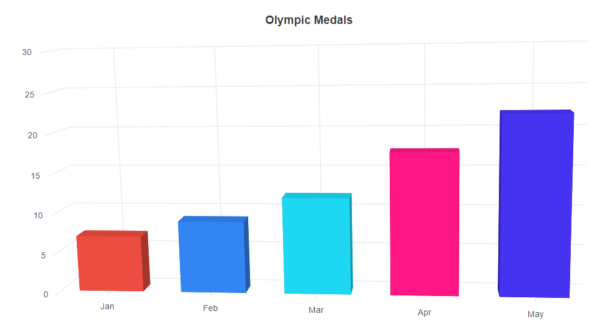
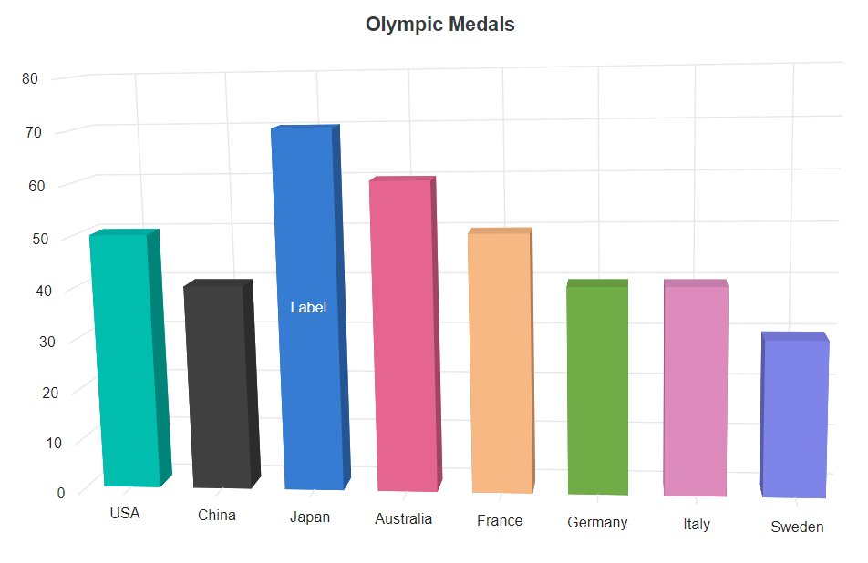
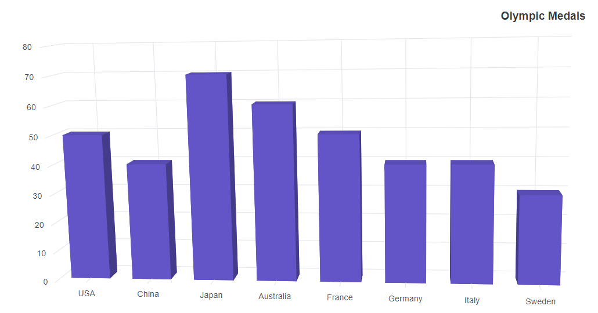
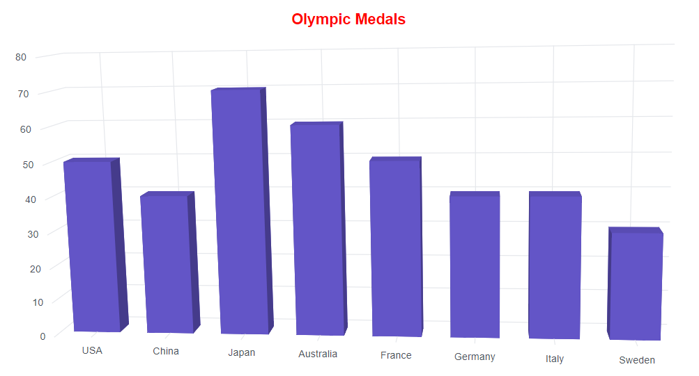

# Appearance in Blazor 3D Chart Component

## Custom color palette

Customize the default colors of series or points by supplying a custom palette using the `Palettes` property.

```cshtml

@using Syncfusion.Blazor.Chart3D

<SfChart3D Title="Olympic Medals" Palettes="@palettes" WallColor="transparent" EnableRotation="true" RotationAngle="7" TiltAngle="10" Depth="100">
    <Chart3DPrimaryXAxis ValueType="Syncfusion.Blazor.Chart3D.ValueType.Category">
    </Chart3DPrimaryXAxis>

    <Chart3DSeriesCollection>
        <Chart3DSeries DataSource="@MedalDetails" XName="Country" YName="Gold" Type="Chart3DSeriesType.Column">
        </Chart3DSeries>
        <Chart3DSeries DataSource="@MedalDetails" XName="Country" YName="Silver" Type="Chart3DSeriesType.Column">
        </Chart3DSeries>
        <Chart3DSeries DataSource="@MedalDetails" XName="Country" YName="Bronze" Type="Chart3DSeriesType.Column">
        </Chart3DSeries>
    </Chart3DSeriesCollection>
</SfChart3D>

@code {
    public class Chart3DData
    {
        public string Country { get; set; }
        public double Gold { get; set; }
        public double Silver { get; set; }
        public double Bronze { get; set; }
    }

    public List<Chart3DData> MedalDetails = new List<Chart3DData>
    {
        new Chart3DData { Country = "USA", Gold = 50, Silver = 70, Bronze = 45 },
        new Chart3DData { Country = "China", Gold = 40, Silver = 60, Bronze = 55 },
        new Chart3DData { Country = "Japan", Gold = 70, Silver = 60, Bronze = 50 },
        new Chart3DData { Country = "Australia", Gold = 60, Silver = 56, Bronze = 40 },
        new Chart3DData { Country = "France", Gold = 50, Silver = 45, Bronze = 35 },
        new Chart3DData { Country = "Germany", Gold = 40, Silver = 30, Bronze = 22 },
        new Chart3DData { Country = "Italy", Gold = 40, Silver = 35, Bronze = 37 },
        new Chart3DData { Country = "Sweden", Gold = 30, Silver = 25, Bronze = 27 }
    };

    public String[] palettes = new String[] { "#E94649", "#F6B53F", "#6FAAB0" };
}

```



<!-- markdownlint-disable MD036 -->

## Data point customization

The color of an individual data point can be customized using the following options.

### Point color mapping

Bind a color for each point from the series `DataSource` using the `PointColor` property.

```cshtml

<SfChart3D Title="Olympic Medals" WallColor="transparent" EnableRotation="true" RotationAngle="7" TiltAngle="10" Depth="100">
    <Chart3DPrimaryXAxis ValueType="Syncfusion.Blazor.Chart3D.ValueType.Category" />

    <Chart3DSeriesCollection>
        <Chart3DSeries DataSource="@MedalDetails" XName="X" YName="Y" PointColor="Color" Type="Chart3DSeriesType.Column">
        </Chart3DSeries>
    </Chart3DSeriesCollection>
</SfChart3D>

@code {
    public class Chart3DData
    {
        public string X { get; set; }
        public double Y { get; set; }
        public string Color { get; set; }
    }

    public List<Chart3DData> MedalDetails = new List<Chart3DData>
    {
        new Chart3DData { X = "Jan", Y = 6.96, Color = "#ed4c40" },
        new Chart3DData { X = "Feb", Y = 8.9, Color = "#3285f3" },
        new Chart3DData { X = "Mar", Y = 12, Color = "#1dd7f3" },
        new Chart3DData { X = "Apr", Y = 17.5, Color = "#fe1684" },
        new Chart3DData { X = "May", Y = 22.1, Color = "#4633f2" }
    };
}

```
 



## Point level customization

Customize the data label and fill color of each point using the `PointRender` and `TextRender` events.

```cshtml

@using Syncfusion.Blazor.Chart3D

<SfChart3D Title="Olympic Medals" PointRendering="Point3DRender" DataLabelRendering="TextRender" WallColor="transparent" EnableRotation="true" RotationAngle="7" TiltAngle="10" Depth="100">
    <Chart3DPrimaryXAxis ValueType="Syncfusion.Blazor.Chart3D.ValueType.Category" />

    <Chart3DSeriesCollection>
        <Chart3DSeries DataSource="@MedalDetails" XName="Country" YName="Gold" Type="Chart3DSeriesType.Column">
            <Chart3DDataLabel Visible="true"></Chart3DDataLabel>
        </Chart3DSeries>
    </Chart3DSeriesCollection>
</SfChart3D>

@code {
    public String[] colors = new String[] { "#00bdae", "#404041", "#357cd2", "#e56590", "#f8b883", "#70ad47", "#dd8abd", "#7f84e8", "#7bb4eb", "#ea7a57" };

    public class Chart3DData
    {
        public string Country { get; set; }
        public double Gold { get; set; }
        public double Silver { get; set; }
        public double Bronze { get; set; }
    }

    public List<Chart3DData> MedalDetails = new List<Chart3DData>
    {
        new Chart3DData { Country = "USA", Gold = 50, Silver = 70, Bronze = 45 },
        new Chart3DData { Country = "China", Gold = 40, Silver = 60, Bronze = 55 },
        new Chart3DData { Country = "Japan", Gold = 70, Silver = 60, Bronze = 50 },
        new Chart3DData { Country = "Australia", Gold = 60, Silver = 56, Bronze = 40 },
        new Chart3DData { Country = "France", Gold = 50, Silver = 45, Bronze = 35 },
        new Chart3DData { Country = "Germany", Gold = 40, Silver = 30, Bronze = 22 },
        new Chart3DData { Country = "Italy", Gold = 40, Silver = 35, Bronze = 37 },
        new Chart3DData { Country = "Sweden", Gold = 30, Silver = 25, Bronze = 27 }
    };

    public void Point3DRender(Chart3DPointRenderEventArgs args)
    {
        args.Fill = colors[args.Point.Index];
    }

    public void TextRender(Chart3DTextRenderEventArgs args)
    {
        if (args.Point.Index == 2)
        {
            args.Text = "Label";
        }
        else
        {
            args.Cancel = true;
        }
    }
}

```




## Chart area customization

<!-- markdownlint-disable MD036 -->

**Customize the chart background**

Customize the chart background and border using the `BackgroundColor` and `Chart3DBorder` properties.

```cshtml

@using Syncfusion.Blazor.Chart3D

<SfChart3D Title="Olympic Medals" BackgroundColor="skyblue" WallColor="transparent" EnableRotation="true" RotationAngle="7" TiltAngle="10" Depth="100">
    <Chart3DBorder Color="#FF0000" Width="2"></Chart3DBorder>

    <Chart3DPrimaryXAxis ValueType="Syncfusion.Blazor.Chart3D.ValueType.Category" />

    <Chart3DSeriesCollection>
        <Chart3DSeries DataSource="@MedalDetails" XName="Country" YName="Gold" Type="Chart3DSeriesType.Column">
        </Chart3DSeries>
    </Chart3DSeriesCollection>
</SfChart3D>

@code {
    public class Chart3DData
    {
        public string Country { get; set; }
        public double Gold { get; set; }
    }

    public List<Chart3DData> MedalDetails = new List<Chart3DData>
    {
        new Chart3DData { Country = "USA", Gold = 50 },
        new Chart3DData { Country = "China", Gold = 40 },
        new Chart3DData { Country = "Japan", Gold = 70 },
        new Chart3DData { Country = "Australia", Gold = 60 },
        new Chart3DData { Country = "France", Gold = 50 },
        new Chart3DData { Country = "Germany", Gold = 40 },
        new Chart3DData { Country = "Italy", Gold = 40 },
        new Chart3DData { Country = "Sweden", Gold = 30 }
    };
}

```



**Chart margin**

Set the margin between the 3D chart and its container using the `Chart3DMargin` property.

```cshtml

@using Syncfusion.Blazor.Chart3D

<SfChart3D Title="Olympic Medals" BackgroundColor="skyblue" WallColor="transparent" EnableRotation="true" RotationAngle="7" TiltAngle="10" Depth="100">
    <Chart3DBorder Color="#FF0000" Width="2"></Chart3DBorder>
    <Chart3DMargin Left="60" Right="60" Top="60" Bottom="60"></Chart3DMargin>

    <Chart3DPrimaryXAxis ValueType="Syncfusion.Blazor.Chart3D.ValueType.Category" />

    <Chart3DSeriesCollection>
        <Chart3DSeries DataSource="@MedalDetails" XName="Country" YName="Gold" Type="Chart3DSeriesType.Column">
        </Chart3DSeries>
    </Chart3DSeriesCollection>
</SfChart3D>

@code {
    public class Chart3DData
    {
        public string Country { get; set; }
        public double Gold { get; set; }
    }

    public List<Chart3DData> MedalDetails = new List<Chart3DData>
    {
        new Chart3DData { Country = "USA", Gold = 50 },
        new Chart3DData { Country = "China", Gold = 40 },
        new Chart3DData { Country = "Japan", Gold = 70 },
        new Chart3DData { Country = "Australia", Gold = 60 },
        new Chart3DData { Country = "France", Gold = 50 },
        new Chart3DData { Country = "Germany", Gold = 40 },
        new Chart3DData { Country = "Italy", Gold = 40 },
        new Chart3DData { Country = "Sweden", Gold = 30 }
    };
}

```



## Animation

Customize per-series animation using the `Chart3DAnimation` property. Enable or disable it via `Enable`. Use `Duration` to control the animation length and `Delay` to start the animation after a specified time.

```cshtml

@using Syncfusion.Blazor.Chart3D

<SfChart3D Title="Olympic Medals" WallColor="transparent" EnableRotation="true" RotationAngle="7" TiltAngle="10" Depth="100">
    <Chart3DPrimaryXAxis ValueType="Syncfusion.Blazor.Chart3D.ValueType.Category" />

    <Chart3DSeriesCollection>
        <Chart3DSeries DataSource="@MedalDetails" Name="Gold" XName="Country" Opacity="1" YName="Gold" Type="Chart3DSeriesType.Column">
             <Chart3DAnimation Enable="true" Duration="2000" Delay="200"></Chart3DAnimation>
            <Chart3DSeriesBorder Width="3" Color="red"></Chart3DSeriesBorder>
        </Chart3DSeries>
    </Chart3DSeriesCollection>
</SfChart3D>

@code {
    public class Chart3DData
    {
        public string Country { get; set; }
        public double Gold { get; set; }
        public double Silver { get; set; }
        public double Bronze { get; set; }
    }

    public List<Chart3DData> MedalDetails = new List<Chart3DData>
    {
        new Chart3DData { Country = "USA", Gold = 50, Silver = 70, Bronze = 45 },
        new Chart3DData { Country = "China", Gold = 40, Silver = 60, Bronze = 55 },
        new Chart3DData { Country = "Japan", Gold = 70, Silver = 60, Bronze = 50 },
        new Chart3DData { Country = "Australia", Gold = 60, Silver = 56, Bronze = 40 },
        new Chart3DData { Country = "France", Gold = 50, Silver = 45, Bronze = 35 },
        new Chart3DData { Country = "Germany", Gold = 40, Silver = 30, Bronze = 22 },
        new Chart3DData { Country = "Italy", Gold = 40, Silver = 35, Bronze = 37 },
        new Chart3DData { Country = "Sweden", Gold = 30, Silver = 25, Bronze = 27 }
    };
}

```


## Chart rotation

Rotate the 3D chart by enabling the `EnableRotation` property.

```cshtml

@using Syncfusion.Blazor.Chart3D

<SfChart3D Title="Olympic Medals" WallColor="transparent" EnableRotation="true" RotationAngle="7" TiltAngle="10" Depth="100">
    <Chart3DPrimaryXAxis ValueType="Syncfusion.Blazor.Chart3D.ValueType.Category" />

    <Chart3DSeriesCollection>
        <Chart3DSeries DataSource="@MedalDetails" Name="Gold" XName="Country" Opacity="1" YName="Gold" Type="Chart3DSeriesType.Column">
        </Chart3DSeries>
    </Chart3DSeriesCollection>
</SfChart3D>

@code {
    public class Chart3DData
    {
        public string Country { get; set; }
        public double Gold { get; set; }
        public double Silver { get; set; }
        public double Bronze { get; set; }
    }

    public List<Chart3DData> MedalDetails = new List<Chart3DData>
    {
        new Chart3DData { Country = "USA", Gold = 50, Silver = 70, Bronze = 45 },
        new Chart3DData { Country = "China", Gold = 40, Silver = 60, Bronze = 55 },
        new Chart3DData { Country = "Japan", Gold = 70, Silver = 60, Bronze = 50 },
        new Chart3DData { Country = "Australia", Gold = 60, Silver = 56, Bronze = 40 },
        new Chart3DData { Country = "France", Gold = 50, Silver = 45, Bronze = 35 },
        new Chart3DData { Country = "Germany", Gold = 40, Silver = 30, Bronze = 22 },
        new Chart3DData { Country = "Italy", Gold = 40, Silver = 35, Bronze = 37 },
        new Chart3DData { Country = "Sweden", Gold = 30, Silver = 25, Bronze = 27 }
    };
}

```


## Title

Add a chart title using the `Title` property to describe the plotted data.

```cshtml

@using Syncfusion.Blazor.Chart3D

<SfChart3D Title="Olympic Medals" WallColor="transparent" EnableRotation="true" RotationAngle="7" TiltAngle="10" Depth="100">
    <Chart3DTitleStyle FontSize="23px" Color="red" FontFamily="Arial" FontWeight="regular" FontStyle="italic"></Chart3DTitleStyle>
    <Chart3DPrimaryXAxis ValueType="Syncfusion.Blazor.Chart3D.ValueType.Category" />

    <Chart3DSeriesCollection>
        <Chart3DSeries DataSource="@MedalDetails" XName="Country" YName="Gold" Type="Chart3DSeriesType.Column">
        </Chart3DSeries>
    </Chart3DSeriesCollection>
</SfChart3D>

@code {
    public class Chart3DData
    {
        public string Country { get; set; }
        public double Gold {get; set; }
    }

    public List<Chart3DData> MedalDetails = new List<Chart3DData>
    {
        new Chart3DData { Country = "USA", Gold = 50 },
        new Chart3DData { Country = "China", Gold = 40 },
        new Chart3DData { Country = "Japan", Gold = 70 },
        new Chart3DData { Country = "Australia", Gold = 60 },
        new Chart3DData { Country = "France", Gold = 50 },
        new Chart3DData { Country = "Germany", Gold = 40 },
        new Chart3DData { Country = "Italy", Gold = 40 },
        new Chart3DData { Country = "Sweden", Gold = 30 }
    };
}

```



### Title position

Use the `Position` property in `TitleStyle` to place the `Title` at the left, right, top, or bottom of the chart. By default, the title appears at the top.

```cshtml

@using Syncfusion.Blazor.Chart3D

<SfChart3D Title="Olympic Medals" WallColor="transparent" EnableRotation="true" RotationAngle="7" TiltAngle="10" Depth="100">
    <Chart3DTitleStyle Position="Chart3DTitlePosition.Bottom"></Chart3DTitleStyle>
    <Chart3DPrimaryXAxis ValueType="Syncfusion.Blazor.Chart3D.ValueType.Category" />

    <Chart3DSeriesCollection>
        <Chart3DSeries DataSource="@MedalDetails" XName="Country" YName="Gold" Type="Chart3DSeriesType.Column">
        </Chart3DSeries>
    </Chart3DSeriesCollection>
</SfChart3D>

@code {
    public class Chart3DData
    {
        public string Country { get; set; }
        public double Gold {get; set; }
    }

    public List<Chart3DData> MedalDetails = new List<Chart3DData>
    {
        new Chart3DData { Country = "USA", Gold = 50 },
        new Chart3DData { Country = "China", Gold = 40 },
        new Chart3DData { Country = "Japan", Gold = 70 },
        new Chart3DData { Country = "Australia", Gold = 60 },
        new Chart3DData { Country = "France", Gold = 50 },
        new Chart3DData { Country = "Germany", Gold = 40 },
        new Chart3DData { Country = "Italy", Gold = 40 },
        new Chart3DData { Country = "Sweden", Gold = 30 }
    };
}

```



The custom option positions the title anywhere in the chart using `X` and `Y` coordinates.

```cshtml

@using Syncfusion.Blazor.Chart3D

<SfChart3D Title="Olympic Medals" WallColor="transparent" EnableRotation="true" RotationAngle="7" TiltAngle="10" Depth="100">
    <Chart3DTitleStyle Position="Chart3DTitlePosition.Custom" X="300" Y="60"></Chart3DTitleStyle>
    <Chart3DPrimaryXAxis ValueType="Syncfusion.Blazor.Chart3D.ValueType.Category" />

    <Chart3DSeriesCollection>
        <Chart3DSeries DataSource="@MedalDetails" XName="Country" YName="Gold" Type="Chart3DSeriesType.Column">
        </Chart3DSeries>
    </Chart3DSeriesCollection>
</SfChart3D>

@code {
    public class Chart3DData
    {
        public string Country { get; set; }
        public double Gold {get; set; }
    }

    public List<Chart3DData> MedalDetails = new List<Chart3DData>
    {
        new Chart3DData { Country = "USA", Gold = 50 },
        new Chart3DData { Country = "China", Gold = 40 },
        new Chart3DData { Country = "Japan", Gold = 70 },
        new Chart3DData { Country = "Australia", Gold = 60 },
        new Chart3DData { Country = "France", Gold = 50 },
        new Chart3DData { Country = "Germany", Gold = 40 },
        new Chart3DData { Country = "Italy", Gold = 40 },
        new Chart3DData { Country = "Sweden", Gold = 30 }
    };
}

```



### Title alignment

Align the title to the near, far, or center of the chart using the `TextAlignment` property.

```cshtml

@using Syncfusion.Blazor.Chart3D

<SfChart3D Title="Olympic Medals" WallColor="transparent" EnableRotation="true" RotationAngle="7" TiltAngle="10" Depth="100">
    <Chart3DTitleStyle TextAlignment="Syncfusion.Blazor.Chart3D.Alignment.Far"></Chart3DTitleStyle>
    <Chart3DPrimaryXAxis ValueType="Syncfusion.Blazor.Chart3D.ValueType.Category" />

    <Chart3DSeriesCollection>
        <Chart3DSeries DataSource="@MedalDetails" XName="Country" YName="Gold" Type="Chart3DSeriesType.Column">
        </Chart3DSeries>
    </Chart3DSeriesCollection>
</SfChart3D>

@code {
    public class Chart3DData
    {
        public string Country { get; set; }
        public double Gold { get; set; }
    }

    public List<Chart3DData> MedalDetails = new List<Chart3DData>
    {
        new Chart3DData { Country = "USA", Gold = 50 },
        new Chart3DData { Country = "China", Gold = 40 },
        new Chart3DData { Country = "Japan", Gold = 70 },
        new Chart3DData { Country = "Australia", Gold = 60 },
        new Chart3DData { Country = "France", Gold = 50 },
        new Chart3DData { Country = "Germany", Gold = 40 },
        new Chart3DData { Country = "Italy", Gold = 40 },
        new Chart3DData { Country = "Sweden", Gold = 30 }
    };
}

```




### Title customization

Customize the title using the `TitleStyle` property of the 3D chart.

```cshtml

@using Syncfusion.Blazor.Chart3D

<SfChart3D Title="Olympic Medals" WallColor="transparent" EnableRotation="true" RotationAngle="7" TiltAngle="10" Depth="100">
    <Chart3DTitleStyle FontSize="18px" Color="red" TextOverflow="Syncfusion.Blazor.Chart3D.TextOverflow.Wrap"></Chart3DTitleStyle>

    <Chart3DPrimaryXAxis ValueType="Syncfusion.Blazor.Chart3D.ValueType.Category" />

    <Chart3DSeriesCollection>
        <Chart3DSeries DataSource="@MedalDetails" XName="Country" YName="Gold" Type="Chart3DSeriesType.Column">
        </Chart3DSeries>
    </Chart3DSeriesCollection>
</SfChart3D>

@code {
    public class Chart3DData
    {
        public string Country { get; set; }
        public double Gold { get; set; }
    }

    public List<Chart3DData> MedalDetails = new List<Chart3DData>
    {
        new Chart3DData { Country = "USA", Gold = 50 },
        new Chart3DData { Country = "China", Gold = 40 },
        new Chart3DData { Country = "Japan", Gold = 70 },
        new Chart3DData { Country = "Australia", Gold = 60 },
        new Chart3DData { Country = "France", Gold = 50 },
        new Chart3DData { Country = "Germany", Gold = 40 },
        new Chart3DData { Country = "Italy", Gold = 40 },
        new Chart3DData { Country = "Sweden", Gold = 30 }
    };
}

```




N> Chart components do not use any CSS for customization. Chart elements such as axis labels, data labels, background, series palette, legend text, and tooltip text can be customized using `Chart3DAxisLabelStyle`, `Chart3DDataLabelFont`, `BackGround`, `Palettes`, `Chart3DLegendTextStyle`, and `Chart3DTooltipTextStyle` respectively.
