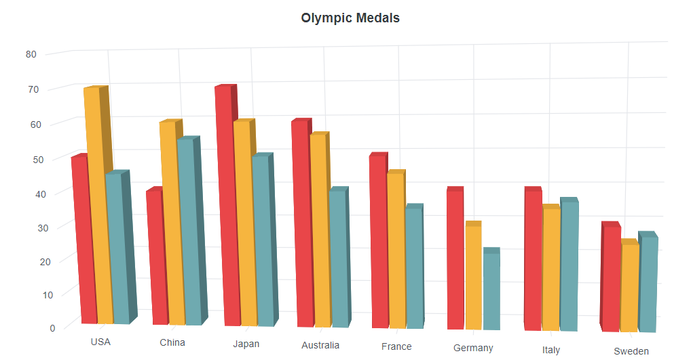

# Appearance in Blazor 3D Chart Component

## Custom color palette

The default color of series or points can be customized by providing a custom color palette of your choice by using the [Palettes](https://help.syncfusion.com/cr/blazor/Syncfusion.Blazor.Charts.SfChart.html#Syncfusion_Blazor_Charts_SfChart_Palettes) property.

```cshtml

@using Syncfusion.Blazor.Chart3D

<SfChart3D Title="Olympic Medals" Palettes="@palettes" WallColor="transparent" EnableRotation="true" RotationAngle="7" TiltAngle="10" Depth="100">
    <Chart3DPrimaryXAxis ValueType="Syncfusion.Blazor.Charts.ValueType.Category">
    </Chart3DPrimaryXAxis>

    <Chart3DSeriesCollection>
        <Chart3DSeries DataSource="@MedalDetails" XName="Country" YName="Gold" Type="Chart3DSeriesType.Column">
        </Chart3DSeries>
        <Chart3DSeries DataSource="@MedalDetails" XName="Country" YName="Silver" Type="Chart3DSeriesType.Column">
        </Chart3DSeries>
        <Chart3DSeries DataSource="@MedalDetails" XName="Country" YName="Bronze" Type="Chart3DSeriesType.Column">
        </Chart3DSeries>
    </Chart3DSeriesCollection>
</SfChart3D>

@code{
    public class Chart3DData
    {
        public string Country { get; set; }
        public double Gold { get; set; }
        public double Silver { get; set; }
        public double Bronze { get; set; }
    }

    public List<Chart3DData> MedalDetails = new List<Chart3DData>
	{
         new Chart3DData{ Country= "USA", Gold=50, Silver=70, Bronze=45 },
         new Chart3DData{ Country="China", Gold=40, Silver= 60, Bronze=55 },
         new Chart3DData{ Country= "Japan", Gold=70, Silver= 60, Bronze=50 },
         new Chart3DData{ Country= "Australia", Gold=60, Silver= 56, Bronze=40 },
         new Chart3DData{ Country= "France", Gold=50, Silver= 45, Bronze=35 },
         new Chart3DData{ Country= "Germany", Gold=40, Silver=30, Bronze=22 },
         new Chart3DData{ Country= "Italy", Gold=40, Silver=35, Bronze=37 },
         new Chart3DData{ Country= "Sweden", Gold=30, Silver=25, Bronze=27 }
    };

    public String[] palettes = new String[] { "#E94649", "#F6B53F", "#6FAAB0" };
}

```



<!-- markdownlint-disable MD036 -->

## Data point customization

The color of an individual data point can be customized using the below options.

### Point color mapping

The color for the points can be bound from the `DataSource` for the series by utilizing the `PointColorMapping` property.

```cshtml

@using Syncfusion.Blazor.Chart3D

<SfChart3D Title="Olympic Medals" WallColor="transparent" EnableRotation="true" RotationAngle="7" TiltAngle="10" Depth="100">

    <Chart3DPrimaryXAxis ValueType="Syncfusion.Blazor.Charts.ValueType.Category" />

    <Chart3DSeriesCollection>
        <Chart3DSeries DataSource="@MedalDetails" XName="X" YName="Y" PointColorMapping="Color" Type="Chart3DSeriesType.Column">
        </Chart3DSeries>
    </Chart3DSeriesCollection>
</SfChart3D>

@code{
    public class Chart3DData
    {
        public string X { get; set; }
        public double Y { get; set; }
		public string Color { get; set; }
    }

    public List<Chart3DData> MedalDetails = new List<Chart3DData>
	{ 
		new Chart3DData { X = "Jan", Y = 6.96, Color = "#ed4c40" },
		new Chart3DData { X = "Feb", Y = 8.9,Color = "#3285f3"},
		new Chart3DData { X = "Mar", Y = 12, Color = "#1dd7f3"},
		new Chart3DData { X = "Apr", Y = 17.5, Color = "#fe1684" },
		new Chart3DData { X = "May", Y = 22.1, Color = "#4633f2" }
    };
}

```

![Blazor Column 3D Chart with PointColorMapping]

## Point level customization

The data label and fill color of each data point can be customized using the [`PointRender`](../api/chart3d/i3DPointRenderEventArgs/) and [`TextRender`](../api/chart3d/i3dtextrendereventargs/) events.

```cshtml

@using Syncfusion.Blazor.Chart3D

<SfChart3D Title="Olympic Medals" WallColor="transparent" EnableRotation="true" RotationAngle="7" TiltAngle="10" Depth="100">

    <Chart3DPrimaryXAxis ValueType="Syncfusion.Blazor.Charts.ValueType.Category" />

    <Chart3DSeriesCollection>
        <Chart3DSeries DataSource="@MedalDetails" XName="X" YName="Y" PointColorMapping="Color" Type="Chart3DSeriesType.Column">
        </Chart3DSeries>
    </Chart3DSeriesCollection>
</SfChart3D>

@code{
    public class Chart3DData
    {
        public string X { get; set; }
        public double Y { get; set; }
		public string Color { get; set; }
    }

    public List<Chart3DData> MedalDetails = new List<Chart3DData>
	{ 
		new Chart3DData { X = "Jan", Y = 6.96, Color = "#ed4c40" },
		new Chart3DData { X = "Feb", Y = 8.9,Color = "#3285f3"},
		new Chart3DData { X = "Mar", Y = 12, Color = "#1dd7f3"},
		new Chart3DData { X = "Apr", Y = 17.5, Color = "#fe1684" },
		new Chart3DData { X = "May", Y = 22.1, Color = "#4633f2" }
    };
}

```

![Blazor Column 3D Chart with Point level customization]

## Chart area customization

<!-- markdownlint-disable MD036 -->

**Customize the chart background**

The background color and border of the 3D chart can be customized using the [BackgroundColor](https://help.syncfusion.com/cr/blazor/Syncfusion.Blazor.Charts.SfChart.html#Syncfusion_Blazor_Charts_SfChart_Background) and [ChartBorder](https://help.syncfusion.com/cr/blazor/Syncfusion.Blazor.Charts.ChartBorder.html) properties.

```cshtml

@using Syncfusion.Blazor.Chart3D

<SfChart3D Title="Olympic Medals" BackgroundColor="skyblue" WallColor="transparent" EnableRotation="true" RotationAngle="7" TiltAngle="10" Depth="100">
    <Chart3DBorder Color="#FF0000" Width="2"></Chart3DBorder>

    <Chart3DPrimaryXAxis ValueType="Syncfusion.Blazor.Charts.ValueType.Category" />

    <Chart3DSeriesCollection>
        <Chart3DSeries DataSource="@MedalDetails" XName="Country" YName="Gold" Type="Chart3DSeriesType.Column">
        </Chart3DSeries>
    </Chart3DSeriesCollection>
</SfChart3D>

@code{
    public class Chart3DData
    {
        public string Country { get; set; }
        public double Gold { get; set; }
    }

    public List<Chart3DData> MedalDetails = new List<Chart3DData>
	{
		new Chart3DData{ Country= "USA", Gold=50  },
		new Chart3DData{ Country="China", Gold=40 },
		new Chart3DData{ Country= "Japan", Gold=70 },
		new Chart3DData{ Country= "Australia", Gold=60},
		new Chart3DData{ Country= "France", Gold=50 },
		new Chart3DData{ Country= "Germany", Gold=40 },
		new Chart3DData{ Country= "Italy", Gold=40 },
		new Chart3DData{ Country= "Sweden", Gold=30 }
    };
}

```


**Chart margin**

The 3D chart's margin can be set from its container using the [Chart3DMargin](https://help.syncfusion.com/cr/blazor/Syncfusion.Blazor.Charts.ChartMargin.html) property.

```cshtml

@using Syncfusion.Blazor.Chart3D

<SfChart3D Title="Olympic Medals" BackgroundColor="skyblue" WallColor="transparent" EnableRotation="true" RotationAngle="7" TiltAngle="10" Depth="100">
    <Chart3DBorder Color="#FF0000" Width="2"></Chart3DBorder>
    <Chart3DMargin Left="60" Right="60" Top="60" Bottom="60"></Chart3DMargin>

    <Chart3DPrimaryXAxis ValueType="Syncfusion.Blazor.Charts.ValueType.Category" />

    <Chart3DSeriesCollection>
        <Chart3DSeries DataSource="@MedalDetails" XName="Country" YName="Gold" Type="Chart3DSeriesType.Column">
        </Chart3DSeries>
    </Chart3DSeriesCollection>
</SfChart3D>

@code{
    public class Chart3DData
    {
        public string Country { get; set; }
        public double Gold { get; set; }
    }

    public List<Chart3DData> MedalDetails = new List<Chart3DData>
	{
		new Chart3DData{ Country= "USA", Gold=50  },
		new Chart3DData{ Country="China", Gold=40 },
		new Chart3DData{ Country= "Japan", Gold=70 },
		new Chart3DData{ Country= "Australia", Gold=60},
		new Chart3DData{ Country= "France", Gold=50 },
		new Chart3DData{ Country= "Germany", Gold=40 },
		new Chart3DData{ Country= "Italy", Gold=40 },
		new Chart3DData{ Country= "Sweden", Gold=30 }
    };
}

```


## Animation

To customize the animation for a particular series, the [Animation](https://help.syncfusion.com/cr/blazor/Syncfusion.Blazor.Charts.ChartSeries.html#Syncfusion_Blazor_Charts_ChartSeries_Animation) property can be used. It can be enabled or disabled by using the [Enable](https://help.syncfusion.com/cr/blazor/Syncfusion.Blazor.Charts.StockChartCommonAnimation.html#Syncfusion_Blazor_Charts_StockChartCommonAnimation_Enable) property. The [Duration](https://help.syncfusion.com/cr/blazor/Syncfusion.Blazor.Charts.StockChartCommonAnimation.html#Syncfusion_Blazor_Charts_StockChartCommonAnimation_Duration) property specifies the duration of an animation and the [Delay](https://help.syncfusion.com/cr/blazor/Syncfusion.Blazor.Charts.StockChartCommonAnimation.html#Syncfusion_Blazor_Charts_StockChartCommonAnimation_Delay) property allows us to start the animation at desire time.

```cshtml

@using Syncfusion.Blazor.Chart3D

<SfChart3D Title="Olympic Medals" WallColor="transparent" EnableRotation="true" RotationAngle="7" TiltAngle="10" Depth="100">
    <Chart3DPrimaryXAxis ValueType="Syncfusion.Blazor.Charts.ValueType.Category"/>

    <Chart3DSeriesCollection>
        <Chart3DSeries DataSource="@MedalDetails" Name="Gold" XName="Country" Opacity="1" YName="Gold" Type="Chart3DSeriesType.Column">
             <Chart3DSeriesAnimation Enable="true" Duration="2000" Delay="200"></Chart3DSeriesAnimation> 
            <Chart3DSeriesBorder Width="3" Color="red"></Chart3DSeriesBorder>
        </Chart3DSeries>
    </Chart3DSeriesCollection>
</SfChart3D>

@code{
    public class Chart3DData
    {
        public string Country { get; set; }
        public double Gold { get; set; }
        public double Silver { get; set; }
        public double Bronze { get; set; }
    }

    public List<Chart3DData> MedalDetails = new List<Chart3DData>
	{
        new Chart3DData{ Country= "USA", Gold=50, Silver=70, Bronze=45 },
        new Chart3DData{ Country="China", Gold=40, Silver= 60, Bronze=55 },
        new Chart3DData{ Country= "Japan", Gold=70, Silver= 60, Bronze=50 },
        new Chart3DData{ Country= "Australia", Gold=60, Silver= 56, Bronze=40 },
        new Chart3DData{ Country= "France", Gold=50, Silver= 45, Bronze=35 },
        new Chart3DData{ Country= "Germany", Gold=40, Silver=30, Bronze=22 },
        new Chart3DData{ Country= "Italy", Gold=40, Silver=35, Bronze=37 },
        new Chart3DData{ Country= "Sweden", Gold=30, Silver=25, Bronze=27 }
    };
}

```

## Chart rotation

The 3D chart can be rotated by using the `EnableRotation` property.

```cshtml

@using Syncfusion.Blazor.Chart3D

<SfChart3D Title="Olympic Medals" WallColor="transparent" EnableRotation="true" RotationAngle="7" TiltAngle="10" Depth="100">
    <Chart3DPrimaryXAxis ValueType="Syncfusion.Blazor.Charts.ValueType.Category"/>

    <Chart3DSeriesCollection>
        <Chart3DSeries DataSource="@MedalDetails" Name="Gold" XName="Country" Opacity="1" YName="Gold" Type="Chart3DSeriesType.Column">
        </Chart3DSeries>
    </Chart3DSeriesCollection>
</SfChart3D>

@code{
    public class Chart3DData
    {
        public string Country { get; set; }
        public double Gold { get; set; }
        public double Silver { get; set; }
        public double Bronze { get; set; }
    }

    public List<Chart3DData> MedalDetails = new List<Chart3DData>
	{
        new Chart3DData{ Country= "USA", Gold=50, Silver=70, Bronze=45 },
        new Chart3DData{ Country="China", Gold=40, Silver= 60, Bronze=55 },
        new Chart3DData{ Country= "Japan", Gold=70, Silver= 60, Bronze=50 },
        new Chart3DData{ Country= "Australia", Gold=60, Silver= 56, Bronze=40 },
        new Chart3DData{ Country= "France", Gold=50, Silver= 45, Bronze=35 },
        new Chart3DData{ Country= "Germany", Gold=40, Silver=30, Bronze=22 },
        new Chart3DData{ Country= "Italy", Gold=40, Silver=35, Bronze=37 },
        new Chart3DData{ Country= "Sweden", Gold=30, Silver=25, Bronze=27 }
    };
}

```

## Title

The 3D chart can be given a title by using [Title](https://help.syncfusion.com/cr/blazor/Syncfusion.Blazor.Charts.SfChart.html#Syncfusion_Blazor_Charts_SfChart_Title) property, to show the information about the data plotted.

```cshtml

@using Syncfusion.Blazor.Chart3D

<SfChart3D Title="Olympic Medals" WallColor="transparent" EnableRotation="true" RotationAngle="7" TiltAngle="10" Depth="100">
    <Chart3DTitleStyle FontSize="23px" Color="red" FontFamily="Arial" FontWeight="regular" FontStyle="italic"></Chart3DTitleStyle>

    <Chart3DPrimaryXAxis ValueType="Syncfusion.Blazor.Charts.ValueType.Category">
    </Chart3DPrimaryXAxis>

    <Chart3DSeriesCollection>
        <Chart3DSeries DataSource="@MedalDetails" XName="Country" YName="Gold" Type="Chart3DSeriesType.Column">
        </Chart3DSeries>
    </Chart3DSeriesCollection>
</SfChart3D>

@code{
    public class Chart3DData
    {
        public string Country { get; set; }
        public double Gold {get; set; }
    }

    public List<Chart3DData> MedalDetails = new List<Chart3DData>
	{
		new Chart3DData{ Country= "USA", Gold=50  },
		new Chart3DData{ Country="China", Gold=40 },
		new Chart3DData{ Country= "Japan", Gold=70 },
		new Chart3DData{ Country= "Australia", Gold=60},
		new Chart3DData{ Country= "France", Gold=50 },
		new Chart3DData{ Country= "Germany", Gold=40 },
		new Chart3DData{ Country= "Italy", Gold=40 },
		new Chart3DData{ Country= "Sweden", Gold=30 }
    };
}

```


### Title position

By using the `Position`property in `TitleStyle`, the [Title](https://help.syncfusion.com/cr/blazor/Syncfusion.Blazor.Charts.SfChart.html#Syncfusion_Blazor_Charts_SfChart_Title) can be positioned at left, right, top or bottom of the 3D chart. The title is positioned at the top of the 3D chart, by default.

```cshtml

@using Syncfusion.Blazor.Chart3D

<SfChart3D Title="Olympic Medals" WallColor="transparent" EnableRotation="true" RotationAngle="7" TiltAngle="10" Depth="100">
    <Chart3DTitleStyle Position="Chart3DTitlePosition.Bottom"></Chart3DTitleStyle>

    <Chart3DPrimaryXAxis ValueType="Syncfusion.Blazor.Charts.ValueType.Category">
    </Chart3DPrimaryXAxis>

    <Chart3DSeriesCollection>
        <Chart3DSeries DataSource="@MedalDetails" XName="Country" YName="Gold" Type="Chart3DSeriesType.Column">
        </Chart3DSeries>
    </Chart3DSeriesCollection>
</SfChart3D>

@code{
    public class Chart3DData
    {
        public string Country { get; set; }
        public double Gold {get; set; }
    }

    public List<Chart3DData> MedalDetails = new List<Chart3DData>
	{
		new Chart3DData{ Country= "USA", Gold=50  },
		new Chart3DData{ Country="China", Gold=40 },
		new Chart3DData{ Country= "Japan", Gold=70 },
		new Chart3DData{ Country= "Australia", Gold=60},
		new Chart3DData{ Country= "France", Gold=50 },
		new Chart3DData{ Country= "Germany", Gold=40 },
		new Chart3DData{ Country= "Italy", Gold=40 },
		new Chart3DData{ Country= "Sweden", Gold=30 }
    };
}

```


The custom option is used to position the title anywhere in the 3D chart using `X` and `Y` coordinates.

```cshtml

@using Syncfusion.Blazor.Chart3D

<SfChart3D Title="Olympic Medals" WallColor="transparent" EnableRotation="true" RotationAngle="7" TiltAngle="10" Depth="100">
    <Chart3DTitleStyle Position="Chart3DTitlePosition.Custom" X="300" Y="60"></Chart3DTitleStyle>

    <Chart3DPrimaryXAxis ValueType="Syncfusion.Blazor.Charts.ValueType.Category">
    </Chart3DPrimaryXAxis>

    <Chart3DSeriesCollection>
        <Chart3DSeries DataSource="@MedalDetails" XName="Country" YName="Gold" Type="Chart3DSeriesType.Column">
        </Chart3DSeries>
    </Chart3DSeriesCollection>
</SfChart3D>

@code{
    public class Chart3DData
    {
        public string Country { get; set; }
        public double Gold {get; set; }
    }

    public List<Chart3DData> MedalDetails = new List<Chart3DData>
	{
		new Chart3DData{ Country= "USA", Gold=50  },
		new Chart3DData{ Country="China", Gold=40 },
		new Chart3DData{ Country= "Japan", Gold=70 },
		new Chart3DData{ Country= "Australia", Gold=60},
		new Chart3DData{ Country= "France", Gold=50 },
		new Chart3DData{ Country= "Germany", Gold=40 },
		new Chart3DData{ Country= "Italy", Gold=40 },
		new Chart3DData{ Country= "Sweden", Gold=30 }
    };
}

```


## Text Alignment

The title can be aligned to the near, far, or center of the 3D chart by using the `TextAlignment` property.

```cshtml

@using Syncfusion.Blazor.Chart3D

<SfChart3D Title="Olympic Medals" WallColor="transparent" EnableRotation="true" RotationAngle="7" TiltAngle="10" Depth="100">
    <Chart3DTitleStyle TextAlingnment="Far" X="300" Y="60" ></Chart3DTitleStyle>

    <Chart3DPrimaryXAxis ValueType="Syncfusion.Blazor.Charts.ValueType.Category">
    </Chart3DPrimaryXAxis>

    <Chart3DSeriesCollection>
        <Chart3DSeries DataSource="@MedalDetails" XName="Country" YName="Gold" Type="Chart3DSeriesType.Column">
        </Chart3DSeries>
    </Chart3DSeriesCollection>
</SfChart3D>

@code{
    public class Chart3DData
    {
        public string Country { get; set; }
        public double Gold {get; set; }
    }

    public List<Chart3DData> MedalDetails = new List<Chart3DData>
	{
		new Chart3DData{ Country= "USA", Gold=50  },
		new Chart3DData{ Country="China", Gold=40 },
		new Chart3DData{ Country= "Japan", Gold=70 },
		new Chart3DData{ Country= "Australia", Gold=60},
		new Chart3DData{ Country= "France", Gold=50 },
		new Chart3DData{ Country= "Germany", Gold=40 },
		new Chart3DData{ Country= "Italy", Gold=40 },
		new Chart3DData{ Country= "Sweden", Gold=30 }
    };
}

```

![Blazor Column 3D Chart Title with Text Alignment]

### Title customization

The `TitleStyle` property of the 3D chart provides options to customize the title by using the following properties.

```cshtml

@using Syncfusion.Blazor.Chart3D

<SfChart3D Title="Olympic Medals" WallColor="transparent" EnableRotation="true" RotationAngle="7" TiltAngle="10" Depth="100">
    <Chart3DTitleStyle FontSize="18px" Color="red" TextOverFlow="Wrap"></Chart3DTitleStyle>

    <Chart3DPrimaryXAxis ValueType="Syncfusion.Blazor.Charts.ValueType.Category">
    </Chart3DPrimaryXAxis>

    <Chart3DSeriesCollection>
        <Chart3DSeries DataSource="@MedalDetails" XName="Country" YName="Gold" Type="Chart3DSeriesType.Column">
        </Chart3DSeries>
    </Chart3DSeriesCollection>
</SfChart3D>

@code{
    public class Chart3DData
    {
        public string Country { get; set; }
        public double Gold {get; set; }
    }

    public List<Chart3DData> MedalDetails = new List<Chart3DData>
	{
		new Chart3DData{ Country= "USA", Gold=50  },
		new Chart3DData{ Country="China", Gold=40 },
		new Chart3DData{ Country= "Japan", Gold=70 },
		new Chart3DData{ Country= "Australia", Gold=60},
		new Chart3DData{ Country= "France", Gold=50 },
		new Chart3DData{ Country= "Germany", Gold=40 },
		new Chart3DData{ Country= "Italy", Gold=40 },
		new Chart3DData{ Country= "Sweden", Gold=30 }
    };
}

```

![Blazor Column 3D Chart Title with Customization]

N> The chart components do not use any CSS style for customization; chart elements like axis labels, datalabel, background, series palette, legend text, and tooltip text can be customized by using the [ChartAxisLabelStyle](https://help.syncfusion.com/cr/blazor/Syncfusion.Blazor.Charts.ChartAxisLabelStyle.html), [ChartDataLabelFont](https://help.syncfusion.com/cr/blazor/Syncfusion.Blazor.Charts.ChartDataLabelFont.html), [BackGround](https://help.syncfusion.com/cr/blazor/Syncfusion.Blazor.Charts.SfChart.html#Syncfusion_Blazor_Charts_SfChart_Background), [Palettes](https://help.syncfusion.com/cr/blazor/Syncfusion.Blazor.Charts.SfChart.html#Syncfusion_Blazor_Charts_SfChart_Palettes), [ChartLegendTextStyle](https://help.syncfusion.com/cr/blazor/Syncfusion.Blazor.Charts.ChartLegendTextStyle.html), and [ChartTooltipTextStyle](https://help.syncfusion.com/cr/blazor/Syncfusion.Blazor.Charts.ChartTooltipTextStyle.html), respectively. 

## See also

* [Data Label](./data-labels)
* [Tooltip](./tool-tip)