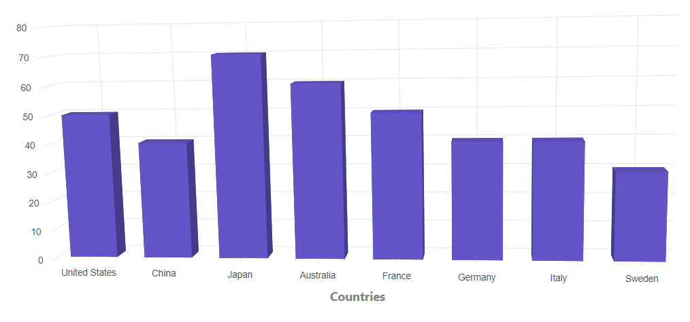
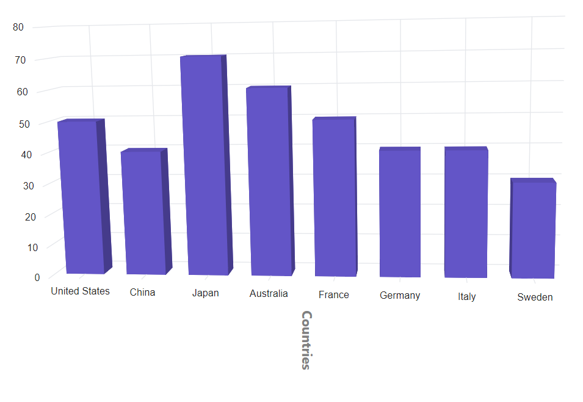
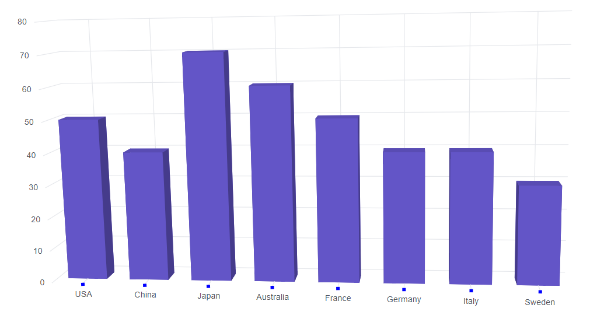
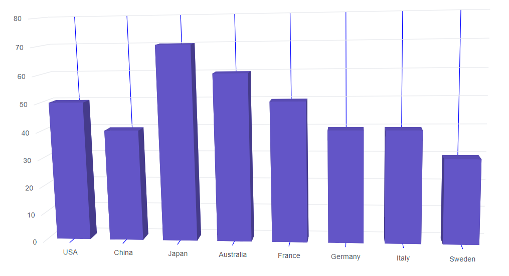
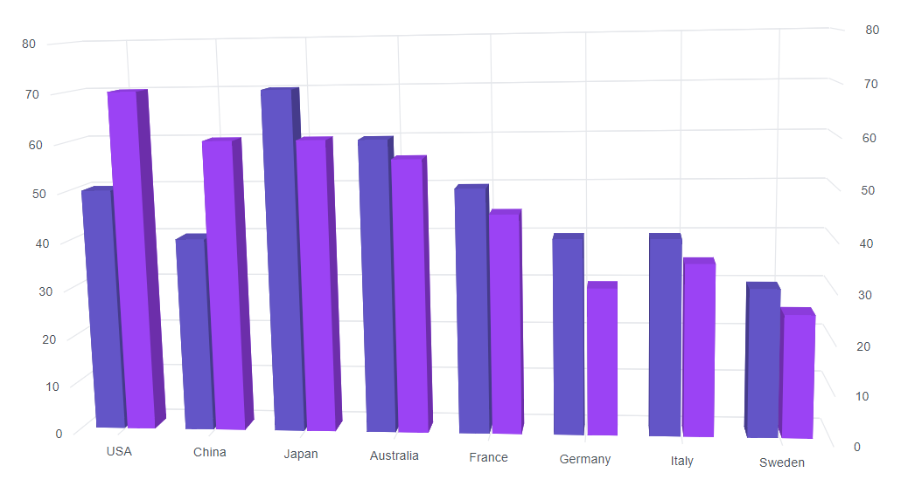
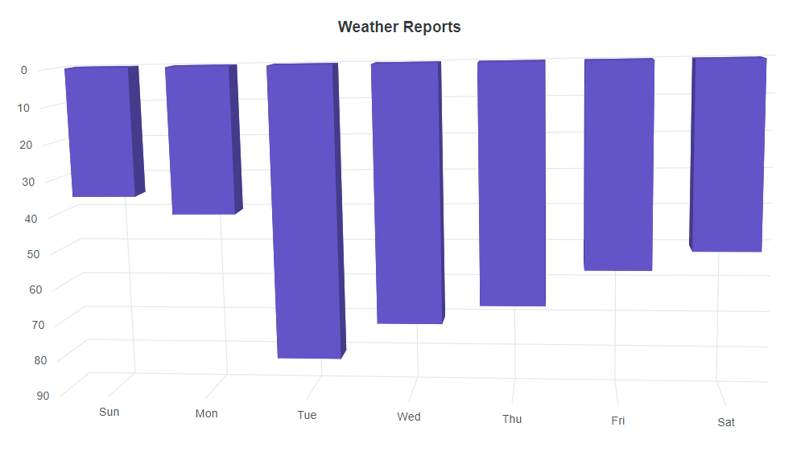
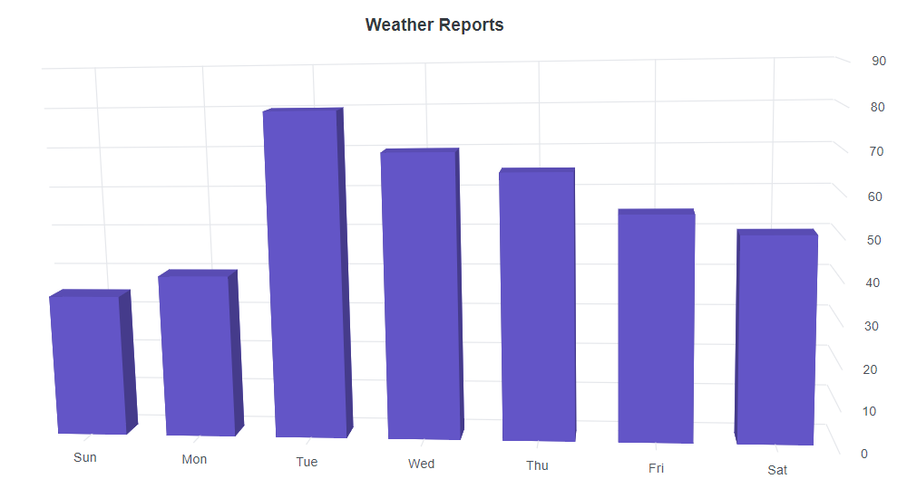

# Axis Customization in Blazor 3D Chart Component

## Title

The axis title can be added using the `Title` property. This provides quick information about the data plotted on the axis. The title style is customizable with the `Chart3DAxisTitleStyle` property.

```cshtml

@using Syncfusion.Blazor.Chart3D

<SfChart3D WallColor="transparent" EnableRotation="true" RotationAngle="7" TiltAngle="10" Depth="100">
    <Chart3DPrimaryXAxis Title="Countries" ValueType="Syncfusion.Blazor.Chart3D.ValueType.Category">
        <Chart3DAxisTitleStyle FontSize="16px" Color="grey" FontFamily="Segoe UI" FontWeight="bold">
        </Chart3DAxisTitleStyle>
    </Chart3DPrimaryXAxis>

    <Chart3DSeriesCollection>
        <Chart3DSeries DataSource="@MedalDetails" XName="Country" YName="Gold" Type="Chart3DSeriesType.Column">
        </Chart3DSeries>
    </Chart3DSeriesCollection>
</SfChart3D>

@code {
    public class Chart3DData
    {
        public string Country { get; set; }
        public double Gold { get; set; }
    }
	
    public List<Chart3DData> MedalDetails = new List<Chart3DData>
	{
		new Chart3DData { Country = "United States", Gold = 50 },
		new Chart3DData { Country = "China", Gold = 40 },
		new Chart3DData { Country = "Japan", Gold = 70 },
		new Chart3DData { Country = "Australia", Gold = 60 },
		new Chart3DData { Country = "France", Gold = 50 },
		new Chart3DData { Country = "Germany", Gold = 40 },
		new Chart3DData { Country = "Italy", Gold = 40 },
		new Chart3DData { Country = "Sweden", Gold = 30 }
    };
}

```




## Title rotation

The axis title can be rotated from 0 to 360 degrees using the `TitleRotationAngle` property.

```cshtml

@using Syncfusion.Blazor.Chart3D

<SfChart3D WallColor="transparent" EnableRotation="true" RotationAngle="7" TiltAngle="10" Depth="100">
    <Chart3DPrimaryXAxis Title="Countries" TitleRotationAngle="90" ValueType="Syncfusion.Blazor.Chart3D.ValueType.Category">
        <Chart3DAxisTitleStyle FontSize="16px" Color="grey" FontFamily="Segoe UI" FontWeight="bold"></Chart3DAxisTitleStyle>
    </Chart3DPrimaryXAxis>

    <Chart3DSeriesCollection>
        <Chart3DSeries DataSource="@MedalDetails" XName="Country" YName="Gold" Type="Chart3DSeriesType.Column">
        </Chart3DSeries>
    </Chart3DSeriesCollection>
</SfChart3D>

@code {
    public class Chart3DData
    {
        public string Country { get; set; }
        public double Gold { get; set; }
    }
	
    public List<Chart3DData> MedalDetails = new List<Chart3DData>
	{
		new Chart3DData { Country = "United States", Gold = 50 },
		new Chart3DData { Country = "China", Gold = 40 },
		new Chart3DData { Country = "Japan", Gold = 70 },
		new Chart3DData { Country = "Australia", Gold = 60 },
		new Chart3DData { Country = "France", Gold = 50 },
		new Chart3DData { Country = "Germany", Gold = 40 },
		new Chart3DData { Country = "Italy", Gold = 40 },
		new Chart3DData { Country = "Sweden", Gold = 30 }
    };
}

```




## Tick lines customization

The width, color, and height of minor and major tick lines are customizable using the `Chart3DMajorTickLines` and `Chart3DMinorTickLines` properties.

```cshtml

@using Syncfusion.Blazor.Chart3D

<SfChart3D WallColor="transparent" EnableRotation="true" RotationAngle="7" TiltAngle="10" Depth="100">
    <Chart3DPrimaryXAxis ValueType="Syncfusion.Blazor.Chart3D.ValueType.Category">
       <Chart3DMajorTickLines Color="blue" Width="5"></Chart3DMajorTickLines>
    </Chart3DPrimaryXAxis>

    <Chart3DSeriesCollection>
        <Chart3DSeries DataSource="@MedalDetails" XName="Country" YName="Gold" Type="Chart3DSeriesType.Column" />
    </Chart3DSeriesCollection>
</SfChart3D>

@code {
    public class Chart3DData
    {
        public string Country { get; set; }
        public double Gold { get; set; }
    }
	
    public List<Chart3DData> MedalDetails = new List<Chart3DData>
    {
		new Chart3DData { Country = "United States", Gold = 50 },
		new Chart3DData { Country = "China", Gold = 40 },
		new Chart3DData { Country = "Japan", Gold = 70 },
		new Chart3DData { Country = "Australia", Gold = 60 },
		new Chart3DData { Country = "France", Gold = 50 },
		new Chart3DData { Country = "Germany", Gold = 40 },
		new Chart3DData { Country = "Italy", Gold = 40 },
		new Chart3DData { Country = "Sweden", Gold = 30 }
    };
}

```




## Grid lines customization

The width and color of minor and major grid lines can be customized using the `Chart3DMajorGridLines` and `Chart3DMinorGridLines` properties.

```cshtml

@using Syncfusion.Blazor.Chart3D

<SfChart3D WallColor="transparent" EnableRotation="true" RotationAngle="7" TiltAngle="10" Depth="100">
    <Chart3DPrimaryXAxis ValueType="Syncfusion.Blazor.Chart3D.ValueType.Category">
       <Chart3DMajorGridLines Color="blue" Width="1"></Chart3DMajorGridLines>
    </Chart3DPrimaryXAxis>

    <Chart3DSeriesCollection>
        <Chart3DSeries DataSource="@MedalDetails" XName="Country" YName="Gold" Type="Chart3DSeriesType.Column" />
    </Chart3DSeriesCollection>
</SfChart3D>

@code {
    public class Chart3DData
    {
        public string Country { get; set; }
        public double Gold { get; set; }
    }
	
    public List<Chart3DData> MedalDetails = new List<Chart3DData>
    {
		new Chart3DData { Country = "United States", Gold = 50 },
		new Chart3DData { Country = "China", Gold = 40 },
		new Chart3DData { Country = "Japan", Gold = 70 },
		new Chart3DData { Country = "Australia", Gold = 60 },
		new Chart3DData { Country = "France", Gold = 50 },
		new Chart3DData { Country = "Germany", Gold = 40 },
		new Chart3DData { Country = "Italy", Gold = 40 },
		new Chart3DData { Country = "Sweden", Gold = 30 }
    };
}

```




## Multiple Axis

In addition to the primary X and Y axes, multiple axes can be added to the chart. Series can be associated with an axis by mapping to the axis's unique name.

```cshtml

@using Syncfusion.Blazor.Chart3D

<SfChart3D WallColor="transparent" EnableRotation="true" RotationAngle="7" TiltAngle="10" Depth="100">
    <Chart3DPrimaryXAxis ValueType="Syncfusion.Blazor.Chart3D.ValueType.Category">
    </Chart3DPrimaryXAxis>
    <Chart3DAxes>
        <Chart3DAxis Name="YAxis" OpposedPosition="true"/>
    </Chart3DAxes>
    <Chart3DSeriesCollection>
        <Chart3DSeries DataSource="@MedalDetails" XName="Country" YName="Gold" Type="Chart3DSeriesType.Column" />
        <Chart3DSeries DataSource="@MedalDetails" XName="Country" YName="Silver" Type="Chart3DSeriesType.Column" YAxisName="YAxis"/>
    </Chart3DSeriesCollection>
</SfChart3D>

@code {
    public class Chart3DData
    {
        public string Country { get; set; }
        public double Gold { get; set; }
        public double Silver { get; set; }
    }
	
    public List<Chart3DData> MedalDetails = new List<Chart3DData>
    {
		new Chart3DData { Country = "USA", Gold = 50, Silver = 70 },
		new Chart3DData { Country = "China", Gold = 40, Silver = 60 },
		new Chart3DData { Country = "Japan", Gold = 70, Silver = 60 },
		new Chart3DData { Country = "Australia", Gold = 60, Silver = 56 },
		new Chart3DData { Country = "France", Gold = 50, Silver = 45 },
		new Chart3DData { Country = "Germany", Gold = 40, Silver = 30 },
		new Chart3DData { Country = "Italy", Gold = 40, Silver = 35 },
		new Chart3DData { Country = "Sweden", Gold = 30, Silver = 25 }
    };
}

```




## Inversed Axis

<!-- markdownlint-disable MD033 -->
When an axis is inversed, the highest value appears closer to the origin. To invert an axis, set the `IsInversed` property to **true**.

```cshtml

@using Syncfusion.Blazor.Chart3D

<SfChart3D Title="Weather Reports" WallColor="transparent" EnableRotation="true" RotationAngle="7" TiltAngle="10" Depth="100">
    <Chart3DPrimaryXAxis ValueType="Syncfusion.Blazor.Chart3D.ValueType.Category" />

    <Chart3DPrimaryYAxis IsInversed="true" />

    <Chart3DSeriesCollection>
        <Chart3DSeries DataSource="@WeatherReports" XName="X" YName="Y" Type="Chart3DSeriesType.Column" />
    </Chart3DSeriesCollection>
</SfChart3D>

@code {
    public class Chart3DData
    {
        public string X { get; set; }
        public double Y { get; set; }
    }
	
    public List<Chart3DData> WeatherReports = new List<Chart3DData>
	{
        new Chart3DData { X = "Sun", Y = 35 },
        new Chart3DData { X = "Mon", Y = 40 },
        new Chart3DData { X = "Tue", Y = 80 },
        new Chart3DData { X = "Wed", Y = 70 },
        new Chart3DData { X = "Thu", Y = 65 },
        new Chart3DData { X = "Fri", Y = 55 },
        new Chart3DData { X = "Sat", Y = 50 }
    };
}

```




## Opposed position

To place an axis opposite its original position, set the `OpposedPosition` property to **true**.

```cshtml

@using Syncfusion.Blazor.Chart3D

<SfChart3D Title="Weather Reports" WallColor="transparent" EnableRotation="true" RotationAngle="7" TiltAngle="10" Depth="100">
    <Chart3DPrimaryXAxis ValueType="Syncfusion.Blazor.Chart3D.ValueType.Category" />

    <Chart3DPrimaryYAxis OpposedPosition="true" />

    <Chart3DSeriesCollection>
        <Chart3DSeries DataSource="@WeatherReports" XName="X" YName="Y" Type="Chart3DSeriesType.Column" />
    </Chart3DSeriesCollection>
</SfChart3D>

@code {
    public class Chart3DData
    {
        public string X { get; set; }
        public double Y { get; set; }
    }
	
    public List<Chart3DData> WeatherReports = new List<Chart3DData>
	{
        new Chart3DData { X = "Sun", Y = 35 },
        new Chart3DData { X = "Mon", Y = 40 },
        new Chart3DData { X = "Tue", Y = 80 },
        new Chart3DData { X = "Wed", Y = 70 },
        new Chart3DData { X = "Thu", Y = 65 },
        new Chart3DData { X = "Fri", Y = 55 },
        new Chart3DData { X = "Sat", Y = 50 }
    };
} 

```



