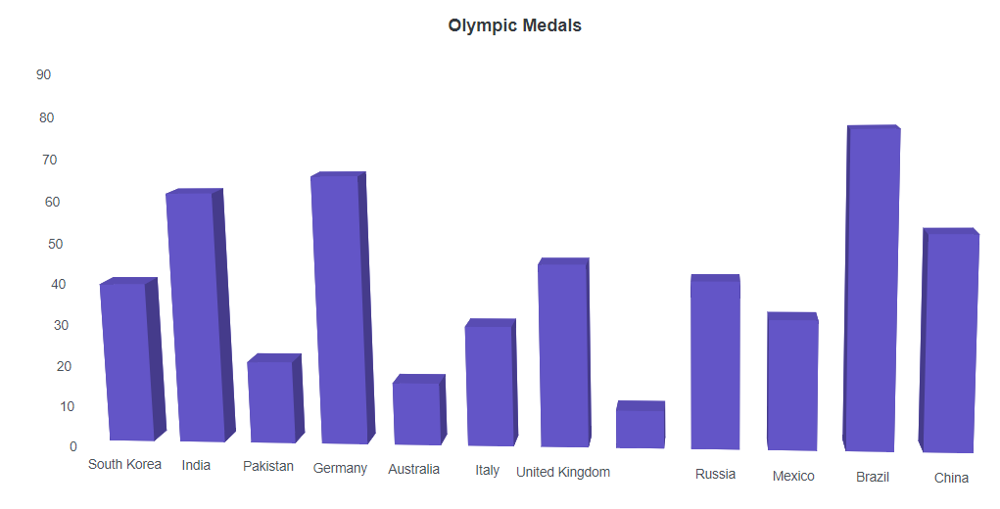
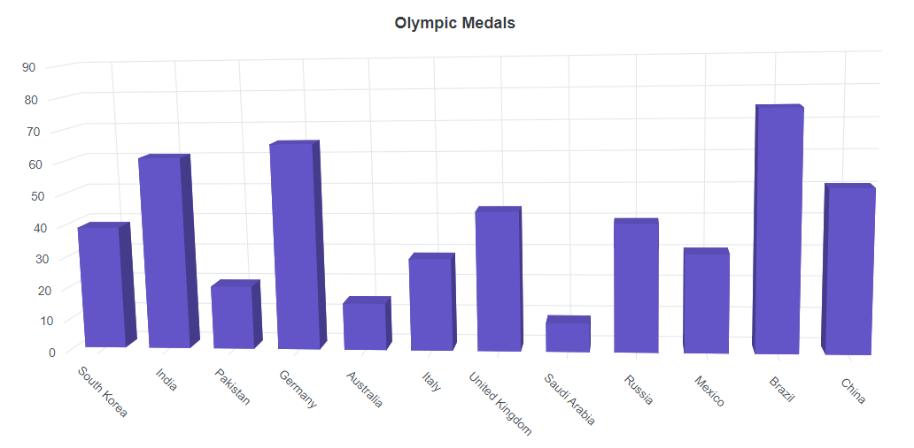
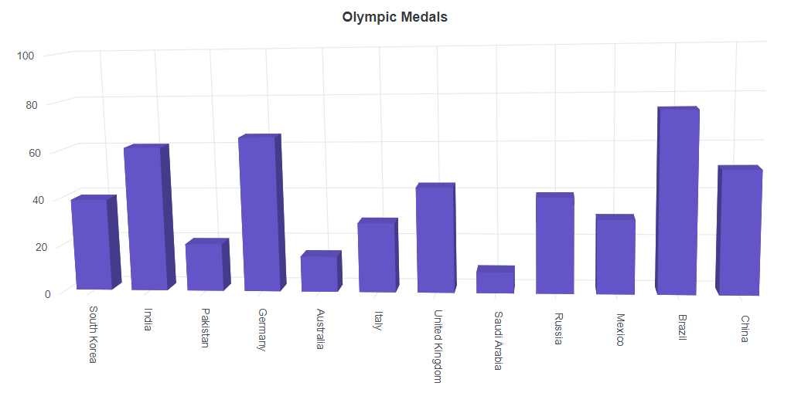
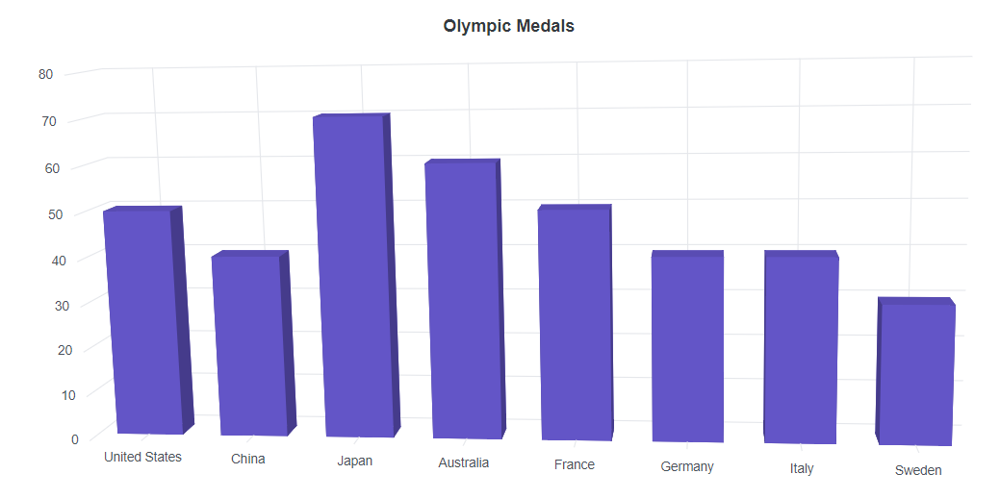

# Axis Labels in Blazor 3D Chart Component

Axis labels are the labels that are positioned adjacent to the y-axis and beneath the x-axis. It provides descriptive information about the axis.

## Smart axis labels

When the axis labels overlap with each other, `LabelIntersectAction` property in the axis can be used to place them smartly.

**Case 1:** When setting `LabelIntersectAction` as **Hide**.

```cshtml

@using Syncfusion.Blazor.Chart3D

<SfChart3D Title="Olympic Medals" WallColor="transparent" EnableRotation="true" RotationAngle="7" TiltAngle="10" Depth="100">
    <Chart3DPrimaryXAxis ValueType="Syncfusion.Blazor.Chart3D.ValueType.Category" LabelIntersectAction="Syncfusion.Blazor.Chart3D.LabelIntersectAction.Hide" />

    <Chart3DSeriesCollection>
        <Chart3DSeries DataSource="@MedalDetails" XName="X" YName="Y" Type="Chart3DSeriesType.Column" />
    </Chart3DSeriesCollection>
</SfChart3D>

@code{
    public class Chart3DData
    {
        public string X { get; set; }
        public double Y { get; set; }
    }
	
    public List<Chart3DData> MedalDetails = new List<Chart3DData>
    {
		new Chart3DData { X = "South Korea", Y = 39 },
		new Chart3DData { X = "India", Y = 61 },
		new Chart3DData { X = "Pakistan", Y = 20 },
		new Chart3DData { X = "Germany", Y = 65 },
		new Chart3DData { X = "Australia", Y = 15 },
		new Chart3DData { X = "Italy", Y = 29 },
		new Chart3DData { X = "United Kingdom", Y = 44 },
		new Chart3DData { X = "Saudi Arabia", Y = 9 },
		new Chart3DData { X = "Russia", Y = 40 },
		new Chart3DData { X = "Mexico", Y = 31 },
		new Chart3DData { X = "Brazil", Y = 75 },
		new Chart3DData { X = "China", Y = 51 }
    };
}


```




**Case 2:** When setting `LabelIntersectAction` as **Rotate45**.

```cshtml

@using Syncfusion.Blazor.Chart3D

<SfChart3D Title="Olympic Medals" WallColor="transparent" EnableRotation="true" RotationAngle="7" TiltAngle="10" Depth="100">
    <Chart3DPrimaryXAxis ValueType="Syncfusion.Blazor.Chart3D.ValueType.Category" LabelIntersectAction="Syncfusion.Blazor.Chart3D.LabelIntersectAction.Rotate45" />

    <Chart3DSeriesCollection>
        <Chart3DSeries DataSource="@MedalDetails" XName="X" YName="Y" Type="Chart3DSeriesType.Column" />
    </Chart3DSeriesCollection>
</SfChart3D>

@code{
    public class Chart3DData
    {
        public string X { get; set; }
        public double Y { get; set; }
    }
	
    public List<Chart3DData> MedalDetails = new List<Chart3DData>
    {
		new Chart3DData { X = "South Korea", Y = 39 },
		new Chart3DData { X = "India", Y = 61 },
		new Chart3DData { X = "Pakistan", Y = 20 },
		new Chart3DData { X = "Germany", Y = 65 },
		new Chart3DData { X = "Australia", Y = 15 },
		new Chart3DData { X = "Italy", Y = 29 },
		new Chart3DData { X = "United Kingdom", Y = 44 },
		new Chart3DData { X = "Saudi Arabia", Y = 9 },
		new Chart3DData { X = "Russia", Y = 40 },
		new Chart3DData { X = "Mexico", Y = 31 },
		new Chart3DData { X = "Brazil", Y = 75 },
		new Chart3DData { X = "China", Y = 51 }
    };
}

```




**Case 3:** When setting `LabelIntersectAction` as **Rotate90**.

```cshtml

@using Syncfusion.Blazor.Chart3D

<SfChart3D Title="Olympic Medals" WallColor="transparent" EnableRotation="true" RotationAngle="7" TiltAngle="10" Depth="100">
    <Chart3DPrimaryXAxis ValueType="Syncfusion.Blazor.Chart3D.ValueType.Category" LabelIntersectAction="Syncfusion.Blazor.Chart3D.LabelIntersectAction.Rotate90" />

    <Chart3DSeriesCollection>
        <Chart3DSeries DataSource="@MedalDetails" XName="X" YName="Y" Type="Chart3DSeriesType.Column" />
    </Chart3DSeriesCollection>
</SfChart3D>

@code{
    public class Chart3DData
    {
        public string X { get; set; }
        public double Y { get; set; }
    }
	
    public List<Chart3DData> MedalDetails = new List<Chart3DData>
    {
		new Chart3DData { X = "South Korea", Y = 39 },
		new Chart3DData { X = "India", Y = 61 },
		new Chart3DData { X = "Pakistan", Y = 20 },
		new Chart3DData { X = "Germany", Y = 65 },
		new Chart3DData { X = "Australia", Y = 15 },
		new Chart3DData { X = "Italy", Y = 29 },
		new Chart3DData { X = "United Kingdom", Y = 44 },
		new Chart3DData { X = "Saudi Arabia", Y = 9 },
		new Chart3DData { X = "Russia", Y = 40 },
		new Chart3DData { X = "Mexico", Y = 31 },
		new Chart3DData { X = "Brazil", Y = 75 },
		new Chart3DData { X = "China", Y = 51 }
    };
}

```




## Edge label placement

Labels with long text at the edges of an axis may appear partially in the 3D chart. To avoid this,
use the `EdgeLabelPlacement` property in axis, which moves the label inside the chart area for better appearance or hides it.

```cshtml

@using Syncfusion.Blazor.Chart3D

<SfChart3D Title="Olympic Medals" WallColor="transparent" EnableRotation="true" RotationAngle="7" TiltAngle="10" Depth="100">
    <Chart3DPrimaryXAxis EdgeLabelPlacement="Syncfusion.Blazor.Chart3D.EdgeLabelPlacement.Shift" ValueType="Syncfusion.Blazor.Chart3D.ValueType.Category">
    </Chart3DPrimaryXAxis>

    <Chart3DSeriesCollection>
        <Chart3DSeries DataSource="@MedalDetails" XName="Country" YName="Gold" Type="Chart3DSeriesType.Column">
        </Chart3DSeries>
    </Chart3DSeriesCollection>
</SfChart3D>

@code{
    public class Chart3DData
    {
        public string Country { get; set; }
        public double Gold { get; set; }
    }
	
    public List<Chart3DData> MedalDetails = new List<Chart3DData>
	{
		new Chart3DData { Country = "United States", Gold = 50 },
		new Chart3DData { Country = "China", Gold = 40 },
		new Chart3DData { Country = "Japan", Gold = 70 },
		new Chart3DData { Country = "Australia", Gold = 60 },
		new Chart3DData { Country = "France", Gold = 50 },
		new Chart3DData { Country = "Germany", Gold = 40 },
		new Chart3DData { Country = "Italy", Gold = 40 },
		new Chart3DData { Country = "Sweden", Gold = 30 }
    };
}

```




## Maximum labels

The labels will be rendered based on the count in the `MaximumLabels` property per 100 pixel. If the range (minimum, maximum, interval) and `MaximumLabels` are set, then the priority goes to range. If the range is not set, then the priority goes to `MaximumLabels` property.

```cshtml

@using Syncfusion.Blazor.Chart3D

<SfChart3D Title="Product X" WallColor="transparent" EnableRotation="true" RotationAngle="7" TiltAngle="10" Depth="100">
    <Chart3DPrimaryXAxis EdgeLabelPlacement="EdgeLabelPlacement.Shift" MaximumLabels="1" ValueType="Syncfusion.Blazor.Chart3D.ValueType.Category">
    </Chart3DPrimaryXAxis>
    <Chart3DPrimaryYAxis Title="Profit ($)"></Chart3DPrimaryYAxis>
    <Chart3DSeriesCollection>
        <Chart3DSeries DataSource="@ChartPoints" XName="Period" YName="Price" Name="Product X" Type="Chart3DSeriesType.Column">
        </Chart3DSeries>
    </Chart3DSeriesCollection>
</SfChart3D>

@code
{
    private Random randomNum = new Random();
    private double PriceY = 80;
    public List<ChartData> ChartPoints { get; set; } = new List<ChartData>();
    protected override void OnInitialized()
    {
        GetChartPoints(50);
    }
    private void GetChartPoints(int value)
    {
        if (ChartPoints.Count > 0)
        {
            ChartPoints.Clear();
        }
        for (int i = 1; i < value; i++)
        {
            if (randomNum.NextDouble() > 0.5)
            {
                PriceY += randomNum.NextDouble();
            }
            else
            {
                PriceY -= randomNum.NextDouble();
            }
            ChartPoints.Add(new ChartData
                {
                    Period = i,
                    Price = Math.Round(PriceY)
                }
            );
        }
    }
    public class ChartData
    {
        public double Period { get; set; }
        public double Price { get; set; }
    }
}

```

