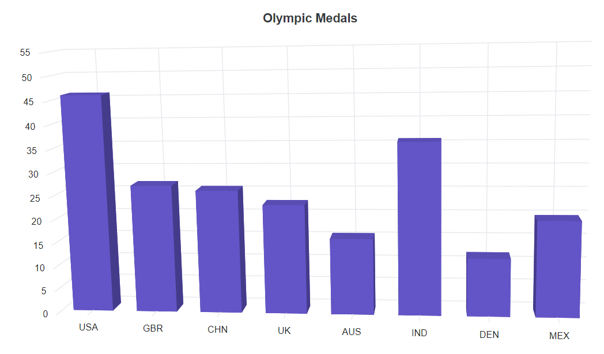
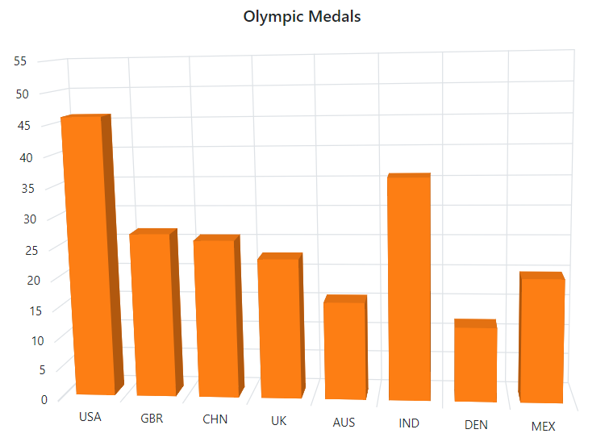
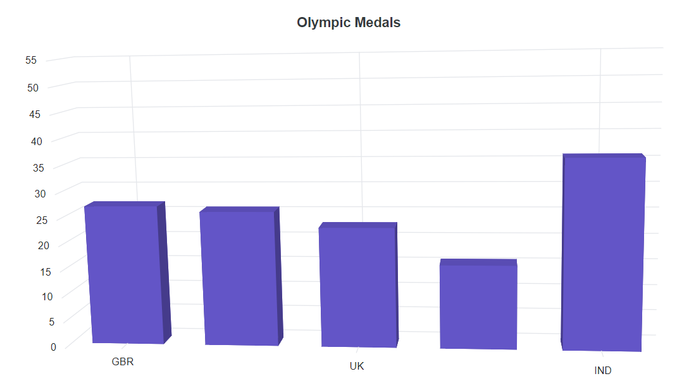

# Category Axis in Blazor 3D Chart Component

The category axis is the horizontal axis of a 3D chart that shows text values rather than numerical values. Compared to the vertical axis, this axis has fewer labels. The following sample shows to render the 3D chart using category axis.

```cshtml

@using Syncfusion.Blazor.Chart3D

<SfChart3D Title="Olympic Medals" WallColor="transparent" EnableRotation="true" RotationAngle="7" TiltAngle="10" Depth="100">
    <Chart3DPrimaryXAxis ValueType="Syncfusion.Blazor.Chart3D.ValueType.Category">
    </Chart3DPrimaryXAxis>

    <Chart3DSeriesCollection>
        <Chart3DSeries DataSource="@MedalDetails" XName="X" YName="YValue" Type="Chart3DSeriesType.Column">
        </Chart3DSeries>
    </Chart3DSeriesCollection>
</SfChart3D>

@code{
    public class Chart3DData
    {
        public string X { get; set; }
        public double YValue { get; set; }
    }

    public List<Chart3DData> MedalDetails = new List<Chart3DData>
	{
        new Chart3DData { X = "USA", YValue = 46 },
        new Chart3DData { X = "GBR", YValue = 27 },
        new Chart3DData { X = "CHN", YValue = 26 },
        new Chart3DData { X = "UK", YValue = 23 },
        new Chart3DData { X = "AUS", YValue = 16 },
        new Chart3DData { X = "IND", YValue = 36 },
        new Chart3DData { X = "DEN", YValue = 12 },
        new Chart3DData { X = "MEX", YValue = 20 }
    };
}

```




## Labels placement

By default, category axis labels are placed between ticks in an axis. It can also be placed on ticks using the `LabelPlacement` property.

```cshtml

@using Syncfusion.Blazor.Chart3D

<SfChart3D Title="Olympic Medals" WallColor="transparent" EnableRotation="true" RotationAngle="7" TiltAngle="10" Depth="100">
    <Chart3DPrimaryXAxis LabelPlacement="LabelPlacement.OnTicks" ValueType="Syncfusion.Blazor.Chart3D.ValueType.Category">
    </Chart3DPrimaryXAxis>

    <Chart3DSeriesCollection>
        <Chart3DSeries DataSource="@MedalDetails" XName="X" YName="YValue" Type="Chart3DSeriesType.Column">
        </Chart3DSeries>
    </Chart3DSeriesCollection>
</SfChart3D>

@code{
    public class Chart3DData
    {
        public string X { get; set; }
        public double YValue { get; set; }
    }
	
    public List<Chart3DData> MedalDetails = new List<Chart3DData>
	{
        new Chart3DData { X = "USA", YValue = 46 },
        new Chart3DData { X = "GBR", YValue = 27 },
        new Chart3DData { X = "CHN", YValue = 26 },
        new Chart3DData { X = "UK", YValue = 23 },
        new Chart3DData { X = "AUS", YValue = 16 },
        new Chart3DData { X = "IND", YValue = 36 },
        new Chart3DData { X = "DEN", YValue = 12 },
        new Chart3DData { X = "MEX", YValue = 20 }
    };
}

```




## Range

The range of the category axis can be customized using `Minimum`, `Maximum`, and `Interval` properties of the axis.

```cshtml

@using Syncfusion.Blazor.Chart3D

<SfChart3D Title="Olympic Medals" WallColor="transparent" EnableRotation="true" RotationAngle="7" TiltAngle="10" Depth="100">
    <Chart3DPrimaryXAxis Maximum="5" Minimum="1" Interval="2" ValueType="Syncfusion.Blazor.Chart3D.ValueType.Category">
    </Chart3DPrimaryXAxis>

    <Chart3DSeriesCollection>
        <Chart3DSeries DataSource="@MedalDetails" XName="X" YName="YValue" Type="Chart3DSeriesType.Column">
        </Chart3DSeries>
    </Chart3DSeriesCollection>
</SfChart3D>

@code{
    public class Chart3DData
    {
        public string X { get; set; }
        public double YValue { get; set; }
    }
	
    public List<Chart3DData> MedalDetails = new List<Chart3DData>
	{
        new Chart3DData { X = "USA", YValue = 46 },
        new Chart3DData { X = "GBR", YValue = 27 },
        new Chart3DData { X = "CHN", YValue = 26 },
        new Chart3DData { X = "UK", YValue = 23 },
        new Chart3DData { X = "AUS", YValue = 16 },
        new Chart3DData { X = "IND", YValue = 36 },
        new Chart3DData { X = "DEN", YValue = 12 },
        new Chart3DData { X = "MEX", YValue = 20 }
    };
}

```




## Indexed category axis

The category axis can also be rendered based on the index values of the data source. This can be achieved by defining the `IsIndexed` property to **true** in the axis.

```cshtml

@using Syncfusion.Blazor.Chart3D
<SfChart3D Title="Olympic Medals" WallColor="transparent" EnableRotation="true" RotationAngle="7" TiltAngle="10" Depth="100">
    <Chart3DPrimaryXAxis IsIndexed="true" ValueType="Syncfusion.Blazor.Chart3D.ValueType.Category">
    </Chart3DPrimaryXAxis>

    <Chart3DSeriesCollection>
        <Chart3DSeries DataSource="@WeatherReports1" XName="X" YName="Y" Type="Chart3DSeriesType.Column">
        </Chart3DSeries>
        <Chart3DSeries DataSource="@WeatherReports2" XName="X" YName="Y" Type="Chart3DSeriesType.Column">
        </Chart3DSeries>
    </Chart3DSeriesCollection>
</SfChart3D>

@code{
    public class WeatherData
    {
        public string X { get; set; }
        public double Y { get; set; }
    }

    public List<WeatherData> WeatherReports1 = new List<WeatherData>
	{
        new WeatherData { X = "Myanmar", Y = 7.3 },
        new WeatherData { X = "India", Y = 7.9 },
        new WeatherData { X = "Bangladesh", Y = 6.8 },
        new WeatherData { X = "Cambodia", Y = 7.0 },
        new WeatherData { X = "China", Y = 6.9 }
    };

    public List<WeatherData> WeatherReports2 = new List<WeatherData>
	{
        new WeatherData { X = "Poland", Y = 2.7 },
        new WeatherData { X = "Australia", Y = 2.5 },
        new WeatherData { X = "Singapore", Y = 2.0 },
        new WeatherData { X = "Canada", Y = 1.4 },
        new WeatherData { X = "Germany", Y = 1.8 }
    };
}

```



