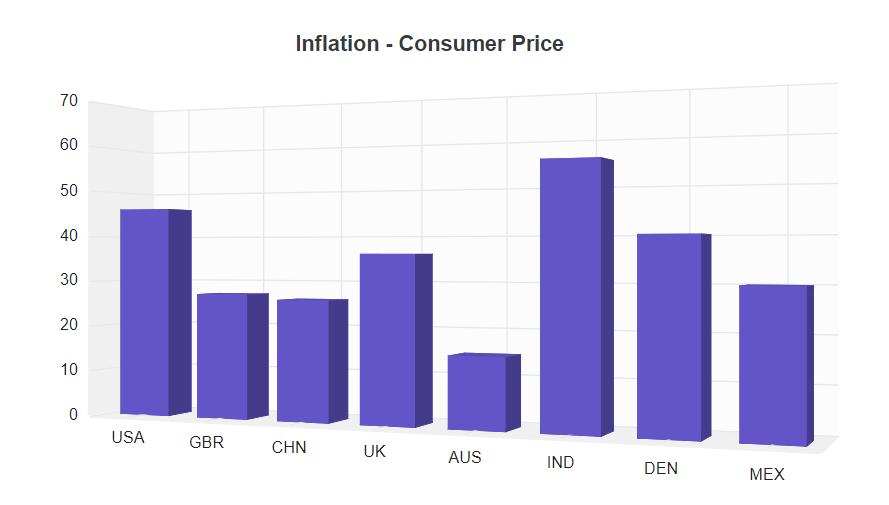

# Dimensions in Blazor 3D Chart Component

## Size for container

The 3D Chart renders to fit its container. The container size can be set using inline styles or CSS, as shown below.

```cshtml

@using Syncfusion.Blazor.Chart3D

<div style="width:650px; height:350px">
    <SfChart3D Title="Inflation - Consumer Price" EnableRotation="true" RotationAngle="22" Depth="100">
        <Chart3DPrimaryXAxis ValueType="Syncfusion.Blazor.Chart3D.ValueType.Category"></Chart3DPrimaryXAxis>

        <Chart3DSeriesCollection>
            <Chart3DSeries DataSource="@ConsumerDetails" XName="X" YName="YValue" Type="Chart3DSeriesType.Column">
            </Chart3DSeries>
        </Chart3DSeriesCollection>
    </SfChart3D>
</div>

@code {
    public class Chart3DData
    {
        public string X { get; set; }
        public double YValue { get; set; }
    }
	
    public List<Chart3DData> ConsumerDetails = new List<Chart3DData>
    {
        new Chart3DData { X = "USA", YValue = 46 },
        new Chart3DData { X = "GBR", YValue = 27 },
        new Chart3DData { X = "CHN", YValue = 26 },
        new Chart3DData { X = "UK", YValue = 36 },
        new Chart3DData { X = "AUS", YValue = 15 },
        new Chart3DData { X = "IND", YValue = 55 },
        new Chart3DData { X = "DEN", YValue = 40 },
        new Chart3DData { X = "MEX", YValue = 30 }
    };
}

```



## Size for chart

The size of the 3D Chart can be set directly using the `Width` and `Height` properties.

### In Pixels

Set the chart size in pixels as shown below.

```cshtml

@using Syncfusion.Blazor.Chart3D

<SfChart3D Title="Inflation - Consumer Price" Width="650px" Height="350px" EnableRotation="true" RotationAngle="22" Depth="100">
    <Chart3DPrimaryXAxis ValueType="Syncfusion.Blazor.Chart3D.ValueType.Category"></Chart3DPrimaryXAxis>

    <Chart3DSeriesCollection>
        <Chart3DSeries DataSource="@ConsumerDetails" XName="X" YName="YValue" Type="Chart3DSeriesType.Column">
        </Chart3DSeries>
    </Chart3DSeriesCollection>
</SfChart3D>

@code {
    public class Chart3DData
    {
        public string X { get; set; }
        public double YValue { get; set; }
    }
	
    public List<Chart3DData> ConsumerDetails = new List<Chart3DData>
    {
        new Chart3DData { X = "USA", YValue = 46 },
        new Chart3DData { X = "GBR", YValue = 27 },
        new Chart3DData { X = "CHN", YValue = 26 },
        new Chart3DData { X = "UK", YValue = 36 },
        new Chart3DData { X = "AUS", YValue = 15 },
        new Chart3DData { X = "IND", YValue = 55 },
        new Chart3DData { X = "DEN", YValue = 40 },
        new Chart3DData { X = "MEX", YValue = 30 }
    };
}

```




### In Percentage

When the value is set in percentage, the 3D Chart dimensions are relative to its container. For example, setting `Height` to **50%** renders the chart at half the container height.

```cshtml

@using Syncfusion.Blazor.Chart3D

<SfChart3D Title="Inflation - Consumer Price" Width="80%" Height="90%" EnableRotation="true" RotationAngle="22" Depth="100">
    <Chart3DPrimaryXAxis ValueType="Syncfusion.Blazor.Chart3D.ValueType.Category"></Chart3DPrimaryXAxis>

    <Chart3DSeriesCollection>
        <Chart3DSeries DataSource="@ConsumerDetails" XName="X" YName="YValue" Type="Chart3DSeriesType.Column">
        </Chart3DSeries>
    </Chart3DSeriesCollection>
</SfChart3D>

@code {
    public class Chart3DData
    {
        public string X { get; set; }
        public double YValue { get; set; }
    }
	
    public List<Chart3DData> ConsumerDetails = new List<Chart3DData>
    {
        new Chart3DData { X = "USA", YValue = 46 },
        new Chart3DData { X = "GBR", YValue = 27 },
        new Chart3DData { X = "CHN", YValue = 26 },
        new Chart3DData { X = "UK", YValue = 36 },
        new Chart3DData { X = "AUS", YValue = 15 },
        new Chart3DData { X = "IND", YValue = 55 },
        new Chart3DData { X = "DEN", YValue = 40 },
        new Chart3DData { X = "MEX", YValue = 30 }
    };
}

```



