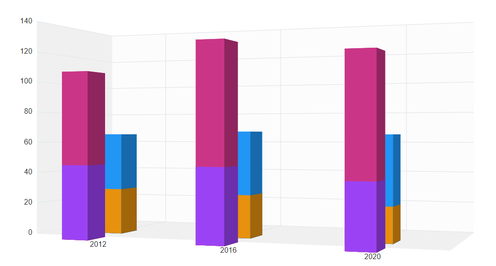

# Column Chart in Blazor 3D Chart Component

## Column

To render a `Column Chart`, use series `Type` as `Column`.

```cshtml

@using Syncfusion.Blazor.Chart3D

<SfChart3D WallColor="transparent" EnableRotation="true" RotationAngle="7" TiltAngle="10" Depth="100">
    <Chart3DPrimaryXAxis ValueType="Syncfusion.Blazor.Chart3D.ValueType.Category"/>

    <Chart3DSeriesCollection>
        <Chart3DSeries DataSource="@MedalDetails" XName="X" YName="Y" Type="Chart3DSeriesType.Column">
        </Chart3DSeries>
    </Chart3DSeriesCollection>
</SfChart3D>

@code{
    public class Chart3DData
    {
        public string X { get; set; }
        public double Y { get; set; }
    }

    public List<Chart3DData> MedalDetails = new List<Chart3DData>
	{
        new Chart3DData { X = "USA", Y = 61.3 },
        new Chart3DData { X = "Pakistan", Y = 20.4 },
        new Chart3DData { X = "Germany", Y = 65.1 },
        new Chart3DData { X = "Australia", Y = 15.8 },
        new Chart3DData { X = "Italy", Y = 29.2 },
        new Chart3DData { X = "India", Y = 44.6 },
        new Chart3DData { X = "Russia", Y = 40.8 },
        new Chart3DData { X = "Mexico", Y = 31 },
        new Chart3DData { X = "Brazil", Y = 75.9 },
        new Chart3DData { X = "China", Y = 51.4 }
    };
}

```



## Column space and width

The `ColumnSpacing` and `ColumnWidth` properties are used to customize the space between columns.

```cshtml

@using Syncfusion.Blazor.Chart3D

<SfChart3D WallColor="transparent" EnableRotation="true" RotationAngle="7" TiltAngle="10" Depth="100">
    <Chart3DPrimaryXAxis ValueType="Syncfusion.Blazor.Chart3D.ValueType.Category">
    </Chart3DPrimaryXAxis>

    <Chart3DSeriesCollection>
        <Chart3DSeries DataSource="@MedalDetails" XName="Country" YName="Gold" Type="Chart3DSeriesType.Column" />
        <Chart3DSeries DataSource="@MedalDetails" XName="Country" YName="Silver" ColumnSpacing="0.5" ColumnWidth="0.75" Type="Chart3DSeriesType.Column" />
    </Chart3DSeriesCollection>
</SfChart3D>

@code{
    public class Chart3DData
    {
        public string Country { get; set; }
        public double Gold { get; set; }
        public double Silver { get; set; }
    }
	
    public List<Chart3DData> MedalDetails = new List<Chart3DData>
    {
		new Chart3DData { Country = "USA", Gold = 50, Silver = 70 },
		new Chart3DData { Country = "China", Gold = 40, Silver = 60 },
		new Chart3DData { Country = "Japan", Gold = 70, Silver = 60 },
		new Chart3DData { Country = "Australia", Gold = 60, Silver = 56 },
		new Chart3DData { Country = "France", Gold = 50, Silver = 45 },
		new Chart3DData { Country = "Germany", Gold = 40, Silver = 30 },
		new Chart3DData { Country = "Italy", Gold = 40, Silver = 35 },
		new Chart3DData { Country = "Sweden", Gold = 30, Silver = 25 }
    };
}

```



## Grouped column

The data points can be grouped in the column type charts by using the `GroupName` property. Data points with same group name are grouped together.

```cshtml

@using Syncfusion.Blazor.Chart3D

<SfChart3D EnableSideBySidePlacement="false" RotationAngle="20" Depth="300">
    <Chart3DPrimaryXAxis ValueType="@Syncfusion.Blazor.Chart3D.ValueType.Category">
    </Chart3DPrimaryXAxis>
    <Chart3DSeriesCollection>
        <Chart3DSeries DataSource="@Chart3DPoints" XName="Year" YName="USA_Total" GroupName="USA" ColumnWidth="0.2" Fill="#CB3587"></Chart3DSeries>
        <Chart3DSeries DataSource="@Chart3DPoints" XName="Year" YName="USA_Gold" GroupName="USA" ColumnWidth="0.2"></Chart3DSeries>
        <Chart3DSeries DataSource="@Chart3DPoints" XName="Year" YName="UK_Total" GroupName="UK" ColumnWidth="0.2"></Chart3DSeries>
        <Chart3DSeries DataSource="@Chart3DPoints" XName="Year" YName="UK_Gold" GroupName="UK" ColumnWidth="0.2" Fill="#E7910F"></Chart3DSeries>
    </Chart3DSeriesCollection>
</SfChart3D>

@code{
    public class ColumnData
    {
        public string Year { get; set; }
        public double USA_Total { get; set; }
        public double USA_Gold { get; set; }
        public double UK_Total { get; set; }
        public double UK_Gold { get; set; }
        public double China_Total { get; set; }
        public double China_Gold { get; set; }
    }
    public List<ColumnData> Chart3DPoints { get; set; } = new List<ColumnData>
    {
        new ColumnData { Year = "2012", USA_Total = 104, USA_Gold = 46, UK_Total = 65, UK_Gold = 29, China_Total = 91, China_Gold = 38},
        new ColumnData { Year = "2016", USA_Total = 121, USA_Gold = 46, UK_Total = 67, UK_Gold = 27, China_Total = 70, China_Gold = 26},
        new ColumnData { Year = "2020", USA_Total = 113, USA_Gold = 39, UK_Total = 65, UK_Gold = 22, China_Total = 88, China_Gold = 38}
    };
}

```




## Cylindrical column chart

To render a cylindrical column chart, set the `ColumnFacet` property to `Cylinder` in the chart series.

```cshtml

@using Syncfusion.Blazor.Chart3D

<SfChart3D WallColor="transparent" RotationAngle="7" TiltAngle="10" Depth="100" Title="Passenger Car Production in Selected Countries – 2021">
    <Chart3DPrimaryXAxis ValueType="Syncfusion.Blazor.Chart3D.ValueType.Category" Interval="1"></Chart3DPrimaryXAxis>
    <Chart3DPrimaryYAxis Maximum="4" Interval="1"></Chart3DPrimaryYAxis>
    <Chart3DSeriesCollection>
        <Chart3DSeries DataSource="@Chart3DPoints" XName="X" YName="Y" ColumnWidth="0.9" Type="Chart3DSeriesType.Column" ColumnFacet="Chart3DShapeType.Cylinder"></Chart3DSeries>
    </Chart3DSeriesCollection>
    <Chart3DTooltipSettings Enable="true" Header="${point.x}" Format="Car Production : <b>${point.y}M"></Chart3DTooltipSettings>
</SfChart3D>
@code {
    public List<ColumnChart3DData> Chart3DPoints { get; set; } = new List<ColumnChart3DData>
    {
        new ColumnChart3DData { X = "Czechia", Y = 1.11 },
        new ColumnChart3DData { X = "Spain", Y = 1.66 },
        new ColumnChart3DData { X = "USA", Y = 1.56 },
        new ColumnChart3DData { X = "Germany", Y = 3.1 },
        new ColumnChart3DData { X = "Russia", Y = 1.35 },
        new ColumnChart3DData { X = "Slovakia", Y = 1 },
        new ColumnChart3DData { X = "South Korea", Y = 3.16 },
        new ColumnChart3DData { X = "France", Y = 0.92 }
    };
    public class ColumnChart3DData
    {
        public string X { get; set; }
        public double Y { get; set; }
    }
}

```



## Series customization

The following properties can be used to customize the `Column` series.

* `Fill` – Specifies the color of the series.
* `Opacity` – Specifies the opacity of the `Fill` color.

```cshtml

@using Syncfusion.Blazor.Chart3D

<SfChart3D WallColor="transparent" EnableRotation="true" RotationAngle="7" TiltAngle="10" Depth="100">
    <Chart3DPrimaryXAxis ValueType="Syncfusion.Blazor.Chart3D.ValueType.Category">
    </Chart3DPrimaryXAxis>

    <Chart3DSeriesCollection>
        <Chart3DSeries DataSource="@MedalDetails" XName="Country" YName="Gold" Fill="#0364DE" Type="Chart3DSeriesType.Column" />
    </Chart3DSeriesCollection>
</SfChart3D>

@code{
    public class Chart3DData
    {
        public string Country { get; set; }
        public double Gold { get; set; }
        public double Silver { get; set; }
    }
	
    public List<Chart3DData> MedalDetails = new List<Chart3DData>
    {
		new Chart3DData { Country = "USA", Gold = 50, Silver = 70 },
		new Chart3DData { Country = "China", Gold = 40, Silver = 60 },
		new Chart3DData { Country = "Japan", Gold = 70, Silver = 60 },
		new Chart3DData { Country = "Australia", Gold = 60, Silver = 56 },
		new Chart3DData { Country = "France", Gold = 50, Silver = 45 },
		new Chart3DData { Country = "Germany", Gold = 40, Silver = 30 },
		new Chart3DData { Country = "Italy", Gold = 40, Silver = 35 },
		new Chart3DData { Country = "Sweden", Gold = 30, Silver = 25 }
    };
}

```



