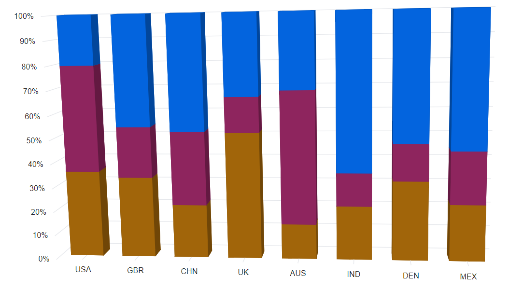

# 100% Stacked Column in Blazor 3D Chart Component

## 100% Stacked column chart

To render a 100% stacked column chart, set the series `Type` property to `StackingColumn100`.

```cshtml

@using Syncfusion.Blazor.Chart3D

<SfChart3D WallColor="transparent" EnableRotation="true" RotationAngle="7" TiltAngle="10" Depth="100">
    <Chart3DPrimaryXAxis ValueType="Syncfusion.Blazor.Chart3D.ValueType.Category" />

    <Chart3DSeriesCollection>
        <Chart3DSeries DataSource="@MedalDetails" XName="X" YName="YValue" Type="Chart3DSeriesType.StackingColumn100"></Chart3DSeries>
        <Chart3DSeries DataSource="@MedalDetails" XName="X" YName="YValue1" Type="Chart3DSeriesType.StackingColumn100"></Chart3DSeries>
    </Chart3DSeriesCollection>
</SfChart3D>

@code {
    public class Chart3DData
    {
        public string X { get; set; }
        public double YValue { get; set; }
        public double YValue1 { get; set; }
    }
	
    public List<Chart3DData> MedalDetails = new List<Chart3DData>
	{
        new Chart3DData { X = "USA", YValue = 46, YValue1 = 56 },
        new Chart3DData { X = "GBR", YValue = 27, YValue1 = 17 },
        new Chart3DData { X = "CHN", YValue = 26, YValue1 = 36 },
        new Chart3DData { X = "UK", YValue = 56, YValue1 = 16 },
        new Chart3DData { X = "AUS", YValue = 12, YValue1 = 46 },
        new Chart3DData { X = "IND", YValue = 26, YValue1 = 16 },
        new Chart3DData { X = "DEN", YValue = 26, YValue1 = 12 },
        new Chart3DData { X = "MEX", YValue = 34, YValue1 = 32 }
    };
}

```



## 100% Cylindrical stacked column chart

To render a 100% cylindrical stacked column chart, set the `ColumnFacet` property to `Cylinder` in the chart series.

```cshtml

@using Syncfusion.Blazor.Chart3D

<SfChart3D WallColor="transparent" EnableRotation="true" RotationAngle="7" TiltAngle="10" Depth="100">
    <Chart3DPrimaryXAxis ValueType="Syncfusion.Blazor.Chart3D.ValueType.Category" />

    <Chart3DSeriesCollection>
        <Chart3DSeries DataSource="@DataSource" XName="X" YName="YValue" ColumnFacet="Chart3DShapeType.Cylinder" Type="Chart3DSeriesType.StackingColumn100"></Chart3DSeries>
        <Chart3DSeries DataSource="@DataSource" XName="X" YName="YValue1" ColumnFacet="Chart3DShapeType.Cylinder" Type="Chart3DSeriesType.StackingColumn100"></Chart3DSeries>
        <Chart3DSeries DataSource="@DataSource" XName="X" YName="YValue2" ColumnFacet="Chart3DShapeType.Cylinder" Type="Chart3DSeriesType.StackingColumn100"></Chart3DSeries>
    </Chart3DSeriesCollection>
</SfChart3D>

@code {
    public class Chart3DData
    {
        public string X { get; set; }
        public double YValue { get; set; }
        public double YValue1 { get; set; }
        public double YValue2 { get; set; }
    }

    public List<Chart3DData> DataSource = new List<Chart3DData>
	{
        new Chart3DData { X = "USA", YValue = 46, YValue1 = 56, YValue2 = 26 },
        new Chart3DData { X = "GBR", YValue = 27, YValue1 = 17, YValue2 = 37 },
        new Chart3DData { X = "CHN", YValue = 26, YValue1 = 36, YValue2 = 56 },
        new Chart3DData { X = "UK", YValue = 56, YValue1 = 16, YValue2 = 36 },
        new Chart3DData { X = "AUS", YValue = 12, YValue1 = 46, YValue2 = 26 },
        new Chart3DData { X = "IND", YValue = 26, YValue1 = 16, YValue2 = 76 },
        new Chart3DData { X = "DEN", YValue = 26, YValue1 = 12, YValue2 = 42 },
        new Chart3DData { X = "MEX", YValue = 34, YValue1 = 32, YValue2 = 82 } 
    };
}

```



## Series customization

The following properties are available to customize the `100% Stacked Column` series:

* `Fill` – Specifies the color of the series.
* `Opacity` – Specifies the opacity of the fill color.

```cshtml

@using Syncfusion.Blazor.Chart3D

<SfChart3D WallColor="transparent" EnableRotation="true" RotationAngle="7" TiltAngle="10" Depth="100">
    <Chart3DPrimaryXAxis ValueType="Syncfusion.Blazor.Chart3D.ValueType.Category" />

    <Chart3DSeriesCollection>
        <Chart3DSeries DataSource="@DataSource" XName="X" YName="YValue" Fill="#A1650A" Type="Chart3DSeriesType.StackingColumn100"></Chart3DSeries>
        <Chart3DSeries DataSource="@DataSource" XName="X" YName="YValue1" Fill="#8E255E" Type="Chart3DSeriesType.StackingColumn100"></Chart3DSeries>
        <Chart3DSeries DataSource="@DataSource" XName="X" YName="YValue2" Fill="#0364DE" Type="Chart3DSeriesType.StackingColumn100"></Chart3DSeries>
    </Chart3DSeriesCollection>
</SfChart3D>

@code {
    public class Chart3DData
    {
        public string X { get; set; }
        public double YValue { get; set; }
        public double YValue1 { get; set; }
        public double YValue2 { get; set; }
    }

    public List<Chart3DData> DataSource = new List<Chart3DData>
	{
        new Chart3DData { X = "USA", YValue = 46, YValue1 = 56, YValue2 = 26 },
        new Chart3DData { X = "GBR", YValue = 27, YValue1 = 17, YValue2 = 37 },
        new Chart3DData { X = "CHN", YValue = 26, YValue1 = 36, YValue2 = 56 },
        new Chart3DData { X = "UK", YValue = 56, YValue1 = 16, YValue2 = 36 },
        new Chart3DData { X = "AUS", YValue = 12, YValue1 = 46, YValue2 = 26 },
        new Chart3DData { X = "IND", YValue = 26, YValue1 = 16, YValue2 = 76 },
        new Chart3DData { X = "DEN", YValue = 26, YValue1 = 12, YValue2 = 42 },
        new Chart3DData { X = "MEX", YValue = 34, YValue1 = 32, YValue2 = 82 } 
    };
}

```



