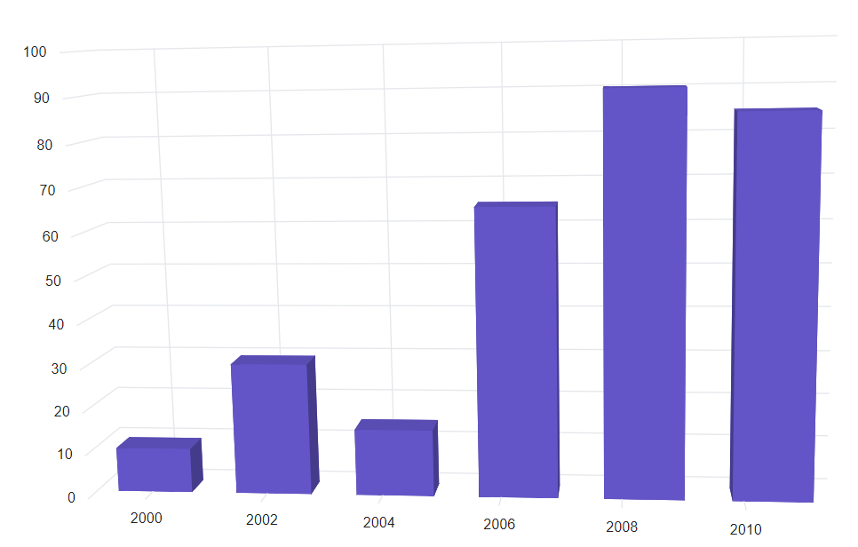
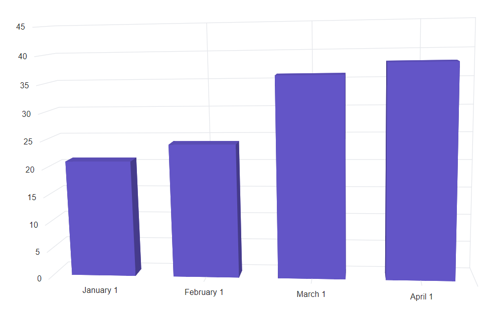
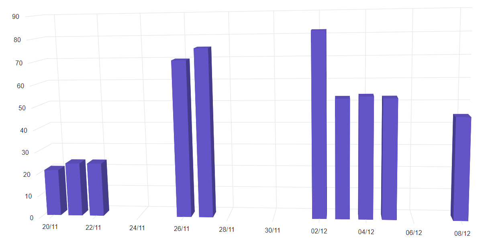

<!-- markdownlint-disable MD036 -->

# DateTime Axis in Blazor 3D Chart Component

## DateTime Axis

The `DateTime` axis uses a date-time scale and displays date-time values as axis labels in the specified format.

```cshtml

@using Syncfusion.Blazor.Chart3D

<SfChart3D WallColor="transparent" EnableRotation="true" RotationAngle="7" TiltAngle="10" Depth="100">
    <Chart3DPrimaryXAxis ValueType="Syncfusion.Blazor.Chart3D.ValueType.DateTime">
    </Chart3DPrimaryXAxis>

    <Chart3DSeriesCollection>
        <Chart3DSeries DataSource="@WeatherReports" XName="XValue" YName="YValue" Type="Chart3DSeriesType.Column">
        </Chart3DSeries>
    </Chart3DSeriesCollection>
</SfChart3D>

@code {
    public class Chart3DData
    {
        public DateTime XValue { get; set;}
        public double YValue {get; set;}
    }

    public List<Chart3DData> WeatherReports = new List<Chart3DData>
    {
        new Chart3DData { XValue = new DateTime(2000, 4, 1), YValue = 10 },
        new Chart3DData { XValue = new DateTime(2002, 5, 1), YValue = 30 },
        new Chart3DData { XValue = new DateTime(2004, 6, 1), YValue = 15 },
        new Chart3DData { XValue = new DateTime(2006, 7, 1), YValue = 65 },
        new Chart3DData { XValue = new DateTime(2008, 8, 1), YValue = 90 },
        new Chart3DData { XValue = new DateTime(2010, 9, 1), YValue = 85 }
    };
}

```




## DateTimeCategory Axis

The `DateTimeCategory` axis displays date-time values with non-linear intervals, such as business days within a week.

```cshtml

@using Syncfusion.Blazor.Chart3D

<SfChart3D WallColor="transparent" EnableRotation="true" RotationAngle="7" TiltAngle="10" Depth="100">
    <Chart3DPrimaryXAxis ValueType="Syncfusion.Blazor.Chart3D.ValueType.DateTimeCategory">
    </Chart3DPrimaryXAxis>

    <Chart3DSeriesCollection>
        <Chart3DSeries DataSource="@WeatherReports" XName="XValue" YName="YValue">
        </Chart3DSeries>
    </Chart3DSeriesCollection>
</SfChart3D>

@code {
    public class Chart3DData
    {
        public DateTime XValue { get; set;}
        public double YValue {get; set;}
    }

    public List<Chart3DData> WeatherReports = new List<Chart3DData>
    {
        new Chart3DData { XValue = new DateTime(2005, 01, 01), YValue = 21 },
        new Chart3DData { XValue = new DateTime(2006, 02, 01), YValue = 24 },
        new Chart3DData { XValue = new DateTime(2007, 03, 01), YValue = 36 },
        new Chart3DData { XValue = new DateTime(2008, 04, 01), YValue = 38 }
    };
}

```




## Range

The range of an axis is calculated automatically based on the provided data, but can be customized using the `Minimum`, `Maximum`, and `Interval` properties.

```cshtml

@using Syncfusion.Blazor.Chart3D

<SfChart3D WallColor="transparent" EnableRotation="true" RotationAngle="7" TiltAngle="10" Depth="100">
    <Chart3DPrimaryXAxis Interval="1" Minimum="@minimum" Maximum="@maximum" ValueType="Syncfusion.Blazor.Chart3D.ValueType.DateTime">
    </Chart3DPrimaryXAxis>
    <Chart3DSeriesCollection>
        <Chart3DSeries DataSource="@WeatherReports" XName="XValue" YName="YValue">
        </Chart3DSeries>
    </Chart3DSeriesCollection>
</SfChart3D>

@code {
    public DateTime minimum = new DateTime(2000, 3, 1);
    public DateTime maximum = new DateTime(2010, 10, 1);

    public class Chart3DData
    {
        public DateTime XValue { get; set; }
        public double YValue { get; set; }
    }

    public List<Chart3DData> WeatherReports = new List<Chart3DData>
    {
        new Chart3DData { XValue = new DateTime(2000, 4, 1), YValue = 21 },
        new Chart3DData { XValue = new DateTime(2002, 5, 1), YValue = 24 },
        new Chart3DData { XValue = new DateTime(2004, 6, 1), YValue = 36 },
        new Chart3DData { XValue = new DateTime(2006, 7, 1), YValue = 38 },
        new Chart3DData { XValue = new DateTime(2008, 8, 1), YValue = 46 },
        new Chart3DData { XValue = new DateTime(2010, 9, 1), YValue = 28 }
    };
}

```



## Interval Customization

Date-time intervals can be customized using the `Interval` and `IntervalType` properties. For example, setting `Interval` to **2** and `IntervalType` to **Years** uses a 2-year interval. Supported interval types:

- Auto
- Years
- Months
- Days
- Hours
- Minutes
- Seconds

```cshtml

@using Syncfusion.Blazor.Chart3D

<SfChart3D WallColor="transparent" EnableRotation="true" RotationAngle="7" TiltAngle="10" Depth="100">
    <Chart3DPrimaryXAxis Interval="1" IntervalType="Syncfusion.Blazor.Chart3D.IntervalType.Months" ValueType="Syncfusion.Blazor.Chart3D.ValueType.DateTime">
    </Chart3DPrimaryXAxis>
    <Chart3DSeriesCollection>
        <Chart3DSeries DataSource="@WeatherReports" XName="XValue" YName="YValue">
        </Chart3DSeries>
    </Chart3DSeriesCollection>
</SfChart3D>

@code {
    public class Chart3DData
    {
        public DateTime XValue { get; set;}
        public double YValue {get; set;}
    }

    public List<Chart3DData> WeatherReports = new List<Chart3DData>
    {
        new Chart3DData { XValue = new DateTime(2016, 4, 1), YValue = 21 },
        new Chart3DData { XValue = new DateTime(2016, 5, 1), YValue = 24 },
        new Chart3DData { XValue = new DateTime(2016, 6, 1), YValue = 36 },
        new Chart3DData { XValue = new DateTime(2016, 7, 1), YValue = 38 },
        new Chart3DData { XValue = new DateTime(2016, 8, 1), YValue = 46 },
        new Chart3DData { XValue = new DateTime(2016, 9, 1), YValue = 28 }
    };
}

```



**Range Padding**

The `RangePadding` property applies padding to the minimum and maximum extremes of the range. Supported types for the DateTime axis:

- None
- Round
- Additional

**DateTime - None**

When `RangePadding` is set to **None**, the minimum and maximum of the axis are based on the data.

```cshtml

@using Syncfusion.Blazor.Chart3D

<SfChart3D WallColor="transparent" EnableRotation="true" RotationAngle="7" TiltAngle="10" Depth="100">
    <Chart3DPrimaryXAxis RangePadding="Syncfusion.Blazor.Chart3D.ChartRangePadding.None" ValueType="Syncfusion.Blazor.Chart3D.ValueType.DateTime">
    </Chart3DPrimaryXAxis>

    <Chart3DSeriesCollection>
        <Chart3DSeries DataSource="@WeatherReports" XName="XValue" YName="YValue">
        </Chart3DSeries>
    </Chart3DSeriesCollection>
</SfChart3D>

@code {
    public class Chart3DData
    {
        public DateTime XValue { get; set; }
        public double YValue { get; set; }
    }

    public List<Chart3DData> WeatherReports = new List<Chart3DData>
    {
        new Chart3DData { XValue = new DateTime(2017, 11, 20), YValue = 21 },
        new Chart3DData { XValue = new DateTime(2017, 11, 21), YValue = 24 },
        new Chart3DData { XValue = new DateTime(2017, 11, 22), YValue = 24 },
        new Chart3DData { XValue = new DateTime(2017, 11, 26), YValue = 70 },
        new Chart3DData { XValue = new DateTime(2017, 11, 27), YValue = 75 },
        new Chart3DData { XValue = new DateTime(2017, 11, 29), YValue = 82 }
    };
}

```



**DateTime - Round**

When `RangePadding` is set to **Round**, the minimum and maximum are rounded to the nearest value divisible by the interval. For example, if the minimum is January 15, the interval is 1, and the interval type is Month, the axis minimum will be January 1.

```cshtml

@using Syncfusion.Blazor.Chart3D

<SfChart3D WallColor="transparent" EnableRotation="true" RotationAngle="7" TiltAngle="10" Depth="100">
    <Chart3DPrimaryXAxis RangePadding="Syncfusion.Blazor.Chart3D.ChartRangePadding.Round" ValueType="Syncfusion.Blazor.Chart3D.ValueType.DateTime">
    </Chart3DPrimaryXAxis>

    <Chart3DSeriesCollection>
        <Chart3DSeries DataSource="@WeatherReports" XName="XValue" YName="YValue">
        </Chart3DSeries>
    </Chart3DSeriesCollection>
</SfChart3D>

@code {
    public class Chart3DData
    {
        public DateTime XValue { get; set; }
        public double YValue { get; set; }
    }

    public List<Chart3DData> WeatherReports = new List<Chart3DData>
    {
        new Chart3DData { XValue = new DateTime(2017, 11, 20), YValue = 21 },
        new Chart3DData { XValue = new DateTime(2017, 11, 21), YValue = 24 },
        new Chart3DData { XValue = new DateTime(2017, 11, 22), YValue = 24 },
        new Chart3DData { XValue = new DateTime(2017, 11, 26), YValue = 70 },
        new Chart3DData { XValue = new DateTime(2017, 11, 27), YValue = 75 },
        new Chart3DData { XValue = new DateTime(2017, 11, 29), YValue = 82 }
    };
}

```



**DateTime - Additional**

When `RangePadding` is set to **Additional**, the interval of an axis is padded to the minimum and maximum.

```cshtml

@using Syncfusion.Blazor.Chart3D
 
<SfChart3D WallColor="transparent" EnableRotation="true" RotationAngle="7" TiltAngle="10" Depth="100">
    <Chart3DPrimaryXAxis RangePadding="Syncfusion.Blazor.Chart3D.ChartRangePadding.Additional" ValueType="Syncfusion.Blazor.Chart3D.ValueType.DateTime">
    </Chart3DPrimaryXAxis>

    <Chart3DSeriesCollection>
        <Chart3DSeries DataSource="@WeatherReports" XName="XValue" YName="YValue">
        </Chart3DSeries>
    </Chart3DSeriesCollection>
</SfChart3D>

@code {
    public class Chart3DData
    {
        public DateTime XValue { get; set; }
        public double YValue { get; set; }
    }

    public List<Chart3DData> WeatherReports = new List<Chart3DData>
    {
        new Chart3DData { XValue = new DateTime(2017, 11, 20), YValue = 21 },
        new Chart3DData { XValue = new DateTime(2017, 11, 21), YValue = 24 },
        new Chart3DData { XValue = new DateTime(2017, 11, 22), YValue = 24 },
        new Chart3DData { XValue = new DateTime(2017, 11, 26), YValue = 70 },
        new Chart3DData { XValue = new DateTime(2017, 11, 27), YValue = 75 },
        new Chart3DData { XValue = new DateTime(2017, 11, 29), YValue = 82 }
    };
}

```



## Label Format

Date values can be formatted using the `LabelFormat` property in an axis. All globalize formats are supported.

```cshtml

@using Syncfusion.Blazor.Chart3D

<SfChart3D WallColor="transparent" EnableRotation="true" RotationAngle="7" TiltAngle="10" Depth="100">
    <Chart3DPrimaryXAxis LabelFormat="dd/MM" ValueType="Syncfusion.Blazor.Chart3D.ValueType.DateTime">
    </Chart3DPrimaryXAxis>

    <Chart3DSeriesCollection>
        <Chart3DSeries DataSource="@WeatherReports" XName="XValue" YName="YValue">
        </Chart3DSeries>
    </Chart3DSeriesCollection>
</SfChart3D>

@code {
    public class Chart3DData
    {
        public DateTime XValue { get; set; }
        public double YValue { get; set; }
    }

    public List<Chart3DData> WeatherReports = new List<Chart3DData>
    {
        new Chart3DData { XValue = new DateTime(2017, 11, 20), YValue = 21 },
        new Chart3DData { XValue = new DateTime(2017, 11, 21), YValue = 24 },
        new Chart3DData { XValue = new DateTime(2017, 11, 22), YValue = 24 },
        new Chart3DData { XValue = new DateTime(2017, 11, 26), YValue = 70 },
        new Chart3DData { XValue = new DateTime(2017, 11, 27), YValue = 75 }, 
        new Chart3DData { XValue = new DateTime(2017, 12, 02), YValue = 82 },
        new Chart3DData { XValue = new DateTime(2017, 12, 03), YValue = 53 }, 
        new Chart3DData { XValue = new DateTime(2017, 12, 04), YValue = 54 },
        new Chart3DData { XValue = new DateTime(2017, 12, 05), YValue = 53 }, 
        new Chart3DData { XValue = new DateTime(2017, 12, 08), YValue = 45 }
    };
}

```




The table below shows the results of applying various popular date and time formats to the `LabelFormat` property.

<!-- markdownlint-disable MD033 -->

<table>
<tr>
<td><b>Label Value</b></td>
<td><b>Label Format Property Value</b></td>
<td><b>Result </b></td>
<td><b>Description </b></td>
</tr>
<tr>
<td>new Date(2000, 03, 10)</td>
<td>EEEE</td>
<td>Monday</td>
<td>The date is displayed in day format.</td>
</tr>
<tr>
<td>new Date(2000, 03, 10)</td>
<td>yMd</td>
<td>04/10/2000</td>
<td>The date is displayed in month/date/year format.</td>
</tr>
<tr>
<td>new Date(2000, 03, 10)</td>
<td> MMM </td>
<td>Apr</td>
<td>The shorthand month for the date is displayed.</td>
</tr>
<tr>
<td>new Date(2000, 03, 10)</td>
<td>hm</td>
<td>12:00 AM</td>
<td>Time of the date value is displayed as label.</td>
</tr>
<tr>
<td>new Date(2000, 03, 10)</td>
<td>hms</td>
<td>12:00:00 AM</td>
<td>The label is displayed in hours:minutes:seconds format.</td>
</tr>
</table>

<!-- markdownlint-disable MD033 -->
