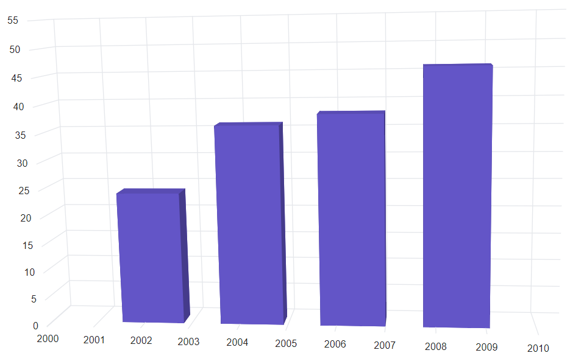

<!-- markdownlint-disable MD036 -->

# DateTime Axis in Blazor 3D Chart Component

## DateTime axis

[DateTime](https://help.syncfusion.com/cr/blazor/Syncfusion.Blazor.Charts.ValueType.html#Syncfusion_Blazor_Charts_ValueType_DateTime) axis uses date time scale and displays the date time values as axis labels in the specified format.

```cshtml

@using Syncfusion.Blazor.Chart3D

<SfChart3D WallColor="transparent" EnableRotation="true" RotationAngle="7" TiltAngle="10" Depth="100">
    <Chart3DPrimaryXAxis ValueType="Syncfusion.Blazor.Charts.ValueType.DateTime">
    </Chart3DPrimaryXAxis>

    <Chart3DSeriesCollection>
        <Chart3DSeries DataSource="@WeatherReports" XName="XValue" YName="YValue" Type="Chart3DSeriesType.Column">
        </Chart3DSeries>
    </Chart3DSeriesCollection>
</SfChart3D>

@code{
    public class Chart3DData
    {
        public DateTime XValue { get; set;}
        public double YValue {get; set;}
    }
	
    public List<Chart3DData> WeatherReports = new List<Chart3DData>
	{
		new Chart3DData { XValue = new DateTime(2000, 4, 1), YValue = 10 },
		new Chart3DData { XValue = new DateTime(2002, 5, 1), YValue = 30 },
		new Chart3DData { XValue = new DateTime(2004, 6, 1), YValue = 15 },
		new Chart3DData { XValue = new DateTime(2006, 7, 1), YValue = 65 },
		new Chart3DData { XValue = new DateTime(2008, 8, 1), YValue = 90 },
		new Chart3DData { XValue = new DateTime(2010, 9, 1), YValue = 85 }
	};
}

```



## DateTime category axis

The [DateTime Category](https://help.syncfusion.com/cr/blazor/Syncfusion.Blazor.Charts.ValueType.html#Syncfusion_Blazor_Charts_ValueType_DateTimeCategory) axis is used to display the date time values with non-linear intervals. For example, the business days alone have been depicted in a week here.

```cshtml

@using Syncfusion.Blazor.Chart3D

<SfChart3D WallColor="transparent" EnableRotation="true" RotationAngle="7" TiltAngle="10" Depth="100">
    <Chart3DPrimaryXAxis ValueType="Syncfusion.Blazor.Charts.ValueType.DateTimeCategory">
    </Chart3DPrimaryXAxis>

    <Chart3DSeriesCollection>
        <Chart3DSeries DataSource="@WeatherReports" XName="XValue" YName="YValue">
        </Chart3DSeries>
    </Chart3DSeriesCollection>
</SfChart3D>

@code{
    public class Chart3DData
    {
        public DateTime XValue { get; set;}
        public double YValue {get; set;}
    }
	
    public List<Chart3DData> WeatherReports = new List<Chart3DData>
	{
        new Chart3DData { XValue = new DateTime(2005, 01, 01), YValue = 21 },
		new Chart3DData { XValue = new DateTime(2006, 02, 01), YValue = 24 },
		new Chart3DData { XValue = new DateTime(2007, 03, 01), YValue = 36 },
		new Chart3DData { XValue = new DateTime(2008, 04, 01), YValue = 38 },
	};
}

```



### Range

Range of an axis will be calculated automatically based on the provided data. You can also customize the range of an axis using [Minimum](https://help.syncfusion.com/cr/blazor/Syncfusion.Blazor.Charts.ChartAxis.html#Syncfusion_Blazor_Charts_ChartAxis_Minimum), [Maximum](https://help.syncfusion.com/cr/blazor/Syncfusion.Blazor.Charts.ChartAxis.html#Syncfusion_Blazor_Charts_ChartAxis_Maximum), and [Interval](https://help.syncfusion.com/cr/blazor/Syncfusion.Blazor.Charts.ChartAxis.html#Syncfusion_Blazor_Charts_ChartAxis_Interval) properties.

```cshtml

@using Syncfusion.Blazor.Chart3D

<SfChart3D WallColor="transparent" EnableRotation="true" RotationAngle="7" TiltAngle="10" Depth="100">
    <Chart3DPrimaryXAxis IntervalType="Syncfusion.Blazor.Charts.IntervalType.Years" ValueType="Syncfusion.Blazor.Charts.ValueType.DateTime">
    </Chart3DPrimaryXAxis>
    <Chart3DSeriesCollection>
        <Chart3DSeries DataSource="@WeatherReports" XName="XValue" YName="YValue">
        </Chart3DSeries>
    </Chart3DSeriesCollection>
</SfChart3D>

@code{
    public class Chart3DData
    {
        public DateTime XValue { get; set;}
        public double YValue {get; set;}
    }
	
    public List<Chart3DData> WeatherReports = new List<Chart3DData>
	{
		new Chart3DData { XValue = new DateTime(2000, 4, 1), YValue = 21 },
		new Chart3DData { XValue = new DateTime(2002, 5, 1), YValue = 24 },
		new Chart3DData { XValue = new DateTime(2004, 6, 1), YValue = 36 },
		new Chart3DData { XValue = new DateTime(2006, 7, 1), YValue = 38 },
		new Chart3DData { XValue = new DateTime(2008, 8, 1), YValue = 46 },
		new Chart3DData { XValue = new DateTime(2010, 9, 1), YValue = 28 }
	};
}

```




### Interval customization

Date time intervals can be customized by using the [Interval](https://help.syncfusion.com/cr/blazor/Syncfusion.Blazor.Charts.ChartAxis.html#Syncfusion_Blazor_Charts_ChartAxis_Interval) and [IntervalType](https://help.syncfusion.com/cr/blazor/Syncfusion.Blazor.Charts.ChartAxis.html#Syncfusion_Blazor_Charts_ChartAxis_IntervalType) properties of the [Axis](https://help.syncfusion.com/cr/blazor/Syncfusion.Blazor.Charts.ChartAxis.html). For example, when you set `Interval` as **2** and `IntervalType` as **Years**, it considers 2 years as interval. DateTime axis supports following interval types,

* Auto
* Years
* Months
* Days
* Hours
* Minutes
* Seconds

```cshtml

@using Syncfusion.Blazor.Chart3D

<SfChart3D WallColor="transparent" EnableRotation="true" RotationAngle="7" TiltAngle="10" Depth="100">
    <Chart3DPrimaryXAxis Interval="1" IntervalType="Syncfusion.Blazor.Charts.IntervalType.Months" ValueType="Syncfusion.Blazor.Charts.ValueType.DateTime">
    </Chart3DPrimaryXAxis>
    <Chart3DSeriesCollection>
        <Chart3DSeries DataSource="@WeatherReports" XName="XValue" YName="YValue">
        </Chart3DSeries>
    </Chart3DSeriesCollection>
</SfChart3D>

@code{
    public class Chart3DData
    {
        public DateTime XValue { get; set;}
        public double YValue {get; set;}
    }
	
    public List<Chart3DData> WeatherReports = new List<Chart3DData>
	{
		new Chart3DData { XValue = new DateTime(2016, 4, 1), YValue = 21 },
		new Chart3DData { XValue = new DateTime(2016, 5, 1), YValue = 24 },
		new Chart3DData { XValue = new DateTime(2016, 6, 1), YValue = 36 },
		new Chart3DData { XValue = new DateTime(2016, 7, 1), YValue = 38 },
		new Chart3DData { XValue = new DateTime(2016, 8, 1), YValue = 46 },
		new Chart3DData { XValue = new DateTime(2016, 9, 1), YValue = 28 }
	};
}

```



**Applying padding to the Range**

The [RangePadding](https://help.syncfusion.com/cr/blazor/Syncfusion.Blazor.Charts.ChartAxis.html#Syncfusion_Blazor_Charts_ChartAxis_RangePadding) property can be used to apply padding to the minimum and maximum extremes of range. The following types of padding are supported by the DateTime axis:

* None
* Round
* Additional

**DateTime - None**

When the [RangePadding](https://help.syncfusion.com/cr/blazor/Syncfusion.Blazor.Charts.ChartAxis.html#Syncfusion_Blazor_Charts_ChartAxis_RangePadding) is set to **None**, the minimum and maximum of the axis is based on the data.

```cshtml

@using Syncfusion.Blazor.Chart3D

<SfChart3D WallColor="transparent" EnableRotation="true" RotationAngle="7" TiltAngle="10" Depth="100">
    <Chart3DPrimaryXAxis RangePadding="Syncfusion.Blazor.Charts.ChartRangePadding.None" ValueType="Syncfusion.Blazor.Charts.ValueType.DateTime">
    </Chart3DPrimaryXAxis>

    <Chart3DSeriesCollection>
        <Chart3DSeries DataSource="@WeatherReports" XName="XValue" YName="YValue">
        </Chart3DSeries>
    </Chart3DSeriesCollection>
</SfChart3D>

@code{
    public class Chart3DData
    {
        public DateTime XValue { get; set; }
        public double YValue { get; set; }
    }
	
    public List<Chart3DData> WeatherReports = new List<Chart3DData>
	{
		new Chart3DData { XValue = new DateTime(2017, 11, 20), YValue = 21 },
		new Chart3DData { XValue = new DateTime(2017, 11, 21), YValue = 24 },
        new Chart3DData { XValue = new DateTime(2017, 11, 22), YValue = 24 },
		new Chart3DData { XValue = new DateTime(2017, 11, 26), YValue = 70 },
		new Chart3DData { XValue = new DateTime(2017, 11, 27), YValue = 75 }, 
		new Chart3DData { XValue = new DateTime(2018, 01, 02), YValue = 82 },
		new Chart3DData { XValue = new DateTime(2018, 01, 03), YValue = 53 }, 
		new Chart3DData { XValue = new DateTime(2018, 01, 04), YValue = 54 },
		new Chart3DData { XValue = new DateTime(2018, 01, 05), YValue = 53 }, 
		new Chart3DData { XValue = new DateTime(2018, 01, 08), YValue = 45 }
    };
}

```



**DateTime - Round**
When the [RangePadding](https://help.syncfusion.com/cr/blazor/Syncfusion.Blazor.Charts.ChartAxis.html#Syncfusion_Blazor_Charts_ChartAxis_RangePadding) is set to `Round`, minimum and maximum will be rounded to the nearest possible value, which is divisible by interval. For example, when the minimum is **15th Jan**, interval is **1** and interval type is **Month**, then the axis minimum will be **Jan 1st**.

When the [RangePadding](https://help.syncfusion.com/cr/blazor/Syncfusion.Blazor.Charts.ChartAxis.html#Syncfusion_Blazor_Charts_ChartAxis_RangePadding) property is set to **Round**, the minimum and maximum will be rounded to the nearest possible value divisible by interval.

```cshtml

@using Syncfusion.Blazor.Chart3D

<SfChart3D WallColor="transparent" EnableRotation="true" RotationAngle="7" TiltAngle="10" Depth="100">
    <Chart3DPrimaryXAxis RangePadding="Syncfusion.Blazor.Charts.ChartRangePadding.Round" ValueType="Syncfusion.Blazor.Charts.ValueType.DateTime">
    </Chart3DPrimaryXAxis>

    <Chart3DSeriesCollection>
        <Chart3DSeries DataSource="@WeatherReports" XName="XValue" YName="YValue">
        </Chart3DSeries>
    </Chart3DSeriesCollection>
</SfChart3D>

@code{
    public class Chart3DData
    {
        public DateTime XValue { get; set; }
        public double YValue { get; set; }
    }
	
    public List<Chart3DData> WeatherReports = new List<Chart3DData>
	{
		new Chart3DData { XValue = new DateTime(2017, 11, 20), YValue = 21 },
		new Chart3DData { XValue = new DateTime(2017, 11, 21), YValue = 24 },
        new Chart3DData { XValue = new DateTime(2017, 11, 22), YValue = 24 },
		new Chart3DData { XValue = new DateTime(2017, 11, 26), YValue = 70 },
		new Chart3DData { XValue = new DateTime(2017, 11, 27), YValue = 75 }, 
		new Chart3DData { XValue = new DateTime(2017, 12, 02), YValue = 82 },
		new Chart3DData { XValue = new DateTime(2017, 12, 03), YValue = 53 }, 
		new Chart3DData { XValue = new DateTime(2017, 12, 04), YValue = 54 },
		new Chart3DData { XValue = new DateTime(2017, 12, 05), YValue = 53 }, 
		new Chart3DData { XValue = new DateTime(2017, 12, 08), YValue = 45 }
    };                                             
}

```



**DateTime - Additional**

When the [RangePadding](https://help.syncfusion.com/cr/blazor/Syncfusion.Blazor.Charts.ChartAxis.html#Syncfusion_Blazor_Charts_ChartAxis_RangePadding) property is set to **Additional**, the interval of an axis will be padded to the minimum and maximum of the axis.

```cshtml

@using Syncfusion.Blazor.Chart3D
 
<SfChart3D WallColor="transparent" EnableRotation="true" RotationAngle="7" TiltAngle="10" Depth="100">
    <Chart3DPrimaryXAxis RangePadding="Syncfusion.Blazor.Charts.ChartRangePadding.Additional" ValueType="Syncfusion.Blazor.Charts.ValueType.DateTime">
    </Chart3DPrimaryXAxis>

    <Chart3DSeriesCollection>
        <Chart3DSeries DataSource="@WeatherReports" XName="XValue" YName="YValue">
        </Chart3DSeries>
    </Chart3DSeriesCollection>
</SfChart3D>

@code{
    public class Chart3DData
    {
        public DateTime XValue { get; set; }
        public double YValue { get; set; }
    }
	
    public List<Chart3DData> WeatherReports = new List<Chart3DData>
	{
		new Chart3DData { XValue = new DateTime(2017, 11, 20), YValue = 21 },
		new Chart3DData { XValue = new DateTime(2017, 11, 21), YValue = 24 },
        new Chart3DData { XValue = new DateTime(2017, 11, 22), YValue = 24 },
		new Chart3DData { XValue = new DateTime(2017, 11, 26), YValue = 70 },
		new Chart3DData { XValue = new DateTime(2017, 11, 27), YValue = 75 }, 
		new Chart3DData { XValue = new DateTime(2017, 12, 02), YValue = 82 },
		new Chart3DData { XValue = new DateTime(2017, 12, 03), YValue = 53 }, 
		new Chart3DData { XValue = new DateTime(2017, 12, 04), YValue = 54 },
		new Chart3DData { XValue = new DateTime(2017, 12, 05), YValue = 53 }, 
		new Chart3DData { XValue = new DateTime(2017, 12, 08), YValue = 45 }
    };                                             
}

```



## Label format

The date can be formatted and parsed to all globalize format using the [LabelFormat](https://help.syncfusion.com/cr/blazor/Syncfusion.Blazor.Charts.ChartAxis.html#Syncfusion_Blazor_Charts_ChartAxis_LabelFormat) property in an axis.

```cshtml

@using Syncfusion.Blazor.Chart3D

<SfChart3D WallColor="transparent" EnableRotation="true" RotationAngle="7" TiltAngle="10" Depth="100">
    <Chart3DPrimaryXAxis LabelFormat="dd/MM" ValueType="Syncfusion.Blazor.Charts.ValueType.DateTime">
    </Chart3DPrimaryXAxis>

    <Chart3DSeriesCollection>
        <Chart3DSeries DataSource="@WeatherReports" XName="XValue" YName="YValue">
        </Chart3DSeries>
    </Chart3DSeriesCollection>
</SfChart3D>

@code{
    public class Chart3DData
    {
        public DateTime XValue { get; set; }
        public double YValue { get; set; }
    }
	
    public List<Chart3DData> WeatherReports = new List<Chart3DData>
	{
		new Chart3DData { XValue = new DateTime(2017, 11, 20), YValue = 21 },
		new Chart3DData { XValue = new DateTime(2017, 11, 21), YValue = 24 },
        new Chart3DData { XValue = new DateTime(2017, 11, 22), YValue = 24 },
		new Chart3DData { XValue = new DateTime(2017, 11, 26), YValue = 70 },
		new Chart3DData { XValue = new DateTime(2017, 11, 27), YValue = 75 }, 
		new Chart3DData { XValue = new DateTime(2017, 12, 02), YValue = 82 },
		new Chart3DData { XValue = new DateTime(2017, 12, 03), YValue = 53 }, 
		new Chart3DData { XValue = new DateTime(2017, 12, 04), YValue = 54 },
		new Chart3DData { XValue = new DateTime(2017, 12, 05), YValue = 53 }, 
		new Chart3DData { XValue = new DateTime(2017, 12, 08), YValue = 45 }
    };                                             
}

```



The table below shows the results of applying various popular date and time formats to the [LabelFormat](https://help.syncfusion.com/cr/blazor/Syncfusion.Blazor.Charts.ChartAxis.html#Syncfusion_Blazor_Charts_ChartAxis_LabelFormat) property.

<!-- markdownlint-disable MD033 -->

<table>
<tr>
<td><b>Label Value</b></td>
<td><b>Label Format Property Value</b></td>
<td><b>Result </b></td>
<td><b>Description </b></td>
</tr>
<tr>
<td>new Date(2000, 03, 10)</td>
<td>EEEE</td>
<td>Monday</td>
<td>The date is displayed in day format.</td>
</tr>
<tr>
<td>new Date(2000, 03, 10)</td>
<td>yMd</td>
<td>04/10/2000</td>
<td>The date is displayed in month/date/year format.</td>
</tr>
<tr>
<td>new Date(2000, 03, 10)</td>
<td> MMM </td>
<td>Apr</td>
<td>The shorthand month for the date is displayed.</td>
</tr>
<tr>
<td>new Date(2000, 03, 10)</td>
<td>hm</td>
<td>12:00 AM</td>
<td>Time of the date value is displayed as label.</td>
</tr>
<tr>
<td>new Date(2000, 03, 10)</td>
<td>hms</td>
<td>12:00:00 AM</td>
<td>The label is displayed in hours:minutes:seconds format.</td>
</tr>
</table>

<!-- markdownlint-disable MD033 -->

N> Refer to our [Blazor 3D Chart](https://www.syncfusion.com/blazor-components/blazor-charts) feature tour page for its groundbreaking feature representations and also explore our [Blazor 3D Chart Example](https://blazor.syncfusion.com/demos/chart/line?theme=bootstrap4) to know various 3D Chart types and how to represent time-dependent data, showing trends at equal intervals.

## See also

* [Data label](./data-labels)
* [Tooltip](./tool-tip)
* [Marker](./data-markers)