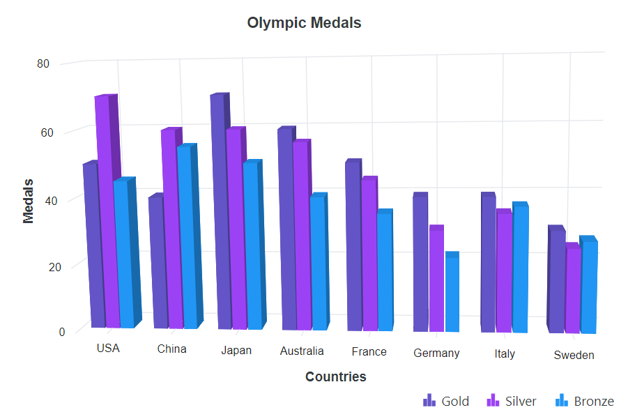
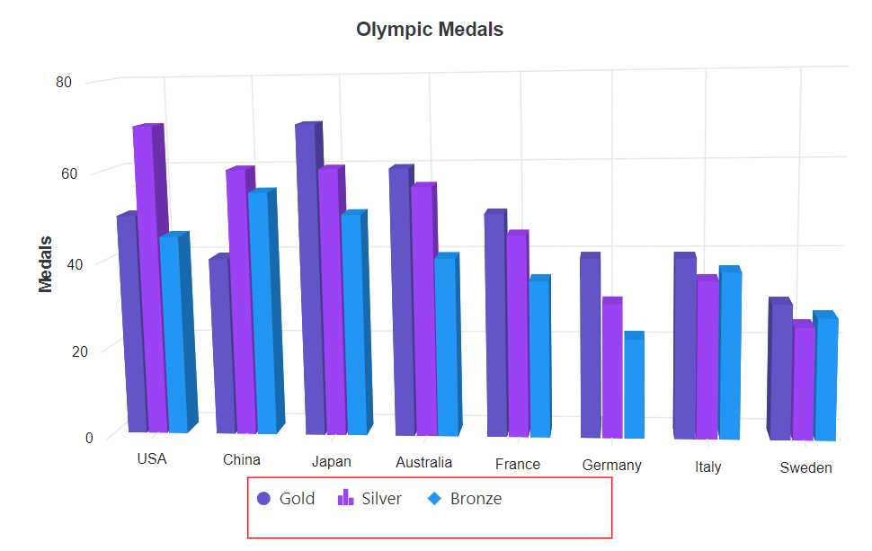
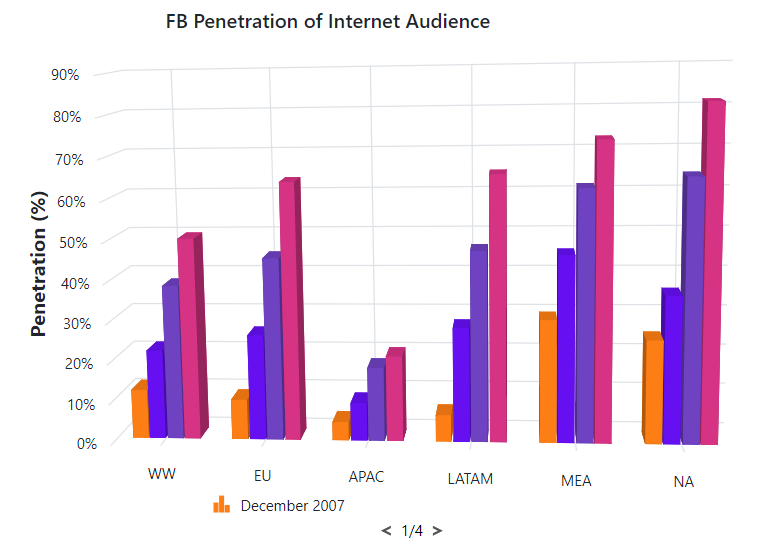
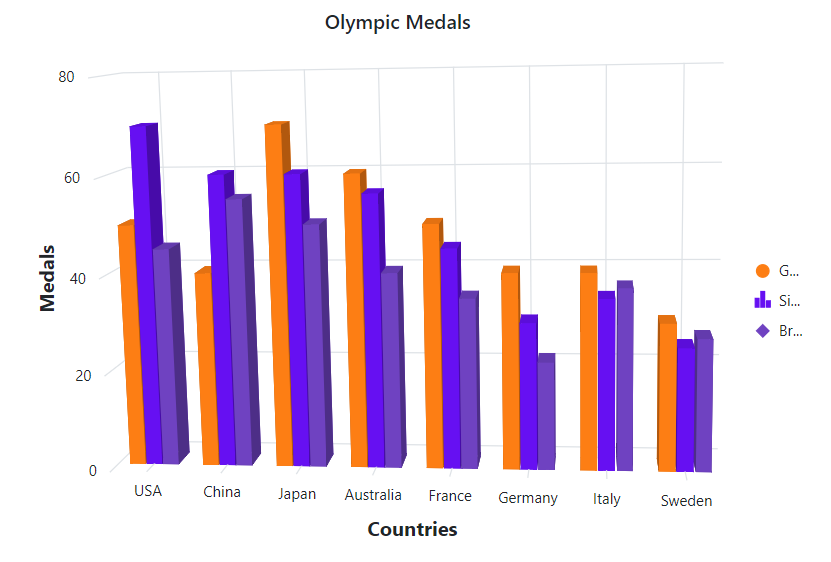
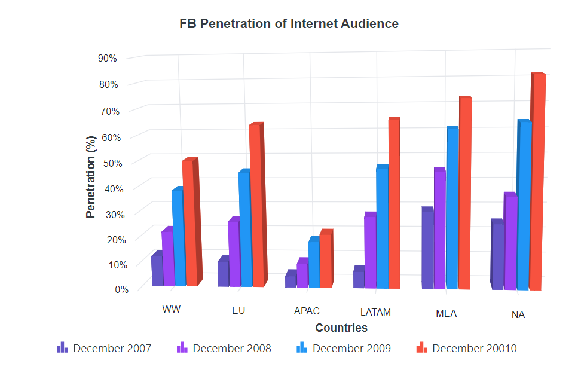
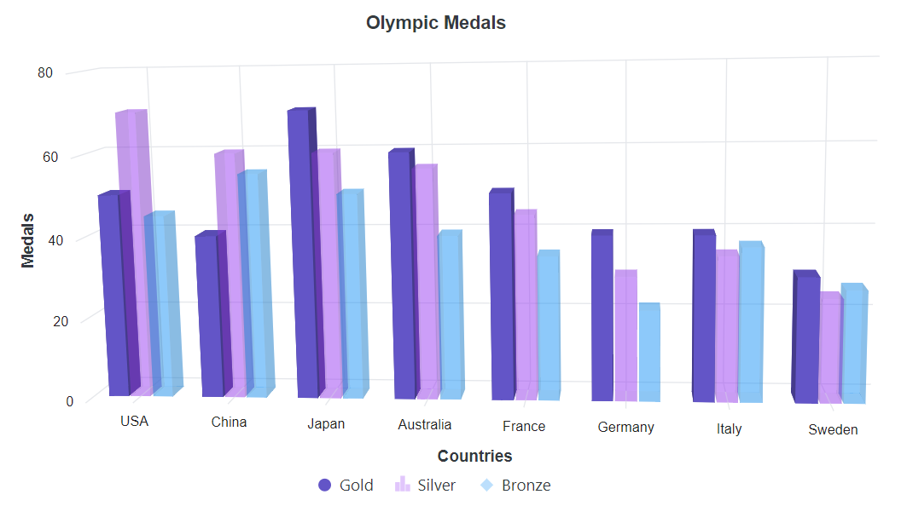
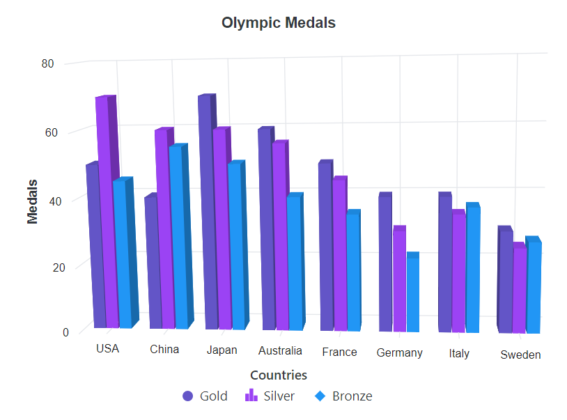
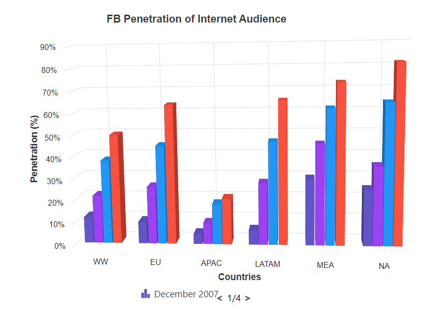

# Legend in Blazor 3D Chart Component

Legend provides information about the series rendered in the 3D chart.

## Position and Alignment

Use the `Position` property to place the legend at the left, right, top, or bottom of the 3D chart. By default, the legend is positioned at the bottom.

```cshtml

@using Syncfusion.Blazor.Chart3D

<SfChart3D Title="Olympic Medals" WallColor="transparent" EnableRotation="true" RotationAngle="7" TiltAngle="10" Depth="100">
    <Chart3DPrimaryXAxis ValueType="Syncfusion.Blazor.Chart3D.ValueType.Category" Title="Countries" />
    <Chart3DPrimaryYAxis Title="Medals" Minimum="0" Maximum="80" Interval="20" /> 

    <Chart3DSeriesCollection>
        <Chart3DSeries DataSource="@MedalDetails" Name="Gold" XName="Country" Opacity="1" YName="Gold" Type="Chart3DSeriesType.Column"/>      
        <Chart3DSeries DataSource="@MedalDetails" Name="Silver" XName="Country" Opacity="1" YName="Silver" Type="Chart3DSeriesType.Column"/>     
        <Chart3DSeries DataSource="@MedalDetails" Name="Bronze" XName="Country" Opacity="1" YName="Bronze" Type="Chart3DSeriesType.Column"/>      
    </Chart3DSeriesCollection>

    <Chart3DLegendSettings Visible="true" Position="Syncfusion.Blazor.Chart3D.LegendPosition.Top" />
</SfChart3D>

@code {
    public class Chart3DData
    {
        public string Country { get; set; }
        public double Gold { get; set; }
        public double Silver { get; set; }
        public double Bronze { get; set; }
    }

    public List<Chart3DData> MedalDetails = new List<Chart3DData>
    {
        new Chart3DData { Country = "USA", Gold = 50, Silver = 70, Bronze = 45 },
        new Chart3DData { Country = "China", Gold = 40, Silver = 60, Bronze = 55 },
        new Chart3DData { Country = "Japan", Gold = 70, Silver = 60, Bronze = 50 },
        new Chart3DData { Country = "Australia", Gold = 60, Silver = 56, Bronze = 40 },
        new Chart3DData { Country = "France", Gold = 50, Silver = 45, Bronze = 35 },
        new Chart3DData { Country = "Germany", Gold = 40, Silver = 30, Bronze = 22 },
        new Chart3DData { Country = "Italy", Gold = 40, Silver = 35, Bronze = 37 },
        new Chart3DData { Country = "Sweden", Gold = 30, Silver = 25, Bronze = 27 }
    };
}

```



Use custom positioning to place the legend anywhere in the 3D chart by specifying X and Y pixel coordinates.

```cshtml

@using Syncfusion.Blazor.Chart3D

<SfChart3D Title="Olympic Medals" WallColor="transparent" EnableRotation="true" RotationAngle="7" TiltAngle="10" Depth="100">
    <Chart3DPrimaryXAxis ValueType="Syncfusion.Blazor.Chart3D.ValueType.Category" Title="Countries" />
    <Chart3DPrimaryYAxis Title="Medals" Minimum="0" Maximum="80" Interval="20" />

    <Chart3DSeriesCollection>
        <Chart3DSeries DataSource="@MedalDetails" Name="Gold" XName="Country" Opacity="1" YName="Gold" Type="Chart3DSeriesType.Column"/>      
        <Chart3DSeries DataSource="@MedalDetails" Name="Silver" XName="Country" Opacity="1" YName="Silver" Type="Chart3DSeriesType.Column"/>     
        <Chart3DSeries DataSource="@MedalDetails" Name="Bronze" XName="Country" Opacity="1" YName="Bronze" Type="Chart3DSeriesType.Column"/>      
    </Chart3DSeriesCollection>

    <Chart3DLegendSettings Visible="true" Position="Syncfusion.Blazor.Chart3D.LegendPosition.Custom">
        <Chart3DLocation X="200" Y="20" />
    </Chart3DLegendSettings>
</SfChart3D>

@code {
    public class Chart3DData
    {
        public string Country { get; set; }
        public double Gold { get; set; }
        public double Silver { get; set; }
        public double Bronze { get; set; }
    }

    public List<Chart3DData> MedalDetails = new List<Chart3DData>
    {
        new Chart3DData { Country = "USA", Gold = 50, Silver = 70, Bronze = 45 },
        new Chart3DData { Country = "China", Gold = 40, Silver = 60, Bronze = 55 },
        new Chart3DData { Country = "Japan", Gold = 70, Silver = 60, Bronze = 50 },
        new Chart3DData { Country = "Australia", Gold = 60, Silver = 56, Bronze = 40 },
        new Chart3DData { Country = "France", Gold = 50, Silver = 45, Bronze = 35 },
        new Chart3DData { Country = "Germany", Gold = 40, Silver = 30, Bronze = 22 },
        new Chart3DData { Country = "Italy", Gold = 40, Silver = 35, Bronze = 37 },
        new Chart3DData { Country = "Sweden", Gold = 30, Silver = 25, Bronze = 27 }
    };
}

```



<!-- markdownlint-disable MD036 -->

## Legend Reverse

Reverse the order of legend items using the `Reverse` property. By default, the legend entry for the first series appears first.

```cshtml

@using Syncfusion.Blazor.Chart3D

<SfChart3D Title="Olympic Medals" WallColor="transparent" EnableRotation="true" RotationAngle="7" TiltAngle="10" Depth="100">
    <Chart3DPrimaryXAxis ValueType="Syncfusion.Blazor.Chart3D.ValueType.Category" Title="Countries" />
    <Chart3DPrimaryYAxis Title="Medals" Minimum="0" Maximum="80" Interval="20" />

    <Chart3DSeriesCollection>
        <Chart3DSeries DataSource="@MedalDetails" Name="Gold" XName="Country" Opacity="1" YName="Gold" Type="Chart3DSeriesType.Column"/>      
        <Chart3DSeries DataSource="@MedalDetails" Name="Silver" XName="Country" Opacity="1" YName="Silver" Type="Chart3DSeriesType.Column"/>     
        <Chart3DSeries DataSource="@MedalDetails" Name="Bronze" XName="Country" Opacity="1" YName="Bronze" Type="Chart3DSeriesType.Column"/>      
    </Chart3DSeriesCollection>

    <Chart3DLegendSettings Visible="true" Reverse="true" />
</SfChart3D>

@code {
    public class Chart3DData
    {
        public string Country { get; set; }
        public double Gold { get; set; }
        public double Silver { get; set; }
        public double Bronze { get; set; }
    }

    public List<Chart3DData> MedalDetails = new List<Chart3DData>
    {
        new Chart3DData { Country = "USA", Gold = 50, Silver = 70, Bronze = 45 },
        new Chart3DData { Country = "China", Gold = 40, Silver = 60, Bronze = 55 },
        new Chart3DData { Country = "Japan", Gold = 70, Silver = 60, Bronze = 50 },
        new Chart3DData { Country = "Australia", Gold = 60, Silver = 56, Bronze = 40 },
        new Chart3DData { Country = "France", Gold = 50, Silver = 45, Bronze = 35 },
        new Chart3DData { Country = "Germany", Gold = 40, Silver = 30, Bronze = 22 },
        new Chart3DData { Country = "Italy", Gold = 40, Silver = 35, Bronze = 37 },
        new Chart3DData { Country = "Sweden", Gold = 30, Silver = 25, Bronze = 27 }
    };
}

```



**Legend Alignment**

<!-- markdownlint-disable MD036 -->

Align the legend to near, far, or center within the chosen position using the `Alignment` property.

```cshtml

@using Syncfusion.Blazor.Chart3D

<SfChart3D Title="Olympic Medals" WallColor="transparent" EnableRotation="true" RotationAngle="7" TiltAngle="10" Depth="100">
    <Chart3DPrimaryXAxis ValueType="Syncfusion.Blazor.Chart3D.ValueType.Category" Title="Countries" />
    <Chart3DPrimaryYAxis Title="Medals" Minimum="0" Maximum="80" Interval="20" />

    <Chart3DSeriesCollection>
        <Chart3DSeries DataSource="@MedalDetails" Name="Gold" XName="Country" Opacity="1" YName="Gold" Type="Chart3DSeriesType.Column"/>      
        <Chart3DSeries DataSource="@MedalDetails" Name="Silver" XName="Country" Opacity="1" YName="Silver" Type="Chart3DSeriesType.Column"/>     
        <Chart3DSeries DataSource="@MedalDetails" Name="Bronze" XName="Country" Opacity="1" YName="Bronze" Type="Chart3DSeriesType.Column"/>      
    </Chart3DSeriesCollection>

    <Chart3DLegendSettings Visible="true" Alignment="Syncfusion.Blazor.Chart3D.Alignment.Far" />
</SfChart3D>

@code {
    public class Chart3DData
    {
        public string Country { get; set; }
        public double Gold { get; set; }
        public double Silver { get; set; }
        public double Bronze { get; set; }
    }

    public List<Chart3DData> MedalDetails = new List<Chart3DData>
    {
        new Chart3DData { Country = "USA", Gold = 50, Silver = 70, Bronze = 45 },
        new Chart3DData { Country = "China", Gold = 40, Silver = 60, Bronze = 55 },
        new Chart3DData { Country = "Japan", Gold = 70, Silver = 60, Bronze = 50 },
        new Chart3DData { Country = "Australia", Gold = 60, Silver = 56, Bronze = 40 },
        new Chart3DData { Country = "France", Gold = 50, Silver = 45, Bronze = 35 },
        new Chart3DData { Country = "Germany", Gold = 40, Silver = 30, Bronze = 22 },
        new Chart3DData { Country = "Italy", Gold = 40, Silver = 35, Bronze = 37 },
        new Chart3DData { Country = "Sweden", Gold = 30, Silver = 25, Bronze = 27 }
    };
}

```




## Legend Customization

Change the legend icon shape using the `LegendShape` property in the `Series`. By default, the legend icon shape follows the `SeriesType`.

```cshtml

@using Syncfusion.Blazor.Chart3D

<SfChart3D Title="Olympic Medals" WallColor="transparent" EnableRotation="true" RotationAngle="7" TiltAngle="10" Depth="100">
    <Chart3DPrimaryXAxis ValueType="Syncfusion.Blazor.Chart3D.ValueType.Category" Title="Countries" />
    <Chart3DPrimaryYAxis Title="Medals" Minimum="0" Maximum="80" Interval="20" />

    <Chart3DSeriesCollection>
        <Chart3DSeries DataSource="@MedalDetails" Name="Gold" XName="Country" Opacity="1" YName="Gold" Type="Syncfusion.Blazor.Chart3D.Chart3DSeriesType.Column" LegendShape="LegendShape.Circle"/>      
        <Chart3DSeries DataSource="@MedalDetails" Name="Silver" XName="Country" Opacity="1" YName="Silver" Type="Syncfusion.Blazor.Chart3D.Chart3DSeriesType.Column" LegendShape="LegendShape.SeriesType"/>     
        <Chart3DSeries DataSource="@MedalDetails" Name="Bronze" XName="Country" Opacity="1" YName="Bronze" Type="Syncfusion.Blazor.Chart3D.Chart3DSeriesType.Column" LegendShape="LegendShape.Diamond"/>      
    </Chart3DSeriesCollection>

    <Chart3DLegendSettings Visible="true" />
</SfChart3D>

@code {
    public class Chart3DData
    {
        public string Country { get; set; }
        public double Gold { get; set; }
        public double Silver { get; set; }
        public double Bronze { get; set; }
    }

    public List<Chart3DData> MedalDetails = new List<Chart3DData>
    {
        new Chart3DData { Country = "USA", Gold = 50, Silver = 70, Bronze = 45 },
        new Chart3DData { Country = "China", Gold = 40, Silver = 60, Bronze = 55 },
        new Chart3DData { Country = "Japan", Gold = 70, Silver = 60, Bronze = 50 },
        new Chart3DData { Country = "Australia", Gold = 60, Silver = 56, Bronze = 40 },
        new Chart3DData { Country = "France", Gold = 50, Silver = 45, Bronze = 35 },
        new Chart3DData { Country = "Germany", Gold = 40, Silver = 30, Bronze = 22 },
        new Chart3DData { Country = "Italy", Gold = 40, Silver = 35, Bronze = 37 },
        new Chart3DData { Country = "Sweden", Gold = 30, Silver = 25, Bronze = 27 }
    };
}

```



### Legend Size

By default, the legend occupies about 20%–25% of the chart area horizontally when placed at the top or bottom, and about 20%–25% vertically when placed at the left or right. Adjust the size using the `Height` and `Width` properties of `LegendSettings`.

```cshtml

@using Syncfusion.Blazor.Chart3D

<SfChart3D Title="Olympic Medals" WallColor="transparent" EnableRotation="true" RotationAngle="7" TiltAngle="10" Depth="100">
    <Chart3DPrimaryXAxis ValueType="Syncfusion.Blazor.Chart3D.ValueType.Category" />
    <Chart3DPrimaryYAxis Title="Medals" Minimum="0" Maximum="80" Interval="20" />

    <Chart3DSeriesCollection>
        <Chart3DSeries DataSource="@MedalDetails" Name="Gold" XName="Country" Opacity="1" YName="Gold" Type="Chart3DSeriesType.Column" LegendShape="Syncfusion.Blazor.Chart3D.LegendShape.Circle"/>      
        <Chart3DSeries DataSource="@MedalDetails" Name="Silver" XName="Country" Opacity="1" YName="Silver" Type="Chart3DSeriesType.Column" LegendShape="Syncfusion.Blazor.Chart3D.LegendShape.SeriesType"/>     
        <Chart3DSeries DataSource="@MedalDetails" Name="Bronze" XName="Country" Opacity="1" YName="Bronze" Type="Chart3DSeriesType.Column" LegendShape="Syncfusion.Blazor.Chart3D.LegendShape.Diamond"/>      
    </Chart3DSeriesCollection>

    <Chart3DLegendSettings Visible="true" Height="50" Width="300">
        <Chart3DLegendBorder Color="red" Width="1" />
    </Chart3DLegendSettings>
</SfChart3D>

@code {
    public class Chart3DData
    {
        public string Country { get; set; }
        public double Gold { get; set; }
        public double Silver { get; set; }
        public double Bronze { get; set; }
    }

    public List<Chart3DData> MedalDetails = new List<Chart3DData>
    {
        new Chart3DData { Country = "USA", Gold = 50, Silver = 70, Bronze = 45 },
        new Chart3DData { Country = "China", Gold = 40, Silver = 60, Bronze = 55 },
        new Chart3DData { Country = "Japan", Gold = 70, Silver = 60, Bronze = 50 },
        new Chart3DData { Country = "Australia", Gold = 60, Silver = 56, Bronze = 40 },
        new Chart3DData { Country = "France", Gold = 50, Silver = 45, Bronze = 35 },
        new Chart3DData { Country = "Germany", Gold = 40, Silver = 30, Bronze = 22 },
        new Chart3DData { Country = "Italy", Gold = 40, Silver = 35, Bronze = 37 },
        new Chart3DData { Country = "Sweden", Gold = 30, Silver = 25, Bronze = 27 }
    };
}

```




### Legend Item Size

Customize legend item dimensions using the `ShapeHeight` and `ShapeWidth` properties.

```cshtml

@using Syncfusion.Blazor.Chart3D

<SfChart3D Title="Olympic Medals" WallColor="transparent" EnableRotation="true" RotationAngle="7" TiltAngle="10" Depth="100">
    <Chart3DPrimaryXAxis ValueType="Syncfusion.Blazor.Chart3D.ValueType.Category" Title="Countries" />
    <Chart3DPrimaryYAxis Title="Medals" Minimum="0" Maximum="80" Interval="20" />

    <Chart3DSeriesCollection>
        <Chart3DSeries DataSource="@MedalDetails" Name="Gold" XName="Country" Opacity="1" YName="Gold" Type="Chart3DSeriesType.Column" LegendShape="Syncfusion.Blazor.Chart3D.LegendShape.Circle"/>      
        <Chart3DSeries DataSource="@MedalDetails" Name="Silver" XName="Country" Opacity="1" YName="Silver" Type="Chart3DSeriesType.Column" LegendShape="Syncfusion.Blazor.Chart3D.LegendShape.SeriesType"/>     
        <Chart3DSeries DataSource="@MedalDetails" Name="Bronze" XName="Country" Opacity="1" YName="Bronze" Type="Chart3DSeriesType.Column" LegendShape="Syncfusion.Blazor.Chart3D.LegendShape.Diamond"/>      
    </Chart3DSeriesCollection>

    <Chart3DLegendSettings Visible="true" Height="50" Width="300" ShapeHeight="20" ShapeWidth="20" />
</SfChart3D>

@code {
    public class Chart3DData
    {
        public string Country { get; set; }
        public double Gold { get; set; }
        public double Silver { get; set; }
        public double Bronze { get; set; }
    }

    public List<Chart3DData> MedalDetails = new List<Chart3DData>
    {
        new Chart3DData { Country = "USA", Gold = 50, Silver = 70, Bronze = 45 },
        new Chart3DData { Country = "China", Gold = 40, Silver = 60, Bronze = 55 },
        new Chart3DData { Country = "Japan", Gold = 70, Silver = 60, Bronze = 50 },
        new Chart3DData { Country = "Australia", Gold = 60, Silver = 56, Bronze = 40 },
        new Chart3DData { Country = "France", Gold = 50, Silver = 45, Bronze = 35 },
        new Chart3DData { Country = "Germany", Gold = 40, Silver = 30, Bronze = 22 },
        new Chart3DData { Country = "Italy", Gold = 40, Silver = 35, Bronze = 37 },
        new Chart3DData { Country = "Sweden", Gold = 30, Silver = 25, Bronze = 27 }
    };
}

```



### Paging for Legend

Paging is enabled automatically when legend items exceed the available bounds. Navigate between pages using the built-in navigation controls.

```cshtml

@using Syncfusion.Blazor.Chart3D

<SfChart3D Title="FB Penetration of Internet Audience" WallColor="transparent" EnableRotation="true" RotationAngle="7" TiltAngle="10" Depth="100">
    <Chart3DPrimaryXAxis ValueType="Syncfusion.Blazor.Chart3D.ValueType.Category" Interval="1" LabelIntersectAction="Syncfusion.Blazor.Chart3D.LabelIntersectAction.Rotate45" />
    <Chart3DPrimaryYAxis Title="Penetration (%)" LabelFormat="{value}%" Minimum="0" Maximum="90" />

    <Chart3DSeriesCollection>
        <Chart3DSeries DataSource="@InternetDetails" Name="December 2007" XName="X" YName="Y" />
        <Chart3DSeries DataSource="@InternetDetails" Name="December 2008" XName="X" YName="Y1" />
        <Chart3DSeries DataSource="@InternetDetails" Name="December 2009" XName="X" YName="Y2" />
        <Chart3DSeries DataSource="@InternetDetails" Name="December 2010" XName="X" YName="Y3" />
    </Chart3DSeriesCollection>

    <Chart3DLegendSettings Visible="true" Padding="10" ShapePadding="10" Width="200" Height="50" />
</SfChart3D>

@code {
    public class Chart3DData
    {
        public string X { get; set; }
        public double Y { get; set; }
        public double Y1 { get; set; }
        public double Y2 { get; set; }
        public double Y3 { get; set; }
    }

    public List<Chart3DData> InternetDetails = new List<Chart3DData>
    {
        new Chart3DData { X = "WW", Y = 12, Y1 = 22, Y2 = 38.3, Y3 = 50 },
        new Chart3DData { X = "EU", Y = 9.9, Y1 = 26, Y2 = 45.2, Y3 = 63.6 },
        new Chart3DData { X = "APAC", Y = 4.4, Y1 = 9.3, Y2 = 18.2, Y3 = 20.9 },
        new Chart3DData { X = "LATAM", Y = 6.4, Y1 = 28, Y2 = 46.7, Y3 = 65.1 },
        new Chart3DData { X = "MEA", Y = 30, Y1 = 45.7, Y2 = 61.5, Y3 = 73 },
        new Chart3DData { X = "NA", Y = 25.3, Y1 = 35.9, Y2 = 64, Y3 = 81.4 }
    };
}

```




### Legend Text Wrap

When legend text exceeds the container, wrap the text using the `TextWrap` property. Text can also be wrapped based on `MaximumLabelWidth`.

```cshtml

@using Syncfusion.Blazor.Chart3D

<SfChart3D Title="Olympic Medals" WallColor="transparent" EnableRotation="true" RotationAngle="7" TiltAngle="10" Depth="100">
    <Chart3DPrimaryXAxis ValueType="Syncfusion.Blazor.Chart3D.ValueType.Category" Title="Countries" />
    <Chart3DPrimaryYAxis Title="Medals" Minimum="0" Maximum="80" Interval="20" />

    <Chart3DSeriesCollection>
        <Chart3DSeries DataSource="@MedalDetails" Name="Gold" XName="Country" Opacity="1" YName="Gold" Type="Chart3DSeriesType.Column" LegendShape="Syncfusion.Blazor.Chart3D.LegendShape.Circle"/>      
        <Chart3DSeries DataSource="@MedalDetails" Name="Silver" XName="Country" Opacity="1" YName="Silver" Type="Chart3DSeriesType.Column" LegendShape="Syncfusion.Blazor.Chart3D.LegendShape.SeriesType"/>     
        <Chart3DSeries DataSource="@MedalDetails" Name="Bronze" XName="Country" Opacity="1" YName="Bronze" Type="Chart3DSeriesType.Column" LegendShape="Syncfusion.Blazor.Chart3D.LegendShape.Diamond"/>      
    </Chart3DSeriesCollection>

    <Chart3DLegendSettings Visible="true" Position="Syncfusion.Blazor.Chart3D.LegendPosition.Right" TextWrap="@Syncfusion.Blazor.TextWrap.Wrap" MaximumLabelWidth="20" />
</SfChart3D>

@code {
    public class Chart3DData
    {
        public string Country { get; set; }
        public double Gold { get; set; }
        public double Silver { get; set; }
        public double Bronze { get; set; }
    }

    public List<Chart3DData> MedalDetails = new List<Chart3DData>
    {
        new Chart3DData { Country = "USA", Gold = 50, Silver = 70, Bronze = 45 },
        new Chart3DData { Country = "China", Gold = 40, Silver = 60, Bronze = 55 },
        new Chart3DData { Country = "Japan", Gold = 70, Silver = 60, Bronze = 50 },
        new Chart3DData { Country = "Australia", Gold = 60, Silver = 56, Bronze = 40 },
        new Chart3DData { Country = "France", Gold = 50, Silver = 45, Bronze = 35 },
        new Chart3DData { Country = "Germany", Gold = 40, Silver = 30, Bronze = 22 },
        new Chart3DData { Country = "Italy", Gold = 40, Silver = 35, Bronze = 37 },
        new Chart3DData { Country = "Sweden", Gold = 30, Silver = 25, Bronze = 27 }
    };
}

```




### Legend Item Padding

Use the `ItemPadding` property to adjust spacing between legend items.

```cshtml

@using Syncfusion.Blazor.Chart3D

<SfChart3D Title="FB Penetration of Internet Audience" WallColor="transparent" EnableRotation="true" RotationAngle="7" TiltAngle="10" Depth="100">
    <Chart3DPrimaryXAxis ValueType="Syncfusion.Blazor.Chart3D.ValueType.Category" Title="Countries" Interval="1" LabelIntersectAction="Syncfusion.Blazor.Chart3D.LabelIntersectAction.Rotate45" />
    <Chart3DPrimaryYAxis Title="Penetration (%)" LabelFormat="{value}%" Minimum="0" Maximum="90" />

    <Chart3DSeriesCollection>
        <Chart3DSeries DataSource="@InternetDetails" Name="December 2007" XName="X" YName="Y" />
        <Chart3DSeries DataSource="@InternetDetails" Name="December 2008" XName="X" YName="Y1" />
        <Chart3DSeries DataSource="@InternetDetails" Name="December 2009" XName="X" YName="Y2" />
        <Chart3DSeries DataSource="@InternetDetails" Name="December 20010" XName="X" YName="Y3" />
    </Chart3DSeriesCollection>

    <Chart3DLegendSettings Visible="true" ItemPadding="30" AllowPaging="false" />
</SfChart3D>

@code {
    public class Chart3DData
    {
        public string X { get; set; }
        public double Y { get; set; }
        public double Y1 { get; set; }
        public double Y2 { get; set; }
        public double Y3 { get; set; }
    }

    public List<Chart3DData> InternetDetails = new List<Chart3DData>
    {
        new Chart3DData { X = "WW", Y = 12, Y1 = 22, Y2 = 38.3, Y3 = 50 },
        new Chart3DData { X = "EU", Y = 9.9, Y1 = 26, Y2 = 45.2, Y3 = 63.6 },
        new Chart3DData { X = "APAC", Y = 4.4, Y1 = 9.3, Y2 = 18.2, Y3 = 20.9 },
        new Chart3DData { X = "LATAM", Y = 6.4, Y1 = 28, Y2 = 46.7, Y3 = 65.1 },
        new Chart3DData { X = "MEA", Y = 30, Y1 = 45.7, Y2 = 61.5, Y3 = 73 },
        new Chart3DData { X = "NA", Y = 25.3, Y1 = 35.9, Y2 = 64, Y3 = 81.4 }
    };
}

```




## Series Selection through Legend

By default, clicking a legend item toggles the corresponding series visibility. To use legend clicks for selecting a series instead, disable automatic toggling using the `ToggleVisibility` property.

```cshtml

@using Syncfusion.Blazor.Chart3D

<SfChart3D Title="Olympic Medals" WallColor="transparent" EnableRotation="true" RotationAngle="7" TiltAngle="10" Depth="100" SelectionMode="Syncfusion.Blazor.Chart3D.SelectionMode.Series">
    <Chart3DPrimaryXAxis ValueType="Syncfusion.Blazor.Chart3D.ValueType.Category" Title="Countries" />
    <Chart3DPrimaryYAxis Title="Medals" Minimum="0" Maximum="80" Interval="20" />

    <Chart3DSeriesCollection>
        <Chart3DSeries DataSource="@MedalDetails" Name="Gold" XName="Country" Opacity="1" YName="Gold" Type="Chart3DSeriesType.Column" LegendShape="Syncfusion.Blazor.Chart3D.LegendShape.Circle"/>      
        <Chart3DSeries DataSource="@MedalDetails" Name="Silver" XName="Country" Opacity="1" YName="Silver" Type="Chart3DSeriesType.Column" LegendShape="Syncfusion.Blazor.Chart3D.LegendShape.SeriesType"/>     
        <Chart3DSeries DataSource="@MedalDetails" Name="Bronze" XName="Country" Opacity="1" YName="Bronze" Type="Chart3DSeriesType.Column" LegendShape="Syncfusion.Blazor.Chart3D.LegendShape.Diamond"/>      
    </Chart3DSeriesCollection>

    <Chart3DLegendSettings Visible="true" ToggleVisibility="false" />
</SfChart3D>

@code {
    public class Chart3DData
    {
        public string Country { get; set; }
        public double Gold { get; set; }
        public double Silver { get; set; }
        public double Bronze { get; set; }
    }

    public List<Chart3DData> MedalDetails = new List<Chart3DData>
    {
        new Chart3DData { Country = "USA", Gold = 50, Silver = 70, Bronze = 45 },
        new Chart3DData { Country = "China", Gold = 40, Silver = 60, Bronze = 55 },
        new Chart3DData { Country = "Japan", Gold = 70, Silver = 60, Bronze = 50 },
        new Chart3DData { Country = "Australia", Gold = 60, Silver = 56, Bronze = 40 },
        new Chart3DData { Country = "France", Gold = 50, Silver = 45, Bronze = 35 },
        new Chart3DData { Country = "Germany", Gold = 40, Silver = 30, Bronze = 22 },
        new Chart3DData { Country = "Italy", Gold = 40, Silver = 35, Bronze = 37 },
        new Chart3DData { Country = "Sweden", Gold = 30, Silver = 25, Bronze = 27 }
    };
}

```




## Collapsing Legend Item

By default, the series `Name` appears in the legend. To omit a specific legend item, set the series `Name` to an empty string.

```cshtml

@using Syncfusion.Blazor.Chart3D

<SfChart3D Title="Olympic Medals" WallColor="transparent" EnableRotation="true" RotationAngle="7" TiltAngle="10" Depth="100">
    <Chart3DPrimaryXAxis ValueType="Syncfusion.Blazor.Chart3D.ValueType.Category" Title="Countries" />
    <Chart3DPrimaryYAxis Title="Medals" Minimum="0" Maximum="80" Interval="20" />

    <Chart3DSeriesCollection>
        <Chart3DSeries DataSource="@MedalDetails" Name="Gold" XName="Country" LegendShape="Syncfusion.Blazor.Chart3D.LegendShape.Circle" Opacity="1" YName="Gold" Type="Syncfusion.Blazor.Chart3D.Chart3DSeriesType.Column"></Chart3DSeries>
        <Chart3DSeries DataSource="@MedalDetails" Name="" XName="Country" LegendShape="Syncfusion.Blazor.Chart3D.LegendShape.SeriesType" Opacity="1" YName="Silver" Type="Syncfusion.Blazor.Chart3D.Chart3DSeriesType.Column"></Chart3DSeries>
        <Chart3DSeries DataSource="@MedalDetails" Name="Bronze" XName="Country" LegendShape="Syncfusion.Blazor.Chart3D.LegendShape.Diamond" Opacity="1" YName="Bronze" Type="Syncfusion.Blazor.Chart3D.Chart3DSeriesType.Column"></Chart3DSeries>
    </Chart3DSeriesCollection>

    <Chart3DLegendSettings Visible="true" ToggleVisibility="true" />
</SfChart3D>

@code {    
    public class Chart3DData
    {
        public string Country { get; set; }
        public double Gold { get; set; }
        public double Silver { get; set; }
        public double Bronze { get; set; }
    }

    public List<Chart3DData> MedalDetails = new List<Chart3DData>
    {
        new Chart3DData { Country = "USA", Gold = 50, Silver = 70, Bronze = 45 },
        new Chart3DData { Country = "China", Gold = 40, Silver = 60, Bronze = 55 },
        new Chart3DData { Country = "Japan", Gold = 70, Silver = 60, Bronze = 50 },
        new Chart3DData { Country = "Australia", Gold = 60, Silver = 56, Bronze = 40 },
        new Chart3DData { Country = "France", Gold = 50, Silver = 45, Bronze = 35 },
        new Chart3DData { Country = "Germany", Gold = 40, Silver = 30, Bronze = 22 },
        new Chart3DData { Country = "Italy", Gold = 40, Silver = 35, Bronze = 37 },
        new Chart3DData { Country = "Sweden", Gold = 30, Silver = 25, Bronze = 27 }
    };
}

```



## Legend Title

Set a legend title using the `Title` property in `LegendSettings`. Customize the title appearance with `TitleStyle` properties such as `Size`, `Color`, `Opacity`, `FontStyle`, `FontWeight`, `FontFamily`, `TextAlignment`, and `TextOverflow`. Control the title position using `TitlePosition` (Top, Left, Right) and the width using `MaximumTitleWidth`. Default value is **100px**.

```cshtml

@using Syncfusion.Blazor.Chart3D

<SfChart3D Title="Olympic Medals" WallColor="transparent" EnableRotation="true" RotationAngle="7" TiltAngle="10" Depth="100">
    <Chart3DPrimaryXAxis ValueType="Syncfusion.Blazor.Chart3D.ValueType.Category" />
    <Chart3DPrimaryYAxis Title="Medals" Minimum="0" Maximum="80" Interval="20" />

    <Chart3DSeriesCollection>
        <Chart3DSeries DataSource="@MedalDetails" Name="Gold" XName="Country" Opacity="1" YName="Gold" Type="Chart3DSeriesType.Column" LegendShape="Syncfusion.Blazor.Chart3D.LegendShape.Circle"/>      
        <Chart3DSeries DataSource="@MedalDetails" Name="Silver" XName="Country" Opacity="1" YName="Silver" Type="Chart3DSeriesType.Column" LegendShape="Syncfusion.Blazor.Chart3D.LegendShape.SeriesType"/>     
        <Chart3DSeries DataSource="@MedalDetails" Name="Bronze" XName="Country" Opacity="1" YName="Bronze" Type="Chart3DSeriesType.Column" LegendShape="Syncfusion.Blazor.Chart3D.LegendShape.Diamond"/>      
    </Chart3DSeriesCollection>

    <Chart3DLegendSettings Visible="true" Title="Countries" />
</SfChart3D>

@code {
    public class Chart3DData
    {
        public string Country { get; set; }
        public double Gold { get; set; }
        public double Silver { get; set; }
        public double Bronze { get; set; }
    }

    public List<Chart3DData> MedalDetails = new List<Chart3DData>
    {
        new Chart3DData { Country = "USA", Gold = 50, Silver = 70, Bronze = 45 },
        new Chart3DData { Country = "China", Gold = 40, Silver = 60, Bronze = 55 },
        new Chart3DData { Country = "Japan", Gold = 70, Silver = 60, Bronze = 50 },
        new Chart3DData { Country = "Australia", Gold = 60, Silver = 56, Bronze = 40 },
        new Chart3DData { Country = "France", Gold = 50, Silver = 45, Bronze = 35 },
        new Chart3DData { Country = "Germany", Gold = 40, Silver = 30, Bronze = 22 },
        new Chart3DData { Country = "Italy", Gold = 40, Silver = 35, Bronze = 37 },
        new Chart3DData { Country = "Sweden", Gold = 30, Silver = 25, Bronze = 27 }
    };
}

```




## Arrow Page Navigation

When legend paging is enabled, page numbers and arrow buttons are displayed. Arrow navigation allows moving between pages using left and right arrows. Enable paging using the `AllowPaging` property.

```cshtml

@using Syncfusion.Blazor.Chart3D

<SfChart3D Title="FB Penetration of Internet Audience" WallColor="transparent" EnableRotation="true" RotationAngle="7" TiltAngle="10" Depth="100">
    <Chart3DPrimaryXAxis ValueType="Syncfusion.Blazor.Chart3D.ValueType.Category" Title="Countries" Interval="1" LabelIntersectAction="Syncfusion.Blazor.Chart3D.LabelIntersectAction.Rotate45" />
    <Chart3DPrimaryYAxis Title="Penetration (%)" LabelFormat="{value}%" Minimum="0" Maximum="90" />

    <Chart3DSeriesCollection>
        <Chart3DSeries DataSource="@InternetDetails" Name="December 2007" XName="X" YName="Y" />
        <Chart3DSeries DataSource="@InternetDetails" Name="December 2008" XName="X" YName="Y1" />
        <Chart3DSeries DataSource="@InternetDetails" Name="December 2009" XName="X" YName="Y2" />
        <Chart3DSeries DataSource="@InternetDetails" Name="December 20010" XName="X" YName="Y3" />
    </Chart3DSeriesCollection>

    <Chart3DLegendSettings Visible="true" Width="180" Height="20" AllowPaging="true" />
</SfChart3D>

@code {
    public class Chart3DData
    {
        public string X { get; set; }
        public double Y { get; set; }
        public double Y1 { get; set; }
        public double Y2 { get; set; }
        public double Y3 { get; set; }
    }

    public List<Chart3DData> InternetDetails = new List<Chart3DData>
    {
        new Chart3DData { X = "WW", Y = 12, Y1 = 22, Y2 = 38.3, Y3 = 50 },
        new Chart3DData { X = "EU", Y = 9.9, Y1 = 26, Y2 = 45.2, Y3 = 63.6 },
        new Chart3DData { X = "APAC", Y = 4.4, Y1 = 9.3, Y2 = 18.2, Y3 = 20.9 },
        new Chart3DData { X = "LATAM", Y = 6.4, Y1 = 28, Y2 = 46.7, Y3 = 65.1 },
        new Chart3DData { X = "MEA", Y = 30, Y1 = 45.7, Y2 = 61.5, Y3 = 73 },
        new Chart3DData { X = "NA", Y = 25.3, Y1 = 35.9, Y2 = 64, Y3 = 81.4 }
    };
}

```



