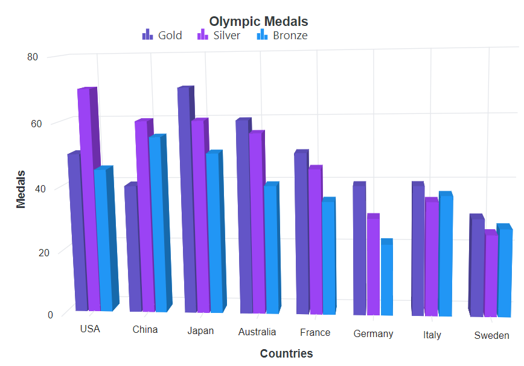
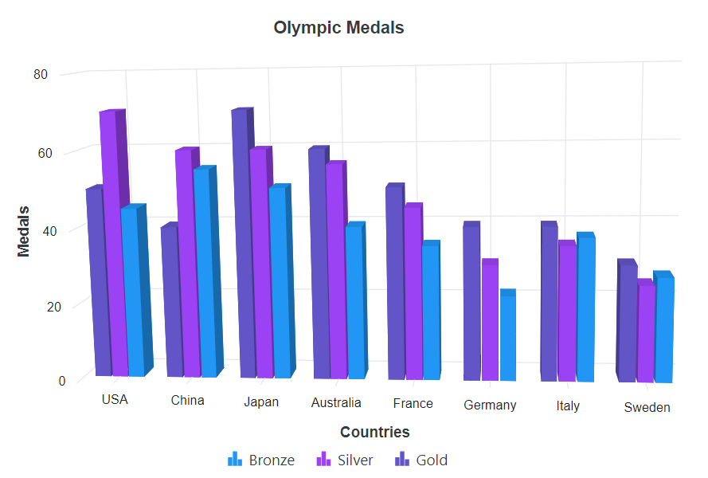
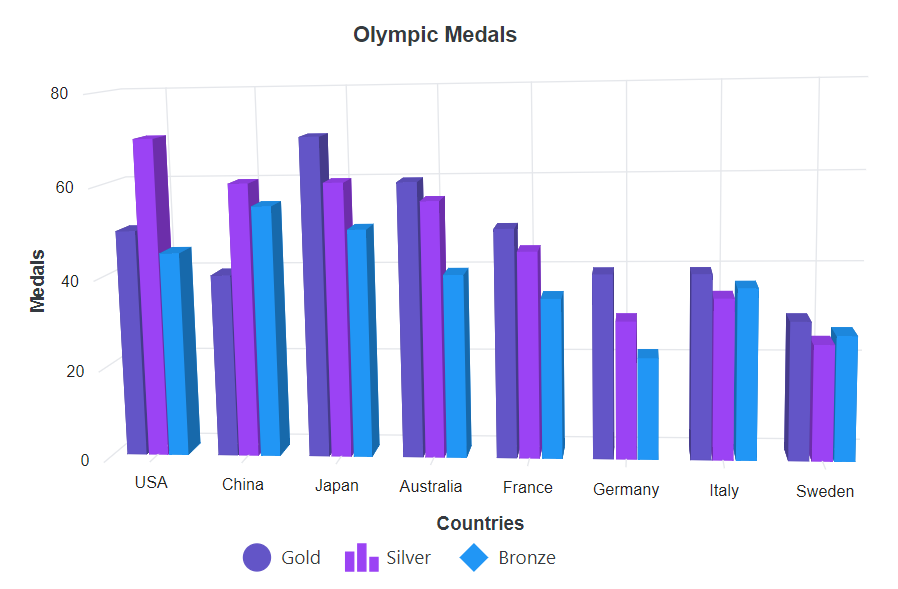

# Legend in Blazor 3D Chart Component

Legend provides information about the series rendered in the 3D chart.

## Position and alignment

By using the [Position](https://help.syncfusion.com/cr/blazor/Syncfusion.Blazor.Charts.ChartLegendSettings.html#Syncfusion_Blazor_Charts_ChartLegendSettings_Position) property, the legend can be positioned at left, right, top or bottom of the 3D chart. The legend is positioned at the bottom of the 3D chart, by default.

```cshtml

@using Syncfusion.Blazor.Chart3D

<SfChart3D Title="Olympic Medals">
    <Chart3DPrimaryXAxis ValueType="Syncfusion.Blazor.Charts.ValueType.Category"/>    

    <Chart3DSeriesCollection>
        <Chart3DSeries DataSource="@MedalDetails" Name="Gold" XName="Country" Opacity="1" YName="Gold" Type="Chart3DSeriesType.Column"/>      
        <Chart3DSeries DataSource="@MedalDetails" Name="Silver" XName="Country" Opacity="1" YName="Silver" Type="Chart3DSeriesType.Column"/>     
        <Chart3DSeries DataSource="@MedalDetails" Name="Bronze" XName="Country" Opacity="1" YName="Bronze" Type="Chart3DSeriesType.Column"/>      
    </Chart3DSeriesCollection>

    <Chart3DLegendSettings Visible="true" Position="Syncfusion.Blazor.Charts.LegendPosition.Top"/>
</SfChart3D>

@code{

    public class Chart3DData
    {
        public string Country { get; set; }
        public double Gold { get; set; }
        public double Silver { get; set; }
        public double Bronze { get; set; }
    }

    public List<Chart3DData> MedalDetails = new List<Chart3DData>
	{
		new Chart3DData{ Country= "USA", Gold=50, Silver=70, Bronze=45 },
		new Chart3DData{ Country="China", Gold=40, Silver= 60, Bronze=55 },
		new Chart3DData{ Country= "Japan", Gold=70, Silver= 60, Bronze=50 },
		new Chart3DData{ Country= "Australia", Gold=60, Silver= 56, Bronze=40 },
		new Chart3DData{ Country= "France", Gold=50, Silver= 45, Bronze=35 },
		new Chart3DData{ Country= "Germany", Gold=40, Silver=30, Bronze=22 },
		new Chart3DData{ Country= "Italy", Gold=40, Silver=35, Bronze=37 },
		new Chart3DData{ Country= "Sweden", Gold=30, Silver=25, Bronze=27 }
	};
}

```


The custom position helps you to position the legend anywhere in the 3D chart using x and y coordinates.

```cshtml

@using Syncfusion.Blazor.Chart3D

<SfChart3D Title="Olympic Medals">
    <Chart3DPrimaryXAxis ValueType="Syncfusion.Blazor.Charts.ValueType.Category"/>    

    <Chart3DSeriesCollection>
        <Chart3DSeries DataSource="@MedalDetails" Name="Gold" XName="Country" Opacity="1" YName="Gold" Type="Chart3DSeriesType.Column"/>      
        <Chart3DSeries DataSource="@MedalDetails" Name="Silver" XName="Country" Opacity="1" YName="Silver" Type="Chart3DSeriesType.Column"/>     
        <Chart3DSeries DataSource="@MedalDetails" Name="Bronze" XName="Country" Opacity="1" YName="Bronze" Type="Chart3DSeriesType.Column"/>      
    </Chart3DSeriesCollection>

    <Chart3DLegendSettings Visible="true" Position="Syncfusion.Blazor.Charts.LegendPosition.Custom">
         <Chart3DLocation X="200" Y="20"/>
    </Chart3DLegendSettings>
</SfChart3D>

@code{

    public class Chart3DData
    {
        public string Country { get; set; }
        public double Gold { get; set; }
        public double Silver { get; set; }
        public double Bronze { get; set; }
    }

    public List<Chart3DData> MedalDetails = new List<Chart3DData>
	{
		new Chart3DData{ Country= "USA", Gold=50, Silver=70, Bronze=45 },
		new Chart3DData{ Country="China", Gold=40, Silver= 60, Bronze=55 },
		new Chart3DData{ Country= "Japan", Gold=70, Silver= 60, Bronze=50 },
		new Chart3DData{ Country= "Australia", Gold=60, Silver= 56, Bronze=40 },
		new Chart3DData{ Country= "France", Gold=50, Silver= 45, Bronze=35 },
		new Chart3DData{ Country= "Germany", Gold=40, Silver=30, Bronze=22 },
		new Chart3DData{ Country= "Italy", Gold=40, Silver=35, Bronze=37 },
		new Chart3DData{ Country= "Sweden", Gold=30, Silver=25, Bronze=27 }
	};
}

```



<!-- markdownlint-disable MD036 -->

## Legend Reverse

The order of the legend items can be reversed by using the [Reverse](https://help.syncfusion.com/cr/blazor/Syncfusion.Blazor.Charts.ChartLegendSettings.html#Syncfusion_Blazor_Charts_ChartLegendSettings_Reverse) property. By default, legend for the first series in the collection will be placed first.

```cshtml

@using Syncfusion.Blazor.Chart3D

<SfChart3D Title="Olympic Medals">
    <Chart3DPrimaryXAxis ValueType="Syncfusion.Blazor.Charts.ValueType.Category"/>    

    <Chart3DSeriesCollection>
        <Chart3DSeries DataSource="@MedalDetails" Name="Gold" XName="Country" Opacity="1" YName="Gold" Type="Chart3DSeriesType.Column"/>      
        <Chart3DSeries DataSource="@MedalDetails" Name="Silver" XName="Country" Opacity="1" YName="Silver" Type="Chart3DSeriesType.Column"/>     
        <Chart3DSeries DataSource="@MedalDetails" Name="Bronze" XName="Country" Opacity="1" YName="Bronze" Type="Chart3DSeriesType.Column"/>      
    </Chart3DSeriesCollection>

    <Chart3DLegendSettings Visible="true" Reverse="true">
    </Chart3DLegendSettings>
</SfChart3D>

@code{

    public class Chart3DData
    {
        public string Country { get; set; }
        public double Gold { get; set; }
        public double Silver { get; set; }
        public double Bronze { get; set; }
    }

    public List<Chart3DData> MedalDetails = new List<Chart3DData>
	{
		new Chart3DData{ Country= "USA", Gold=50, Silver=70, Bronze=45 },
		new Chart3DData{ Country="China", Gold=40, Silver= 60, Bronze=55 },
		new Chart3DData{ Country= "Japan", Gold=70, Silver= 60, Bronze=50 },
		new Chart3DData{ Country= "Australia", Gold=60, Silver= 56, Bronze=40 },
		new Chart3DData{ Country= "France", Gold=50, Silver= 45, Bronze=35 },
		new Chart3DData{ Country= "Germany", Gold=40, Silver=30, Bronze=22 },
		new Chart3DData{ Country= "Italy", Gold=40, Silver=35, Bronze=37 },
		new Chart3DData{ Country= "Sweden", Gold=30, Silver=25, Bronze=27 }
	};
}


```



**Legend Alignment**

<!-- markdownlint-disable MD036 -->

The legend can be aligned at near, far or center to the 3D chart using the [Alignment](https://help.syncfusion.com/cr/blazor/Syncfusion.Blazor.Charts.ChartLegendSettings.html#Syncfusion_Blazor_Charts_ChartLegendSettings_Alignment) property.

```cshtml

@using Syncfusion.Blazor.Chart3D

<SfChart3D Title="Olympic Medals">
    <Chart3DPrimaryXAxis ValueType="Syncfusion.Blazor.Charts.ValueType.Category"/>    

    <Chart3DSeriesCollection>
        <Chart3DSeries DataSource="@MedalDetails" Name="Gold" XName="Country" Opacity="1" YName="Gold" Type="Chart3DSeriesType.Column"/>      
        <Chart3DSeries DataSource="@MedalDetails" Name="Silver" XName="Country" Opacity="1" YName="Silver" Type="Chart3DSeriesType.Column"/>     
        <Chart3DSeries DataSource="@MedalDetails" Name="Bronze" XName="Country" Opacity="1" YName="Bronze" Type="Chart3DSeriesType.Column"/>      
    </Chart3DSeriesCollection>

    <Chart3DLegendSettings Visible="true" Alignment="Syncfusion.Blazor.Charts.Alignment.Far">
    </Chart3DLegendSettings>
</SfChart3D>

@code{

    public class Chart3DData
    {
        public string Country { get; set; }
        public double Gold { get; set; }
        public double Silver { get; set; }
        public double Bronze { get; set; }
    }

    public List<Chart3DData> MedalDetails = new List<Chart3DData>
	{
		new Chart3DData{ Country= "USA", Gold=50, Silver=70, Bronze=45 },
		new Chart3DData{ Country="China", Gold=40, Silver= 60, Bronze=55 },
		new Chart3DData{ Country= "Japan", Gold=70, Silver= 60, Bronze=50 },
		new Chart3DData{ Country= "Australia", Gold=60, Silver= 56, Bronze=40 },
		new Chart3DData{ Country= "France", Gold=50, Silver= 45, Bronze=35 },
		new Chart3DData{ Country= "Germany", Gold=40, Silver=30, Bronze=22 },
		new Chart3DData{ Country= "Italy", Gold=40, Silver=35, Bronze=37 },
		new Chart3DData{ Country= "Sweden", Gold=30, Silver=25, Bronze=27 }
	};
}


```


## Legend customization

To change the legend icon shape, [LegendShape](https://help.syncfusion.com/cr/blazor/Syncfusion.Blazor.Charts.ChartSeries.html#Syncfusion_Blazor_Charts_ChartSeries_LegendShape) property in the [Series](https://help.syncfusion.com/cr/blazor/Syncfusion.Blazor.Charts.ChartSeries.html) can be used. By default, the legend icon shape is [SeriesType](https://help.syncfusion.com/cr/blazor/Syncfusion.Blazor.Charts.LegendShape.html#Syncfusion_Blazor_Charts_LegendShape_SeriesType).

```cshtml

@using Syncfusion.Blazor.Chart3D

<SfChart3D Title="Olympic Medals">
    <Chart3DPrimaryXAxis ValueType="Syncfusion.Blazor.Charts.ValueType.Category"/>    

    <Chart3DSeriesCollection>
        <Chart3DSeries DataSource="@MedalDetails" Name="Gold" XName="Country" Opacity="1" YName="Gold" Type="Chart3DSeriesType.Column" LegendShape="Syncfusion.Blazor.Charts.LegendShape.Circle"/>      
        <Chart3DSeries DataSource="@MedalDetails" Name="Silver" XName="Country" Opacity="1" YName="Silver" Type="Chart3DSeriesType.Column" LegendShape="Syncfusion.Blazor.Charts.LegendShape.SeriesType"/>     
        <Chart3DSeries DataSource="@MedalDetails" Name="Bronze" XName="Country" Opacity="1" YName="Bronze" Type="Chart3DSeriesType.Column" LegendShape="Syncfusion.Blazor.Charts.LegendShape.Diamond"/>      
    </Chart3DSeriesCollection>

    <Chart3DLegendSettings Visible="true">
    </Chart3DLegendSettings>
</SfChart3D>

@code{

    public class Chart3DData
    {
        public string Country { get; set; }
        public double Gold { get; set; }
        public double Silver { get; set; }
        public double Bronze { get; set; }
    }

    public List<Chart3DData> MedalDetails = new List<Chart3DData>
	{
		new Chart3DData{ Country= "USA", Gold=50, Silver=70, Bronze=45 },
		new Chart3DData{ Country="China", Gold=40, Silver= 60, Bronze=55 },
		new Chart3DData{ Country= "Japan", Gold=70, Silver= 60, Bronze=50 },
		new Chart3DData{ Country= "Australia", Gold=60, Silver= 56, Bronze=40 },
		new Chart3DData{ Country= "France", Gold=50, Silver= 45, Bronze=35 },
		new Chart3DData{ Country= "Germany", Gold=40, Silver=30, Bronze=22 },
		new Chart3DData{ Country= "Italy", Gold=40, Silver=35, Bronze=37 },
		new Chart3DData{ Country= "Sweden", Gold=30, Silver=25, Bronze=27 }
	};
}

```


### Legend Size

By default, legend takes 20% - 25% of the 3D chart's height horizontally, when it is placed on top or bottom position and 20% - 25% of the 3D chart's width vertically, when it is placed on left or right position. You can change this default legend size by using the [Height](https://help.syncfusion.com/cr/blazor/Syncfusion.Blazor.Charts.ChartLegendSettings.html#Syncfusion_Blazor_Charts_ChartLegendSettings_Height) and [Width](https://help.syncfusion.com/cr/blazor/Syncfusion.Blazor.Charts.ChartLegendSettings.html#Syncfusion_Blazor_Charts_ChartLegendSettings_Width) properties of the `LegendSettings`.

```cshtml

@using Syncfusion.Blazor.Chart3D

<SfChart3D Title="Olympic Medals">
    <Chart3DPrimaryXAxis ValueType="Syncfusion.Blazor.Charts.ValueType.Category"/>    

    <Chart3DSeriesCollection>
        <Chart3DSeries DataSource="@MedalDetails" Name="Gold" XName="Country" Opacity="1" YName="Gold" Type="Chart3DSeriesType.Column" LegendShape="Syncfusion.Blazor.Charts.LegendShape.Circle"/>      
        <Chart3DSeries DataSource="@MedalDetails" Name="Silver" XName="Country" Opacity="1" YName="Silver" Type="Chart3DSeriesType.Column" LegendShape="Syncfusion.Blazor.Charts.LegendShape.SeriesType"/>     
        <Chart3DSeries DataSource="@MedalDetails" Name="Bronze" XName="Country" Opacity="1" YName="Bronze" Type="Chart3DSeriesType.Column" LegendShape="Syncfusion.Blazor.Charts.LegendShape.Diamond"/>      
    </Chart3DSeriesCollection>

    <Chart3DLegendSettings Visible="true" Height="50" Width="300">
        <Chart3DLegendBorder Color="red" Width="1"/>
    </Chart3DLegendSettings>
</SfChart3D>

@code{

    public class Chart3DData
    {
        public string Country { get; set; }
        public double Gold { get; set; }
        public double Silver { get; set; }
        public double Bronze { get; set; }
    }

    public List<Chart3DData> MedalDetails = new List<Chart3DData>
	{
		new Chart3DData{ Country= "USA", Gold=50, Silver=70, Bronze=45 },
		new Chart3DData{ Country="China", Gold=40, Silver= 60, Bronze=55 },
		new Chart3DData{ Country= "Japan", Gold=70, Silver= 60, Bronze=50 },
		new Chart3DData{ Country= "Australia", Gold=60, Silver= 56, Bronze=40 },
		new Chart3DData{ Country= "France", Gold=50, Silver= 45, Bronze=35 },
		new Chart3DData{ Country= "Germany", Gold=40, Silver=30, Bronze=22 },
		new Chart3DData{ Country= "Italy", Gold=40, Silver=35, Bronze=37 },
		new Chart3DData{ Country= "Sweden", Gold=30, Silver=25, Bronze=27 }
	};
}

```


### Legend item Size

The size of the legend items can be customised by using the [ShapeHeight](https://help.syncfusion.com/cr/blazor/Syncfusion.Blazor.Charts.ChartLegendSettings.html#Syncfusion_Blazor_Charts_ChartLegendSettings_ShapeHeight) and [ShapeWidth](https://help.syncfusion.com/cr/blazor/Syncfusion.Blazor.Charts.ChartLegendSettings.html#Syncfusion_Blazor_Charts_ChartLegendSettings_ShapeWidth) properties.

```cshtml

@using Syncfusion.Blazor.Chart3D

<SfChart3D Title="Olympic Medals">
    <Chart3DPrimaryXAxis ValueType="Syncfusion.Blazor.Charts.ValueType.Category"/>    

    <Chart3DSeriesCollection>
        <Chart3DSeries DataSource="@MedalDetails" Name="Gold" XName="Country" Opacity="1" YName="Gold" Type="Chart3DSeriesType.Column" LegendShape="Syncfusion.Blazor.Charts.LegendShape.Circle"/>      
        <Chart3DSeries DataSource="@MedalDetails" Name="Silver" XName="Country" Opacity="1" YName="Silver" Type="Chart3DSeriesType.Column" LegendShape="Syncfusion.Blazor.Charts.LegendShape.SeriesType"/>     
        <Chart3DSeries DataSource="@MedalDetails" Name="Bronze" XName="Country" Opacity="1" YName="Bronze" Type="Chart3DSeriesType.Column" LegendShape="Syncfusion.Blazor.Charts.LegendShape.Diamond"/>      
    </Chart3DSeriesCollection>

    <Chart3DLegendSettings Visible="true" Height="50" Width="300" ShapeHeight="20" ShapeWidth="20">
        <Chart3DLegendBorder Color="red" Width="1"/>
    </Chart3DLegendSettings>
</SfChart3D>

@code{

    public class Chart3DData
    {
        public string Country { get; set; }
        public double Gold { get; set; }
        public double Silver { get; set; }
        public double Bronze { get; set; }
    }

    public List<Chart3DData> MedalDetails = new List<Chart3DData>
	{
		new Chart3DData{ Country= "USA", Gold=50, Silver=70, Bronze=45 },
		new Chart3DData{ Country="China", Gold=40, Silver= 60, Bronze=55 },
		new Chart3DData{ Country= "Japan", Gold=70, Silver= 60, Bronze=50 },
		new Chart3DData{ Country= "Australia", Gold=60, Silver= 56, Bronze=40 },
		new Chart3DData{ Country= "France", Gold=50, Silver= 45, Bronze=35 },
		new Chart3DData{ Country= "Germany", Gold=40, Silver=30, Bronze=22 },
		new Chart3DData{ Country= "Italy", Gold=40, Silver=35, Bronze=37 },
		new Chart3DData{ Country= "Sweden", Gold=30, Silver=25, Bronze=27 }
	};
}

```



### Legend Paging

Paging will be enabled by default, when the legend items exceeds the legend bounds. Each legend items can be viewed by navigating between the pages using navigation buttons.

```cshtml

@using Syncfusion.Blazor.Chart3D

<SfChart3D Title="Olympic Medals">
    <Chart3DPrimaryXAxis ValueType="Syncfusion.Blazor.Charts.ValueType.Category"/>    

    <Chart3DSeriesCollection>
        <Chart3DSeries DataSource="@MedalDetails" Name="Gold" XName="Country" Opacity="1" YName="Gold" Type="Chart3DSeriesType.Column" LegendShape="Syncfusion.Blazor.Charts.LegendShape.Circle"/>      
        <Chart3DSeries DataSource="@MedalDetails" Name="Silver" XName="Country" Opacity="1" YName="Silver" Type="Chart3DSeriesType.Column" LegendShape="Syncfusion.Blazor.Charts.LegendShape.SeriesType"/>     
        <Chart3DSeries DataSource="@MedalDetails" Name="Bronze" XName="Country" Opacity="1" YName="Bronze" Type="Chart3DSeriesType.Column" LegendShape="Syncfusion.Blazor.Charts.LegendShape.Diamond"/>      
    </Chart3DSeriesCollection>

    <Chart3DLegendSettings Visible="true" Width="100" Height="80" Padding="10" ShapePadding="10">
        <Chart3DLegendBorder Color="red" Width="1"/>
    </Chart3DLegendSettings>
</SfChart3D>

@code{

    public class Chart3DData
    {
        public string Country { get; set; }
        public double Gold { get; set; }
        public double Silver { get; set; }
        public double Bronze { get; set; }
    }

    public List<Chart3DData> MedalDetails = new List<Chart3DData>
	{
		new Chart3DData{ Country= "USA", Gold=50, Silver=70, Bronze=45 },
		new Chart3DData{ Country="China", Gold=40, Silver= 60, Bronze=55 },
		new Chart3DData{ Country= "Japan", Gold=70, Silver= 60, Bronze=50 },
		new Chart3DData{ Country= "Australia", Gold=60, Silver= 56, Bronze=40 },
		new Chart3DData{ Country= "France", Gold=50, Silver= 45, Bronze=35 },
		new Chart3DData{ Country= "Germany", Gold=40, Silver=30, Bronze=22 },
		new Chart3DData{ Country= "Italy", Gold=40, Silver=35, Bronze=37 },
		new Chart3DData{ Country= "Sweden", Gold=30, Silver=25, Bronze=27 }
	};
}

```


### Legend Text Wrap

When the legend text exceeds the container, the text can be wrapped by using the [TextWrap](https://help.syncfusion.com/cr/blazor/Syncfusion.Blazor.Charts.ChartLegendSettings.html#Syncfusion_Blazor_Charts_ChartLegendSettings_TextWrap) property. End user can also wrap the legend text based on the [MaximumLabelWidth](https://help.syncfusion.com/cr/blazor/Syncfusion.Blazor.Charts.ChartLegendSettings.html#Syncfusion_Blazor_Charts_ChartLegendSettings_MaximumLabelWidth) property.

```cshtml

@using Syncfusion.Blazor.Chart3D

<SfChart3D Title="Olympic Medals">
    <Chart3DPrimaryXAxis ValueType="Syncfusion.Blazor.Charts.ValueType.Category"/>    

    <Chart3DSeriesCollection>
        <Chart3DSeries DataSource="@MedalDetails" Name="Gold" XName="Country" Opacity="1" YName="Gold" Type="Chart3DSeriesType.Column" LegendShape="Syncfusion.Blazor.Charts.LegendShape.Circle"/>      
        <Chart3DSeries DataSource="@MedalDetails" Name="Silver" XName="Country" Opacity="1" YName="Silver" Type="Chart3DSeriesType.Column" LegendShape="Syncfusion.Blazor.Charts.LegendShape.SeriesType"/>     
        <Chart3DSeries DataSource="@MedalDetails" Name="Bronze" XName="Country" Opacity="1" YName="Bronze" Type="Chart3DSeriesType.Column" LegendShape="Syncfusion.Blazor.Charts.LegendShape.Diamond"/>      
    </Chart3DSeriesCollection>

    <Chart3DLegendSettings Visible="true" Position="Syncfusion.Blazor.Charts.LegendPosition.Right" TextWrap="@TextWrap.Wrap" MaximumLabelWidth="50">
        <Chart3DLegendBorder Color="red" Width="1"/>
    </Chart3DLegendSettings>
</SfChart3D>

@code{

    public class Chart3DData
    {
        public string Country { get; set; }
        public double Gold { get; set; }
        public double Silver { get; set; }
        public double Bronze { get; set; }
    }

    public List<Chart3DData> MedalDetails = new List<Chart3DData>
	{
		new Chart3DData{ Country= "USA", Gold=50, Silver=70, Bronze=45 },
		new Chart3DData{ Country="China", Gold=40, Silver= 60, Bronze=55 },
		new Chart3DData{ Country= "Japan", Gold=70, Silver= 60, Bronze=50 },
		new Chart3DData{ Country= "Australia", Gold=60, Silver= 56, Bronze=40 },
		new Chart3DData{ Country= "France", Gold=50, Silver= 45, Bronze=35 },
		new Chart3DData{ Country= "Germany", Gold=40, Silver=30, Bronze=22 },
		new Chart3DData{ Country= "Italy", Gold=40, Silver=35, Bronze=37 },
		new Chart3DData{ Country= "Sweden", Gold=30, Silver=25, Bronze=27 }
	};
}

```

![Blazor 3D Chart Legend with Wrap]

## Series selection based on legend

By default, you can collapse the series visibility by clicking the legend. On the other hand, turn off the [ToggleVisibility](https://help.syncfusion.com/cr/blazor/Syncfusion.Blazor.Charts.ChartLegendSettings.html#Syncfusion_Blazor_Charts_ChartLegendSettings_ToggleVisibility) property if you must use a legend click to choose a series.

```cshtml

@using Syncfusion.Blazor.Chart3D

<SfChart3D Title="Olympic Medals">
    <Chart3DPrimaryXAxis ValueType="Syncfusion.Blazor.Charts.ValueType.Category"/>    

    <Chart3DSeriesCollection>
        <Chart3DSeries DataSource="@MedalDetails" Name="Gold" XName="Country" Opacity="1" YName="Gold" Type="Chart3DSeriesType.Column" LegendShape="Syncfusion.Blazor.Charts.LegendShape.Circle"/>      
        <Chart3DSeries DataSource="@MedalDetails" Name="Silver" XName="Country" Opacity="1" YName="Silver" Type="Chart3DSeriesType.Column" LegendShape="Syncfusion.Blazor.Charts.LegendShape.SeriesType"/>     
        <Chart3DSeries DataSource="@MedalDetails" Name="Bronze" XName="Country" Opacity="1" YName="Bronze" Type="Chart3DSeriesType.Column" LegendShape="Syncfusion.Blazor.Charts.LegendShape.Diamond"/>      
    </Chart3DSeriesCollection>

    <Chart3DLegendSettings Visible="true" ToggleVisibility="false">
        <Chart3DLegendBorder Color="red" Width="1"/>
    </Chart3DLegendSettings>
</SfChart3D>

@code{

    public class Chart3DData
    {
        public string Country { get; set; }
        public double Gold { get; set; }
        public double Silver { get; set; }
        public double Bronze { get; set; }
    }

    public List<Chart3DData> MedalDetails = new List<Chart3DData>
	{
		new Chart3DData{ Country= "USA", Gold=50, Silver=70, Bronze=45 },
		new Chart3DData{ Country="China", Gold=40, Silver= 60, Bronze=55 },
		new Chart3DData{ Country= "Japan", Gold=70, Silver= 60, Bronze=50 },
		new Chart3DData{ Country= "Australia", Gold=60, Silver= 56, Bronze=40 },
		new Chart3DData{ Country= "France", Gold=50, Silver= 45, Bronze=35 },
		new Chart3DData{ Country= "Germany", Gold=40, Silver=30, Bronze=22 },
		new Chart3DData{ Country= "Italy", Gold=40, Silver=35, Bronze=37 },
		new Chart3DData{ Country= "Sweden", Gold=30, Silver=25, Bronze=27 }
	};
}

```


## Collapsing legend item

By default, series [Name](https://help.syncfusion.com/cr/blazor/Syncfusion.Blazor.Charts.ChartSeries.html#Syncfusion_Blazor_Charts_ChartSeries_Name) will be displayed as legend. To skip the legend for a particular series, you can give empty string to the series [Name](https://help.syncfusion.com/cr/blazor/Syncfusion.Blazor.Charts.ChartSeries.html#Syncfusion_Blazor_Charts_ChartSeries_Name).

```cshtml

@using Syncfusion.Blazor.Charts

<SfChart Title="Olympic Medals">
    <ChartPrimaryXAxis ValueType="Syncfusion.Blazor.Charts.ValueType.Category">
    </ChartPrimaryXAxis>

    <ChartSeriesCollection>
        <ChartSeries DataSource="@MedalDetails" Name="Gold" XName="Country" Width="2" LegendShape="LegendShape.Circle" Opacity="1" YName="Gold" Type="ChartSeriesType.Column">
        </ChartSeries>
        <ChartSeries DataSource="@MedalDetails" Name="" XName="Country" Width="2" LegendShape="LegendShape.SeriesType" Opacity="1" YName="Silver" Type="ChartSeriesType.Column">
        </ChartSeries>
        <ChartSeries DataSource="@MedalDetails" Name="Bronze" XName="Country" Width="2" LegendShape="LegendShape.Diamond" Opacity="1" YName="Bronze" Type="ChartSeriesType.Column">
        </ChartSeries>
    </ChartSeriesCollection>

    <ChartLegendSettings Visible="true" ToggleVisibility="true">
    </ChartLegendSettings>
</SfChart>
@code{
    
    public class ChartData
    {
        public string Country { get; set; }
        public double Gold { get; set; }
        public double Silver { get; set; }
        public double Bronze { get; set; }
    }

    public List<ChartData> MedalDetails = new List<ChartData>
	{
		new ChartData{ Country= "USA", Gold=50, Silver=70, Bronze=45 },
		new ChartData{ Country="China", Gold=40, Silver= 60, Bronze=55 },
		new ChartData{ Country= "Japan", Gold=70, Silver= 60, Bronze=50 },
		new ChartData{ Country= "Australia", Gold=60, Silver= 56, Bronze=40 },
		new ChartData{ Country= "France", Gold=50, Silver= 45, Bronze=35 },
		new ChartData{ Country= "Germany", Gold=40, Silver=30, Bronze=22 },
		new ChartData{ Country= "Italy", Gold=40, Silver=35, Bronze=37 },
		new ChartData{ Country= "Sweden", Gold=30, Silver=25, Bronze=27 }
	};
}

```


## Legend title

You can set title for legend using `Title` property in `LegendSettings`. The `Size`, `Color`, `Opacity`,`FontStyle`, `FontWeight`, `FontFamily`, `TextAlignment`, and `TextOverflow` of legend title can be customized by using the `TitleStyle` property in `LegendSettings`. The `TitlePosition` is used to set the legend position in `Top`, `Left` and `Right` position. The `MaximumTitleWidth` is used to set the width of the legend title. By default, it will be `100px`.

```cshtml

@using Syncfusion.Blazor.Chart3D

<SfChart3D Title="Olympic Medals">
    <Chart3DPrimaryXAxis ValueType="Syncfusion.Blazor.Charts.ValueType.Category"/>    

    <Chart3DSeriesCollection>
        <Chart3DSeries DataSource="@MedalDetails" Name="Gold" XName="Country" Opacity="1" YName="Gold" Type="Chart3DSeriesType.Column" LegendShape="Syncfusion.Blazor.Charts.LegendShape.Circle"/>      
        <Chart3DSeries DataSource="@MedalDetails" Name="Silver" XName="Country" Opacity="1" YName="Silver" Type="Chart3DSeriesType.Column" LegendShape="Syncfusion.Blazor.Charts.LegendShape.SeriesType"/>     
        <Chart3DSeries DataSource="@MedalDetails" Name="Bronze" XName="Country" Opacity="1" YName="Bronze" Type="Chart3DSeriesType.Column" LegendShape="Syncfusion.Blazor.Charts.LegendShape.Diamond"/>      
    </Chart3DSeriesCollection>

    <Chart3DLegendSettings Visible="true" Title="Countries">
    </Chart3DLegendSettings>
</SfChart3D>

@code{

    public class Chart3DData
    {
        public string Country { get; set; }
        public double Gold { get; set; }
        public double Silver { get; set; }
        public double Bronze { get; set; }
    }

    public List<Chart3DData> MedalDetails = new List<Chart3DData>
	{
		new Chart3DData{ Country= "USA", Gold=50, Silver=70, Bronze=45 },
		new Chart3DData{ Country="China", Gold=40, Silver= 60, Bronze=55 },
		new Chart3DData{ Country= "Japan", Gold=70, Silver= 60, Bronze=50 },
		new Chart3DData{ Country= "Australia", Gold=60, Silver= 56, Bronze=40 },
		new Chart3DData{ Country= "France", Gold=50, Silver= 45, Bronze=35 },
		new Chart3DData{ Country= "Germany", Gold=40, Silver=30, Bronze=22 },
		new Chart3DData{ Country= "Italy", Gold=40, Silver=35, Bronze=37 },
		new Chart3DData{ Country= "Sweden", Gold=30, Silver=25, Bronze=27 }
	};
}

```


## Arrow page navigation

The page number will always be visible while using legend paging. It is now possible to disable the page number and enable page navigation with the left and right arrows. The `EnablePages` property needs to be set to **false** in order to render the arrow page navigation.

```cshtml

@using Syncfusion.Blazor.Chart3D

<SfChart3D Title="Olympic Medals">
    <Chart3DPrimaryXAxis ValueType="Syncfusion.Blazor.Charts.ValueType.Category"/>    

    <Chart3DSeriesCollection>
        <Chart3DSeries DataSource="@MedalDetails" Name="Gold" XName="Country" Opacity="1" YName="Gold" Type="Chart3DSeriesType.Column" LegendShape="Syncfusion.Blazor.Charts.LegendShape.Circle"/>      
        <Chart3DSeries DataSource="@MedalDetails" Name="Silver" XName="Country" Opacity="1" YName="Silver" Type="Chart3DSeriesType.Column" LegendShape="Syncfusion.Blazor.Charts.LegendShape.SeriesType"/>     
        <Chart3DSeries DataSource="@MedalDetails" Name="Bronze" XName="Country" Opacity="1" YName="Bronze" Type="Chart3DSeriesType.Column" LegendShape="Syncfusion.Blazor.Charts.LegendShape.Diamond"/>      
    </Chart3DSeriesCollection>

    <Chart3DLegendSettings Visible="true" EnablePages="false" Width="180" Height="20">
    </Chart3DLegendSettings>
</SfChart3D>

@code{

    public class Chart3DData
    {
        public string Country { get; set; }
        public double Gold { get; set; }
        public double Silver { get; set; }
        public double Bronze { get; set; }
    }

    public List<Chart3DData> MedalDetails = new List<Chart3DData>
	{
		new Chart3DData{ Country= "USA", Gold=50, Silver=70, Bronze=45 },
		new Chart3DData{ Country="China", Gold=40, Silver= 60, Bronze=55 },
		new Chart3DData{ Country= "Japan", Gold=70, Silver= 60, Bronze=50 },
		new Chart3DData{ Country= "Australia", Gold=60, Silver= 56, Bronze=40 },
		new Chart3DData{ Country= "France", Gold=50, Silver= 45, Bronze=35 },
		new Chart3DData{ Country= "Germany", Gold=40, Silver=30, Bronze=22 },
		new Chart3DData{ Country= "Italy", Gold=40, Silver=35, Bronze=37 },
		new Chart3DData{ Country= "Sweden", Gold=30, Silver=25, Bronze=27 }
	};
}

```

[Enabling legend pages in Blazor Column 3D Chart]

### Legend Item Padding

The [ItemPadding](https://help.syncfusion.com/cr/blazor/Syncfusion.Blazor.Charts.ChartLegendSettings.html#Syncfusion_Blazor_Charts_ChartLegendSettings_ItemPadding) property can be used to adjust the space between the legend items.

```cshtml

@using Syncfusion.Blazor.Chart3D

<SfChart3D Title="Olympic Medals">
    <Chart3DPrimaryXAxis ValueType="Syncfusion.Blazor.Charts.ValueType.Category"/>    

    <Chart3DSeriesCollection>
        <Chart3DSeries DataSource="@MedalDetails" Name="Gold" XName="Country" Opacity="1" YName="Gold" Type="Chart3DSeriesType.Column" LegendShape="Syncfusion.Blazor.Charts.LegendShape.Circle"/>      
        <Chart3DSeries DataSource="@MedalDetails" Name="Silver" XName="Country" Opacity="1" YName="Silver" Type="Chart3DSeriesType.Column" LegendShape="Syncfusion.Blazor.Charts.LegendShape.SeriesType"/>     
        <Chart3DSeries DataSource="@MedalDetails" Name="Bronze" XName="Country" Opacity="1" YName="Bronze" Type="Chart3DSeriesType.Column" LegendShape="Syncfusion.Blazor.Charts.LegendShape.Diamond"/>      
    </Chart3DSeriesCollection>

    <Chart3DLegendSettings Visible="true" ItemPadding="30">
        <Chart3DLegendBorder Color="red" Width="1"/>
    </Chart3DLegendSettings>
</SfChart3D>

@code{

    public class Chart3DData
    {
        public string Country { get; set; }
        public double Gold { get; set; }
        public double Silver { get; set; }
        public double Bronze { get; set; }
    }

    public List<Chart3DData> MedalDetails = new List<Chart3DData>
	{
		new Chart3DData{ Country= "USA", Gold=50, Silver=70, Bronze=45 },
		new Chart3DData{ Country="China", Gold=40, Silver= 60, Bronze=55 },
		new Chart3DData{ Country= "Japan", Gold=70, Silver= 60, Bronze=50 },
		new Chart3DData{ Country= "Australia", Gold=60, Silver= 56, Bronze=40 },
		new Chart3DData{ Country= "France", Gold=50, Silver= 45, Bronze=35 },
		new Chart3DData{ Country= "Germany", Gold=40, Silver=30, Bronze=22 },
		new Chart3DData{ Country= "Italy", Gold=40, Silver=35, Bronze=37 },
		new Chart3DData{ Country= "Sweden", Gold=30, Silver=25, Bronze=27 }
	};
}

```


N> Refer to our [Blazor 3D Chart](https://www.syncfusion.com/blazor-components/blazor-charts) feature tour page for its groundbreaking feature representations and also explore our [Blazor 3D Chart Example](https://blazor.syncfusion.com/demos/chart/line?theme=bootstrap5) to know various 3D Chart types and how to represent time-dependent data, showing trends at equal intervals.

## See also

* [Data label](./data-labels)