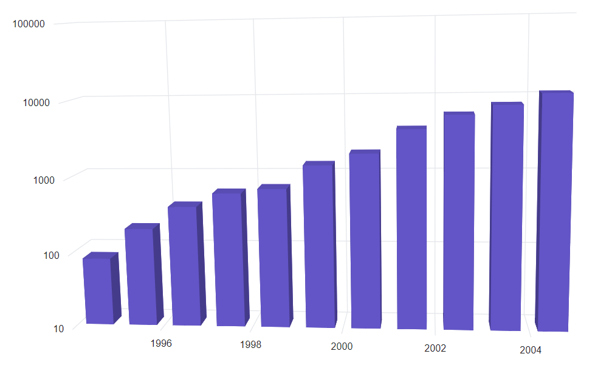
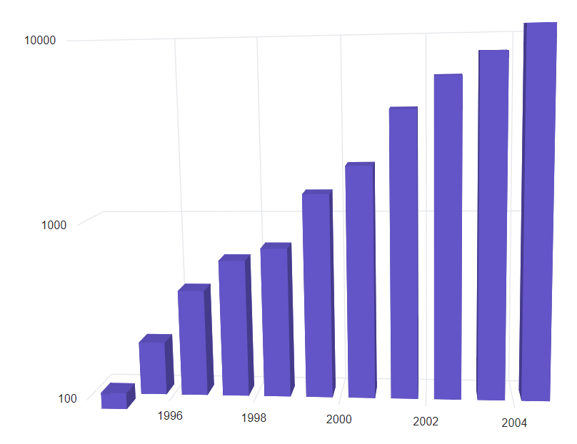
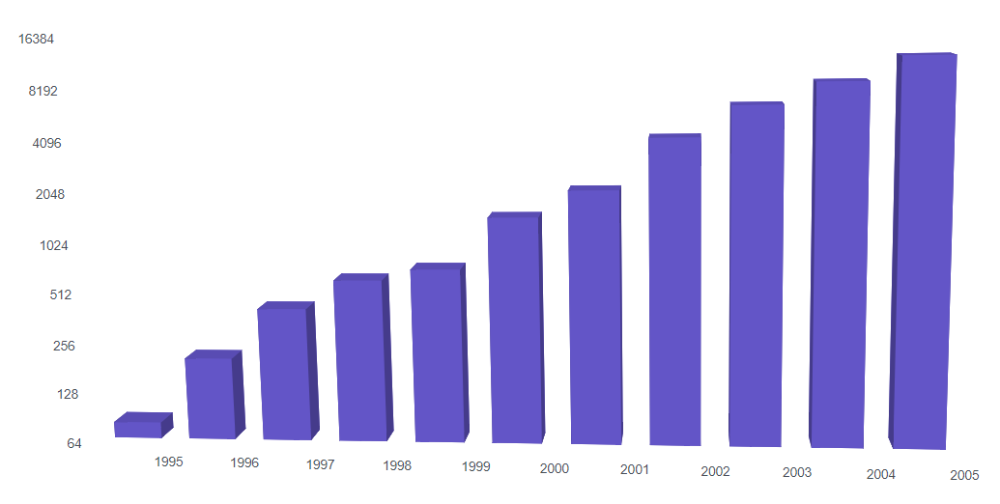
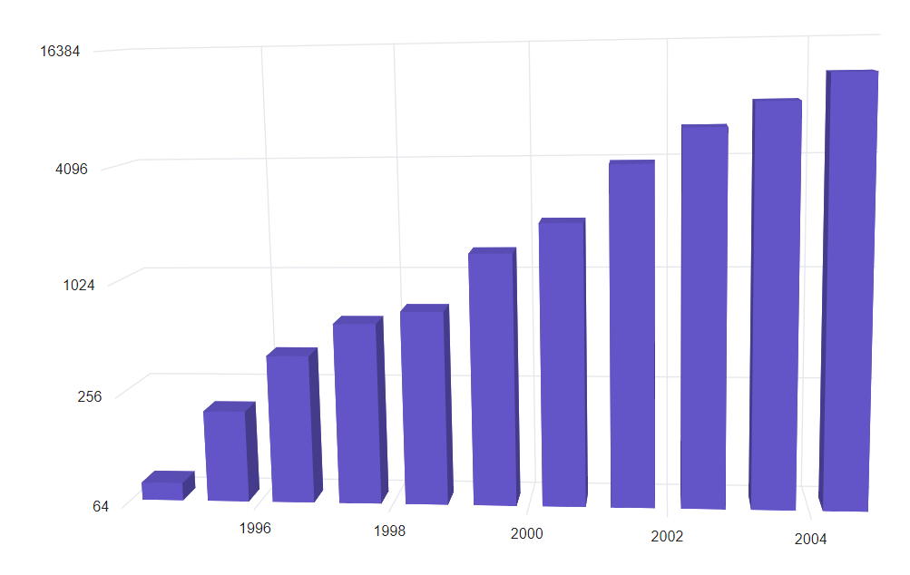

# Logarithmic Axis in Blazor 3D Chart Component

<!-- markdownlint-disable MD033 -->

A logarithmic axis applies a logarithmic scale, which is effective for visualizing data with values spanning several orders of magnitude, such as from 10<sup>-6</sup> to 10<sup>6</sup>.

```cshtml

@using Syncfusion.Blazor.Chart3D

<SfChart3D WallColor="transparent" EnableRotation="true" RotationAngle="7" TiltAngle="10" Depth="100">
    <Chart3DPrimaryXAxis ValueType="Syncfusion.Blazor.Chart3D.ValueType.DateTime"></Chart3DPrimaryXAxis>

    <Chart3DPrimaryYAxis ValueType="Syncfusion.Blazor.Chart3D.ValueType.Logarithmic" />

    <Chart3DSeriesCollection>
        <Chart3DSeries DataSource="@Data" XName="XValue" YName="YValue" />
    </Chart3DSeriesCollection>
</SfChart3D>

@code {
    public class Chart3DData
    {
        public DateTime XValue { get; set; }
        public double YValue { get; set; }
    }

    public List<Chart3DData> Data = new List<Chart3DData> 
	{
		new Chart3DData { XValue = new DateTime(1995, 01, 01), YValue = 80 },
		new Chart3DData { XValue = new DateTime(1996, 01, 01), YValue = 200 },
		new Chart3DData { XValue = new DateTime(1997, 01, 01), YValue = 400 }, 
		new Chart3DData { XValue = new DateTime(1998, 01, 01), YValue = 600 },
		new Chart3DData { XValue = new DateTime(1999, 01, 01), YValue = 700 }, 
		new Chart3DData { XValue = new DateTime(2000, 01, 01), YValue = 1400 },
		new Chart3DData { XValue = new DateTime(2001, 01, 01), YValue = 2000 }, 
		new Chart3DData { XValue = new DateTime(2002, 01, 01), YValue = 4000 },
		new Chart3DData { XValue = new DateTime(2003, 01, 01), YValue = 6000 }, 
		new Chart3DData { XValue = new DateTime(2004, 01, 01), YValue = 8000 },
		new Chart3DData { XValue = new DateTime(2005, 01, 01), YValue = 11000 }
	};
}

```




## Range

The axis range is calculated automatically based on the data, but can be customized using the `Minimum`, `Maximum`, and `Interval` properties.

```cshtml

@using Syncfusion.Blazor.Chart3D

<SfChart3D WallColor="transparent" EnableRotation="true" RotationAngle="7" TiltAngle="10" Depth="100">
    <Chart3DPrimaryXAxis ValueType="Syncfusion.Blazor.Chart3D.ValueType.DateTime"></Chart3DPrimaryXAxis>

    <Chart3DPrimaryYAxis Minimum="100" Maximum="10000" ValueType="Syncfusion.Blazor.Chart3D.ValueType.Logarithmic" />

    <Chart3DSeriesCollection>
        <Chart3DSeries DataSource="@Data" XName="XValue" YName="YValue" />  
    </Chart3DSeriesCollection>
</SfChart3D>

@code {
    public class Chart3DData
    {
        public DateTime XValue { get; set; }
        public double YValue { get; set; }
    }

    public List<Chart3DData> Data = new List<Chart3DData> 
	{
		new Chart3DData { XValue = new DateTime(1995, 01, 01), YValue = 80 },
		new Chart3DData { XValue = new DateTime(1996, 01, 01), YValue = 200 },
		new Chart3DData { XValue = new DateTime(1997, 01, 01), YValue = 400 }, 
		new Chart3DData { XValue = new DateTime(1998, 01, 01), YValue = 600 },
		new Chart3DData { XValue = new DateTime(1999, 01, 01), YValue = 700 }, 
		new Chart3DData { XValue = new DateTime(2000, 01, 01), YValue = 1400 },
		new Chart3DData { XValue = new DateTime(2001, 01, 01), YValue = 2000 }, 
		new Chart3DData { XValue = new DateTime(2002, 01, 01), YValue = 4000 },
		new Chart3DData { XValue = new DateTime(2003, 01, 01), YValue = 6000 }, 
		new Chart3DData { XValue = new DateTime(2004, 01, 01), YValue = 8000 },
		new Chart3DData { XValue = new DateTime(2005, 01, 01), YValue = 11000 }
	};
}

```




## Logarithmic base

The logarithmic base can be set using the `LogBase` property. For example, when `LogBase` is 5, the axis values follow 5<sup>-2</sup>, 5<sup>-1</sup>, 5<sup>0</sup>, 5<sup>1</sup>, 5<sup>2</sup>, and so on.

```cshtml

@using Syncfusion.Blazor.Chart3D

<SfChart3D WallColor="transparent" EnableRotation="true" RotationAngle="7" TiltAngle="10" Depth="100">
    <Chart3DPrimaryXAxis ValueType="Syncfusion.Blazor.Chart3D.ValueType.DateTime"></Chart3DPrimaryXAxis>

    <Chart3DPrimaryYAxis LogBase="2" ValueType="Syncfusion.Blazor.Chart3D.ValueType.Logarithmic" />

    <Chart3DSeriesCollection>
        <Chart3DSeries DataSource="@Data" XName="XValue" YName="YValue" />
    </Chart3DSeriesCollection>
</SfChart3D>

@code {
    public class Chart3DData
    {
        public DateTime XValue { get; set; }
        public double YValue { get; set; }
    }

    public List<Chart3DData> Data = new List<Chart3DData> 
	{
		new Chart3DData { XValue = new DateTime(1995, 01, 01), YValue = 80 },
		new Chart3DData { XValue = new DateTime(1996, 01, 01), YValue = 200 },
		new Chart3DData { XValue = new DateTime(1997, 01, 01), YValue = 400 }, 
		new Chart3DData { XValue = new DateTime(1998, 01, 01), YValue = 600 },
		new Chart3DData { XValue = new DateTime(1999, 01, 01), YValue = 700 }, 
		new Chart3DData { XValue = new DateTime(2000, 01, 01), YValue = 1400 },
		new Chart3DData { XValue = new DateTime(2001, 01, 01), YValue = 2000 }, 
		new Chart3DData { XValue = new DateTime(2002, 01, 01), YValue = 4000 },
		new Chart3DData { XValue = new DateTime(2003, 01, 01), YValue = 6000 }, 
		new Chart3DData { XValue = new DateTime(2004, 01, 01), YValue = 8000 },
		new Chart3DData { XValue = new DateTime(2005, 01, 01), YValue = 11000 }
	};
}

```




## Logarithmic interval

The interval of the logarithmic axis can be adjusted using the `Interval` property. For example, with a logarithmic base of 10 and an interval of 2, axis labels are placed at intervals of 10<sup>2</sup>. The default value for `Interval` is **1**.

```cshtml

@using Syncfusion.Blazor.Chart3D

<SfChart3D WallColor="transparent" EnableRotation="true" RotationAngle="7" TiltAngle="10" Depth="100">
    <Chart3DPrimaryXAxis ValueType="Syncfusion.Blazor.Chart3D.ValueType.DateTime"></Chart3DPrimaryXAxis>

    <Chart3DPrimaryYAxis Interval="2" LogBase="2" ValueType="Syncfusion.Blazor.Chart3D.ValueType.Logarithmic" />

    <Chart3DSeriesCollection>
        <Chart3DSeries DataSource="@Data" XName="XValue" YName="YValue" />
    </Chart3DSeriesCollection>
</SfChart3D>

@code {
    public class Chart3DData
    {
        public DateTime XValue { get; set; }
        public double YValue { get; set; }
    }

    public List<Chart3DData> Data = new List<Chart3DData> 
	{
		new Chart3DData { XValue = new DateTime(1995, 01, 01), YValue = 80 },
		new Chart3DData { XValue = new DateTime(1996, 01, 01), YValue = 200 },
		new Chart3DData { XValue = new DateTime(1997, 01, 01), YValue = 400 }, 
		new Chart3DData { XValue = new DateTime(1998, 01, 01), YValue = 600 },
		new Chart3DData { XValue = new DateTime(1999, 01, 01), YValue = 700 }, 
		new Chart3DData { XValue = new DateTime(2000, 01, 01), YValue = 1400 },
		new Chart3DData { XValue = new DateTime(2001, 01, 01), YValue = 2000 }, 
		new Chart3DData { XValue = new DateTime(2002, 01, 01), YValue = 4000 },
		new Chart3DData { XValue = new DateTime(2003, 01, 01), YValue = 6000 }, 
		new Chart3DData { XValue = new DateTime(2004, 01, 01), YValue = 8000 },
		new Chart3DData { XValue = new DateTime(2005, 01, 01), YValue = 11000 }
	};
}

```



