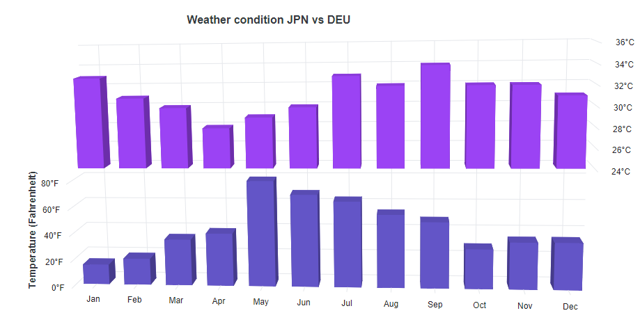
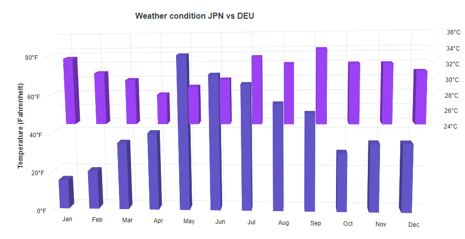
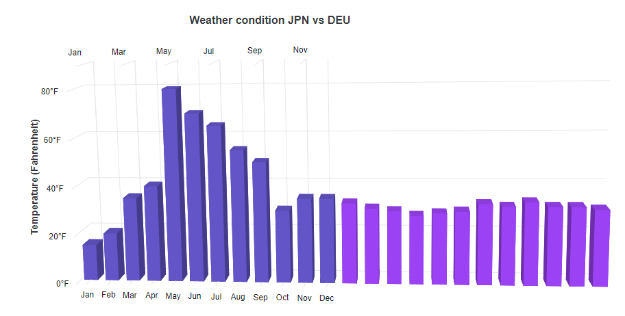
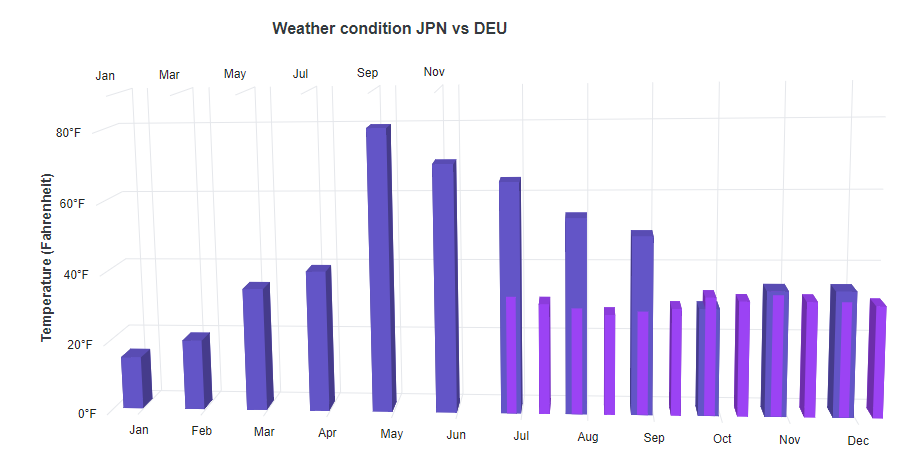

# Multiple Panes in Blazor 3D Chart Component

The chart area can be divided into multiple panes using the `Rows` and `Columns` properties.

## Rows

To split the chart area vertically into multiple rows, use the `Rows` property of the 3D chart.

* The space for each row is allocated using the `Height` property, which accepts values in percentage or pixels.
* To associate a vertical axis with a specific row, set its `RowIndex` property.

```cshtml

@using Syncfusion.Blazor.Chart3D

<SfChart3D Title="Weather condition JPN vs DEU" WallColor="transparent" EnableRotation="true" RotationAngle="7" TiltAngle="10" Depth="100">
    <Chart3DPrimaryXAxis ValueType="Syncfusion.Blazor.Chart3D.ValueType.Category" />
    <Chart3DPrimaryYAxis Title="Temperature (Fahrenheit)" LabelFormat="{value}°F" Minimum="0" Maximum="90" Interval="20" />
    <Chart3DRows>
        <Chart3DRow Height="50%" />
        <Chart3DRow Height="50%" />
    </Chart3DRows>
    <Chart3DAxes>
        <Chart3DAxis Minimum="24" Maximum="36" Interval="2" OpposedPosition="true" RowIndex="1" Name="YAxis" LabelFormat="{value}°C" />
    </Chart3DAxes>
    <Chart3DSeriesCollection>
        <Chart3DSeries DataSource="@WeatherReports" XName="X" YName="Y" Type="Chart3DSeriesType.Column" />
        <Chart3DSeries DataSource="@WeatherReports" XName="X" YName="Y1" YAxisName="YAxis" />
    </Chart3DSeriesCollection>
</SfChart3D>

@code {
    public class Chart3DData
    {
        public string X { get; set; }
        public double Y { get; set; }
        public double Y1 { get; set; }
    }

    public List<Chart3DData> WeatherReports = new List<Chart3DData>
    {
        new Chart3DData { X = "Jan", Y = 15, Y1 = 33 },
        new Chart3DData { X = "Feb", Y = 20, Y1 = 31 },
        new Chart3DData { X = "Mar", Y = 35, Y1 = 30 },
        new Chart3DData { X = "Apr", Y = 40, Y1 = 28 },
        new Chart3DData { X = "May", Y = 80, Y1 = 29 },
        new Chart3DData { X = "Jun", Y = 70, Y1 = 30 },
        new Chart3DData { X = "Jul", Y = 65, Y1 = 33 },
        new Chart3DData { X = "Aug", Y = 55, Y1 = 32 },
        new Chart3DData { X = "Sep", Y = 50, Y1 = 34 },
        new Chart3DData { X = "Oct", Y = 30, Y1 = 32 },
        new Chart3DData { X = "Nov", Y = 35, Y1 = 32 },
        new Chart3DData { X = "Dec", Y = 35, Y1 = 31 }
    };
}

```




To span a vertical axis across multiple rows, use the `Span` property of the axis.

```cshtml

@using Syncfusion.Blazor.Chart3D

<SfChart3D Title="Weather condition JPN vs DEU" WallColor="transparent" EnableRotation="true" RotationAngle="7" TiltAngle="10" Depth="100">
    <Chart3DPrimaryXAxis ValueType="Syncfusion.Blazor.Chart3D.ValueType.Category" />    
    <Chart3DPrimaryYAxis Span="2" Title="Temperature (Fahrenheit)" LabelFormat="{value}°F" Minimum="0" Maximum="90" Interval="20" />
    <Chart3DRows>
        <Chart3DRow Height="50%" />
        <Chart3DRow Height="50%" />
    </Chart3DRows>
    <Chart3DAxes>
        <Chart3DAxis Minimum="24" Maximum="36" Interval="2" OpposedPosition="true" RowIndex="1" Name="YAxis" LabelFormat="{value}°C" />
    </Chart3DAxes>
    <Chart3DSeriesCollection>
        <Chart3DSeries DataSource="@WeatherReports" XName="X" YName="Y" Type="Chart3DSeriesType.Column" />
        <Chart3DSeries DataSource="@WeatherReports" XName="X" YName="Y1" YAxisName="YAxis" />
    </Chart3DSeriesCollection>
</SfChart3D>

@code {
    public class Chart3DData
    {
        public string X { get; set; }
        public double Y { get; set; }
        public double Y1 { get; set; }
    }

    public List<Chart3DData> WeatherReports = new List<Chart3DData>
    {
        new Chart3DData { X = "Jan", Y = 15, Y1 = 33 },
        new Chart3DData { X = "Feb", Y = 20, Y1 = 31 },
        new Chart3DData { X = "Mar", Y = 35, Y1 = 30 },
        new Chart3DData { X = "Apr", Y = 40, Y1 = 28 },
        new Chart3DData { X = "May", Y = 80, Y1 = 29 },
        new Chart3DData { X = "Jun", Y = 70, Y1 = 30 },
        new Chart3DData { X = "Jul", Y = 65, Y1 = 33 },
        new Chart3DData { X = "Aug", Y = 55, Y1 = 32 },
        new Chart3DData { X = "Sep", Y = 50, Y1 = 34 },
        new Chart3DData { X = "Oct", Y = 30, Y1 = 32 },
        new Chart3DData { X = "Nov", Y = 35, Y1 = 32 },
        new Chart3DData { X = "Dec", Y = 35, Y1 = 31 }
    };
}


```




## Columns

To split the chart area horizontally into multiple columns, use the `Columns` property of the 3D chart.

* The space for each column is allocated using the `Width` property, which accepts values in percentage or pixels.
* To associate a horizontal axis with a specific column, set its `ColumnIndex` property.

```cshtml

@using Syncfusion.Blazor.Chart3D

<SfChart3D Title="Weather condition JPN vs DEU" WallColor="transparent" EnableRotation="true" RotationAngle="7" TiltAngle="10" Depth="100">
    <Chart3DPrimaryXAxis ValueType="Syncfusion.Blazor.Chart3D.ValueType.Category" />    
    <Chart3DPrimaryYAxis Title="Temperature (Fahrenheit)" LabelFormat="{value}°F" Minimum="0" Maximum="90" Interval="20" />
    <Chart3DColumns>
        <Chart3DColumn Width="50%" />
        <Chart3DColumn Width="50%" />
    </Chart3DColumns>
    <Chart3DAxes>
        <Chart3DAxis Interval="2" OpposedPosition="true" ColumnIndex="1" Name="XAxis" ValueType="Syncfusion.Blazor.Chart3D.ValueType.Category" />
    </Chart3DAxes>
    <Chart3DSeriesCollection>
        <Chart3DSeries DataSource="@WeatherReports" XName="X" YName="Y" Type="Chart3DSeriesType.Column" />
        <Chart3DSeries DataSource="@WeatherReports" XName="X" YName="Y1" XAxisName="XAxis" />       
    </Chart3DSeriesCollection>
</SfChart3D>

@code {
    public class Chart3DData
    {
        public string X { get; set; }
        public double Y { get; set; }
        public double Y1 { get; set; }
    }

    public List<Chart3DData> WeatherReports = new List<Chart3DData>
    {
        new Chart3DData { X = "Jan", Y = 15, Y1 = 33 },
        new Chart3DData { X = "Feb", Y = 20, Y1 = 31 },
        new Chart3DData { X = "Mar", Y = 35, Y1 = 30 },
        new Chart3DData { X = "Apr", Y = 40, Y1 = 28 },
        new Chart3DData { X = "May", Y = 80, Y1 = 29 },
        new Chart3DData { X = "Jun", Y = 70, Y1 = 30 },
        new Chart3DData { X = "Jul", Y = 65, Y1 = 33 },
        new Chart3DData { X = "Aug", Y = 55, Y1 = 32 },
        new Chart3DData { X = "Sep", Y = 50, Y1 = 34 },
        new Chart3DData { X = "Oct", Y = 30, Y1 = 32 },
        new Chart3DData { X = "Nov", Y = 35, Y1 = 32 },
        new Chart3DData { X = "Dec", Y = 35, Y1 = 31 }
    };
}

```




The `Span` property of the axis can be used to span a horizontal axis across multiple columns.

```cshtml

@using Syncfusion.Blazor.Chart3D

<SfChart3D Title="Weather condition JPN vs DEU" WallColor="transparent" EnableRotation="true" RotationAngle="7" TiltAngle="10" Depth="100">
   <Chart3DPrimaryXAxis Span="2" ValueType="Syncfusion.Blazor.Chart3D.ValueType.Category" />    
   <Chart3DPrimaryYAxis Title="Temperature (Fahrenheit)" LabelFormat="{value}°F" Minimum="0" Maximum="90" Interval="20" />
   <Chart3DColumns>
        <Chart3DColumn Width="50%" />
        <Chart3DColumn Width="50%" />
    </Chart3DColumns>
    <Chart3DAxes>
        <Chart3DAxis Interval="2" OpposedPosition="true" ColumnIndex="1" Name="XAxis" ValueType="Syncfusion.Blazor.Chart3D.ValueType.Category" />
    </Chart3DAxes>
    <Chart3DSeriesCollection>
        <Chart3DSeries DataSource="@WeatherReports" XName="X" YName="Y" Type="Chart3DSeriesType.Column" />
        <Chart3DSeries DataSource="@WeatherReports" XName="X" YName="Y1" XAxisName="XAxis" />       
    </Chart3DSeriesCollection>
</SfChart3D>

@code {
    public class Chart3DData
    {
        public string X { get; set; }
        public double Y { get; set; }
        public double Y1 { get; set; }
    }

    public List<Chart3DData> WeatherReports = new List<Chart3DData>
    {
        new Chart3DData { X = "Jan", Y = 15, Y1 = 33 },
        new Chart3DData { X = "Feb", Y = 20, Y1 = 31 },
        new Chart3DData { X = "Mar", Y = 35, Y1 = 30 },
        new Chart3DData { X = "Apr", Y = 40, Y1 = 28 },
        new Chart3DData { X = "May", Y = 80, Y1 = 29 },
        new Chart3DData { X = "Jun", Y = 70, Y1 = 30 },
        new Chart3DData { X = "Jul", Y = 65, Y1 = 33 },
        new Chart3DData { X = "Aug", Y = 55, Y1 = 32 },
        new Chart3DData { X = "Sep", Y = 50, Y1 = 34 },
        new Chart3DData { X = "Oct", Y = 30, Y1 = 32 },
        new Chart3DData { X = "Nov", Y = 35, Y1 = 32 },
        new Chart3DData { X = "Dec", Y = 35, Y1 = 31 }
    };
}

```



