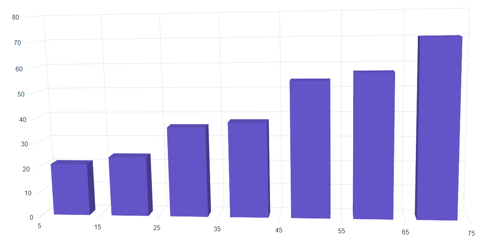
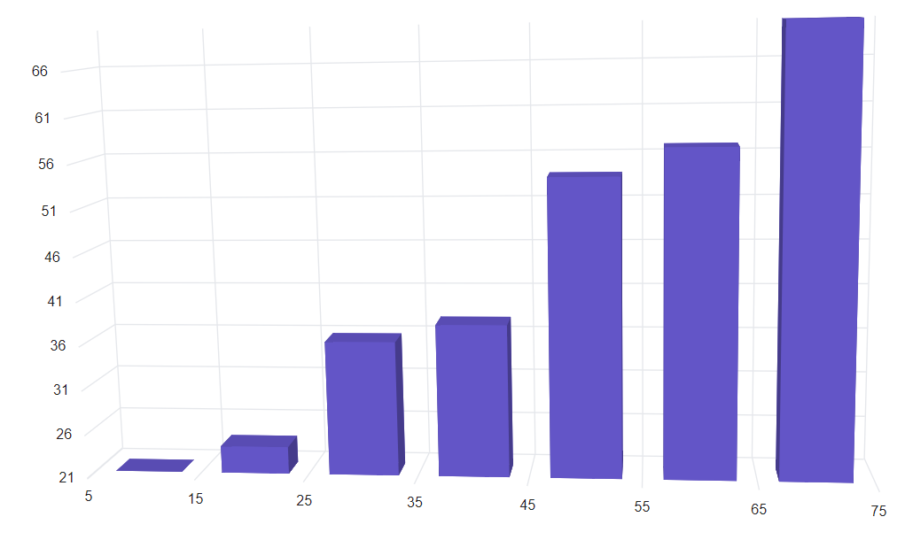
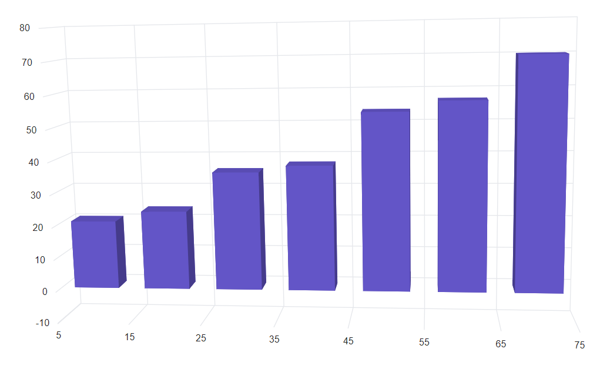
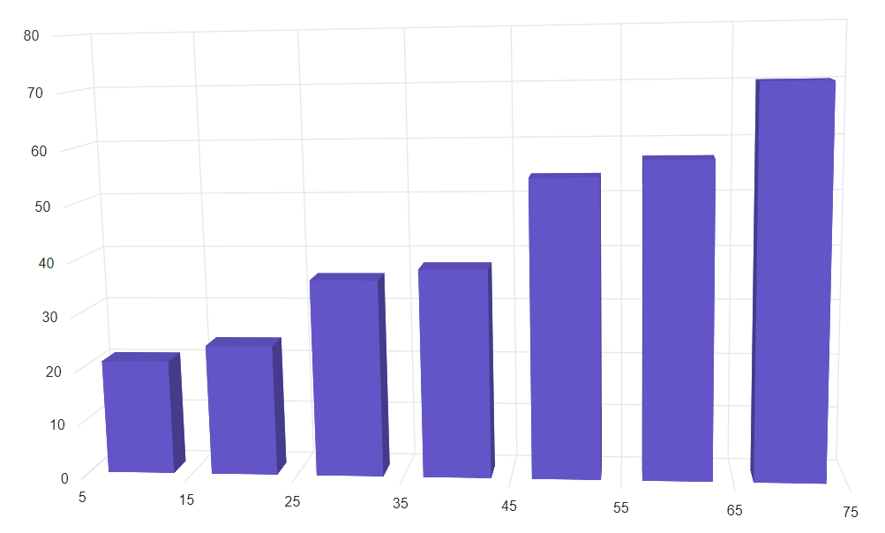
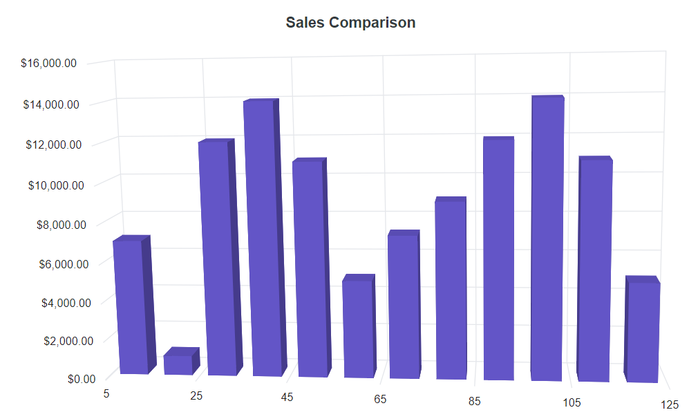

<!-- markdownlint-disable MD036 -->

# Numeric Axis in Blazor 3D Chart Component

The [numeric axis](https://www.syncfusion.com/javascript-ui-controls/js-charts/chart-axis) can be used to represent the numeric values of data in 3D chart. By default, the [ValueType](https://help.syncfusion.com/cr/blazor/Syncfusion.Blazor.Charts.ChartAxis html#Syncfusion_Blazor_Charts_ChartAxis_ValueType) of an axis is [Double](https://help.syncfusion.com/cr/blazor/Syncfusion.Blazor.Charts.ValueType.html#Syncfusion_Blazor_Charts_ValueType_Double).

```cshtml

@using Syncfusion.Blazor.Chart3D

<SfChart3D>
    <Chart3DSeriesCollection>
        <Chart3DSeries DataSource="@Data" XName="XValue" YName="YValue">
        </Chart3DSeries>
    </Chart3DSeriesCollection>
</SfChart3D>

@code{
    public class Chart3DData
    {
        public double XValue { get; set; }
        public double YValue { get; set; }
    }

    public List<Chart3DData> Data = new List<Chart3DData>
	{
		new Chart3DData { XValue = 10, YValue = 21 },
		new Chart3DData { XValue = 20, YValue = 24 },
		new Chart3DData { XValue = 30, YValue = 36 },
		new Chart3DData { XValue = 40, YValue = 38 },
		new Chart3DData { XValue = 50, YValue = 54 },
		new Chart3DData { XValue = 60, YValue = 57 },
		new Chart3DData { XValue = 70, YValue = 70 },
	};
}

```



## Range and interval

The range of an axis will be calculated automatically based on the provided data, and it can also be customized by using the [Minimum](https://help.syncfusion.com/cr/blazor/Syncfusion.Blazor.Charts.ChartAxis.html#Syncfusion_Blazor_Charts_ChartAxis_Minimum), [Maximum](https://help.syncfusion.com/cr/blazor/Syncfusion.Blazor.Charts.ChartAxis.html#Syncfusion_Blazor_Charts_ChartAxis_Maximum), and [Interval](https://help.syncfusion.com/cr/blazor/Syncfusion.Blazor.Charts.ChartAxis.html#Syncfusion_Blazor_Charts_ChartAxis_Interval) properties of the axis.

```cshtml

@using Syncfusion.Blazor.Chart3D

<SfChart3D>
    <Chart3DPrimaryXAxis Minimum="5" Maximum="50" Interval="2"/>

    <Chart3DSeriesCollection>
        <Chart3DSeries DataSource="@Data" XName="XValue" YName="YValue"/>
    </Chart3DSeriesCollection>
</SfChart3D>

@code{
    public class Chart3DData
    {
        public double XValue { get; set; }
        public double YValue { get; set; }
    }

    public List<Chart3DData> Data = new List<Chart3DData>
	{
		new Chart3DData { XValue = 10, YValue = 21 },
		new Chart3DData { XValue = 20, YValue = 24 },
		new Chart3DData { XValue = 30, YValue = 36 },
		new Chart3DData { XValue = 40, YValue = 38 },
		new Chart3DData { XValue = 50, YValue = 54 },
		new Chart3DData { XValue = 60, YValue = 57 },
		new Chart3DData { XValue = 70, YValue = 70 },
	};
}

```




## Range padding

Padding can be applied to the minimum and maximum extremes of an axis range by using the [RangePadding](https://help.syncfusion.com/cr/blazor/Syncfusion.Blazor.Charts.ChartAxis.html#Syncfusion_Blazor_Charts_ChartAxis_RangePadding) property. Numeric axis supports the following types of padding.
The following types of padding are supported by the numeric axis:

* None
* Round
* Additional
* Normal
* Auto

**Numeric - None**

When the [RangePadding](https://help.syncfusion.com/cr/blazor/Syncfusion.Blazor.Charts.ChartAxis.html#Syncfusion_Blazor_Charts_ChartAxis_RangePadding) is set to **None**, the minimum and maximum of an axis is based on the data.

```cshtml

@using Syncfusion.Blazor.Chart3D

<SfChart3D>
    <Chart3DPrimaryYAxis RangePadding="Syncfusion.Blazor.Charts.ChartRangePadding.None"/>

    <Chart3DSeriesCollection>
        <Chart3DSeries DataSource="@Data" XName="XValue" YName="YValue"/>
    </Chart3DSeriesCollection>
</SfChart3D>

@code{
    public class Chart3DData
    {
        public double XValue { get; set; }
        public double YValue { get; set; }
    }

    public List<Chart3DData> Data = new List<Chart3DData>
	{
		new Chart3DData { XValue = 10, YValue = 21 },
		new Chart3DData { XValue = 20, YValue = 24 },
		new Chart3DData { XValue = 30, YValue = 36 },
		new Chart3DData { XValue = 40, YValue = 38 },
		new Chart3DData { XValue = 50, YValue = 54 },
		new Chart3DData { XValue = 60, YValue = 57 },
		new Chart3DData { XValue = 70, YValue = 70 },
	};
}

```




**Numeric - Round**

When the [RangePadding](https://help.syncfusion.com/cr/blazor/Syncfusion.Blazor.Charts.ChartAxis.html#Syncfusion_Blazor_Charts_ChartAxis_RangePadding) is set to **Round**, the minimum and maximum will be rounded to the nearest possible value divisible by interval. For example, when the minimum is 3.5 and the interval is 1, then the minimum will be rounded to 3.

```cshtml

@using Syncfusion.Blazor.Chart3D

<SfChart3D>
    <Chart3DPrimaryYAxis RangePadding="Syncfusion.Blazor.Charts.ChartRangePadding.Round"/>

    <Chart3DSeriesCollection>
        <Chart3DSeries DataSource="@Data" XName="XValue" YName="YValue"/>
    </Chart3DSeriesCollection>
</SfChart3D>

@code{
    public class Chart3DData
    {
        public double XValue { get; set; }
        public double YValue { get; set; }
    }

    public List<Chart3DData> Data = new List<Chart3DData>
	{
		new Chart3DData { XValue = 10, YValue = 21 },
		new Chart3DData { XValue = 20, YValue = 24 },
		new Chart3DData { XValue = 30, YValue = 36 },
		new Chart3DData { XValue = 40, YValue = 38 },
		new Chart3DData { XValue = 50, YValue = 54 },
		new Chart3DData { XValue = 60, YValue = 57 },
		new Chart3DData { XValue = 70, YValue = 70 },
	};
}

```



**Numeric - Additional**

When the [RangePadding](https://help.syncfusion.com/cr/blazor/Syncfusion.Blazor.Charts.ChartAxis.html#Syncfusion_Blazor_Charts_ChartAxis_RangePadding) is set to **Additional**, interval of an axis will be padded to the minimum and maximum of the axis.

```cshtml

@using Syncfusion.Blazor.Chart3D

<SfChart3D>
    <Chart3DPrimaryYAxis RangePadding="Syncfusion.Blazor.Charts.ChartRangePadding.Additional"/>

    <Chart3DSeriesCollection>
        <Chart3DSeries DataSource="@Data" XName="XValue" YName="YValue"/>
    </Chart3DSeriesCollection>
</SfChart3D>

@code{
    public class Chart3DData
    {
        public double XValue { get; set; }
        public double YValue { get; set; }
    }

    public List<Chart3DData> Data = new List<Chart3DData>
	{
		new Chart3DData { XValue = 10, YValue = 21 },
		new Chart3DData { XValue = 20, YValue = 24 },
		new Chart3DData { XValue = 30, YValue = 36 },
		new Chart3DData { XValue = 40, YValue = 38 },
		new Chart3DData { XValue = 50, YValue = 54 },
		new Chart3DData { XValue = 60, YValue = 57 },
		new Chart3DData { XValue = 70, YValue = 70 },
	};
}

```




**Numeric - Normal**

When the [RangePadding](https://help.syncfusion.com/cr/blazor/Syncfusion.Blazor.Charts.ChartAxis.html#Syncfusion_Blazor_Charts_ChartAxis_RangePadding) is set to **Normal**, padding is applied to the axis based on default range calculation.

```cshtml

@using Syncfusion.Blazor.Chart3D

<SfChart3D>
    <Chart3DPrimaryYAxis RangePadding="Syncfusion.Blazor.Charts.ChartRangePadding.Normal"/>

    <Chart3DSeriesCollection>
        <Chart3DSeries DataSource="@Data" XName="XValue" YName="YValue"/>
    </Chart3DSeriesCollection>
</SfChart3D>

@code{
    public class Chart3DData
    {
        public double XValue { get; set; }
        public double YValue { get; set; }
    }

    public List<Chart3DData> Data = new List<Chart3DData>
	{
		new Chart3DData { XValue = 10, YValue = 21 },
		new Chart3DData { XValue = 20, YValue = 24 },
		new Chart3DData { XValue = 30, YValue = 36 },
		new Chart3DData { XValue = 40, YValue = 38 },
		new Chart3DData { XValue = 50, YValue = 54 },
		new Chart3DData { XValue = 60, YValue = 57 },
		new Chart3DData { XValue = 70, YValue = 70 },
	};
}

```



**Numeric - Auto**

When the [RangePadding](https://help.syncfusion.com/cr/blazor/Syncfusion.Blazor.Charts.ChartAxis.html#Syncfusion_Blazor_Charts_ChartAxis_RangePadding) is set to **Auto**, horizontal numeric axis takes **None** as padding calculation, while the vertical numeric axis takes **Normal** as padding calculation.

```cshtml

@using Syncfusion.Blazor.Chart3D

<SfChart3D>
    <Chart3DPrimaryYAxis RangePadding="Syncfusion.Blazor.Charts.ChartRangePadding.Auto"/>
    <Chart3DPrimaryXAxis RangePadding="Syncfusion.Blazor.Charts.ChartRangePadding.Auto"/>

    <Chart3DSeriesCollection>
        <Chart3DSeries DataSource="@Data" XName="XValue" YName="YValue"/>
    </Chart3DSeriesCollection>
</SfChart3D>

@code{
    public class Chart3DData
    {
        public double XValue { get; set; }
        public double YValue { get; set; }
    }

    public List<Chart3DData> Data = new List<Chart3DData>
	{
		new Chart3DData { XValue = 10, YValue = 21 },
		new Chart3DData { XValue = 20, YValue = 24 },
		new Chart3DData { XValue = 30, YValue = 36 },
		new Chart3DData { XValue = 40, YValue = 38 },
		new Chart3DData { XValue = 50, YValue = 54 },
		new Chart3DData { XValue = 60, YValue = 57 },
		new Chart3DData { XValue = 70, YValue = 70 },
	};
}

```




## Label format

**Numeric label format**

Numeric labels can be formatted by using the [LabelFormat](https://help.syncfusion.com/cr/blazor/Syncfusion.Blazor.Charts.ChartAxis.html#Syncfusion_Blazor_Charts_ChartAxis_LabelFormat) property. Also, it supports all globalize format.

```cshtml

@using Syncfusion.Blazor.Chart3D

<SfChart3D Title="Sales Comparison">
    <Chart3DPrimaryYAxis LabelFormat="c"/>    

    <Chart3DSeriesCollection>
        <Chart3DSeries DataSource="@Data" XName="X" YName="Y" Type="Chart3DSeriesType.Column"/>
    </Chart3DSeriesCollection>
</SfChart3D>

@code{
    public class Chart3DData
    {
        public double X { get; set; }
        public double Y { get; set; }
    }

    public List<Chart3DData> Data = new List<Chart3DData>
	{
          new Chart3DData{ X= 10, Y=7000 },
          new Chart3DData{ X= 20, Y= 1000 },
          new Chart3DData{ X= 30, Y= 12000 },
          new Chart3DData{ X= 40, Y= 14000 },
          new Chart3DData{ X= 50, Y= 11000 },
          new Chart3DData{ X= 60, Y= 5000 },
          new Chart3DData{ X= 70, Y= 7300 },
          new Chart3DData{ X= 80, Y= 9000 },
          new Chart3DData{ X= 90, Y= 12000 },
          new Chart3DData{ X= 100, Y= 14000 },
          new Chart3DData{ X= 110, Y= 11000 },
          new Chart3DData{ X= 120, Y= 5000 }
    };
}

```




The table below shows the results of applying various commonly used label formats to numeric data.

<!-- markdownlint-disable MD033 -->

<table>
<tr>
<td><b>Label Value</b></td>
<td><b>Label Format property value</b></td>
<td><b>Result </b></td>
<td><b>Description </b></td>
</tr>
<tr>
<td>1000</td>
<td>n1</td>
<td>1000.0</td>
<td>The number is rounded to 1 decimal place.</td>
</tr>
<tr>
<td>1000</td>
<td>n2</td>
<td>1000.00</td>
<td>The number is rounded to 2 decimal places.</td>
</tr>
<tr>
<td>1000</td>
<td>n3</td>
<td>1000.000</td>
<td>The number is rounded to 3 decimal places.</td>
</tr>
<tr>
<td>0.01</td>
<td>p1</td>
<td>1.0%</td>
<td>The number is converted to percentage with 1 decimal place.</td>
</tr>
<tr>
<td>0.01</td>
<td>p2</td>
<td>1.00%</td>
<td>The number is converted to percentage with 2 decimal places.</td>
</tr>
<tr>
<td>0.01</td>
<td>p3</td>
<td>1.000%</td>
<td>The number is converted to percentage with 3 decimal places.</td>
</tr>
<tr>
<td>1000</td>
<td>c1</td>
<td>$1000.0</td>
<td>The currency symbol is appended to number and number is rounded to 1 decimal place.</td>
</tr>
<tr>
<td>1000</td>
<td>c2</td>
<td>$1000.00</td>
<td>The currency symbol is appended to number and number is rounded to 2 decimal places.</td>
</tr>
</table>

## GroupingSeparator

To separate groups of thousands for numerical values, use the [UseGroupingSeparator](https://help.syncfusion.com/cr/blazor/Syncfusion.Blazor.Charts.SfChart.html#Syncfusion_Blazor_Charts_SfChart_UseGroupingSeparator) property set to true in the 3D chart to enable it. When this property is enabled, axis labels, data labels, and tooltips will display with a thousand separator.

```cshtml

@using Syncfusion.Blazor.Charts

<SfChart UseGroupingSeparator="true">
    <ChartArea><ChartAreaBorder Width="0" /></ChartArea>
    <ChartPrimaryXAxis ValueType="Syncfusion.Blazor.Charts.ValueType.DateTimeCategory" LabelFormat="MMM yyyy" IntervalType="Syncfusion.Blazor.Charts.IntervalType.Months" EdgeLabelPlacement="EdgeLabelPlacement.Shift">
        <ChartAxisMajorGridLines Width="0" />
    </ChartPrimaryXAxis>
    <ChartPrimaryYAxis>
        <ChartAxisLineStyle Width="0" />
        <ChartAxisMajorTickLines Width="0" />
    </ChartPrimaryYAxis>
    <ChartTooltipSettings Enable="true" />
    <ChartSeriesCollection>
        <ChartSeries DataSource="@Data" Name="Test" XName="PrdDate" Width="2" YName="Amount" Type="Syncfusion.Blazor.Charts.ChartSeriesType.Line">
            <ChartMarker Visible="true">
                <ChartDataLabel Visible="true" />
            </ChartMarker>
        </ChartSeries>
    </ChartSeriesCollection>
</SfChart>

@code {
    public class ChartData
    {
        public DateTime PrdDate { get; set; }
        public double Amount { get; set; }
    }
    public List<ChartData> Data = new List<ChartData>
    {
        new ChartData { PrdDate = new DateTime(2021,01,01), Amount = 1000 },
        new ChartData { PrdDate = new DateTime(2021,02,01), Amount = 4000 },
        new ChartData { PrdDate = new DateTime(2021,03,01), Amount = 5000 },
        new ChartData { PrdDate = new DateTime(2021,04,01), Amount = 6000 },
        new ChartData { PrdDate = new DateTime(2021,05,01), Amount = 2000 },
        new ChartData { PrdDate = new DateTime(2021,06,01), Amount = 3000 },
        new ChartData { PrdDate = new DateTime(2021,07,01), Amount = 8000 },
    };
}

```




## Custom label format

Axis also supports custom label format using placeholders such as {value}K, where the value represents the axis label, for example, 20K.

```cshtml

@using Syncfusion.Blazor.Chart3D

<SfChart3D UseGroupingSeparator="true">
    <Chart3DArea><Chart3DAreaBorder Width="0" /></Chart3DArea>
    <Chart3DPrimaryXAxis ValueType="Syncfusion.Blazor.Charts.ValueType.DateTimeCategory" LabelFormat="MMM yyyy" IntervalType="Syncfusion.Blazor.Charts.IntervalType.Months" EdgeLabelPlacement="Syncfusion.Blazor.Charts.EdgeLabelPlacement.Shift">
        <Chart3DAxisMajorGridLines Width="0" />
    </Chart3DPrimaryXAxis>
    <Chart3DPrimaryYAxis>
        <Chart3DAxisLineStyle Width="0" />
        <Chart3DAxisMajorTickLines Width="0" />
    </Chart3DPrimaryYAxis>
    <Chart3DTooltipSettings Enable="true" />
    <Chart3DSeriesCollection>
        <Chart3DSeries DataSource="@Data" Name="Test" XName="PrdDate" YName="Amount">
                <Chart3DDataLabel Visible="true" />
        </Chart3DSeries>
    </Chart3DSeriesCollection>
</SfChart3D>

@code {
    public class Chart3DData
    {
        public DateTime PrdDate { get; set; }
        public double Amount { get; set; }
    }
    public List<Chart3DData> Data = new List<Chart3DData>
    {
        new Chart3DData { PrdDate = new DateTime(2021,01,01), Amount = 1000 },
        new Chart3DData { PrdDate = new DateTime(2021,02,01), Amount = 4000 },
        new Chart3DData { PrdDate = new DateTime(2021,03,01), Amount = 5000 },
        new Chart3DData { PrdDate = new DateTime(2021,04,01), Amount = 6000 },
        new Chart3DData { PrdDate = new DateTime(2021,05,01), Amount = 2000 },
        new Chart3DData { PrdDate = new DateTime(2021,06,01), Amount = 3000 },
        new Chart3DData { PrdDate = new DateTime(2021,07,01), Amount = 8000 },
    };
}

```



N> Refer to our [Blazor Chart 3D](https://www.syncfusion.com/blazor-components/blazor-charts) feature tour page for its groundbreaking feature representations and also explore our [Blazor 3D Chart Example](https://blazor.syncfusion.com/demos/chart/line?theme=bootstrap4) to know various 3D Chart types and how to represent time-dependent data, showing trends at equal intervals.

## See also

* [Data label](./data-labels)
* [Tooltip](./tool-tip)