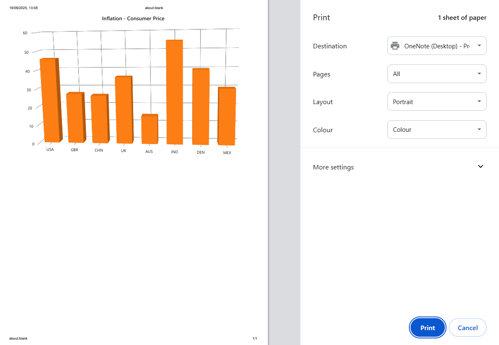
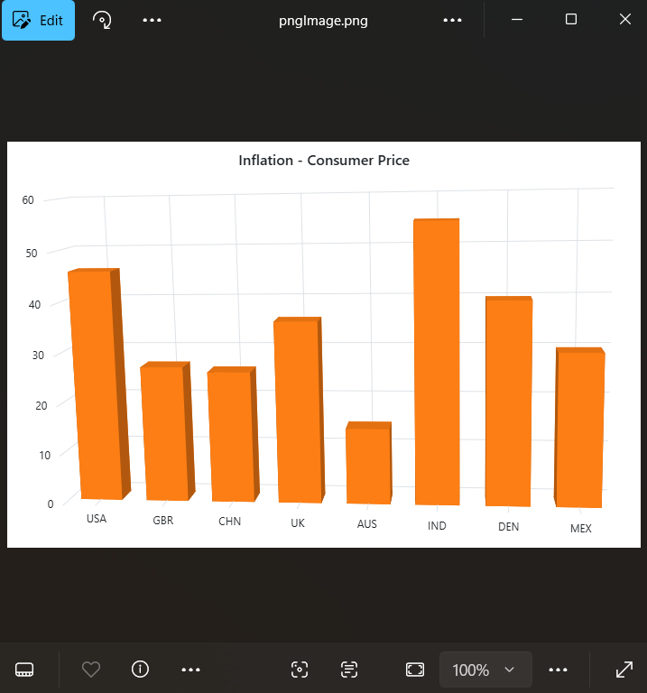

# Print and Export in Blazor 3D Chart Component

## Print

The rendered 3D chart can be printed directly from the browser by calling the public method `PrintAsync`. The ID of the 3D chart's div element must be passed as the input parameter to that method.

```cshtml

@using Syncfusion.Blazor.Chart3D
@using Syncfusion.Blazor.Buttons

<SfChart3D @ref="Chart3DObj" Title="Inflation - Consumer Price" WallColor="transparent" EnableRotation="true" RotationAngle="7" TiltAngle="10" Depth="100">
    <Chart3DPrimaryXAxis ValueType="Syncfusion.Blazor.Chart3D.ValueType.Category"></Chart3DPrimaryXAxis>

    <Chart3DSeriesCollection>
        <Chart3DSeries DataSource="@ConsumerDetails" XName="X" YName="YValue" Type="Chart3DSeriesType.Column">
        </Chart3DSeries>
    </Chart3DSeriesCollection>
</SfChart3D>

<SfButton Id="button" Content="Print" @onclick="Print"  IsPrimary="true" CssClass="e-flat"></SfButton>

@code{

    SfChart3D Chart3DObj;

    private async Task Print(Microsoft.AspNetCore.Components.Web.MouseEventArgs args)
    {
        await Chart3DObj.PrintAsync();
    }

    public class Chart3DData
    {
        public string X { get; set; }
        public double YValue { get; set; }
    }

    public List<Chart3DData> ConsumerDetails = new List<Chart3DData>
	{
        new Chart3DData { X = "USA", YValue = 46 },
        new Chart3DData { X = "GBR", YValue = 27 },
        new Chart3DData { X = "CHN", YValue = 26 },
        new Chart3DData { X = "UK", YValue = 36 },
        new Chart3DData { X = "AUS", YValue = 15 },
        new Chart3DData { X = "IND", YValue = 55 },
        new Chart3DData { X = "DEN", YValue = 40 },
        new Chart3DData { X = "MEX", YValue = 30 }
    };
}

```



## Export

The rendered 3D chart can be exported to `JPEG`, `PNG`, `SVG`, or `PDF` format using the `ExportAsync` method. The input parameters for this method are: `type` for format and `fileName` for result.

```cshtml

@using Syncfusion.Blazor.Chart3D
@using Syncfusion.Blazor.Buttons

<SfChart3D @ref="Chart3DObj" Title="Inflation - Consumer Price" WallColor="transparent" EnableRotation="true" RotationAngle="7" TiltAngle="10" Depth="100">
    <Chart3DPrimaryXAxis ValueType="Syncfusion.Blazor.Chart3D.ValueType.Category"></Chart3DPrimaryXAxis>

    <Chart3DSeriesCollection>
        <Chart3DSeries DataSource="@ConsumerDetails" XName="X" YName="YValue" Type="Chart3DSeriesType.Column">
        </Chart3DSeries>
    </Chart3DSeriesCollection>
</SfChart3D>

<SfButton Id="button" Content="Export" @onclick="Export"  IsPrimary="true" CssClass="e-flat"></SfButton>

@code{

    SfChart3D Chart3DObj;

    private async Task Export(Microsoft.AspNetCore.Components.Web.MouseEventArgs args)
    {
        await Chart3DObj.ExportAsync(Syncfusion.Blazor.Chart3D.ExportType.PNG, "pngImage");
    }

    public class Chart3DData
    {
        public string X { get; set; }
        public double YValue { get; set; }
    }

    public List<Chart3DData> ConsumerDetails = new List<Chart3DData>
    {
        new Chart3DData { X = "USA", YValue = 46 },
        new Chart3DData { X = "GBR", YValue = 27 },
        new Chart3DData { X = "CHN", YValue = 26 },
        new Chart3DData { X = "UK", YValue = 36 },
        new Chart3DData { X = "AUS", YValue = 15 },
        new Chart3DData { X = "IND", YValue = 55 },
        new Chart3DData { X = "DEN", YValue = 40 },
        new Chart3DData { X = "MEX", YValue = 30 }
    };
}

```


