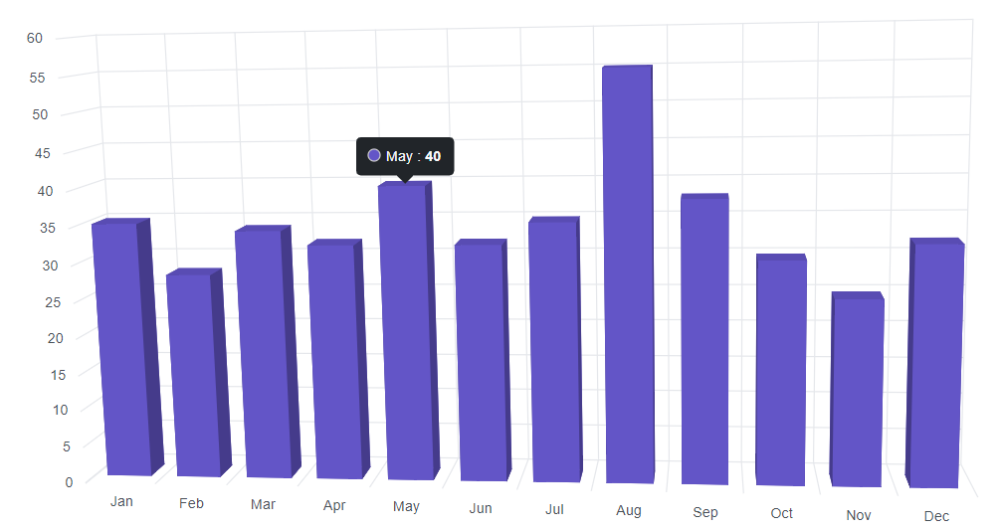
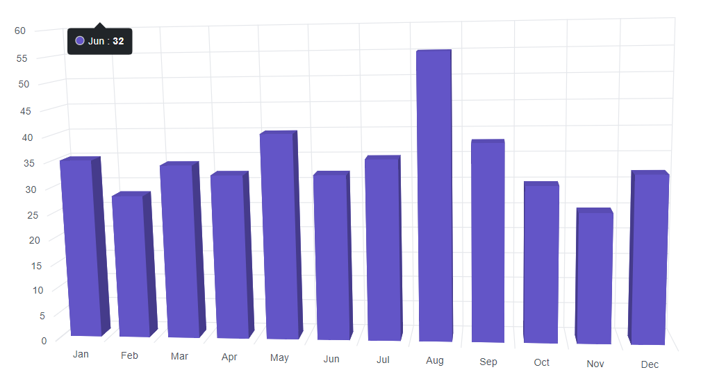
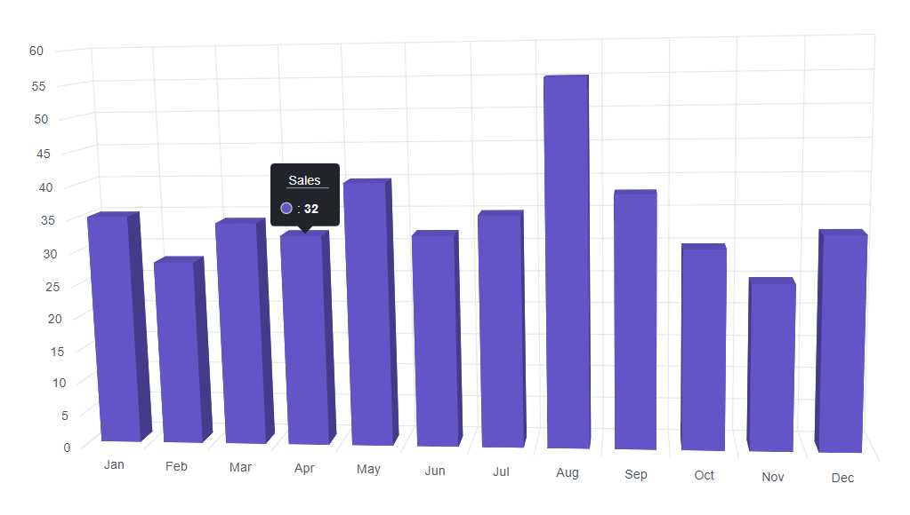
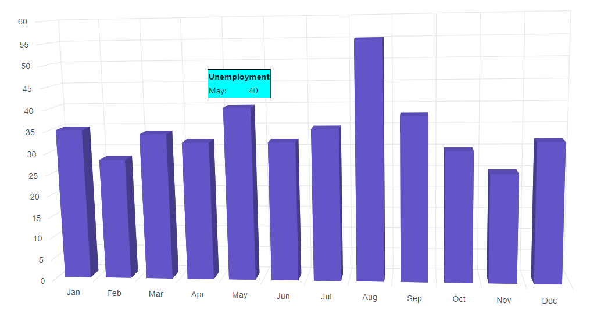
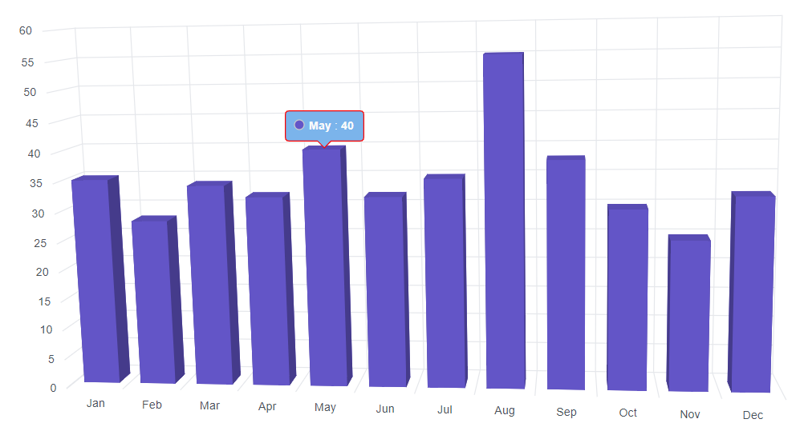

# Tooltip in Blazor 3D Chart Component

<!-- markdownlint-disable MD036 -->

The 3D Chart will display details about the points through tooltip, when the mouse is moved over the specific point.

## Defauls tooltip

By default, tooltip is not visible. The tooltip can be enabled by setting the [Enable](https://help.syncfusion.com/cr/blazor/Syncfusion.Blazor.Charts.ChartTooltipSettings.html#Syncfusion_Blazor_Charts_ChartTooltipSettings_Enable) property in [Chart3DTooltipSettings](https://help.syncfusion.com/cr/blazor/Syncfusion.Blazor.Charts.ChartTooltipSettings.html) to **true**.

```cshtml

@using Syncfusion.Blazor.Chart3D

<SfChart3D WallColor="transparent" EnableRotation="true" RotationAngle="7" TiltAngle="10" Depth="100">
    <Chart3DPrimaryXAxis ValueType="Syncfusion.Blazor.Charts.ValueType.Category"
        LabelPlacement="Syncfusion.Blazor.Charts.LabelPlacement.BetweenTicks" />
    <Chart3DTooltipSettings Enable="true"></Chart3DTooltipSettings>
    <Chart3DSeriesCollection>
        <Chart3DSeries DataSource="@SalesReports" XName="Month" YName="Sales" Type="Chart3DSeriesType.Column" />
    </Chart3DSeriesCollection>
</SfChart3D>

@code{
    public class Chart3DData
    {
        public string Month { get; set; }
        public double Sales { get; set; }
    }
	
    public List<Chart3DData> SalesReports = new List<Chart3DData>
    {
        new Chart3DData { Month = "Jan", Sales = 35 },
        new Chart3DData { Month = "Feb", Sales = 28 },
        new Chart3DData { Month = "Mar", Sales = 34 },
        new Chart3DData { Month = "Apr", Sales = 32 },
        new Chart3DData { Month = "May", Sales = 40 },
        new Chart3DData { Month = "Jun", Sales = 32 },
        new Chart3DData { Month = "Jul", Sales = 35 },
        new Chart3DData { Month = "Aug", Sales = 55 },
        new Chart3DData { Month = "Sep", Sales = 38 },
        new Chart3DData { Month = "Oct", Sales = 30 },
        new Chart3DData { Month = "Nov", Sales = 25 },
        new Chart3DData { Month = "Dec", Sales = 32 }
    };
}

```



## Fixed tooltip

By default, tooltip track the mouse movement, but the tooltip can be set in fixed position by using the `Location` property.

```cshtml

@using Syncfusion.Blazor.Chart3D

<SfChart3D WallColor="transparent" EnableRotation="true" RotationAngle="7" TiltAngle="10" Depth="100">
    <Chart3DPrimaryXAxis ValueType="Syncfusion.Blazor.Charts.ValueType.Category"
        LabelPlacement="Syncfusion.Blazor.Charts.LabelPlacement.BetweenTicks" />
    <Chart3DTooltipSettings Enable="true">
        <Chart3DTooltipLocation X="120" Y="20"></Chart3DTooltipLocation>
    </Chart3DTooltipSettings>
    <Chart3DSeriesCollection>
        <Chart3DSeries DataSource="@SalesReports" XName="Month" YName="Sales" Type="Chart3DSeriesType.Column" />
    </Chart3DSeriesCollection>
</SfChart3D>

@code{
    public class Chart3DData
    {
        public string Month { get; set; }
        public double Sales { get; set; }
    }
	
    public List<Chart3DData> SalesReports = new List<Chart3DData>
    {
        new Chart3DData { Month = "Jan", Sales = 35 },
        new Chart3DData { Month = "Feb", Sales = 28 },
        new Chart3DData { Month = "Mar", Sales = 34 },
        new Chart3DData { Month = "Apr", Sales = 32 },
        new Chart3DData { Month = "May", Sales = 40 },
        new Chart3DData { Month = "Jun", Sales = 32 },
        new Chart3DData { Month = "Jul", Sales = 35 },
        new Chart3DData { Month = "Aug", Sales = 55 },
        new Chart3DData { Month = "Sep", Sales = 38 },
        new Chart3DData { Month = "Oct", Sales = 30 },
        new Chart3DData { Month = "Nov", Sales = 25 },
        new Chart3DData { Month = "Dec", Sales = 32 }
    };
}

```



## Format the tooltip

<!-- markdownlint-disable MD013 -->

By default, tooltip shows information of x and y value in points. In addition to that, more information can be shown in tooltip by using the `Format` property. For example the format `${series.name} : ${point.y}` shows series name and point y value.

```cshtml

@using Syncfusion.Blazor.Chart3D

<SfChart3D WallColor="transparent" EnableRotation="true" RotationAngle="7" TiltAngle="10" Depth="100">
    <Chart3DPrimaryXAxis ValueType="Syncfusion.Blazor.Charts.ValueType.Category"
        LabelPlacement="Syncfusion.Blazor.Charts.LabelPlacement.BetweenTicks" />
    <Chart3DTooltipSettings Enable="true" Header="Sales" Format="<b>${series.name} : ${point.y}</b>">
    </Chart3DTooltipSettings>
    <Chart3DSeriesCollection>
        <Chart3DSeries DataSource="@SalesReports" XName="Month" YName="Sales" Type="Chart3DSeriesType.Column" />
    </Chart3DSeriesCollection>
</SfChart3D>

@code{
    public class Chart3DData
    {
        public string Month { get; set; }
        public double Sales { get; set; }
    }
	
    public List<Chart3DData> SalesReports = new List<Chart3DData>
    {
        new Chart3DData { Month = "Jan", Sales = 35 },
        new Chart3DData { Month = "Feb", Sales = 28 },
        new Chart3DData { Month = "Mar", Sales = 34 },
        new Chart3DData { Month = "Apr", Sales = 32 },
        new Chart3DData { Month = "May", Sales = 40 },
        new Chart3DData { Month = "Jun", Sales = 32 },
        new Chart3DData { Month = "Jul", Sales = 35 },
        new Chart3DData { Month = "Aug", Sales = 55 },
        new Chart3DData { Month = "Sep", Sales = 38 },
        new Chart3DData { Month = "Oct", Sales = 30 },
        new Chart3DData { Month = "Nov", Sales = 25 },
        new Chart3DData { Month = "Dec", Sales = 32 }
    };
}

```



<!-- markdownlint-disable MD013 -->

## Tooltip template

Any HTML elements can be displayed within the tooltip by using the [Template](https://help.syncfusion.com/cr/blazor/Syncfusion.Blazor.Charts.ChartTooltipSettings.html#Syncfusion_Blazor_Charts_ChartTooltipSettings_Template) property of the [Chart3DTooltipSettings](https://help.syncfusion.com/cr/blazor/Syncfusion.Blazor.Charts.ChartTooltipSettings.html). You can use the **data.X** and **data.Y** as place holders in the HTML element to display x and y values of the corresponding data point.

```cshtml

@using Syncfusion.Blazor.Chart3D

<SfChart3D WallColor="transparent" EnableRotation="true" RotationAngle="7" TiltAngle="10" Depth="100">
    <Chart3DPrimaryXAxis ValueType="Syncfusion.Blazor.Charts.ValueType.Category"
        LabelPlacement="Syncfusion.Blazor.Charts.LabelPlacement.BetweenTicks" />
    <Chart3DTooltipSettings Enable="true">
        <Chart3DTooltipSettings Enable="true">
        <Chart3DTooltipTemplate>
            @{
                    var data = context as Chart3DTooltipInfo;
                    <div>                       
                        <table style="width:100%;  border: 1px solid black;">
                            <tr><th colspan="2" bgcolor="#00FFFF">Unemployment</th></tr>
                            <tr><td bgcolor="#00FFFF">@data.X:</td><td bgcolor="#00FFFF">@data.Y</td></tr>
                        </table>
                    </div>
                }         
        </Chart3DTooltipTemplate>
    </Chart3DTooltipSettings>
    </Chart3DTooltipSettings>
    <Chart3DSeriesCollection>
        <Chart3DSeries DataSource="@SalesReports" XName="Month" YName="Sales" Type="Chart3DSeriesType.Column" />
    </Chart3DSeriesCollection>
</SfChart3D>

@code{
    public class Chart3DData
    {
        public string Month { get; set; }
        public double Sales { get; set; }
    }
	
    public List<Chart3DData> SalesReports = new List<Chart3DData>
    {
        new Chart3DData { Month = "Jan", Sales = 35 },
        new Chart3DData { Month = "Feb", Sales = 28 },
        new Chart3DData { Month = "Mar", Sales = 34 },
        new Chart3DData { Month = "Apr", Sales = 32 },
        new Chart3DData { Month = "May", Sales = 40 },
        new Chart3DData { Month = "Jun", Sales = 32 },
        new Chart3DData { Month = "Jul", Sales = 35 },
        new Chart3DData { Month = "Aug", Sales = 55 },
        new Chart3DData { Month = "Sep", Sales = 38 },
        new Chart3DData { Month = "Oct", Sales = 30 },
        new Chart3DData { Month = "Nov", Sales = 25 },
        new Chart3DData { Month = "Dec", Sales = 32 }
    };
}

```



## Customize the appearance of tooltip

The [Fill](https://help.syncfusion.com/cr/blazor/Syncfusion.Blazor.Charts.ChartTooltipSettings.html#Syncfusion_Blazor_Charts_ChartTooltipSettings_Fill) and [Border](https://help.syncfusion.com/cr/blazor/Syncfusion.Blazor.Charts.ChartTooltipSettings.html#Syncfusion_Blazor_Charts_ChartTooltipSettings_Border) properties are used to customize the background color and the border of the tooltip respectively. The [ChartTooltipTextStyle](https://help.syncfusion.com/cr/blazor/Syncfusion.Blazor.Charts.ChartTooltipTextStyle.html) is used to customize the tooltip text. The [HighlightColor](https://help.syncfusion.com/cr/blazor/Syncfusion.Blazor.Charts.SfChart.html#Syncfusion_Blazor_Charts_SfChart_HighlightColor) property is used to customize the font of the tooltip text.

```cshtml

@using Syncfusion.Blazor.Chart3D

<SfChart3D WallColor="transparent" EnableRotation="true" RotationAngle="7" TiltAngle="10" Depth="100">
    <Chart3DPrimaryXAxis ValueType="Syncfusion.Blazor.Charts.ValueType.Category"
        LabelPlacement="Syncfusion.Blazor.Charts.LabelPlacement.BetweenTicks" />
    <Chart3DTooltipSettings Enable="true" Format="<b>${point.x} : ${point.y}</b>" Fill="#7bb4eb">
        <Chart3DTooltipBorder Color="red" Width="1"></Chart3DTooltipBorder>
    </Chart3DTooltipSettings>
    <Chart3DSeriesCollection>
        <Chart3DSeries DataSource="@SalesReports" XName="Month" YName="Sales" Type="Chart3DSeriesType.Column" />
    </Chart3DSeriesCollection>
</SfChart3D>

@code{
    public class Chart3DData
    {
        public string Month { get; set; }
        public double Sales { get; set; }
    }
	
    public List<Chart3DData> SalesReports = new List<Chart3DData>
    {
        new Chart3DData { Month = "Jan", Sales = 35 },
        new Chart3DData { Month = "Feb", Sales = 28 },
        new Chart3DData { Month = "Mar", Sales = 34 },
        new Chart3DData { Month = "Apr", Sales = 32 },
        new Chart3DData { Month = "May", Sales = 40 },
        new Chart3DData { Month = "Jun", Sales = 32 },
        new Chart3DData { Month = "Jul", Sales = 35 },
        new Chart3DData { Month = "Aug", Sales = 55 },
        new Chart3DData { Month = "Sep", Sales = 38 },
        new Chart3DData { Month = "Oct", Sales = 30 },
        new Chart3DData { Month = "Nov", Sales = 25 },
        new Chart3DData { Month = "Dec", Sales = 32 }
    };
}

```



N> Refer to our [Blazor 3D Chart](https://www.syncfusion.com/blazor-components/blazor-charts) feature tour page for its groundbreaking feature representations and also explore our [Blazor 3D Chart Example](https://blazor.syncfusion.com/demos/chart/line?theme=bootstrap4) to know various 3D Chart types and how to represent time-dependent data, showing trends at equal intervals.

## See also

* [Data label](./data-labels)