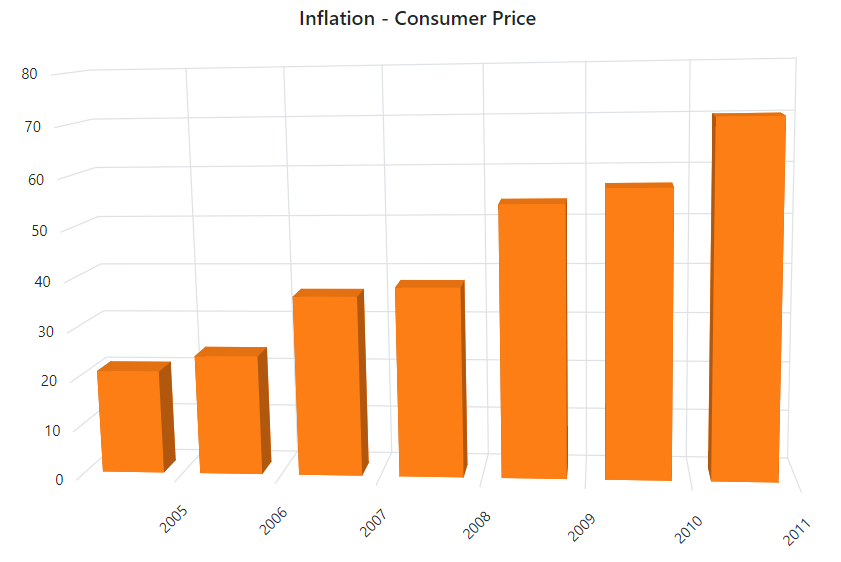
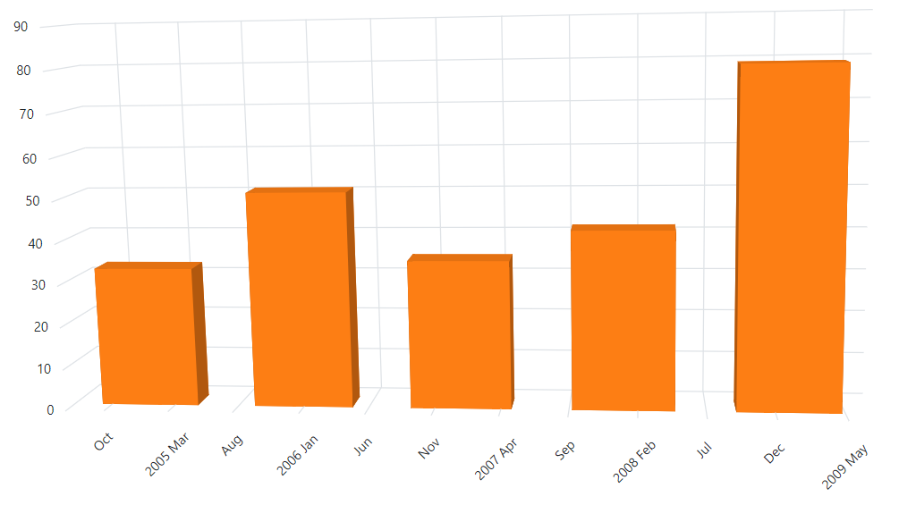
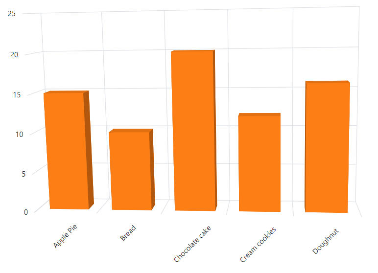
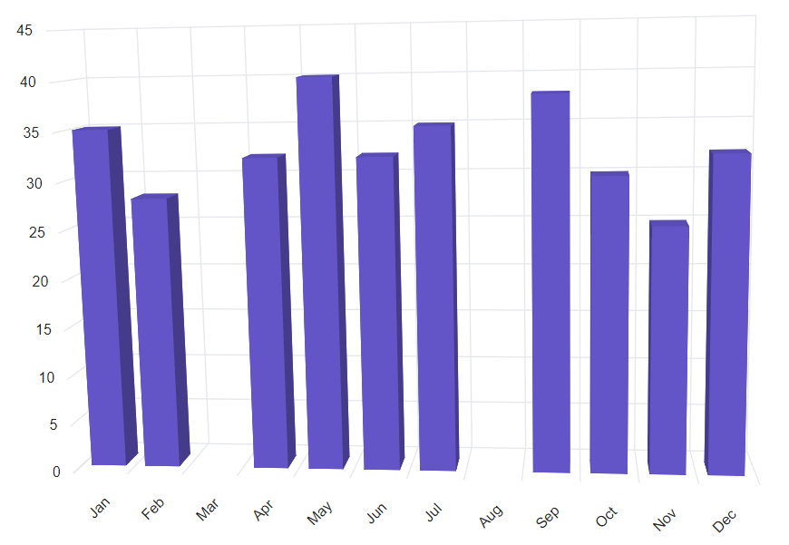

<!-- markdownlint-disable MD036 -->

# Working with Data in Blazor 3D Chart Component

The 3D Chart uses [SfDataManager](https://help.syncfusion.com/cr/blazor/Syncfusion.Blazor.Data.SfDataManager.html), which supports both RESTful JSON data services binding and IEnumerable binding. The [DataSource](https://help.syncfusion.com/cr/blazor/Syncfusion.Blazor.Chart3D.ChartSeries.html#Syncfusion_Blazor_Charts_ChartSeries_DataSource) value can be set using either [SfDataManager](https://help.syncfusion.com/cr/blazor/Syncfusion.Blazor.Data.SfDataManager.html) property values or a list of business objects.

It supports the following data binding methods:
* List binding
* Remote data

## List binding

An IEnumerable object can be assigned to the `DataSource` property. The list data source can alternatively be given as an instance of [SfDataManager](https://help.syncfusion.com/cr/blazor/Syncfusion.Blazor.Data.SfDataManager.html) or by using [SfDataManager](https://help.syncfusion.com/cr/blazor/Syncfusion.Blazor.Data.SfDataManager.html) or as a component of the [SfDataManager](https://help.syncfusion.com/cr/blazor/Syncfusion.Blazor.Data.SfDataManager.html) or by using [SfDataManager](https://help.syncfusion.com/cr/blazor/Syncfusion.Blazor.Data.SfDataManager.html). The data fields should now be mapped to the `XName` and `YName` properties.

```cshtml

@using Syncfusion.Blazor.Chart3D

<SfChart3D Title="Inflation - Consumer Price" Width="60%" WallColor="transparent" EnableRotation="true" RotationAngle="7" TiltAngle="10" Depth="100">
    <Chart3DPrimaryXAxis LabelFormat="yyyy" ValueType="Syncfusion.Blazor.Chart3D.ValueType.DateTime" LabelRotationAngle="-45" LabelPlacement="Syncfusion.Blazor.Chart3D.LabelPlacement.BetweenTicks">
    </Chart3DPrimaryXAxis>
	<Chart3DSeriesCollection>
        <Chart3DSeries DataSource="@ConsumerReports" XName="XValue" YName="YValue" Type="Chart3DSeriesType.Column">
        </Chart3DSeries>
    </Chart3DSeriesCollection>
</SfChart3D>

@code{
    public class Chart3DData
    {
        public DateTime XValue { get; set; }
        public double YValue { get; set; }
    }

    public List<Chart3DData> ConsumerReports = new List<Chart3DData>
    {
		new Chart3DData { XValue = new DateTime(2005, 01, 01), YValue = 21 },
		new Chart3DData { XValue = new DateTime(2006, 01, 01), YValue = 24 },
		new Chart3DData { XValue = new DateTime(2007, 01, 01), YValue = 36 },
		new Chart3DData { XValue = new DateTime(2008, 01, 01), YValue = 38 },
		new Chart3DData { XValue = new DateTime(2009, 01, 01), YValue = 54 },
		new Chart3DData { XValue = new DateTime(2010, 01, 01), YValue = 57 },
		new Chart3DData { XValue = new DateTime(2011, 01, 01), YValue = 70 },
	};
}

```




N> By default, [SfDataManager](https://help.syncfusion.com/cr/blazor/Syncfusion.Blazor.Data.SfDataManager.html) uses **BlazorAdaptor** for list data-binding.

### ExpandoObject binding

Blazor 3D Chart is a generic component which is strongly bound to a model type. There are cases when the model type is unknown during compile time. In such circumstances data can be bound to the chart as a list of **ExpandoObjects**. The **ExpandoObject** can be bound to 3D Chart by assigning to the `DataSource` property.

```cshtml

@using Syncfusion.Blazor.Chart3D
@using System.Dynamic

<SfChart3D WallColor="transparent" EnableRotation="true" RotationAngle="7" TiltAngle="10" Depth="100">
    <Chart3DPrimaryXAxis ValueType="Syncfusion.Blazor.Chart3D.ValueType.Category" LabelRotationAngle="-45" LabelPlacement="Syncfusion.Blazor.Chart3D.LabelPlacement.BetweenTicks"/>
    <Chart3DSeriesCollection>
        <Chart3DSeries DataSource="@MedalDetails" XName="X" YName="Y" Type="Chart3DSeriesType.Column">
        </Chart3DSeries>
    </Chart3DSeriesCollection>
</SfChart3D>

@code{
    private List<string> countries = new List<string> { "South Korea", "India", "Germany", "Italy", "Russia" };
    private Random randomNum = new Random();
    public List<ExpandoObject> MedalDetails { get; set; } = new List<ExpandoObject>();
    protected override void OnInitialized()
    {
        MedalDetails = Enumerable.Range(0, 5).Select((x) =>
        {
            dynamic d = new ExpandoObject();
            d.X = countries[x];
            d.Y = randomNum.Next(20, 80);
            return d;
        }).Cast<ExpandoObject>().ToList<ExpandoObject>();
    }
}

```


### DynamicObject binding

Blazor 3D Chart supports **DynamicObject** data source when the model type is unknown. The **DynamicObject** can be bound to chart by assigning to the `DataSource` property.

```cshtml

@using Syncfusion.Blazor.Chart3D
@using System.Dynamic

<SfChart3D WallColor="transparent" EnableRotation="true" RotationAngle="7" TiltAngle="10" Depth="100">
    <Chart3DPrimaryXAxis ValueType="Syncfusion.Blazor.Chart3D.ValueType.DateTime" LabelRotationAngle="-45" LabelPlacement="LabelPlacement.BetweenTicks"></Chart3DPrimaryXAxis>
    <Chart3DPrimaryYAxis></Chart3DPrimaryYAxis>
    <Chart3DSeriesCollection>
        <Chart3DSeries DataSource="MedalDetails" XName="X" YName="Y" Type="Chart3DSeriesType.Column"></Chart3DSeries>
    </Chart3DSeriesCollection>
</SfChart3D>

@code{
    private List<DateTime> Dates = new List<DateTime> { new DateTime(2005, 01, 01), new DateTime(2006, 01, 01), 
        new DateTime(2007, 01, 01), new DateTime(2008, 01, 01), new DateTime(2009, 01, 01), new DateTime(2010, 01, 01), new DateTime(2011, 01, 01) };
    public DateTime[] Value = new DateTime[] { new DateTime(2006, 01, 01), new DateTime(2008, 01, 01) };
    private Random randomNum = new Random();
    public List<DynamicDictionary> MedalDetails = new List<DynamicDictionary>() { };
    protected override void OnInitialized()
    {
        MedalDetails = Enumerable.Range(0, 5).Select((x) =>
        {
            dynamic d = new DynamicDictionary();
            d.X = Dates[x];
            d.Y = randomNum.Next(20, 80);
            return d;
        }).Cast<DynamicDictionary>().ToList<DynamicDictionary>();
    }
    public class DynamicDictionary : DynamicObject
    {
        Dictionary<string, object> dictionary = new Dictionary<string, object>();

        public override bool TryGetMember(GetMemberBinder binder, out object result)
        {
            string name = binder.Name;
            return dictionary.TryGetValue(name, out result);
        }
        public override bool TrySetMember(SetMemberBinder binder, object value)
        {
            dictionary[binder.Name] = value;
            return true;
        }
        public override System.Collections.Generic.IEnumerable<string> GetDynamicMemberNames()
        {
            return this.dictionary?.Keys;
        }
    }
}

```



## Remote data

The remote data can be bound to the 3D chart using the [SfDataManager](https://help.syncfusion.com/cr/blazor/Syncfusion.Blazor.Data.SfDataManager.html). The `DataManager` requires minimal information like web service URL, adaptor and cross domain to interact with service endpoint properly. Assign the instance of the `DataManager` to the `DataSource` property in series and map the fields of data to `XName` and `YName` properties.

```cshtml

@using Syncfusion.Blazor
@using Syncfusion.Blazor.Data
@using Syncfusion.Blazor.Chart3D
@using System.Dynamic

<SfChart3D WallColor="transparent" EnableRotation="true" RotationAngle="7" TiltAngle="10" Depth="100">
    <SfDataManager Url="https://blazor.syncfusion.com/services/development/api/chart" Adaptor="Adaptors.WebApiAdaptor"></SfDataManager>

    <Chart3DPrimaryXAxis ValueType="Syncfusion.Blazor.Chart3D.ValueType.Category" LabelRotationAngle="-45" LabelPlacement="LabelPlacement.BetweenTicks"></Chart3DPrimaryXAxis>

    <Chart3DSeriesCollection>
        <Chart3DSeries XName="FoodName" YName="Price" Type="Chart3DSeriesType.Column"></Chart3DSeries>
    </Chart3DSeriesCollection>
</SfChart3D>

```




### Binding with OData services

[OData](https://www.odata.org/documentation/odata-version-3-0/) is a standardized data creation and consumption protocol. The [SfDataManager](https://help.syncfusion.com/cr/blazor/Syncfusion.Blazor.Data.SfDataManager.html) can be used to retrieve data from an [OData](https://www.odata.org/documentation/odata-version-3-0/) service. For remote data binding using the [OData](https://www.odata.org/documentation/odata-version-3-0/) service, see the code below.

### Binding with OData v4 services

The [SfDataManager](https://help.syncfusion.com/cr/blazor/Syncfusion.Blazor.Data.SfDataManager.html) can retrieve and consume OData v4 services, which is an upgraded version of OData protocols. Refer to the [OData documentation](https://docs.oasis-open.org/odata/odata/v4.0/errata03/os/complete/part1-protocol/odata-v4.0-errata03-os-part1-protocol-complete.html#_Toc453752197) for additional information on OData v4 services. To bind an OData v4 service, use the **ODataV4Adaptor**.

```cshtml

@using Syncfusion.Blazor
@using Syncfusion.Blazor.Data
@using Syncfusion.Blazor.Chart3D
@using System.Dynamic

<SfChart3D WallColor="transparent" EnableRotation="true" RotationAngle="7" TiltAngle="10" Depth="100">
    <SfDataManager Url="https://services.odata.org/V4/Northwind/Northwind.svc/Orders" Adaptor="Adaptors.ODataV4Adaptor"></SfDataManager>

    <Chart3DPrimaryXAxis Title="Orders" ValueType="Syncfusion.Blazor.Chart3D.ValueType.Category" LabelRotationAngle="-45" LabelPlacement="Syncfusion.Blazor.Chart3D.LabelPlacement.BetweenTicks"></Chart3DPrimaryXAxis>

    <Chart3DSeriesCollection>
        <Chart3DSeries XName="OrderID" YName="Freight" Type="Chart3DSeriesType.Column"></Chart3DSeries>
    </Chart3DSeriesCollection>
</SfChart3D>

```


### Web API

The [WebApiAdaptor](https://help.syncfusion.com/cr/blazor/Syncfusion.Blazor.Data.WebApiAdaptor.html) can be used to bind a chart to a Web API created using an [OData](https://www.odata.org/documentation/odata-version-3-0/) endpoint.

```cshtml

@using Syncfusion.Blazor
@using Syncfusion.Blazor.Data
@using Syncfusion.Blazor.Chart3D

<SfChart3D WallColor="transparent" EnableRotation="true" RotationAngle="7" TiltAngle="10" Depth="100">
    <SfDataManager Url="https://blazor.syncfusion.com/services/production/api/Orders" Adaptor="Adaptors.WebApiAdaptor"></SfDataManager>

    <Chart3DPrimaryXAxis Title="Orders" ValueType="Syncfusion.Blazor.Chart3D.ValueType.Category" LabelRotationAngle="-45" LabelPlacement="Syncfusion.Blazor.Chart3D.LabelPlacement.BetweenTicks"></Chart3DPrimaryXAxis>

    <Chart3DSeriesCollection>
        <Chart3DSeries XName="OrderID" YName="Freight" Type="Chart3DSeriesType.Column"></Chart3DSeries>
    </Chart3DSeriesCollection>
</SfChart3D>

```



### Sending additional parameters to the server

To create a data request with a custom parameter, add additional parameters to the `Query` object and assign it to the chart's Query property.

The following sample code shows how to send parameters using the Query property in the series.

```cshtml
@using Syncfusion.Blazor.Data
@using Syncfusion.Blazor.Chart3D

<SfChart3D WallColor="transparent" EnableRotation="true" RotationAngle="7" TiltAngle="10" Depth="100">
    <SfDataManager Url="https://services.odata.org/V4/Northwind/Northwind.svc/Orders" Adaptor="Adaptors.ODataV4Adaptor"></SfDataManager>

    <Chart3DPrimaryXAxis Title="Orders" ValueType="Syncfusion.Blazor.Chart3D.ValueType.Category" LabelRotationAngle="-45" LabelPlacement="Syncfusion.Blazor.Chart3D.LabelPlacement.BetweenTicks"></Chart3DPrimaryXAxis>

    <Chart3DSeriesCollection>
        <Chart3DSeries Query="ChartQuery" XName="OrderID" YName="Freight" Type="Chart3DSeriesType.Column"></Chart3DSeries>
    </Chart3DSeriesCollection>
</SfChart3D>

@code {
    public Query ChartQuery { get; set; }

    protected override void OnInitialized()
    {
        ChartQuery = new Query().Take(10).Where("Freight", "GreaterThan", 300, false);
    }

}
```

## Empty points

The data points that uses the `null` or `undefined` as value are considered as empty points. The empty data points are ignored and is not plotted in the chart. When the data is provided by using the points property, by using `Chart3DEmptyPointSettings` property in series, the empty can be customized. The default `Mode` of the empty point is **Gap**.

```cshtml

@using Syncfusion.Blazor.Chart3D

<SfChart3D WallColor="transparent" EnableRotation="true" RotationAngle="7" TiltAngle="10" Depth="100">
    <Chart3DPrimaryXAxis ValueType="Syncfusion.Blazor.Chart3D.ValueType.Category" LabelRotationAngle="-45" LabelPlacement="Syncfusion.Blazor.Chart3D.LabelPlacement.BetweenTicks">
    </Chart3DPrimaryXAxis>

    <Chart3DSeriesCollection>
        <Chart3DSeries DataSource="@SalesReports" XName="Month" YName="Sales" Type="Chart3DSeriesType.Column">
            <Chart3DEmptyPointSettings Fill="gray" Mode="Syncfusion.Blazor.Chart3D.EmptyPointMode.Gap">
            </Chart3DEmptyPointSettings>
        </Chart3DSeries>
    </Chart3DSeriesCollection>
</SfChart3D>

@code{
    public class Chart3DData
    {
        public string Month { get; set; }
        public Nullable<double> Sales { get; set; }
    }

    public List<Chart3DData> SalesReports = new List<Chart3DData>
    {
        new Chart3DData { Month = "Jan", Sales = 35 },
        new Chart3DData { Month = "Feb", Sales = 28 },
        new Chart3DData { Month = "Mar", Sales = double.NaN },
        new Chart3DData { Month = "Apr", Sales = 32 },
        new Chart3DData { Month = "May", Sales = 40 },
        new Chart3DData { Month = "Jun", Sales = 32 },
        new Chart3DData { Month = "Jul", Sales = 35 },
        new Chart3DData { Month = "Aug", Sales = double.NaN },
        new Chart3DData { Month = "Sep", Sales = 38 },
        new Chart3DData { Month = "Oct", Sales = 30 },
        new Chart3DData { Month = "Nov", Sales = 25 },
        new Chart3DData { Month = "Dec", Sales = 32 }
    };
}

```




**Customizing empty point**

The specific color for empty point can be set by the `Fill` property in `Chart3DEmptyPointSettings`.

```cshtml

@using Syncfusion.Blazor.Chart3D

<SfChart3D WallColor="transparent" EnableRotation="true" RotationAngle="7" TiltAngle="10" Depth="100">
    <Chart3DPrimaryXAxis ValueType="Syncfusion.Blazor.Chart3D.ValueType.Category" LabelRotationAngle="-45" LabelPlacement="Syncfusion.Blazor.Chart3D.LabelPlacement.BetweenTicks">
    </Chart3DPrimaryXAxis>

    <Chart3DSeriesCollection>
        <Chart3DSeries DataSource="@SalesReports" XName="Month" YName="Sales" Type="Chart3DSeriesType.Column">
            <Chart3DEmptyPointSettings Mode="Syncfusion.Blazor.Chart3D.EmptyPointMode.Average" Fill="green">
            </Chart3DEmptyPointSettings>
        </Chart3DSeries>
    </Chart3DSeriesCollection>
</SfChart3D>

@code {
    public class Chart3DData
    {
        public string Month { get; set; }
        public Nullable<double> Sales { get; set; }
    }

    public List<Chart3DData> SalesReports = new List<Chart3DData>
    {
        new Chart3DData { Month = "Jan", Sales = 35 },
        new Chart3DData { Month = "Feb", Sales = 28 },
        new Chart3DData { Month = "Mar", Sales = double.NaN },
        new Chart3DData { Month = "Apr", Sales = 32 },
        new Chart3DData { Month = "May", Sales = 40 },
        new Chart3DData { Month = "Jun", Sales = 32 },
        new Chart3DData { Month = "Jul", Sales = 35 },
        new Chart3DData { Month = "Aug", Sales = double.NaN },
        new Chart3DData { Month = "Sep", Sales = 38 },
        new Chart3DData { Month = "Oct", Sales = 30 },
        new Chart3DData { Month = "Nov", Sales = 25 },
        new Chart3DData { Month = "Dec", Sales = 32 }
    };
}

```


