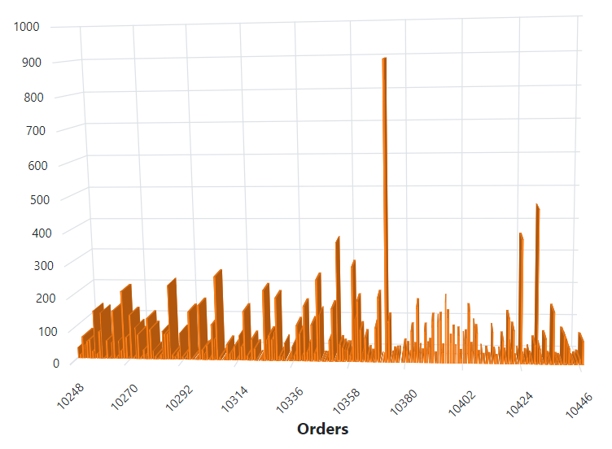

<!-- markdownlint-disable MD036 -->

# Working with Data in Blazor 3D Chart Component

The Blazor 3D Chart supports flexible data binding using the [SfDataManager](https://help.syncfusion.com/cr/blazor/Syncfusion.Blazor.Data.SfDataManager.html), which enables both RESTful JSON data services and IEnumerable binding. The [DataSource](https://help.syncfusion.com/cr/blazor/Syncfusion.Blazor.Chart3D.ChartSeries.html#Syncfusion_Blazor_Charts_ChartSeries_DataSource) property can be set using either SfDataManager or a list of business objects.

Supported data binding methods include:
- List binding
- Remote data

## List Binding

An IEnumerable object can be assigned to the `DataSource` property. Alternatively, an instance of [SfDataManager](https://help.syncfusion.com/cr/blazor/Syncfusion.Blazor.Data.SfDataManager.html) may be used. Data fields must be mapped to the `XName` and `YName` properties.

```cshtml

@using Syncfusion.Blazor.Chart3D

<SfChart3D Title="Inflation - Consumer Price" WallColor="transparent" EnableRotation="true" RotationAngle="7" TiltAngle="10" Depth="100">
    <Chart3DPrimaryXAxis LabelFormat="yyyy" ValueType="Syncfusion.Blazor.Chart3D.ValueType.DateTime" LabelRotationAngle="-45" LabelPlacement="Syncfusion.Blazor.Chart3D.LabelPlacement.BetweenTicks">
    </Chart3DPrimaryXAxis>
    <Chart3DSeriesCollection>
        <Chart3DSeries DataSource="@ConsumerReports" XName="XValue" YName="YValue" Type="Chart3DSeriesType.Column">
        </Chart3DSeries>
    </Chart3DSeriesCollection>
</SfChart3D>

@code {
    public class Chart3DData
    {
        public DateTime XValue { get; set; }
        public double YValue { get; set; }
    }

    public List<Chart3DData> ConsumerReports = new List<Chart3DData>
    {
        new Chart3DData { XValue = new DateTime(2005, 01, 01), YValue = 21 },
        new Chart3DData { XValue = new DateTime(2006, 01, 01), YValue = 24 },
        new Chart3DData { XValue = new DateTime(2007, 01, 01), YValue = 36 },
        new Chart3DData { XValue = new DateTime(2008, 01, 01), YValue = 38 },
        new Chart3DData { XValue = new DateTime(2009, 01, 01), YValue = 54 },
        new Chart3DData { XValue = new DateTime(2010, 01, 01), YValue = 57 },
        new Chart3DData { XValue = new DateTime(2011, 01, 01), YValue = 70 }
    };
}

```



N> By default, [SfDataManager](https://help.syncfusion.com/cr/blazor/Syncfusion.Blazor.Data.SfDataManager.html) uses **BlazorAdaptor** for list data binding.

### ExpandoObject binding

When the model type is unknown at compile time, a list of **ExpandoObject** instances can be bound to the chart by assigning it to the `DataSource` property.

```cshtml

@using Syncfusion.Blazor.Chart3D
@using System.Dynamic

<SfChart3D WallColor="transparent" EnableRotation="true" RotationAngle="7" TiltAngle="10" Depth="100">
    <Chart3DPrimaryXAxis ValueType="Syncfusion.Blazor.Chart3D.ValueType.Category" LabelRotationAngle="-45" LabelPlacement="Syncfusion.Blazor.Chart3D.LabelPlacement.BetweenTicks"/>
    <Chart3DSeriesCollection>
        <Chart3DSeries DataSource="@MedalDetails" XName="X" YName="Y" Type="Chart3DSeriesType.Column">
        </Chart3DSeries>
    </Chart3DSeriesCollection>
</SfChart3D>

@code {
    private List<string> countries = new List<string> { "South Korea", "India", "Germany", "Italy", "Russia" };

    private Random randomNum = new Random();

    public List<ExpandoObject> MedalDetails { get; set; } = new List<ExpandoObject>();

    protected override void OnInitialized()
    {
        MedalDetails = Enumerable.Range(0, 5).Select((x) =>
        {
            dynamic d = new ExpandoObject();
            d.X = countries[x];
            d.Y = randomNum.Next(20, 80);
            return d;
        }).Cast<ExpandoObject>().ToList<ExpandoObject>();
    }
}

```


### DynamicObject Binding

Blazor 3D Chart also supports **DynamicObject** as a data source when the model type is unknown. A list of DynamicObject instances can be assigned to the `DataSource` property.

```cshtml

@using Syncfusion.Blazor.Chart3D
@using System.Dynamic

<SfChart3D WallColor="transparent" EnableRotation="true" RotationAngle="7" TiltAngle="10" Depth="100">
    <Chart3DPrimaryXAxis ValueType="Syncfusion.Blazor.Chart3D.ValueType.DateTime" LabelRotationAngle="-45" LabelPlacement="LabelPlacement.BetweenTicks"></Chart3DPrimaryXAxis>
    <Chart3DPrimaryYAxis></Chart3DPrimaryYAxis>
    <Chart3DSeriesCollection>
        <Chart3DSeries DataSource="MedalDetails" XName="X" YName="Y" Type="Chart3DSeriesType.Column"></Chart3DSeries>
    </Chart3DSeriesCollection>
</SfChart3D>

@code {
    private List<DateTime> Dates = new List<DateTime> { new DateTime(2005, 01, 01), new DateTime(2006, 01, 01), 
        new DateTime(2007, 01, 01), new DateTime(2008, 01, 01), new DateTime(2009, 01, 01), new DateTime(2010, 01, 01), new DateTime(2011, 01, 01) };
    public DateTime[] Value = new DateTime[] { new DateTime(2006, 01, 01), new DateTime(2008, 01, 01) };

    private Random randomNum = new Random();
    public List<DynamicDictionary> MedalDetails = new List<DynamicDictionary>() { };

    protected override void OnInitialized()
    {
        MedalDetails = Enumerable.Range(0, 5).Select((x) =>
        {
            dynamic d = new DynamicDictionary();
            d.X = Dates[x];
            d.Y = randomNum.Next(20, 80);
            return d;
        }).Cast<DynamicDictionary>().ToList<DynamicDictionary>();
    }

    public class DynamicDictionary : DynamicObject
    {
        Dictionary<string, object> dictionary = new Dictionary<string, object>();

        public override bool TryGetMember(GetMemberBinder binder, out object result)
        {
            string name = binder.Name;
            return dictionary.TryGetValue(name, out result);
        }
    
        public override bool TrySetMember(SetMemberBinder binder, object value)
        {
            dictionary[binder.Name] = value;
            return true;
        }
    
        public override System.Collections.Generic.IEnumerable<string> GetDynamicMemberNames()
        {
            return this.dictionary?.Keys;
        }
    }
}

```


## Remote Data

Remote data is bound to the 3D Chart using [SfDataManager](https://help.syncfusion.com/cr/blazor/Syncfusion.Blazor.Data.SfDataManager.html). The DataManager requires information such as the web service URL, adaptor, and cross-domain settings. Assign the DataManager instance to the `DataSource` property and map the data fields to `XName` and `YName`.

```cshtml

@using Syncfusion.Blazor
@using Syncfusion.Blazor.Data
@using Syncfusion.Blazor.Chart3D
@using System.Dynamic

<SfChart3D WallColor="transparent" EnableRotation="true" RotationAngle="7" TiltAngle="10" Depth="100">
    <SfDataManager Url="https://blazor.syncfusion.com/services/development/api/chart" Adaptor="Adaptors.WebApiAdaptor"></SfDataManager>

    <Chart3DPrimaryXAxis ValueType="Syncfusion.Blazor.Chart3D.ValueType.Category" LabelRotationAngle="-45" LabelPlacement="LabelPlacement.BetweenTicks"></Chart3DPrimaryXAxis>

    <Chart3DSeriesCollection>
        <Chart3DSeries XName="FoodName" YName="Price" Type="Chart3DSeriesType.Column"></Chart3DSeries>
    </Chart3DSeriesCollection>
</SfChart3D>

```




### Binding with OData Services

[OData](https://www.odata.org/documentation/odata-version-3-0/) is a standardized protocol for data creation and consumption. The [SfDataManager](https://help.syncfusion.com/cr/blazor/Syncfusion.Blazor.Data.SfDataManager.html) retrieves data from OData services.

**Binding with OData v4 services**

The [SfDataManager](https://help.syncfusion.com/cr/blazor/Syncfusion.Blazor.Data.SfDataManager.html) can retrieve and consume OData v4 services, which is an upgraded version of OData protocols. Refer to the [OData documentation](https://docs.oasis-open.org/odata/odata/v4.0/errata03/os/complete/part1-protocol/odata-v4.0-errata03-os-part1-protocol-complete.html#_Toc453752197) for additional information on OData v4 services. To bind an OData v4 service, use the **ODataV4Adaptor**.

```cshtml

@using Syncfusion.Blazor
@using Syncfusion.Blazor.Data
@using Syncfusion.Blazor.Chart3D
@using System.Dynamic

<SfChart3D WallColor="transparent" EnableRotation="true" RotationAngle="7" TiltAngle="10" Depth="100">
    <SfDataManager Url="https://services.odata.org/V4/Northwind/Northwind.svc/Orders" Adaptor="Adaptors.ODataV4Adaptor"></SfDataManager>

    <Chart3DPrimaryXAxis Title="Orders" ValueType="Syncfusion.Blazor.Chart3D.ValueType.Category" LabelRotationAngle="-45" LabelPlacement="Syncfusion.Blazor.Chart3D.LabelPlacement.BetweenTicks"></Chart3DPrimaryXAxis>

    <Chart3DSeriesCollection>
        <Chart3DSeries XName="OrderID" YName="Freight" Type="Chart3DSeriesType.Column"></Chart3DSeries>
    </Chart3DSeriesCollection>
</SfChart3D>

```



### Web API

The [WebApiAdaptor](https://help.syncfusion.com/cr/blazor/Syncfusion.Blazor.Data.WebApiAdaptor.html) enables binding to a Web API endpoint.

```cshtml

@using Syncfusion.Blazor
@using Syncfusion.Blazor.Data
@using Syncfusion.Blazor.Chart3D

<SfChart3D WallColor="transparent" EnableRotation="true" RotationAngle="7" TiltAngle="10" Depth="100">
    <SfDataManager Url="https://blazor.syncfusion.com/services/production/api/Orders" Adaptor="Adaptors.WebApiAdaptor"></SfDataManager>

    <Chart3DPrimaryXAxis Title="Orders" ValueType="Syncfusion.Blazor.Chart3D.ValueType.Category" LabelRotationAngle="-45" LabelPlacement="Syncfusion.Blazor.Chart3D.LabelPlacement.BetweenTicks"></Chart3DPrimaryXAxis>

    <Chart3DSeriesCollection>
        <Chart3DSeries XName="OrderID" YName="Freight" Type="Chart3DSeriesType.Column"></Chart3DSeries>
    </Chart3DSeriesCollection>
</SfChart3D>

```



### Sending Additional Parameters to the Server

To send custom parameters with a data request, add them to a `Query` object and assign the object to the chart's `Query` property.

```cshtml

@using Syncfusion.Blazor.Data
@using Syncfusion.Blazor.Chart3D

<SfChart3D WallColor="transparent" EnableRotation="true" RotationAngle="7" TiltAngle="10" Depth="100">
    <SfDataManager Url="https://services.odata.org/V4/Northwind/Northwind.svc/Orders" Adaptor="Adaptors.ODataV4Adaptor"></SfDataManager>

    <Chart3DPrimaryXAxis Title="Orders" ValueType="Syncfusion.Blazor.Chart3D.ValueType.Category" LabelRotationAngle="-45" LabelPlacement="Syncfusion.Blazor.Chart3D.LabelPlacement.BetweenTicks"></Chart3DPrimaryXAxis>

    <Chart3DSeriesCollection>
        <Chart3DSeries Query="ChartQuery" XName="OrderID" YName="Freight" Type="Chart3DSeriesType.Column"></Chart3DSeries>
    </Chart3DSeriesCollection>
</SfChart3D>

@code {
    public Query ChartQuery { get; set; }

    protected override void OnInitialized()
    {
        ChartQuery = new Query().Take(10).Where("Freight", "GreaterThan", 300, false);
    }
}

```

## Empty Points

Data points with `null` or `undefined` values are considered empty points. These points are ignored and not plotted. The appearance of empty points can be customized using the `Chart3DEmptyPointSettings` property in the series. The default `Mode` is **Gap**.

```cshtml

@using Syncfusion.Blazor.Chart3D

<SfChart3D WallColor="transparent" EnableRotation="true" RotationAngle="7" TiltAngle="10" Depth="100">
    <Chart3DPrimaryXAxis ValueType="Syncfusion.Blazor.Chart3D.ValueType.Category" LabelRotationAngle="-45" LabelPlacement="Syncfusion.Blazor.Chart3D.LabelPlacement.BetweenTicks">
    </Chart3DPrimaryXAxis>

    <Chart3DSeriesCollection>
        <Chart3DSeries DataSource="@SalesReports" XName="Month" YName="Sales" Type="Chart3DSeriesType.Column">
            <Chart3DEmptyPointSettings Fill="gray" Mode="Syncfusion.Blazor.Chart3D.EmptyPointMode.Gap">
            </Chart3DEmptyPointSettings>
        </Chart3DSeries>
    </Chart3DSeriesCollection>
</SfChart3D>

@code {
    public class Chart3DData
    {
        public string Month { get; set; }
        public Nullable<double> Sales { get; set; }
    }

    public List<Chart3DData> SalesReports = new List<Chart3DData>
    {
        new Chart3DData { Month = "Jan", Sales = 35 },
        new Chart3DData { Month = "Feb", Sales = 28 },
        new Chart3DData { Month = "Mar", Sales = double.NaN },
        new Chart3DData { Month = "Apr", Sales = 32 },
        new Chart3DData { Month = "May", Sales = 40 },
        new Chart3DData { Month = "Jun", Sales = 32 },
        new Chart3DData { Month = "Jul", Sales = 35 },
        new Chart3DData { Month = "Aug", Sales = double.NaN },
        new Chart3DData { Month = "Sep", Sales = 38 },
        new Chart3DData { Month = "Oct", Sales = 30 },
        new Chart3DData { Month = "Nov", Sales = 25 },
        new Chart3DData { Month = "Dec", Sales = 32 }
    };
}

```



### Customizing Empty Points

A specific color for empty points can be set using the `Fill` property in `Chart3DEmptyPointSettings`.

```cshtml

@using Syncfusion.Blazor.Chart3D

<SfChart3D WallColor="transparent" EnableRotation="true" RotationAngle="7" TiltAngle="10" Depth="100">
    <Chart3DPrimaryXAxis ValueType="Syncfusion.Blazor.Chart3D.ValueType.Category" LabelRotationAngle="-45" LabelPlacement="Syncfusion.Blazor.Chart3D.LabelPlacement.BetweenTicks">
    </Chart3DPrimaryXAxis>

    <Chart3DSeriesCollection>
        <Chart3DSeries DataSource="@SalesReports" XName="Month" YName="Sales" Type="Chart3DSeriesType.Column">
            <Chart3DEmptyPointSettings Mode="Syncfusion.Blazor.Chart3D.EmptyPointMode.Average" Fill="green">
            </Chart3DEmptyPointSettings>
        </Chart3DSeries>
    </Chart3DSeriesCollection>
</SfChart3D>

@code {
    public class Chart3DData
    {
        public string Month { get; set; }
        public Nullable<double> Sales { get; set; }
    }

    public List<Chart3DData> SalesReports = new List<Chart3DData>
    {
        new Chart3DData { Month = "Jan", Sales = 35 },
        new Chart3DData { Month = "Feb", Sales = 28 },
        new Chart3DData { Month = "Mar", Sales = double.NaN },
        new Chart3DData { Month = "Apr", Sales = 32 },
        new Chart3DData { Month = "May", Sales = 40 },
        new Chart3DData { Month = "Jun", Sales = 32 },
        new Chart3DData { Month = "Jul", Sales = 35 },
        new Chart3DData { Month = "Aug", Sales = double.NaN },
        new Chart3DData { Month = "Sep", Sales = 38 },
        new Chart3DData { Month = "Oct", Sales = 30 },
        new Chart3DData { Month = "Nov", Sales = 25 },
        new Chart3DData { Month = "Dec", Sales = 32 }
    };
}

```



