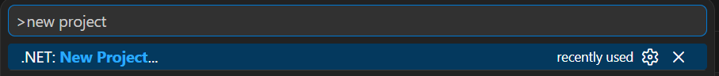
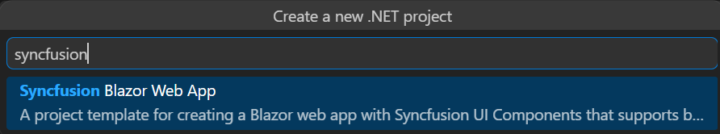
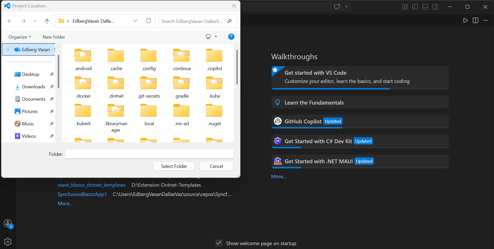
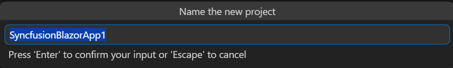
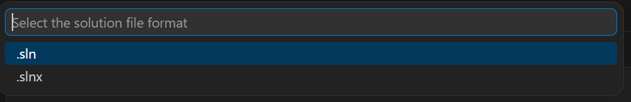
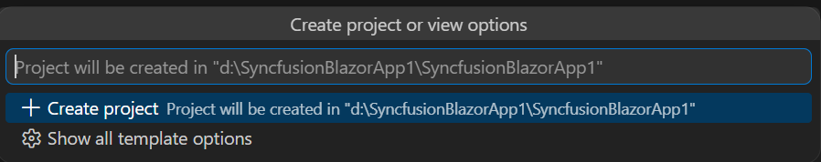
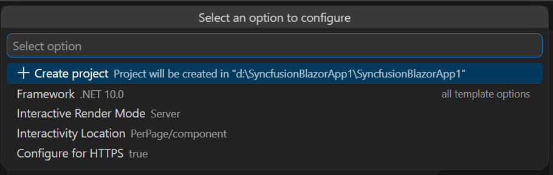
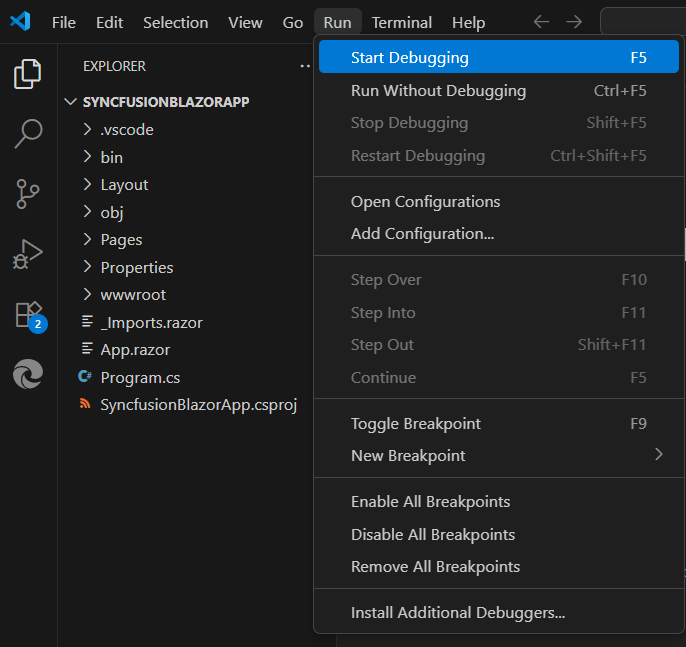

# Creating a Syncfusion® Blazor Web App

Syncfusion® provides the Blazor Web App Template in Visual Studio Code, which allows you to create a Syncfusion® Blazor application with Syncfusion® components. The Syncfusion® Blazor app is created with the required component Syncfusion® NuGet references, namespaces, styles, and component render code. The Template provides an easy-to-use project wizard that walks you through the process of creating an application with Syncfusion® components.

N> Blazor project templates from `v17.4.0.39` are supported by the Syncfusion® Visual Studio Code project template.

The instructions below assist you in creating **Syncfusion Blazor Applications** using **Visual Studio Code**:
1. Open the Command Palette (press **Ctrl+Shift+P**), type **New project**, and choose the **New project** command to view available templates.

    
2. In the palette search box type **Syncfusion**, then select the Syncfusion templates from the results.

    
3. Choose **Syncfusion Blazor Web App** and press **Enter**. When prompted, pick the folder where you want the new project created.

    
4. In the project dialog confirm the **Project name** and the **Solution (.sln) file** format, then press **Enter** to generate the project.

    
    

    N> Refer to the .NET SDK support for Syncfusion® Blazor Components [here](https://blazor.syncfusion.com/documentation/system-requirements#net-sdk).

5. Select either **Create a project** or the **Show all template options**. 

    

6. In template options, you can customize the interactive render mode, interactivity location and https configuration based on the version of the .NET SDK you are using.

    | .NET SDK version | Supported Syncfusion Blazor Application Type |
    | ---------------- | -------------------------------------------- |
    | [.NET 10.0](https://dotnet.microsoft.com/en-us/download/dotnet/10.0), [.NET 9.0](https://dotnet.microsoft.com/en-us/download/dotnet/9.0), [.NET 8.0](https://dotnet.microsoft.com/en-us/download/dotnet/8.0) | Syncfusion Blazor Web App |
    
    In the **Syncfusion Blazor Web App** application type, you can configure the following options:

    <table>
    <tbody>
    <tr>
    <td>
    <a href="https://learn.microsoft.com/en-us/aspnet/core/blazor/components/render-modes?view=aspnetcore-8.0#render-modes" rel="nofollow">Interactivity type</a>
    </td>
    <td>
    Server, WebAssembly, Auto (Server and WebAssembly)
    </td>
    </tr>
    <tr>
    <td>
    <a href="https://learn.microsoft.com/en-us/aspnet/core/blazor/tooling?view=aspnetcore-8.0&pivots=windows" rel="nofollow">Interactivity location</a>
    </td>
    <td>
    Global, Per page/component
    </td>
    </tr>
    </tbody>
    </table>

    

7. Click **Create project** button. The Syncfusion® Blazor application has been created. The created Syncfusion® Blazor app has the Syncfusion NuGet packages, styles, and the render code for the selected Syncfusion® component.

    
8. You can run the application to see the Syncfusion® components. Click **F5** or go to **Run>Start Debugging**.

     

9. The Syncfusion® Blazor application configures with most recent Syncfusion® Blazor NuGet packages version, selected style, namespaces, selected authentication, and component render code for Syncfusion® components.

10. If you installed the trial setup or NuGet packages from nuget.org you must register the Syncfusion® license key to your application since Syncfusion® introduced the licensing system from 2018 Volume 2 (v16.2.0.41) Essential Studio® release. Navigate to the [help topic](https://help.syncfusion.com/common/essential-studio/licensing/license-key#how-to-generate-syncfusion-license-key) to generate and register the Syncfusion® license key to your application. Refer to this [UG](https://blazor.syncfusion.com/documentation/getting-started/license-key/overview) topic for understanding the licensing details in Essential Studio® for Blazor.