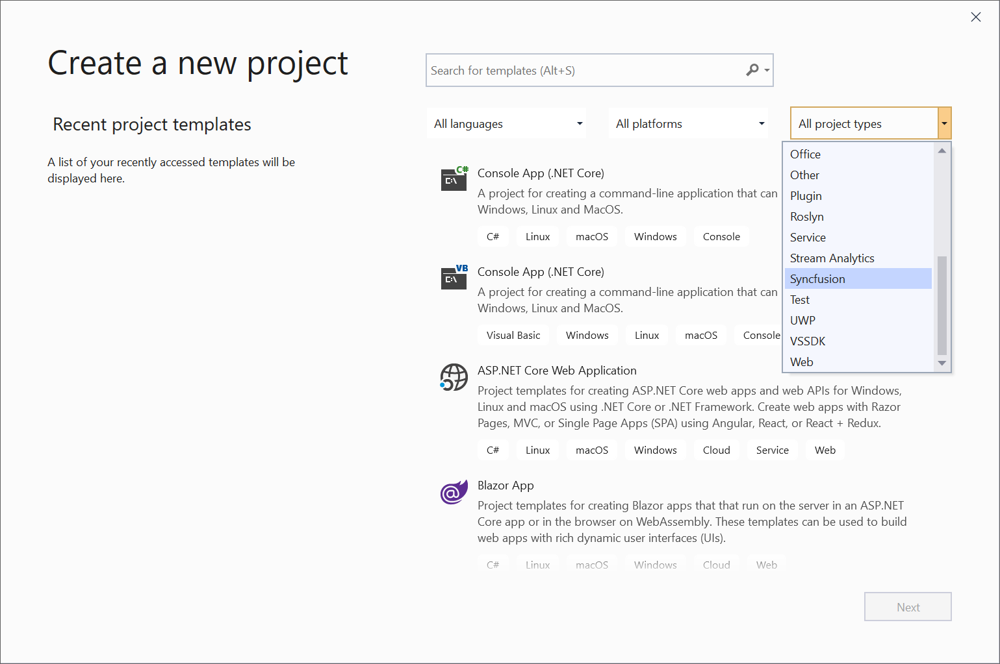
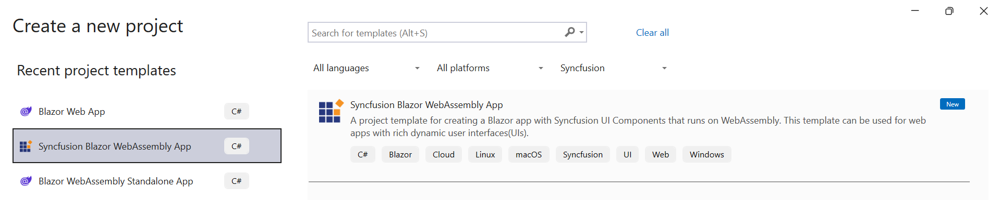
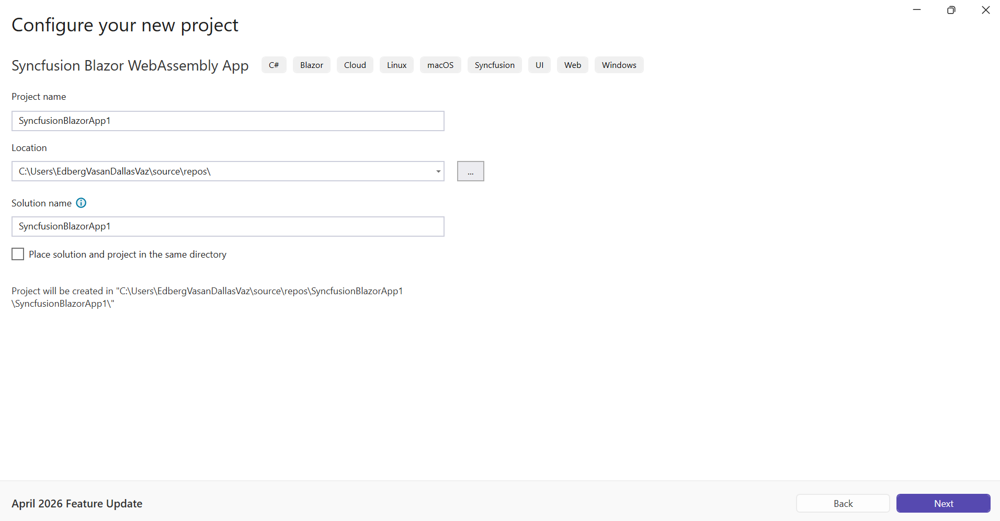
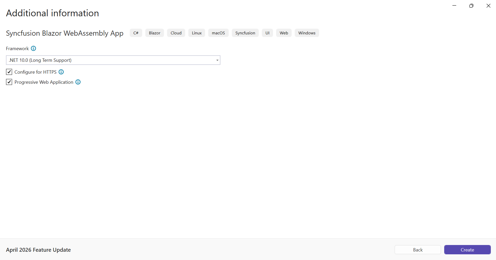
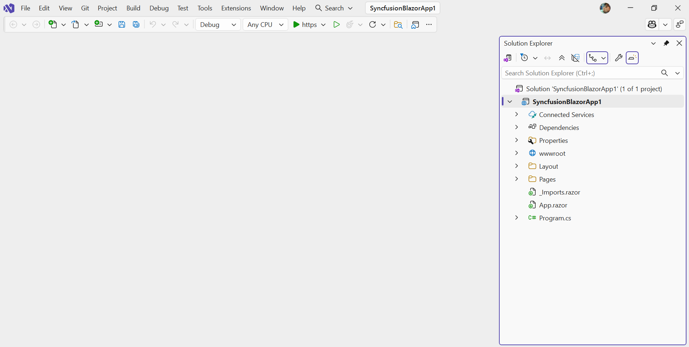

# Syncfusion® Blazor WebAssembly App Template

Syncfusion® provides the Blazor WebAssembly App Template, which allows you to create a Syncfusion Blazor application using Syncfusion® components. The Syncfusion® Blazor app is created with the required Syncfusion® NuGet references, namespaces, styles, and component render code. The Template includes an easy-to-use project wizard that guides you through the process of creating an application with Syncfusion® components.

The steps below will assist you to create your **Syncfusion® Blazor Application** through **Visual Studio 2022 or 2026**:

1. Open Visual Studio 2022 or 2026.

2. To create a Syncfusion® Blazor application, Choose **File -> New -> Project** from the menu. This launches a new dialogue for creating a new application. Syncfusion® templates for Blazor can be found by filtering the application type for **Syncfusion** or by entering **Syncfusion** as a keyword in the search option.

     

3. Select the **Syncfusion Blazor WebAssembly App** and click **Next**.

     
4. The Syncfusion Blazor WebAssembly App wizard will open to configure your new project. Click **Next**.

     
5. Configure the project options (project type, progressive web application support, and https configuration) in the wizard as needed.

     > **Note:** Refer to the .NET SDK support for Syncfusion Blazor Components [here](https://blazor.syncfusion.com/documentation/system-requirements#net-sdk).

     **Project type section**

     Choose one of the Syncfusion® Blazor application types based on the version of the .NET SDK you are using.

    | .NET SDK version | Supported Syncfusion Blazor Application Type |
    | ---------------- | -------------------------------------------- |
    | [.NET 10.0](https://dotnet.microsoft.com/en-us/download/dotnet/10.0), [.NET 9.0](https://dotnet.microsoft.com/en-us/download/dotnet/9.0), [.NET 8.0](https://dotnet.microsoft.com/en-us/download/dotnet/8.0) | Syncfusion Blazor WebAssembly App |

     In the **Syncfusion Blazor WebAssembly App** application type, you can choose Progressive Web Application.
     
     

     > **Note:** The Progressive Web Application will be enabled if .NET 8.0 version or higher is installed.

6. Click **Create** button. The Syncfusion® Blazor application has been created. The created Syncfusion® Blazor app has the Syncfusion NuGet packages, styles, and the render code for the selected Syncfusion® component.

     

7. The Syncfusion® Blazor application configures with most recent Syncfusion® Blazor NuGet packages version, selected style, namespaces, selected authentication, and component render code for Syncfusion® components.

8. If you installed the trial setup or NuGet packages from nuget.org you must register the Syncfusion® license key to your application since Syncfusion® introduced the licensing system from 2018 Volume 2 (v16.2.0.41) Essential Studio® release. Navigate to the [help topic](https://help.syncfusion.com/common/essential-studio/licensing/overview#how-to-generate-syncfusion-license-key) to generate and register the Syncfusion® license key to your application. Refer to this [blog](https://www.syncfusion.com/blogs/post/whats-new-in-2018-volume-2.aspx) post for understanding the licensing changes introduced in Essential Studio®.