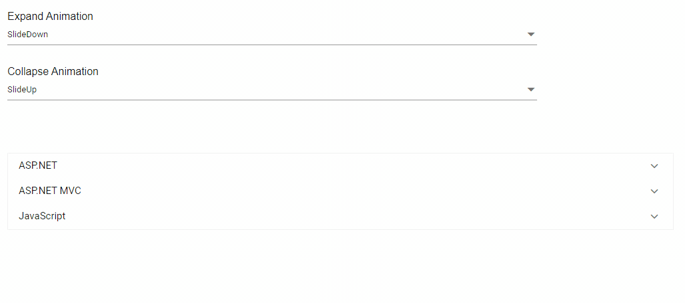

# Animations in Blazor Accordion Component

The [Blazor Accordion](https://www.syncfusion.com/blazor-components/blazor-accordion) component supports custom animations for both expand and collapse actions using the animation options provided by the `Animation` library. The animation property allows you to customize various aspects including [Easing](https://help.syncfusion.com/cr/blazor/Syncfusion.Blazor.Navigations.AccordionAnimationCollapse.html#Syncfusion_Blazor_Navigations_AccordionAnimationCollapse_Easing), [Duration](https://help.syncfusion.com/cr/blazor/Syncfusion.Blazor.Navigations.AccordionAnimationCollapse.html#Syncfusion_Blazor_Navigations_AccordionAnimationCollapse_Duration), and other effects according to your preference.

By default, the accordion uses `SlideDown` animation for expanding panels (set through the [Expand](https://help.syncfusion.com/cr/blazor/Syncfusion.Blazor.Navigations.AccordionAnimationSettings.html#Syncfusion_Blazor_Navigations_AccordionAnimationSettings_Expand) property) and `SlideUp` animation for collapsing panels (set through the [Collapse](https://help.syncfusion.com/cr/blazor/Syncfusion.Blazor.Navigations.AccordionAnimationSettings.html#Syncfusion_Blazor_Navigations_AccordionAnimationSettings_Collapse) property). You can disable animations completely by setting the animation [Effect](https://help.syncfusion.com/cr/blazor/Syncfusion.Blazor.Navigations.AccordionAnimationCollapse.html#Syncfusion_Blazor_Navigations_AccordionAnimationCollapse_Effect) to `None`.

The following example demonstrates how to apply and select various animation types for both the expand and collapse actions of the Accordion component using interactive dropdowns:

```cshtml
@using Syncfusion.Blazor
@using Syncfusion.Blazor.Navigations
@using Syncfusion.Blazor.DropDowns

<div id="container">
    <div id="default" style="padding-bottom:75px;">
        <div class="row">
            <div class="col-xs-6 col-sm-6 col-lg-6 col-md-6">
                <label> Expand Animation </label>
            </div>
            <div class="col-xs-6 col-sm-6 col-lg-6 col-md-6">
                <SfDropDownList TValue="AnimationEffect" DataSource="@AnimationData" TItem="Effect" PopupHeight="150px" Placeholder="Select a animate type" @bind-Value="ExpandEffect">
                    <DropDownListEvents ValueChange="ExpandOption" TValue="AnimationEffect" TItem="Effect"></DropDownListEvents>
                    <DropDownListFieldSettings Value="ID" Text="Text"></DropDownListFieldSettings>
                </SfDropDownList>
            </div>
        </div>
        <div class="row">
            <div class="col-xs-6 col-sm-6 col-lg-6 col-md-6">
                <label> Collapse Animation </label>
            </div>
            <div class="col-xs-6 col-sm-6 col-lg-6 col-md-6">
                <SfDropDownList TValue="AnimationEffect" DataSource="@AnimationData" TItem="Effect" PopupHeight="150px" Placeholder="Select a animate type" @bind-Value="CollapseEffect">
                    <DropDownListEvents ValueChange="CollapseOption" TValue="AnimationEffect" TItem="Effect"></DropDownListEvents>
                    <DropDownListFieldSettings Value="ID" Text="Text"></DropDownListFieldSettings>
                </SfDropDownList>
            </div>
        </div>
    </div>
    <SfAccordion>
        <AccordionAnimationSettings>
            <AccordionAnimationCollapse Effect=@CollapseEffect></AccordionAnimationCollapse>
            <AccordionAnimationExpand Effect=@ExpandEffect></AccordionAnimationExpand>
        </AccordionAnimationSettings>
        <AccordionItems>
            <AccordionItem Header="ASP.NET" Content="Microsoft ASP.NET is a set of technologies in the Microsoft .NET Framework for building Web applications and XML Web services. ASP.NET pages execute on the server and generate markup such as HTML, WML, or XML that is sent to a desktop or mobile browser. ASP.NET pages use a compiled,event-driven programming model that improves performance and enables the separation of application logic and user interface.">
            </AccordionItem>
            <AccordionItem Header="ASP.NET MVC" Content="The Model-View-Controller (MVC) architectural pattern separates an application into three main components: the model, the view, and the controller. The ASP.NET MVC framework provides an alternative to the ASP.NET Web Forms pattern for creating Web applications. The ASP.NET MVC framework is a lightweight, highly testable presentation framework that (as with Web Forms-based applications) is integrated with existing ASP.NET features, such as master pages and membership-based authentication.">
            </AccordionItem>
            <AccordionItem Header="JavaScript" Content="JavaScript (JS) is an interpreted computer programming language.It was originally implemented as part of web browsers so that client-side scripts could interact with the user, control the browser, communicate asynchronously, and alter the document content that was displayed.More recently, however, it has become common in both Animation development and the creation of desktop applications.">
            </AccordionItem>
        </AccordionItems>
    </SfAccordion>
</div>

@code{
    public AnimationEffect ExpandEffect = AnimationEffect.SlideDown;
    public AnimationEffect CollapseEffect = AnimationEffect.SlideUp;
    public void ExpandOption(Syncfusion.Blazor.DropDowns.ChangeEventArgs<AnimationEffect, Effect> args)
    {
        this.ExpandEffect = args.Value;
    }
    public void CollapseOption(Syncfusion.Blazor.DropDowns.ChangeEventArgs<AnimationEffect, Effect> args)
    {
        this.CollapseEffect = args.Value;
    }
    List<Effect> AnimationData = new List<Effect> {
        new Effect() { ID = AnimationEffect.SlideDown, Text = "SlideDown" },
        new Effect() { ID = AnimationEffect.SlideUp, Text = "SlideUp" },
        new Effect() { ID = AnimationEffect.FadeIn, Text = "FadeIn" },
        new Effect() { ID = AnimationEffect.FadeOut, Text = "FadeOut" },
        new Effect() { ID = AnimationEffect.FadeZoomIn, Text = "FadeZoomIn" },
        new Effect() { ID = AnimationEffect.FadeZoomOut, Text = "FadeZoomOut" },
        new Effect() { ID = AnimationEffect.ZoomIn, Text = "ZoomIn" },
        new Effect() { ID = AnimationEffect.ZoomOut, Text = "ZoomOut" },
        new Effect() { ID = AnimationEffect.None, Text = "None" }
    };
    public class Effect
    {
        public AnimationEffect ID { get; set; }
        public string Text { get; set; }
    }
}
```





