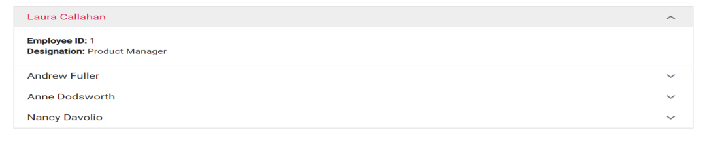

# Data Binding in Blazor Accordion Component

The [Blazor Accordion](https://www.syncfusion.com/blazor-components/blazor-accordion) component provides an option to populate accordion items from local data. This can be accomplished by iterating through accordion items using a conditional **foreach** loop. The Accordion component currently supports only local data for data binding. The [HeaderTemplate](https://help.syncfusion.com/cr/blazor/Syncfusion.Blazor.Navigations.AccordionItem.html#Syncfusion_Blazor_Navigations_AccordionItem_HeaderTemplate) and [ContentTemplate](https://help.syncfusion.com/cr/blazor/Syncfusion.Blazor.Navigations.AccordionItem.html#Syncfusion_Blazor_Navigations_AccordionItem_ContentTemplate) properties can be used to render the accordion header and content respectively.

The following example demonstrates how to initialize accordion items using `templates`:

```cshtml
@using Syncfusion.Blazor.Navigations

<SfAccordion>
    <AccordionItems>
        @foreach (AccordionData Item in AccordionItems)
        {
            <AccordionItem>
                <HeaderTemplate>
                    <div>@(Item.EmployeeName)</div>
                </HeaderTemplate>
                <ContentTemplate>
                    <div>
                        <div><b>Employee ID: </b>@Item.EmployeeId</div>
                        <div><b>Designation: </b>@Item.Designation</div>
                    </div>
                </ContentTemplate>
            </AccordionItem>
        }
    </AccordionItems>
</SfAccordion>

@code {
    List<AccordionData> AccordionItems = new List<AccordionData>()
    {
        new AccordionData
        {
        EmployeeId = 1,
        EmployeeName = "Laura Callahan",
        Designation = "Product Manager",
        },
        new AccordionData
        {
        EmployeeId = 3,
        EmployeeName = "Andrew Fuller",
        Designation = "Team Lead",
        },
        new AccordionData
        {
        EmployeeId = 4,
        EmployeeName = "Anne Dodsworth",
        Designation = "Developer"
        },
        new AccordionData
        {
        EmployeeId = 5,
        EmployeeName = "Nancy Davolio",
        Designation = "Product Manager"
        }
    };

    public class AccordionData
    {
        public string EmployeeName { get; set; }
        public int EmployeeId { get; set; }
        public string Designation { get; set; }
    }
}
```




