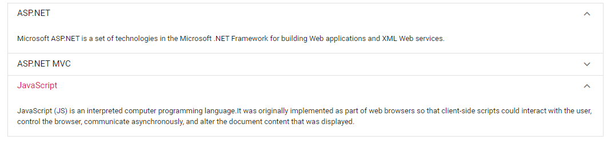

# Expand Mode in Blazor Accordion Component

 The Accordion supports the two listed types of expand modes while expanding or collapsing the item.

* Single
* Multiple

## Single

This property enables to expand only one Accordion item at a time. If you expand any new item, the previously expanded one is collapsed and new item changed to expanded state.

```csharp

@using Syncfusion.Blazor.Navigations

<SfAccordion ExpandMode="ExpandMode.Single">
    <AccordionItems>
        <AccordionItem Expanded="true" Header="ASP.NET" Content="Microsoft ASP.NET is a set of technologies in the Microsoft .NET Framework for building Web applications and XML Web services."></AccordionItem>
        <AccordionItem Header="ASP.NET MVC" Content="The Model-View-Controller (MVC) architectural pattern separates an application into three main components: the model, the view, and the controller."></AccordionItem>
        <AccordionItem Header="JavaScript" Content="JavaScript (JS) is an interpreted computer programming language.It was originally implemented as part of web browsers so that client-side scripts could interact with the user, control the browser, communicate asynchronously, and alter the document content that was displayed."></AccordionItem>
    </AccordionItems>
</SfAccordion>

```

Output be like the below.


## Multiple

Default [ExpandMode](https://help.syncfusion.com/cr/blazor/Syncfusion.Blazor.Navigations.SfAccordion.html#Syncfusion_Blazor_Navigations_SfAccordion_ExpandMode) of the Accordion is `Multiple`. It enables you to expand more than one Accordion item at a time. Expand/collapse action can also be toggled by clicking on it again. For example, expanded item is collapsed when you click on it again.

```csharp

@using Syncfusion.Blazor.Navigations

<SfAccordion ExpandMode="ExpandMode.Multiple" @bind-ExpandedIndices=ExpandItems>
    <AccordionItems>
        <AccordionItem Header="ASP.NET" Content="Microsoft ASP.NET is a set of technologies in the Microsoft .NET Framework for building Web applications and XML Web services."></AccordionItem>
        <AccordionItem Header="ASP.NET MVC" Content="The Model-View-Controller (MVC) architectural pattern separates an application into three main components: the model, the view, and the controller."></AccordionItem>
        <AccordionItem Header="JavaScript" Content="JavaScript (JS) is an interpreted computer programming language.It was originally implemented as part of web browsers so that client-side scripts could interact with the user, control the browser, communicate asynchronously, and alter the document content that was displayed."></AccordionItem>
    </AccordionItems>
</SfAccordion>

@code {
    public int[] ExpandItems = new int[] { 0, 2 };
}

```

Output be like the below.



## Expanding the items

By default, accordion items were in collapsed state on initial load. To expand particular item(s) on initial load, you can use either `ExpandedIndices` property or `Expanded` option within `AccordionItem` tag helper. In the following code example, `ExpandedIndices` is used to expand the second and third item.

```cshtml
@using Syncfusion.Blazor.Navigations

<SfAccordion @bind-ExpandedIndices=ExpandItems>
    <AccordionItems>
        @foreach (AccordionData Item in AccordionItems)
        {
            <AccordionItem>
                <HeaderTemplate>
                    <div>@(Item.EmployeeName)</div>
                </HeaderTemplate>
                <ContentTemplate>
                    <div>
                        <div><b>Employee ID: </b>@Item.EmployeeId</div>
                        <div><b>Designation: </b>@Item.Designation</div>
                    </div>
                </ContentTemplate>
            </AccordionItem>
        }
    </AccordionItems>
</SfAccordion>

@code{
    public int[] ExpandItems = new int[] { 1, 2 };
    List<AccordionData> AccordionItems = new List<AccordionData>()
    {
        new AccordionData
        {
        EmployeeId = 1,
        EmployeeName = "Laura Callahan",
        Designation = "Product Manager",
        },
        new AccordionData
        {
        EmployeeId = 3,
        EmployeeName = "Andrew Fuller",
        Designation = "Team Lead",
        },
        new AccordionData
        {
        EmployeeId = 4,
        EmployeeName = "Anne Dodsworth",
        Designation = "Developer"
        },
        new AccordionData
        {
        EmployeeId = 5,
        EmployeeName = "Nancy Davolio",
        Designation = "Product Manager"
        }
    };

    public class AccordionData
    {
        public string EmployeeName { get; set; }
        public int EmployeeId { get; set; }
        public string Designation { get; set; }
    }
}

```

Output be like the below.

