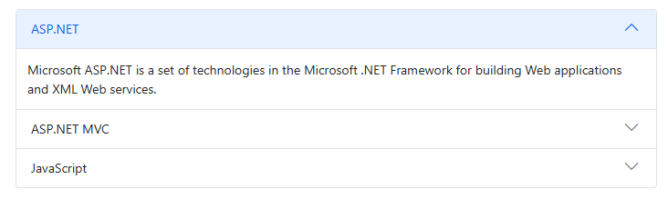
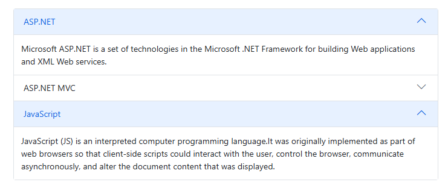
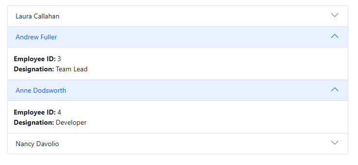

# Expand Mode in Blazor Accordion Component

 The [Blazor Accordion](https://www.syncfusion.com/blazor-components/blazor-accordion) component offers flexible control over how its items expand and collapse. You can configure the Accordion to allow only one item to be open at a time or to permit multiple items to remain expanded simultaneously. This behavior is managed through the [ExpandMode](https://help.syncfusion.com/cr/blazor/Syncfusion.Blazor.Navigations.SfAccordion.html#Syncfusion_Blazor_Navigations_SfAccordion_ExpandMode) property.

The Accordion supports two primary types of expand modes:

*   **Single**: Only one Accordion item can be expanded at any given time.
*   **Multiple**: Allows more than one Accordion item to be expanded concurrently.

## Single Expand Mode

The `Single` expand mode ensures that only one `AccordionItem` is expanded at a time. If a new item is expanded, any previously expanded item automatically collapses, maintaining a focused view for the user. This is ideal for scenarios where screen space is limited or when the content of each item requires exclusive attention.

To enable this mode, set the `ExpandMode` property of the `SfAccordion` component to `ExpandMode.Single`.

```cshtml

@using Syncfusion.Blazor.Navigations

<SfAccordion ExpandMode="ExpandMode.Single">
    <AccordionItems>
        <AccordionItem Expanded="true" Header="ASP.NET" Content="Microsoft ASP.NET is a set of technologies in the Microsoft .NET Framework for building Web applications and XML Web services."></AccordionItem>
        <AccordionItem Header="ASP.NET MVC" Content="The Model-View-Controller (MVC) architectural pattern separates an application into three main components: the model, the view, and the controller."></AccordionItem>
        <AccordionItem Header="JavaScript" Content="JavaScript (JS) is an interpreted computer programming language. It was originally implemented as part of web browsers so that client-side scripts could interact with the user, control the browser, communicate asynchronously, and alter the document content that was displayed."></AccordionItem>
    </AccordionItems>
</SfAccordion>

```





## Multiple

The default [ExpandMode](https://help.syncfusion.com/cr/blazor/Syncfusion.Blazor.Navigations.SfAccordion.html#Syncfusion_Blazor_Navigations_SfAccordion_ExpandMode) of the Accordion is `Multiple`. It enables you to expand more than one Accordion item at a time. Expand/collapse action can also be toggled by clicking on it again. For example, expanded item is collapsed when you click on it again.
To enable this mode, you can either explicitly set `ExpandMode="ExpandMode.Multiple"` (though it's the default) or omit the ExpandMode property entirely.

```cshtml

@using Syncfusion.Blazor.Navigations

<SfAccordion ExpandMode="ExpandMode.Multiple" @bind-ExpandedIndices=ExpandItems>
    <AccordionItems>
        <AccordionItem Header="ASP.NET" Content="Microsoft ASP.NET is a set of technologies in the Microsoft .NET Framework for building Web applications and XML Web services."></AccordionItem>
        <AccordionItem Header="ASP.NET MVC" Content="The Model-View-Controller (MVC) architectural pattern separates an application into three main components: the model, the view, and the controller."></AccordionItem>
        <AccordionItem Header="JavaScript" Content="JavaScript (JS) is an interpreted computer programming language. It was originally implemented as part of web browsers so that client-side scripts could interact with the user, control the browser, communicate asynchronously, and alter the document content that was displayed."></AccordionItem>
    </AccordionItems>
</SfAccordion>

@code {
    public int[] ExpandItems = new int[] { 0, 2 };
}

```





## Expanding the items

By default, accordion items were in collapsed state on initial load. To expand a particular item(s) on initial load, either use the [ExpandedIndices](https://help.syncfusion.com/cr/blazor/Syncfusion.Blazor.Navigations.SfAccordion.html#Syncfusion_Blazor_Navigations_SfAccordion_ExpandedIndices) property or [Expanded](https://help.syncfusion.com/cr/blazor/Syncfusion.Blazor.Navigations.AccordionItem.html#Syncfusion_Blazor_Navigations_AccordionItem_Expanded) option within the [AccordionItem](https://help.syncfusion.com/cr/blazor/Syncfusion.Blazor.Navigations.AccordionItem.html) tag helper. In the following code example, the `ExpandedIndices` is used to expand the second and third item.

```cshtml
@using Syncfusion.Blazor.Navigations

<SfAccordion @bind-ExpandedIndices=ExpandItems>
    <AccordionItems>
        @foreach (AccordionData Item in AccordionItems)
        {
            <AccordionItem>
                <HeaderTemplate>
                    <div>@(Item.EmployeeName)</div>
                </HeaderTemplate>
                <ContentTemplate>
                    <div>
                        <div><b>Employee ID: </b>@Item.EmployeeId</div>
                        <div><b>Designation: </b>@Item.Designation</div>
                    </div>
                </ContentTemplate>
            </AccordionItem>
        }
    </AccordionItems>
</SfAccordion>

@code{
    public int[] ExpandItems = new int[] { 1, 2 };
    List<AccordionData> AccordionItems = new List<AccordionData>()
    {
        new AccordionData
        {
        EmployeeId = 1,
        EmployeeName = "Laura Callahan",
        Designation = "Product Manager",
        },
        new AccordionData
        {
        EmployeeId = 3,
        EmployeeName = "Andrew Fuller",
        Designation = "Team Lead",
        },
        new AccordionData
        {
        EmployeeId = 4,
        EmployeeName = "Anne Dodsworth",
        Designation = "Developer"
        },
        new AccordionData
        {
        EmployeeId = 5,
        EmployeeName = "Nancy Davolio",
        Designation = "Product Manager"
        }
    };

    public class AccordionData
    {
        public string EmployeeName { get; set; }
        public int EmployeeId { get; set; }
        public string Designation { get; set; }
    }
}

```



