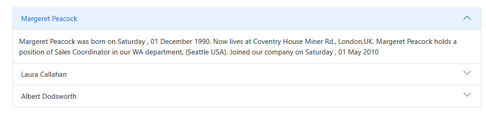
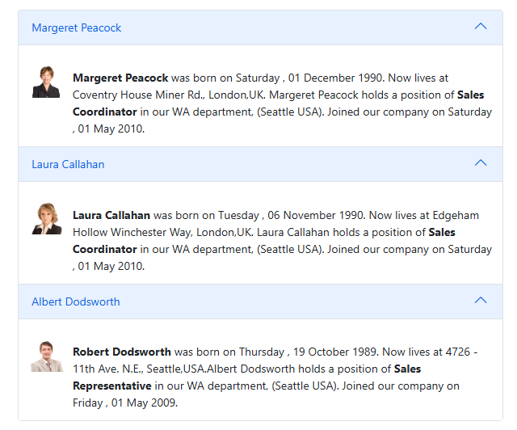

# Getting Started with Blazor Accordion Component

This section briefly explains about how to include a [Accordion](https://help.syncfusion.com/cr/blazor/Syncfusion.Blazor.Navigations.SfAccordion.html) in the Blazor server-side application. Refer [Getting Started with Syncfusion Blazor for Server-Side in Visual Studio 2019](../getting-started/blazor-server-side-visual-studio-2019/) page for the introduction and configuring the common specifications.

To get start quickly with Blazor Accordion, check on the following video:



## Importing Syncfusion Blazor component in the application

Any one of the following standards can be used to install the Syncfusion Blazor library in the application.

### Using Syncfusion Blazor individual NuGet Packages [New standard]

> Starting with Volume 4, 2020 (v18.4.0.30) release, Syncfusion provides [individual NuGet packages](https://blazor.syncfusion.com/documentation/nuget-packages) for the Syncfusion Blazor components. This new standard is highly recommended for the Blazor production applications. Refer to [this section](https://blazor.syncfusion.com/documentation/nuget-packages#benefits-of-using-individual-nuget-packages) to know the benefits of the individual NuGet packages.

1. Install [Syncfusion.Blazor.Navigations](https://www.nuget.org/packages/Syncfusion.Blazor.Navigations/) NuGet package to the application using the `NuGet Package Manager`.

2. Add the client-side style resources from the [NuGet](https://blazor.syncfusion.com/documentation/appearance/themes#static-web-assets) package in the `<head>` element of the **~/Pages/_Host.cshtml** page.

    ```html
    <head>
        ....
        ....
        <link href="_content/Syncfusion.Blazor.Themes/bootstrap4.css" rel="stylesheet" />
    </head>
    ```

    W> `Syncfusion.Blazor` package should not be installed along with the [individual NuGet packages](https://blazor.syncfusion.com/documentation/nuget-packages). Hence, add the above [Syncfusion.Blazor.Themes](https://www.nuget.org/packages/Syncfusion.Blazor.Themes/) static web assets (styles) in the application.

### Using Syncfusion.Blazor NuGet Package [Old standard]

W> If the above new standard ([individual NuGet packages](https://blazor.syncfusion.com/documentation/nuget-packages)) is preferred , then skip this section. Using both the old and new standards in the same application will throw ambiguous compilation errors.

1. Install **Syncfusion.Blazor** NuGet package to the newly created application by using the `NuGet Package Manager`.

2. Add the client-side style resources using [NuGet](https://blazor.syncfusion.com/documentation/appearance/themes#static-web-assets) package in the `<head>` element of the **~/Pages/_Host.cshtml** page.

    ```html
    <head>
        ....
        ....
        <link href="_content/Syncfusion.Blazor/styles/bootstrap4.css" rel="stylesheet" />
         @*<link href="https://cdn.syncfusion.com/blazor/{{ site.blazorversion }}/styles/bootstrap4.css" rel="stylesheet" />*@
    </head>
    ```

    > For Internet Explorer 11 kindly refer the polyfills. Refer the [documentation](../common/how-to/render-blazor-server-app-in-ie/) for more information.

    ```html
    <head>
        ...
            <link href="https://cdn.syncfusion.com/blazor/{{ site.blazorversion }}/styles/bootstrap4.css" rel="stylesheet" />
            <script src="https://github.com/Daddoon/Blazor.Polyfill/releases/download/3.0.1/blazor.polyfill.min.js"></script>
        ...
    </head>
    ```

## Adding component package to the application

Open the `~/_Imports.razor` file and import the `Syncfusion.Blazor.Navigations` package.

```cshtml
@using Syncfusion.Blazor.Navigations
```

## Add SyncfusionBlazor service in Startup file

Open the **Startup.cs** file and add services required by the Syncfusion components using the **services.AddSyncfusionBlazor()** method. Add this method in the **ConfigureServices** function as follows.

```c#
using Syncfusion.Blazor;

namespace BlazorApplication
{
    public class Startup
    {
        ....
        ....
        public void ConfigureServices(IServiceCollection services)
        {
            ....
            ....
            services.AddSyncfusionBlazor();
        }
    }
}
```

## Adding Accordion component to the application

Now, add the Syncfusion Blazor Accordion component in any web page (razor) in the `Pages` folder. For example, the Accordion component is added in the `~/Pages/Index.razor` page.

```cshtml
@using Syncfusion.Blazor.Navigations

<SfAccordion>
    <AccordionItems>
        <AccordionItem Header="Margeret Peacock" Content="Margeret Peacock was born on Saturday , 01 December 1990. Now lives at Coventry House Miner Rd., London,UK. Margeret Peacock holds a position of Sales Coordinator in our WA department, (Seattle USA). Joined our company on Saturday , 01 May 2010"></AccordionItem>
        <AccordionItem Header="Laura Callahan" Content="Laura Callahan was born on Tuesday , 06 November 1990. Now lives at Edgeham Hollow Winchester Way, London,UK. Laura Callahan holds a position of Sales Coordinator in our WA department, (Seattle USA). Joined our company on Saturday , 01 May 2010"></AccordionItem>
        <AccordionItem Header="Albert Dodsworth" Content="Albert Dodsworth was born on Thursday , 19 October 1989. Now lives at 4726 - 11th Ave. N.E., Seattle,USA.Albert Dodsworth holds a position of Sales Representative in our WA department, (Seattle USA). Joined our company on Friday , 01 May 2009"></AccordionItem>
    </AccordionItems>
</SfAccordion>
```

## Run the application

After successful compilation of the application, simply press `F5` to run the application.



## Initialize Accordion using Template

The following code explains how to initialize accordion using `Template`.

```cshtml
@using Syncfusion.Blazor.Navigations

<SfAccordion>
    <AccordionItems>
        <AccordionItem>
            <HeaderTemplate>
                <div>Margeret Peacock</div>
            </HeaderTemplate>
            <ContentTemplate>
                <div class='container'><div class='content'><b>Margeret Peacock</b> was born on Saturday , 01 December 1990. Now lives at Coventry House Miner Rd., London,UK. Margeret Peacock holds a position of <b>Sales Coordinator</b> in our WA department, (Seattle USA). Joined our company on Saturday , 01 May 2010.</div></div>">
            </ContentTemplate>
        </AccordionItem>
        <AccordionItem>
            <HeaderTemplate>
                <div>Laura Callahan</div>
            </HeaderTemplate>
            <ContentTemplate>
                <div class='container'><div class='content'><b>Laura Callahan</b> was born on Tuesday , 06 November 1990. Now lives at Edgeham Hollow Winchester Way, London,UK. Laura Callahan holds a position of <b>Sales Coordinator</b> in our WA department, (Seattle USA). Joined our company on Saturday , 01 May 2010.</div></div>
            </ContentTemplate>
        </AccordionItem>
        <AccordionItem>
            <HeaderTemplate>
                <div>Albert Dodsworth</div>
            </HeaderTemplate>
            <ContentTemplate>
                <div class='container'><div class='content'> <b>Albert Dodsworth</b> was born on Thursday , 19 October 1989. Now lives at 4726 - 11th Ave. N.E., Seattle,USA.Albert Dodsworth holds a position of <b>Sales Representative</b> in our WA department, (Seattle USA). Joined our company on Friday , 01 May 2009.</div></div>
            </ContentTemplate>
        </AccordionItem>
    </AccordionItems>
</SfAccordion>

<style>
    img {
        height: 40px;
        width: 50px;
        margin-top: 13px;
    }

    .container {
        display: inline-flex;
        width: auto;
        padding: 0;
    }

    .content {
        margin-left: 10px;
    }
</style>
```



## See Also

1. [Getting Started with Syncfusion Blazor for client-side in .NET Core CLI](../getting-started/blazor-webassembly-dotnet-cli/)
2. [Getting Started with Syncfusion Blazor for client-side in Visual Studio 2019](../getting-started/blazor-webassembly-visual-studio-2019/)
3. [Getting Started with Syncfusion Blazor for server-side in .NET Core CLI](../getting-started/blazor-server-side-dotnet-cli/)