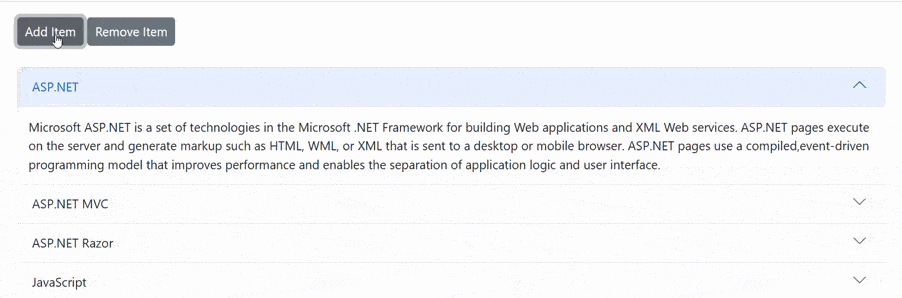

# Dynamically Add or Remove Accordion Items in Blazor Accordion Component

You can dynamically add or remove Accordion items by iterating through the Accordion Items using a conditional **foreach** loop.

In the following example, the Accordion initially contains three accordion items in the [AccordionItems](https://help.syncfusion.com/cr/blazor/Syncfusion.Blazor.Navigations.AccordionItems.html) collection. When you click the `Add Item` button, a new item is added to the `AccordionItems` collection, resulting in the addition of a fourth accordion item to the component. When you click the `Remove Item` button, the first item in the `AccordionItems` collection is removed from the Accordion component.

```cshtml
@using Syncfusion.Blazor.Navigations
@using Syncfusion.Blazor.Buttons

<SfButton @onclick="AddItemClick" Content="Add Item"></SfButton>
<SfButton @onclick="RemoveItemClick" Content="Remove Item"></SfButton>
<br />
<br />

<SfAccordion>
    <AccordionItems>
        @foreach (AccordionData Item in AccordionItems)
        {
            <AccordionItem @bind-Expanded=@Item.IsExpanded>
                <HeaderTemplate>
                    <div>@(Item.Header)</div>
                </HeaderTemplate>
                <ContentTemplate>
                    <div>@(Item.Content)</div>
                </ContentTemplate>
            </AccordionItem>
        }
    </AccordionItems>
</SfAccordion>

@code {
    List<AccordionData> AccordionItems = new List<AccordionData>()
    {
        new AccordionData
        {
        Header = "ASP.NET",
        Content = "Microsoft ASP.NET is a set of technologies in the Microsoft .NET Framework for building Web applications and XML Web services. ASP.NET pages execute on the server and generate markup such as HTML, WML, or XML that is sent to a desktop or mobile browser. ASP.NET pages use a compiled, event-driven programming model that improves performance and enables the separation of application logic and user interface.",
        IsExpanded = true
        },
        new AccordionData
        {
        Header = "ASP.NET MVC",
        Content = "The Model-View-Controller (MVC) architectural pattern separates an application into three main components: the model, the view, and the controller. The ASP.NET MVC framework provides an alternative to the ASP.NET Web Forms pattern for creating Web applications. The ASP.NET MVC framework is a lightweight, highly testable presentation framework that (as with Web Forms-based applications) is integrated with existing ASP.NET features, such as master pages and membership-based authentication.",
        IsExpanded = false
        },
        new AccordionData
        {
        Header = "ASP.NET Razor",
        Content = "Razor is an ASP.NET programming syntax used to create dynamic web pages with the C# or Visual Basic .NET programming languages. Razor was in development in June 2010 and was released for Microsoft Visual Studio 2010 in January 2011. Razor is a simple-syntax view engine and was released as part of MVC 3 and the WebMatrix tool set. Side Code content",
        IsExpanded = false
        }
    };
    public class AccordionData
    {
        public string Header { get; set; }
        public string Content { get; set; }
        public bool IsExpanded { get; set; }
    }
    void AddItemClick()
    {
        AccordionItems.Add(new AccordionData
        {
            Header = "JavaScript",
            Content = "JavaScript (JS) is an interpreted computer programming language. It was originally implemented as part of web browsers so that client-side scripts could interact with the user, control the browser, communicate asynchronously, and alter the document content that was displayed.",
            IsExpanded = false
        });
    }
    void RemoveItemClick()
    {
        if (AccordionItems.Count > 0)
        {
            AccordionItems.RemoveAt(0);
        }
    }
}
```





