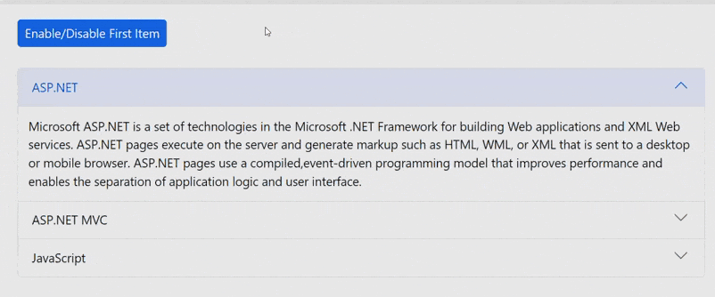

# Enable or Disable Item in Blazor Accordion Component

The Accordion component provides support to enable or disable specific accordion items using the accordion item's [Disabled](https://help.syncfusion.com/cr/blazor/Syncfusion.Blazor.Navigations.AccordionItem.html#Syncfusion_Blazor_Navigations_AccordionItem_Disabled) property.

In the following example, the first accordion item is enabled or disabled dynamically when the **Enable/Disable First Item** button is clicked.

```cshtml
@using Syncfusion.Blazor.Navigations
@using Syncfusion.Blazor.Buttons

<SfButton IsPrimary="true" @onclick="EnableItemClick" Content="Enable/Disable First Item"></SfButton>
<br />
<br />
<SfAccordion>
    <AccordionItems>
        <AccordionItem Disabled=@IsEnable Expanded="true" Header="ASP.NET" Content="Microsoft ASP.NET is a set of technologies in the Microsoft .NET Framework for building Web applications and XML Web services. ASP.NET pages execute on the server and generate markup such as HTML, WML, or XML that is sent to a desktop or mobile browser. ASP.NET pages use a compiled,event-driven programming model that improves performance and enables the separation of application logic and user interface."></AccordionItem>
        <AccordionItem Header="ASP.NET MVC" Content="The Model-View-Controller (MVC) architectural pattern separates an application into three main components: the model, the view, and the controller. The ASP.NET MVC framework provides an alternative to the ASP.NET Web Forms pattern for creating Web applications. The ASP.NET MVC framework is a lightweight, highly testable presentation framework that (as with Web Forms-based applications) is integrated with existing ASP.NET features, such as master pages and membership-based authentication."></AccordionItem>
        <AccordionItem Header="JavaScript" Content="JavaScript (JS) is an interpreted computer programming language.It was originally implemented as part of web browsers so that client-side scripts could interact with the user, control the browser, communicate asynchronously, and alter the document content that was displayed.More recently, however, it has become common in both game development and the creation of desktop applications."></AccordionItem>
    </AccordionItems>
</SfAccordion>

@code {
    public bool IsEnable { get; set; } = false;
    public void EnableItemClick()
    {
        IsEnable = !IsEnable;
    }
}
```




