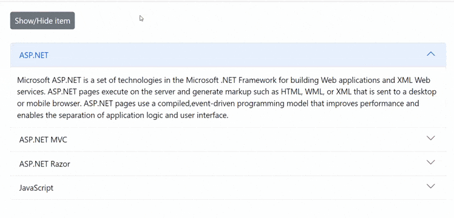

# Show/Hide Accordion Item in Blazor Accordion Component

The Syncfusion Blazor Accordion component provides robust mechanisms to dynamically control the visibility of its items. This is particularly useful for building adaptive user interfaces where content needs to be conditionally displayed or hidden based on user actions, permissions, or application state. There are primarily two approaches to achieve this: using conditional rendering (`@if`) or leveraging the `Visible` property of the `AccordionItem`.

## Using conditional rendering

Conditional rendering involves using a Blazor `@if` statement around an `AccordionItem`. When the condition evaluates to `false`, the `AccordionItem` is completely removed from the DOM (Document Object Model). This means the item is not rendered at all, and its associated resources are released.

In the following example, an `AccordionItem` will be toggled between being present and completely absent from the DOM when the **Show/Hide item** button is clicked.

```cshtml
@using Syncfusion.Blazor.Navigations
@using Syncfusion.Blazor.Buttons

<SfButton @onclick="ShowHideItemClick" Content="Show/Hide item"></SfButton>
<br />
<br />

<SfAccordion>
    <AccordionItems>
        <AccordionItem Expanded="true">
            <HeaderTemplate>
                <div>ASP.NET</div>
            </HeaderTemplate>
            <ContentTemplate>
                <div>Microsoft ASP.NET is a set of technologies in the Microsoft .NET Framework for building Web applications and XML Web services. ASP.NET pages execute on the server and generate markup such as HTML, WML, or XML that is sent to a desktop or mobile browser. ASP.NET pages use a compiled, event-driven programming model that improves performance and enables the separation of application logic and user interface.</div>
            </ContentTemplate>
        </AccordionItem>
        @if (ShowItem)
        {
            <AccordionItem>
                <HeaderTemplate>
                    <div>ASP.NET MVC</div>
                </HeaderTemplate>
                <ContentTemplate>
                    <div>The Model-View-Controller (MVC) architectural pattern separates an application into three main components: the model, the view, and the controller. The ASP.NET MVC framework provides an alternative to the ASP.NET Web Forms pattern for creating Web applications. The ASP.NET MVC framework is a lightweight, highly testable presentation framework that (as with Web Forms-based applications) is integrated with existing ASP.NET features, such as master pages and membership-based authentication.</div>
                </ContentTemplate>
            </AccordionItem>
        }
        <AccordionItem>
            <HeaderTemplate>
                <div>ASP.NET Razor</div>
            </HeaderTemplate>
            <ContentTemplate>
                <div>Razor is an ASP.NET programming syntax used to create dynamic web pages with the C# or Visual Basic .NET programming languages. Razor was in development in June 2010 and was released for Microsoft Visual Studio 2010 in January 2011. Razor is a simple-syntax view engine and was released as part of MVC 3 and the WebMatrix tool set.</div>
            </ContentTemplate>
        </AccordionItem>
        <AccordionItem>
            <HeaderTemplate>
                <div>JavaScript</div>
            </HeaderTemplate>
            <ContentTemplate>
                <div>JavaScript (JS) is an interpreted computer programming language. It was originally implemented as part of web browsers so that client-side scripts could interact with the user, control the browser, communicate asynchronously, and alter the document content that was displayed.</div>
            </ContentTemplate>
        </AccordionItem>
    </AccordionItems>
</SfAccordion>

@code {
    public bool ShowItem = true;
    void ShowHideItemClick()
    {
        ShowItem = !ShowItem;
    }
}
```


## Using property

You can dynamically show or hide specific accordion items using the accordion item's [Visible](https://help.syncfusion.com/cr/blazor/Syncfusion.Blazor.Navigations.AccordionItem.html#Syncfusion_Blazor_Navigations_AccordionItem_Visible) property.

In the following example, the specified `AccordionItem` will be toggled between visible and hidden states using its Visible property when the **Show/Hide item** button is clicked.

```cshtml
@using Syncfusion.Blazor.Navigations
@using Syncfusion.Blazor.Buttons

<SfButton @onclick="ShowHideItemClick" Content="Show/Hide item"></SfButton>
<br />
<br />

<SfAccordion>
    <AccordionItems>
        <AccordionItem Expanded="true">
            <HeaderTemplate>
                <div>ASP.NET</div>
            </HeaderTemplate>
            <ContentTemplate>
                <div>Microsoft ASP.NET is a set of technologies in the Microsoft .NET Framework for building Web applications and XML Web services. ASP.NET pages execute on the server and generate markup such as HTML, WML, or XML that is sent to a desktop or mobile browser. ASP.NET pages use a compiled, event-driven programming model that improves performance and enables the separation of application logic and user interface.</div>
            </ContentTemplate>
        </AccordionItem>
        <AccordionItem Visible=@ShowItem>
            <HeaderTemplate>
                <div>ASP.NET MVC</div>
            </HeaderTemplate>
            <ContentTemplate>
                <div>The Model-View-Controller (MVC) architectural pattern separates an application into three main components: the model, the view, and the controller. The ASP.NET MVC framework provides an alternative to the ASP.NET Web Forms pattern for creating Web applications. The ASP.NET MVC framework is a lightweight, highly testable presentation framework that (as with Web Forms-based applications) is integrated with existing ASP.NET features, such as master pages and membership-based authentication.</div>
            </ContentTemplate>
        </AccordionItem>
        <AccordionItem>
            <HeaderTemplate>
                <div>ASP.NET Razor</div>
            </HeaderTemplate>
            <ContentTemplate>
                <div>Razor is an ASP.NET programming syntax used to create dynamic web pages with the C# or Visual Basic .NET programming languages. Razor was in development in June 2010 and was released for Microsoft Visual Studio 2010 in January 2011. Razor is a simple-syntax view engine and was released as part of MVC 3 and the WebMatrix tool set.</div>
            </ContentTemplate>
        </AccordionItem>
        <AccordionItem>
            <HeaderTemplate>
                <div>JavaScript</div>
            </HeaderTemplate>
            <ContentTemplate>
                <div>JavaScript (JS) is an interpreted computer programming language. It was originally implemented as part of web browsers so that client-side scripts could interact with the user, control the browser, communicate asynchronously, and alter the document content that was displayed.</div>
            </ContentTemplate>
        </AccordionItem>
    </AccordionItems>
</SfAccordion>

@code {
    public bool ShowItem = true;
    void ShowHideItemClick()
    {
        ShowItem = !ShowItem;
    }
}
```




