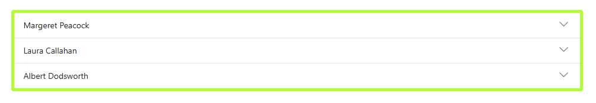
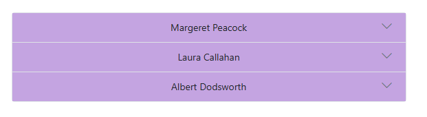
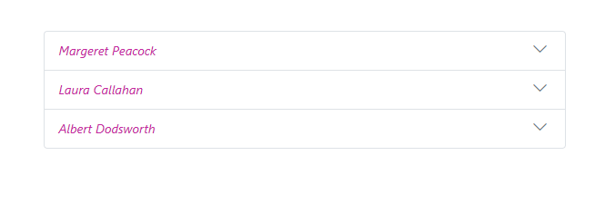
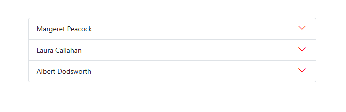
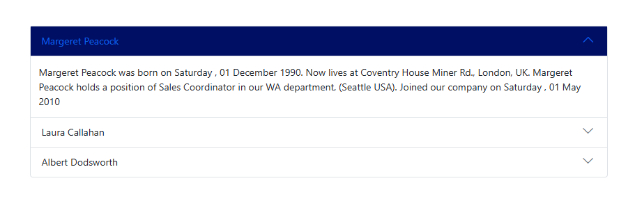
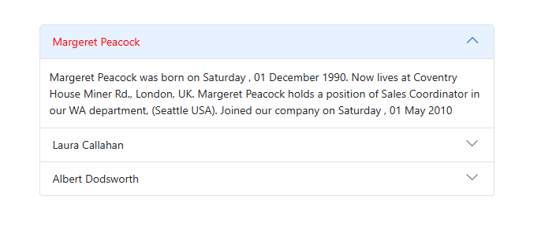
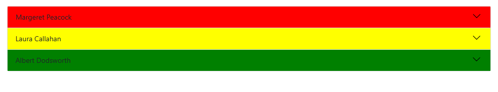

# Style and Appearance in Blazor Accordion Component

The following content provides the exact CSS structure that can be used to modify the control’s appearance based on the user preference.

## Customizing accordion

Use the following CSS to customize the [Accordion](https://help.syncfusion.com/cr/blazor/Syncfusion.Blazor.Navigations.SfAccordion.html).

```CSS

.e-accordion {
    border: 5px solid rgb(173, 255, 47);
}

```



## Customizing the accordion items

Use the following CSS to customize the items of Accordion.

```CSS

.e-accordion .e-acrdn-item.e-select {
    text-align: center;
    background-color: #a76cdd;
}

```



## Customizing accordion item header content

Use the following CSS to customize the header content of Accordion control.

```CSS

.e-accordion .e-acrdn-item .e-acrdn-header .e-acrdn-header-content {
    color: #c526a1;
    font-style: italic;
}

```



## Customizing accordion expand and collapse icons

The following CSS can be viewed to customize the expand and collapse icons of the Accordion control.

```CSS

.e-accordion .e-acrdn-item .e-acrdn-header .e-toggle-icon .e-icons {
     color: #ff0000;
}

```



## Customizing the hover state of accordion

Use the following CSS to customize the [accordion item](https://help.syncfusion.com/cr/blazor/Syncfusion.Blazor.Navigations.AccordionItem.html) when hovering.

```CSS

.e-accordion .e-acrdn-item .e-acrdn-header:hover {
    border: 2px solid gray;
}

```

## Customizing selected item of accordion

Use the following CSS to customize the selected accordion item and focus state.

```CSS

.e-accordion .e-acrdn-item.e-select.e-selected.e-expand-state>.e-acrdn-header, 
.e-accordion .e-acrdn-item.e-select.e-expand-state>.e-acrdn-header,
.e-accordion .e-acrdn-item.e-selected.e-select>.e-acrdn-header,
.e-accordion .e-acrdn-item.e-selected.e-select.e-expand-state>.e-acrdn-header:focus {
    background-color: rgb(0, 15, 100);
}

```



Use the following CSS to customize the selected accordion item text.

```CSS

.e-accordion .e-acrdn-item.e-select.e-selected.e-expand-state>.e-acrdn-header .e-acrdn-header-content,
.e-accordion .e-acrdn-item.e-select.e-expand-state>.e-acrdn-header .e-acrdn-header-content,
.e-accordion .e-acrdn-item.e-selected>.e-acrdn-header>.e-acrdn-header-content {
    color: #ff0000;
}

```



## Customize each accordion item header

You can customize each accordion item header by setting [AccordionItem.CssClass](https://help.syncfusion.com/cr/blazor/Syncfusion.Blazor.Navigations.AccordionItem.html#Syncfusion_Blazor_Navigations_AccordionItem_CssClass) property.

```cshtml

@using Syncfusion.Blazor.Navigations

<SfAccordion>
    <AccordionItems>
        <AccordionItem CssClass="margaret-class" Header="Margeret Peacock" Content="Margeret Peacock was born on Saturday , 01 December 1990. Now lives at Coventry House Miner Rd., London,UK. Margeret Peacock holds a position of Sales Coordinator in our WA department, (Seattle USA). Joined our company on Saturday , 01 May 2010"></AccordionItem>
        <AccordionItem CssClass="laura-class" Header="Laura Callahan" Content="Laura Callahan was born on Tuesday , 06 November 1990. Now lives at Edgeham Hollow Winchester Way, London,UK. Laura Callahan holds a position of Sales Coordinator in our WA department, (Seattle USA). Joined our company on Saturday , 01 May 2010"></AccordionItem>
        <AccordionItem CssClass="albert-class" Header="Albert Dodsworth" Content="Albert Dodsworth was born on Thursday , 19 October 1989. Now lives at 4726 - 11th Ave. N.E., Seattle,USA.Albert Dodsworth holds a position of Sales Representative in our WA department, (Seattle USA). Joined our company on Friday , 01 May 2009"></AccordionItem>
    </AccordionItems>
</SfAccordion>

<style>
    .e-accordion .e-acrdn-item .e-acrdn-header .e-toggle-icon .e-icons {
        color: black;
    }
    .e-accordion .margaret-class.e-acrdn-item.e-select > .e-acrdn-header {
     background: red;
    }
    .e-accordion .laura-class.e-acrdn-item.e-select > .e-acrdn-header {
     background: yellow;
    }
    .e-accordion .albert-class.e-acrdn-item.e-select > .e-acrdn-header {
     background: green;
    }
</style>

```




