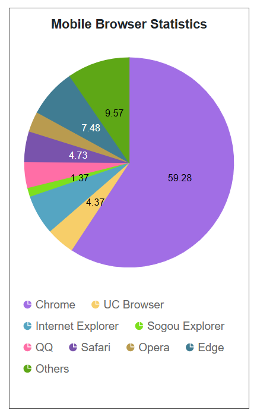

# Adaptive Layout in Blazor Accumulation Chart Component

When viewing the accumulation chart on mobile devices, some elements may not display properly due to limited screen space. The **Syncfusion<sup style="font-size:70%">&reg;</sup> Accumulation Chart Adaptive Layout** feature dynamically adjusts chart elements for optimal display based on screen size and orientation. Enable the `EnableAdaptiveRendering` property to allow the chart to automatically adapt to container size changes, ensuring clear alignment and visibility of elements such as the legend, data labels, chart title, and more.

```cshtml

@using Syncfusion.Blazor.Charts

<SfAccumulationChart Title="Mobile Browser Statistics" SubTitle="Browser and Users" EnableAdaptiveRendering="true" Width="300px" Height="400px">
    <AccumulationChartBorder Color="black" Width="1"></AccumulationChartBorder>
    <AccumulationChartSeriesCollection>
        <AccumulationChartSeries DataSource="@PieChartPoints" Explode="true" XName="Browser" YName="Users" Name="Browser" Type="AccumulationType.Pie">
            <AccumulationDataLabelSettings Visible="true" Position="AccumulationLabelPosition.Inside" Name="DataLabelMappingName"></AccumulationDataLabelSettings>
        </AccumulationChartSeries>
    </AccumulationChartSeriesCollection>
    <AccumulationChartTooltipSettings Enable="true"></AccumulationChartTooltipSettings>
    <AccumulationChartLegendSettings Visible="true" Position="LegendPosition.Right"></AccumulationChartLegendSettings>
</SfAccumulationChart>

@code {
    public class PieData
    {
        public string Browser { get; set; }
        public double Users { get; set; }
        public string DataLabelMappingName { get; set; }
    }

    public List<PieData> PieChartPoints { get; set; } = new List<PieData>
    {
        new PieData { Browser = "Chrome", Users = 59.28, DataLabelMappingName = "Chrome: 59.28%" },
        new PieData { Browser = "UC Browser", Users = 4.37, DataLabelMappingName = "UC Browser: 4.37%" },
        new PieData { Browser = "Internet Explorer", Users = 6.12, DataLabelMappingName = "Internet Explorer: 6 12%" },
        new PieData { Browser = "Sogou Explorer", Users = 1.37, DataLabelMappingName = "Sogou Explorer: 1.37%" },
        new PieData { Browser = "QQ", Users = 3.96, DataLabelMappingName = "QQ: 3.96%" },
        new PieData { Browser = "Safari", Users = 4.73, DataLabelMappingName = "Safari: 4.73%" },
        new PieData { Browser = "Opera", Users = 3.12, DataLabelMappingName = "Opera: 3.12%" },
        new PieData { Browser = "Edge", Users = 7.48, DataLabelMappingName = "Edge: 7.48%" },
        new PieData { Browser = "Others", Users = 9.57, DataLabelMappingName = "Others: 9.57%" }
    };
}

```



The table below outlines the behavior of chart elements under specific conditions determined by chart height and width:

| Element      | Size              | Behavior         |
|--------------|-------------------|------------------|
| Title  | <kbd>Height &lt; 200</kbd> / <kbd>Width &lt; 200</kbd> | Accumulation chart title is disabled |
| Sutitle | <kbd>Height &lt; 300</kbd> / <kbd>Width &lt; 300</kbd> | Accumulation chart subtitle is disabled |
| Datalabel | <kbd>Radius &lt; 300</kbd> / <kbd>Radius &lt; 200</kbd> | Data label moves inside / Datalabel is disabled |
| Legend | <kbd>Height &lt; 300</kbd> / <kbd>Width &lt; 300</kbd> | Moves bottom or top legend to the right if width is greater than 200px; otherwise, disabled / Moves right or left legend to bottom if height is greater than 200px; otherwise, disabled |

N> Refer to the [Blazor Charts](https://www.syncfusion.com/blazor-components/blazor-charts) feature tour page for its groundbreaking feature representations and also explore the [Blazor Accumulation Chart Example](https://blazor.syncfusion.com/demos/chart/pie?theme=bootstrap5) to know about the various features of accumulation charts and how it is used to represent numeric proportional data.

## See also

* [Data label](./data-labels)
* [Tooltip](./tool-tip)
* [Legend](./legend)
