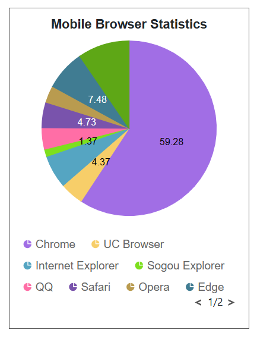
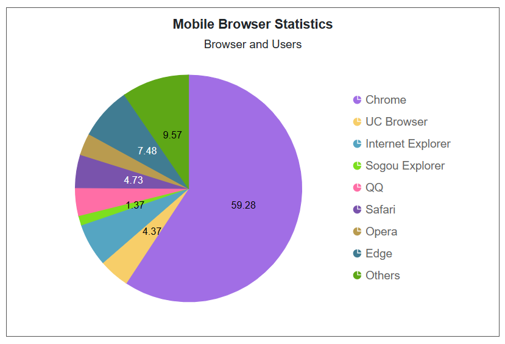

# Adaptive Layout in Blazor Accumulation Chart Component

Adaptive rendering in accumulation charts refers to a feature that dynamically adjusts chart elements to provide an optimal display based on the available screen size and orientation. By setting the `EnableAdaptiveRendering` property to **true**, the chart responds to changes in the container's size. This ensures that elements like the legend, data labels, and chart title adjust appropriately.

## Small Layout

The small layout is designed for screens with limited space. For example, with a width of 300px and height of 400px, chart elements adjust to fit the smaller screen.

* Legend Position - When the screen width is less than 300px and the legend is positioned on the right or left, it moves to the bottom of the chart to avoid overlapping the main chart area. This improves readability and ensures the data remains visible.

* Subtitle - On very small screens (e.g., 300px by 300px), the subtitle is hidden due to space limitations, keeping the chart clean and focused on essential data.


```cshtml 

@using Syncfusion.Blazor.Charts

<SfAccumulationChart Title="Mobile Browser Statistics" SubTitle="Browser and Users" EnableAdaptiveRendering="true" Width="300px" Height="400px">
    <AccumulationChartBorder Color="black" Width="1"></AccumulationChartBorder>
    <AccumulationChartSeriesCollection>
        <AccumulationChartSeries DataSource="@PieChartPoints" Explode="true" XName="Browser" YName="Users" Name="Browser" Type="AccumulationType.Pie">
            <AccumulationDataLabelSettings Visible="true" Position="AccumulationLabelPosition.Inside" Name="DataLabelMappingName"></AccumulationDataLabelSettings>
        </AccumulationChartSeries>
    </AccumulationChartSeriesCollection>
    <AccumulationChartTooltipSettings Enable="true"></AccumulationChartTooltipSettings>
    <AccumulationChartLegendSettings Visible="true" Position="LegendPosition.Right"></AccumulationChartLegendSettings>
</SfAccumulationChart>

@code {
    public class PieData
    {
        public string Browser { get; set; }
        public double Users { get; set; }
        public string DataLabelMappingName { get; set; }
    }

    public List<PieData> PieChartPoints { get; set; } = new List<PieData>
    {
        new PieData { Browser = "Chrome", Users = 59.28, DataLabelMappingName = "Chrome: 59.28%" },
        new PieData { Browser = "UC Browser", Users = 4.37, DataLabelMappingName = "UC Browser: 4.37%" },
        new PieData { Browser = "Internet Explorer", Users = 6.12, DataLabelMappingName = "Internet Explorer: 6.12%" },
        new PieData { Browser = "Sogou Explorer", Users = 1.37, DataLabelMappingName = "Sogou Explorer: 1.37%" },
        new PieData { Browser = "QQ", Users = 3.96, DataLabelMappingName = "QQ: 3.96%" },
        new PieData { Browser = "Safari", Users = 4.73, DataLabelMappingName = "Safari: 4.73%" },
        new PieData { Browser = "Opera", Users = 3.12, DataLabelMappingName = "Opera: 3.12%" },
        new PieData { Browser = "Edge", Users = 7.48, DataLabelMappingName = "Edge: 7.48%" },
        new PieData { Browser = "Others", Users = 9.57, DataLabelMappingName = "Others: 9.57%" },
    };
}

```



## Large Layout

The large layout is designed for larger screens, where there’s enough space to show all elements clearly without crowding. For example, with a width of 600px and height of 400px, the chart can display more information.

In this layout, all chart elements, such as the legend, chart title, subtitle, and data labels, are visible. Since the screen has enough space, elements remain in their usual positions, providing a complete and detailed chart view without any elements being hidden or repositioned.

```cshtml 

@using Syncfusion.Blazor.Charts

<SfAccumulationChart Title="Mobile Browser Statistics" SubTitle="Browser and Users" EnableAdaptiveRendering="true" Width="600px" Height="400px">
    <AccumulationChartBorder Color="black" Width="1"></AccumulationChartBorder>
    <AccumulationChartSeriesCollection>
        <AccumulationChartSeries DataSource="@PieChartPoints" Explode="true" XName="Browser" YName="Users" Name="Browser" Type="AccumulationType.Pie">
            <AccumulationDataLabelSettings Visible="true" Position="AccumulationLabelPosition.Inside" Name="DataLabelMappingName"></AccumulationDataLabelSettings>
        </AccumulationChartSeries>
    </AccumulationChartSeriesCollection>
    <AccumulationChartTooltipSettings Enable="true"></AccumulationChartTooltipSettings>
    <AccumulationChartLegendSettings Visible="true" Position="LegendPosition.Right"></AccumulationChartLegendSettings>
</SfAccumulationChart>

@code {
    public class PieData
    {
        public string Browser { get; set; }
        public double Users { get; set; }
        public string DataLabelMappingName { get; set; }
    }

    public List<PieData> PieChartPoints { get; set; } = new List<PieData>
    {
        new PieData { Browser = "Chrome", Users = 59.28, DataLabelMappingName = "Chrome: 59.28%" },
        new PieData { Browser = "UC Browser", Users = 4.37, DataLabelMappingName = "UC Browser: 4.37%" },
        new PieData { Browser = "Internet Explorer", Users = 6.12, DataLabelMappingName = "Internet Explorer: 6.12%" },
        new PieData { Browser = "Sogou Explorer", Users = 1.37, DataLabelMappingName = "Sogou Explorer: 1.37%" },
        new PieData { Browser = "QQ", Users = 3.96, DataLabelMappingName = "QQ: 3.96%" },
        new PieData { Browser = "Safari", Users = 4.73, DataLabelMappingName = "Safari: 4.73%" },
        new PieData { Browser = "Opera", Users = 3.12, DataLabelMappingName = "Opera: 3.12%" },
        new PieData { Browser = "Edge", Users = 7.48, DataLabelMappingName = "Edge: 7.48%" },
        new PieData { Browser = "Others", Users = 9.57, DataLabelMappingName = "Others: 9.57%" },
    };
}

```



The table below shows the different chart elements and their behavior based on specific conditions related to chart's height and width:


| Element      | Rules              | Description         |
|--------------|------------------  |---------------------|
| Title  | <kbd>Height &lt; 200px</kbd> or <kbd>Width &lt; 200px</kbd> | Removed chart title |
| Sutitle | <kbd>Height &lt; 300px</kbd> or <kbd>Width &lt; 300px</kbd> | Removed chart subtitle |
| Datalabel <br> (Outise Position) | <kbd>Radius &lt; 300</kbd> | Datalabel moves to inside position |
| Datalabel <br> (Both Inside and Outside Position) | <kbd>Radius &lt; 200</kbd> | Disabled Datalabel |
| Legend Position <br> (Top/Bottom) | <kbd>Height &lt; 300px</kbd> | Moves to the right if width is greater than 200px; otherwise disabled |
| Legend Position <br> (Right/Left) | <kbd>Width &lt; 300px</kbd>  | Moves to the bottom if height is greater than 200px; otherwise disabled |
| Legend Position <br> (Custom) | <kbd>Height &lt; 200px</kbd> | Legend is disabled |

N> Refer to the [Blazor Charts](https://www.syncfusion.com/blazor-components/blazor-charts) feature tour page for its groundbreaking feature representations and also explore the [Blazor Accumulation Chart Example](https://blazor.syncfusion.com/demos/chart/pie?theme=bootstrap5) to know about the various features of accumulation charts and how it is used to represent numeric proportional data.

## See also

* [Data Label](./data-labels)
* [Tooltip](./tool-tip)
* [Legend](./legend)