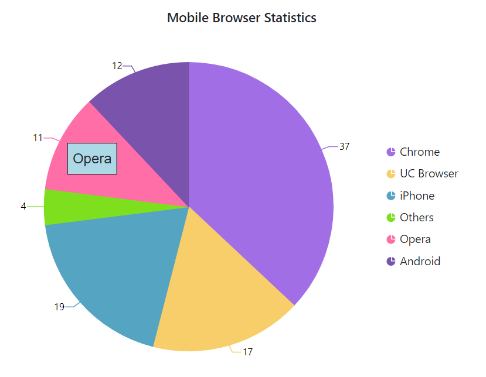
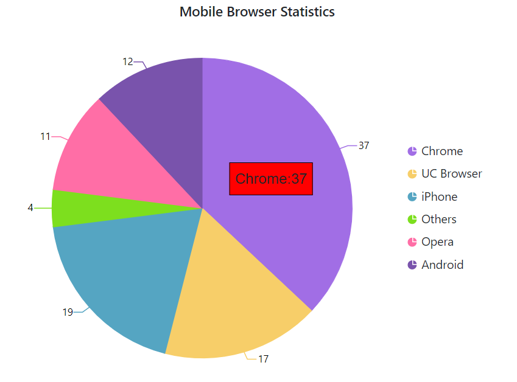

# Annotation

Annotations are used to mark the specific area of interest in the chart with texts, shapes or images. By using the [`Content`](https://help.syncfusion.com/cr/blazor/Syncfusion.Blazor.Charts.AccumulationChartAnnotation.html#Syncfusion_Blazor_Charts_AccumulationChartAnnotation_Content) option of annotation property, you can specify the Id of the HTML element that needs to be displayed in the chart.





## Region

The annotation can be placed with respect to `Series` or `Chart`.





## Co-ordinate Units

Specifies the [`CoordinateUnits`](https://help.syncfusion.com/cr/blazor/Syncfusion.Blazor.Charts.AccumulationChartAnnotation.html#Syncfusion_Blazor_Charts_AccumulationChartAnnotation_CoordinateUnits) of an annotation either in `Pixel` or `Point`.





