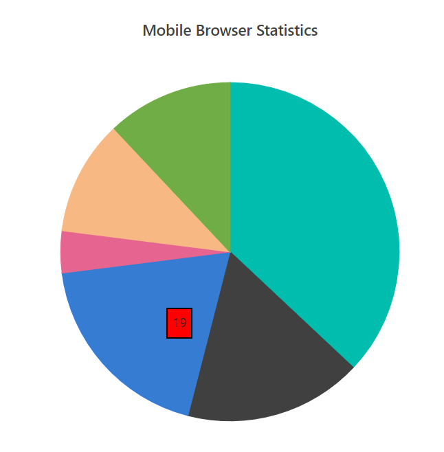

# Annotation in Blazor Accumulation Chart Component

Annotations are texts, shapes, or images that are used to highlight a specific region of interest in a chart. The [AccumulationChartAnnotation](https://help.syncfusion.com/cr/blazor/Syncfusion.Blazor.Charts.AccumulationChartAnnotation.html) property allows to add annotations to the chart. Specify the element that needs to be displayed in the accumulation chart area by using the [Content](https://help.syncfusion.com/cr/blazor/Syncfusion.Blazor.Charts.AccumulationChartAnnotation.html#Syncfusion_Blazor_Charts_AccumulationChartAnnotation_Content) property of the annotation.

```cshtml 

@using Syncfusion.Blazor.Charts

<SfAccumulationChart Title="Mobile Browser Statistics">
    <AccumulationChartSeriesCollection>
        <AccumulationChartSeries DataSource="@StatisticsDetails" XName="Browser" YName="Users" Name="Browser">
            <AccumulationDataLabelSettings Visible="true" Name="Text" Position="AccumulationLabelPosition.Outside"></AccumulationDataLabelSettings>
        </AccumulationChartSeries>
    </AccumulationChartSeriesCollection>

    <AccumulationChartAnnotations>
        <AccumulationChartAnnotation X="Opera" Y="11" CoordinateUnits="@Syncfusion.Blazor.Charts.Units.Point" Region="@Syncfusion.Blazor.Charts.Regions.Series">
            <ContentTemplate>
                <div style='border: 1px solid black;background-color:red;padding: 5px 5px 5px 5px'>19</div>
            </ContentTemplate>
        </AccumulationChartAnnotation>
    </AccumulationChartAnnotations>
</SfAccumulationChart>

@code{
    public class Statistics
    {
        public string Browser { get; set; }
        public double Users { get; set; }
    }

    public List<Statistics> StatisticsDetails = new List<Statistics>
	{
        new Statistics { Browser = "Chrome", Users = 37 },
        new Statistics { Browser = "UC Browser", Users = 17 },
        new Statistics { Browser = "iPhone", Users = 19 },
        new Statistics { Browser = "Others", Users = 4  },
        new Statistics { Browser = "Opera", Users = 11 },
        new Statistics { Browser = "Android", Users = 12 },
    };
}

```


<!--  -->

## Region

The [Region](https://help.syncfusion.com/cr/blazor/Syncfusion.Blazor.Charts.AccumulationChartAnnotation.html#Syncfusion_Blazor_Charts_AccumulationChartAnnotation_Region) property can be used to insert annotations in relation to a series or a chart. By default, it is positioned with respect to a [Accumulation Chart](https://help.syncfusion.com/cr/blazor/Syncfusion.Blazor.Charts.Regions.html#Syncfusion_Blazor_Charts_Regions_Chart).

```cshtml 

@using Syncfusion.Blazor.Charts

<SfAccumulationChart Title="Mobile Browser Statistics">
    <AccumulationChartSeriesCollection>
        <AccumulationChartSeries DataSource="@StatisticsDetails" XName="Browser" YName="Users" Name="Browser">
            <AccumulationDataLabelSettings Visible="true" Name="Text" Position="AccumulationLabelPosition.Outside"></AccumulationDataLabelSettings>
        </AccumulationChartSeries>
    </AccumulationChartSeriesCollection>

    <AccumulationChartAnnotations>
        <AccumulationChartAnnotation X=130 Y=180 CoordinateUnits="@Syncfusion.Blazor.Charts.Units.Pixel" Region="@Syncfusion.Blazor.Charts.Regions.Chart">
            <ContentTemplate>
                <div style='border: 1px solid black;background-color:lightblue;padding: 5px 5px 5px 5px'>Opera</div>
            </ContentTemplate>
        </AccumulationChartAnnotation>
    </AccumulationChartAnnotations>
</SfAccumulationChart>

@code{
    public class Statistics
    {
        public string Browser { get; set; }
        public double Users { get; set; }
    }

    public List<Statistics> StatisticsDetails = new List<Statistics>
	{
        new Statistics { Browser = "Chrome", Users = 37 },
        new Statistics { Browser = "UC Browser", Users = 17 },
        new Statistics { Browser = "iPhone", Users = 19 },
        new Statistics { Browser = "Others", Users = 4  },
        new Statistics { Browser = "Opera", Users = 11 },
        new Statistics { Browser = "Android", Users = 12 },
    };
}

```


<!--  -->

## Co-ordinate units

The [CoordinateUnits](https://help.syncfusion.com/cr/blazor/Syncfusion.Blazor.Charts.AccumulationChartAnnotation.html#Syncfusion_Blazor_Charts_AccumulationChartAnnotation_CoordinateUnits) property allows to specify the annotation's coordinate units either in [Pixel](https://help.syncfusion.com/cr/blazor/Syncfusion.Blazor.Charts.Units.html#Syncfusion_Blazor_Charts_Units_Pixel) or [Point](https://help.syncfusion.com/cr/blazor/Syncfusion.Blazor.Charts.Units.html#Syncfusion_Blazor_Charts_Units_Point).

```cshtml 

@using Syncfusion.Blazor.Charts

<SfAccumulationChart Title="Mobile Browser Statistics">
    <AccumulationChartSeriesCollection>
        <AccumulationChartSeries DataSource="@StatisticsDetails" XName="Browser" YName="Users" Name="Browser">
            <AccumulationDataLabelSettings Visible="true" Name="Text" Position="AccumulationLabelPosition.Outside"></AccumulationDataLabelSettings>
        </AccumulationChartSeries>
    </AccumulationChartSeriesCollection>

    <AccumulationChartAnnotations>
        <AccumulationChartAnnotation X="Chrome" Y="37" CoordinateUnits="@Syncfusion.Blazor.Charts.Units.Point" Region="@Syncfusion.Blazor.Charts.Regions.Series">
            <ContentTemplate>
                <div style='border: 1px solid black;background-color:red;padding: 5px 5px 5px 5px'>Chrome:37</div>
            </ContentTemplate>
        </AccumulationChartAnnotation>
    </AccumulationChartAnnotations>
</SfAccumulationChart>

@code{
    public class Statistics
    {
        public string Browser { get; set; }
        public double Users { get; set; }
    }

    public List<Statistics> StatisticsDetails = new List<Statistics>
	{
        new Statistics { Browser = "Chrome", Users = 37 },
        new Statistics { Browser = "UC Browser", Users = 17 },
        new Statistics { Browser = "iPhone", Users = 19 },
        new Statistics { Browser = "Others", Users = 4  },
        new Statistics { Browser = "Opera", Users = 11 },
        new Statistics { Browser = "Android", Users = 12 },
    };
}

```


<!--  -->

N> Refer to the [Blazor Charts](https://www.syncfusion.com/blazor-components/blazor-charts) feature tour page for its groundbreaking feature representations and also explore the [Blazor Accumulation Chart Example](https://blazor.syncfusion.com/demos/chart/pie?theme=bootstrap5) to know about the various features of accumulation charts and how it is used to represent numeric proportional data.

## See also

* [Data Label](./data-labels)
* [Tooltip](./tool-tip)
* [Legend](./legend)