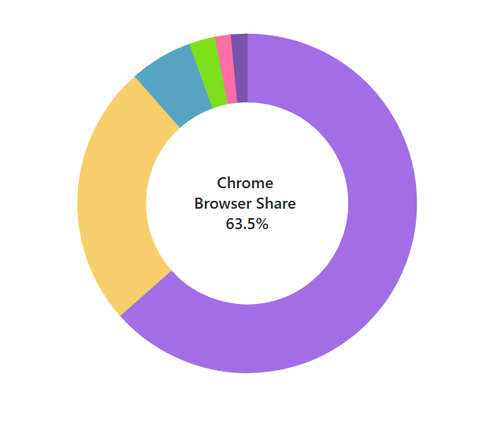

# Center Label in Blazor Accumulation Chart Component

The Center Label feature enables you to place custom text in the center of pie and doughnut charts using `AccumulationChartCenterLabel`. This is particularly useful for showing chart's title, percentage distribution, or other important metrics related to the data being visualized.

You can configure the text displayed in the center using the `Text` property within the `AccumulationChartCenterLabel`. This allows you to customize what information is shown at the focal point of your chart.

```cshtml
@using Syncfusion.Blazor.Charts

<SfAccumulationChart>
    <AccumulationChartCenterLabel Text="Mobile Browser<br>Statistics 2024">
    </AccumulationChartCenterLabel>
    <AccumulationChartLegendSettings Visible="false"></AccumulationChartLegendSettings>
    <AccumulationChartSeriesCollection>
        <AccumulationChartSeries DataSource="@DoughnutChartPoints" XName="Browser" YName="Users" InnerRadius="60%">
        </AccumulationChartSeries>
    </AccumulationChartSeriesCollection>
</SfAccumulationChart>

@code {
    public List<DoughnutData> DoughnutChartPoints { get; set; } = new List<DoughnutData>
    {
        new DoughnutData { Browser = "Chrome", Users = 63.5, DataLabelMappingName = "Chrome: 63.5%"},
        new DoughnutData { Browser = "Safari", Users = 25.0, DataLabelMappingName = "Safari: 25.0%"},
        new DoughnutData { Browser = "Samsung Internet", Users = 6.0, DataLabelMappingName = "Samsung Internet: 6.0%"},
        new DoughnutData { Browser = "UC Browser", Users = 2.5, DataLabelMappingName = "UC Browser: 2.5%"},
        new DoughnutData { Browser = "Opera", Users = 1.5, DataLabelMappingName = "Opera: 1.5%"},
        new DoughnutData { Browser = "Others", Users = 1.5, DataLabelMappingName = "Others: 1.5%"}
    };
    public class DoughnutData
    {
        public string Browser { get; set; }
        public double Users { get; set; }
        public string DataLabelMappingName { get; set; }
    }
}
```


## Hover Text

The center label text updates dynamically when hovering over chart slices using the `HoverTextFormat` property. This interactive feature enhances user engagement by providing relevant information about specific segments during exploration of the visualization.

```cshtml
@using Syncfusion.Blazor.Charts

<SfAccumulationChart>
    <AccumulationChartCenterLabel Text="Mobile Browser<br>Statistics 2024" HoverTextFormat="${point.x} <br> Browser Share <br> ${point.y}%">
    </AccumulationChartCenterLabel>
    <AccumulationChartLegendSettings Visible="false"></AccumulationChartLegendSettings>
    <AccumulationChartSeriesCollection>
        <AccumulationChartSeries DataSource="@DoughnutChartPoints" XName="Browser" YName="Users" InnerRadius="60%">
        </AccumulationChartSeries>
    </AccumulationChartSeriesCollection>
</SfAccumulationChart>

@code {
    public List<DoughnutData> DoughnutChartPoints { get; set; } = new List<DoughnutData>
    {
        new DoughnutData { Browser = "Chrome", Users = 63.5, DataLabelMappingName = "Chrome: 63.5%"},
        new DoughnutData { Browser = "Safari", Users = 25.0, DataLabelMappingName = "Safari: 25.0%"},
        new DoughnutData { Browser = "Samsung Internet", Users = 6.0, DataLabelMappingName = "Samsung Internet: 6.0%"},
        new DoughnutData { Browser = "UC Browser", Users = 2.5, DataLabelMappingName = "UC Browser: 2.5%"},
        new DoughnutData { Browser = "Opera", Users = 1.5, DataLabelMappingName = "Opera: 1.5%"},
        new DoughnutData { Browser = "Others", Users = 1.5, DataLabelMappingName = "Others: 1.5%"}
    };
    public class DoughnutData
    {
        public string Browser { get; set; }
        public double Users { get; set; }
        public string DataLabelMappingName { get; set; }
    }
}
```


## Customization

The appearance of the center label can be customized by using the `AccumulationChartCenterLabelFont`, which allows you to modify font properties such as size, family, style, weight, and color to enhance the visual presentation of the text displayed in the center of the chart.

```cshtml
@using Syncfusion.Blazor.Charts

<SfAccumulationChart>
    <AccumulationChartCenterLabel Text="Mobile Browser<br>Statistics 2024">
        <AccumulationChartCenterLabelFont Size="15px" FontWeight="600" FontFamily="Roboto" fontStyle="Italic" Color="Blue" ></AccumulationChartCenterLabelFont>
    </AccumulationChartCenterLabel>
    <AccumulationChartLegendSettings Visible="false"></AccumulationChartLegendSettings>
    <AccumulationChartSeriesCollection>
        <AccumulationChartSeries DataSource="@DoughnutChartPoints" XName="Browser" YName="Users" InnerRadius="60%">
        </AccumulationChartSeries>
    </AccumulationChartSeriesCollection>
</SfAccumulationChart>

@code {
    public List<DoughnutData> DoughnutChartPoints { get; set; } = new List<DoughnutData>
    {
        new DoughnutData { Browser = "Chrome", Users = 63.5, DataLabelMappingName = "Chrome: 63.5%"},
        new DoughnutData { Browser = "Safari", Users = 25.0, DataLabelMappingName = "Safari: 25.0%"},
        new DoughnutData { Browser = "Samsung Internet", Users = 6.0, DataLabelMappingName = "Samsung Internet: 6.0%"},
        new DoughnutData { Browser = "UC Browser", Users = 2.5, DataLabelMappingName = "UC Browser: 2.5%"},
        new DoughnutData { Browser = "Opera", Users = 1.5, DataLabelMappingName = "Opera: 1.5%"},
        new DoughnutData { Browser = "Others", Users = 1.5, DataLabelMappingName = "Others: 1.5%"}
    };
    public class DoughnutData
    {
        public string Browser { get; set; }
        public double Users { get; set; }
        public string DataLabelMappingName { get; set; }
    }
}
```


N> Refer to the [Blazor Charts](https://www.syncfusion.com/blazor-components/blazor-charts) feature tour page for its groundbreaking feature representations and also explore the [Blazor Accumulation Chart Example](https://blazor.syncfusion.com/demos/chart/pie?theme=bootstrap5) to know about the various features of accumulation charts and how it is used to represent numeric proportional data.

## See also

* [Data Label](./data-labels)
* [Title and SubTitles](./title-and-sub-title)
* [Annotation](./annotation)
