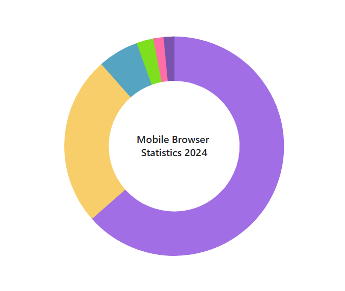
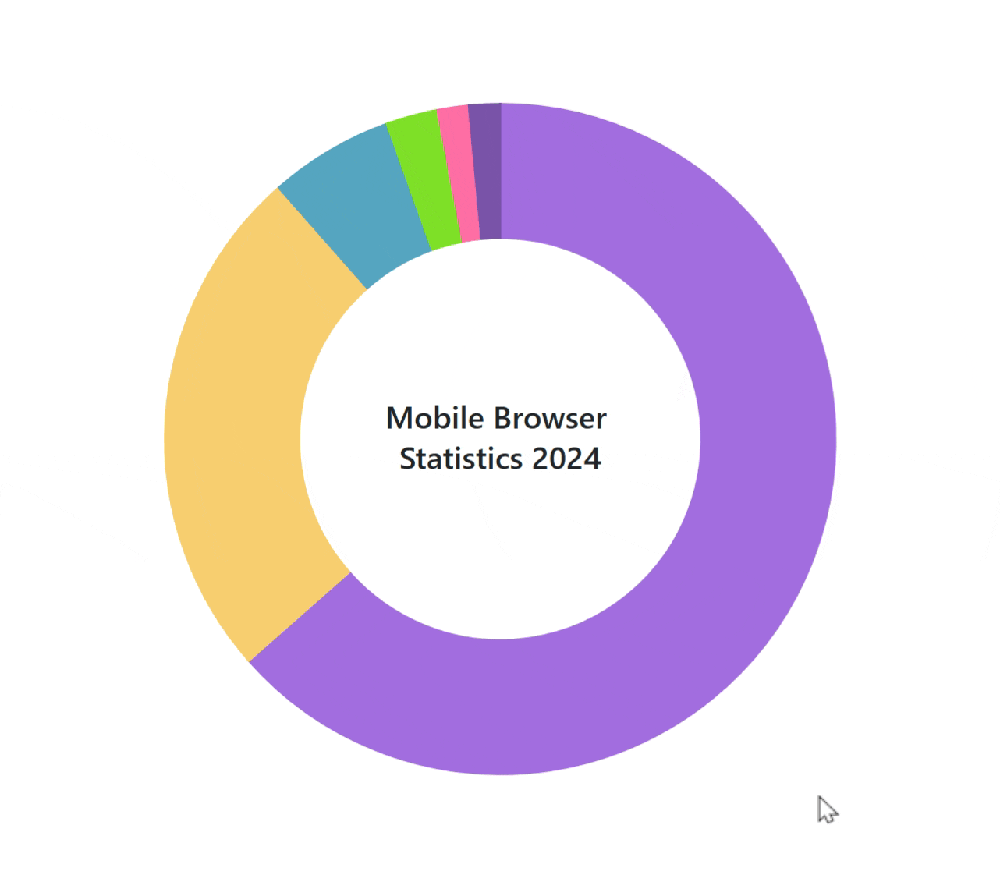
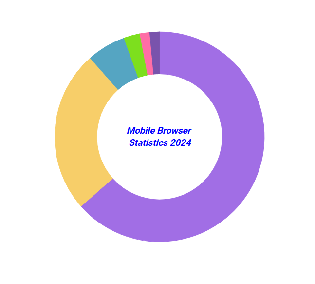

# Center Label in Blazor Pie and Donut Chart Component

The center label feature enables custom text placement in the middle of pie and donut charts using the [AccumulationChartCenterLabel](https://help.syncfusion.com/cr/blazor/Syncfusion.Blazor.Charts.AccumulationChartCenterLabel.html). This is useful for displaying chart titles, percentage distributions or other key metrics relevant to the data.

Configure the center text using the [Text](https://help.syncfusion.com/cr/blazor/Syncfusion.Blazor.Charts.AccumulationChartCenterLabel.html#Syncfusion_Blazor_Charts_AccumulationChartCenterLabel_Text) property within `AccumulationChartCenterLabel`.

```cshtml

@using Syncfusion.Blazor.Charts

<SfAccumulationChart>
    <AccumulationChartSeriesCollection>
        <AccumulationChartSeries DataSource="@DonutChartPoints" XName="Browser" YName="Users" InnerRadius="60%">
        </AccumulationChartSeries>
    </AccumulationChartSeriesCollection>
    <AccumulationChartCenterLabel Text="Mobile Browser<br>Statistics 2024">
    </AccumulationChartCenterLabel>
    <AccumulationChartLegendSettings Visible="false"></AccumulationChartLegendSettings>
</SfAccumulationChart>

@code {
    public class DonutData
    {
        public string Browser { get; set; }
        public double Users { get; set; }
        public string DataLabelMappingName { get; set; }
    }

    public List<DonutData> DonutChartPoints { get; set; } = new List<DonutData>
    {
        new DonutData { Browser = "Chrome", Users = 63.5, DataLabelMappingName = "Chrome: 63.5%" },
        new DonutData { Browser = "Safari", Users = 25.0, DataLabelMappingName = "Safari: 25.0%" },
        new DonutData { Browser = "Samsung Internet", Users = 6.0, DataLabelMappingName = "Samsung Internet: 6.0%" },
        new DonutData { Browser = "UC Browser", Users = 2.5, DataLabelMappingName = "UC Browser: 2.5%"},
        new DonutData { Browser = "Opera", Users = 1.5, DataLabelMappingName = "Opera: 1.5%" },
        new DonutData { Browser = "Others", Users = 1.5, DataLabelMappingName = "Others: 1.5%" }
    };
}

```




## Hover Text

Dynamically update the center label text when hovering over pie or donut chart slices using the [HoverTextFormat](https://help.syncfusion.com/cr/blazor/Syncfusion.Blazor.Charts.AccumulationChartCenterLabel.html#Syncfusion_Blazor_Charts_AccumulationChartCenterLabel_HoverTextFormat) property. This interactive feature provides relevant information about specific segments during chart exploration.

N> Line breaks can be added to texts in the `HoverTextFormat` property using the `<br>` tag.

```cshtml

@using Syncfusion.Blazor.Charts

<SfAccumulationChart>
    <AccumulationChartSeriesCollection>
        <AccumulationChartSeries DataSource="@DonutChartPoints" XName="Browser" YName="Users" InnerRadius="60%">
        </AccumulationChartSeries>
    </AccumulationChartSeriesCollection>
    <AccumulationChartCenterLabel Text="Mobile Browser<br>Statistics 2024" HoverTextFormat="${point.x} <br> Browser Share <br> ${point.y}%">
    </AccumulationChartCenterLabel>
    <AccumulationChartLegendSettings Visible="false"></AccumulationChartLegendSettings>
</SfAccumulationChart>

@code {
    public class DonutData
    {
        public string Browser { get; set; }
        public double Users { get; set; }
        public string DataLabelMappingName { get; set; }
    }

    public List<DonutData> DonutChartPoints { get; set; } = new List<DonutData>
    {
        new DonutData { Browser = "Chrome", Users = 63.5, DataLabelMappingName = "Chrome: 63.5%" },
        new DonutData { Browser = "Safari", Users = 25.0, DataLabelMappingName = "Safari: 25.0%" },
        new DonutData { Browser = "Samsung Internet", Users = 6.0, DataLabelMappingName = "Samsung Internet: 6.0%" },
        new DonutData { Browser = "UC Browser", Users = 2.5, DataLabelMappingName = "UC Browser: 2.5%" },
        new DonutData { Browser = "Opera", Users = 1.5, DataLabelMappingName = "Opera: 1.5%" },
        new DonutData { Browser = "Others", Users = 1.5, DataLabelMappingName = "Others: 1.5%" }
    };
}

```




## Customization

Customize the center label's appearance using [AccumulationChartCenterLabelFont](https://help.syncfusion.com/cr/blazor/Syncfusion.Blazor.Charts.AccumulationChartCenterLabelFont.html), which allows modification of font size, family, style, weight and color for enhanced visual presentation.

Adjust the center label's position using the [XOffset](https://help.syncfusion.com/cr/blazor/Syncfusion.Blazor.Charts.AccumulationChartCenterLabel.html#Syncfusion_Blazor_Charts_AccumulationChartCenterLabel_XOffset) and [YOffset](https://help.syncfusion.com/cr/blazor/Syncfusion.Blazor.Charts.AccumulationChartCenterLabel.html#Syncfusion_Blazor_Charts_AccumulationChartCenterLabel_YOffset) properties in `AccumulationChartCenterLabel`.

```cshtml

@using Syncfusion.Blazor.Charts

<SfAccumulationChart>
    <AccumulationChartSeriesCollection>
        <AccumulationChartSeries DataSource="@DonutChartPoints" XName="Browser" YName="Users" InnerRadius="60%">
        </AccumulationChartSeries>
    </AccumulationChartSeriesCollection>
    <AccumulationChartCenterLabel Text="Mobile Browser<br>Statistics 2024">
        <AccumulationChartCenterLabelFont Size="15px" FontWeight="600" FontFamily="Roboto" fontStyle="Italic" Color="Blue" ></AccumulationChartCenterLabelFont>
    </AccumulationChartCenterLabel>
    <AccumulationChartLegendSettings Visible="false"></AccumulationChartLegendSettings>
</SfAccumulationChart>

@code {
    public class DonutData
    {
        public string Browser { get; set; }
        public double Users { get; set; }
        public string DataLabelMappingName { get; set; }
    }

    public List<DonutData> DonutChartPoints { get; set; } = new List<DonutData>
    {
        new DonutData { Browser = "Chrome", Users = 63.5, DataLabelMappingName = "Chrome: 63.5%" },
        new DonutData { Browser = "Safari", Users = 25.0, DataLabelMappingName = "Safari: 25.0%" },
        new DonutData { Browser = "Samsung Internet", Users = 6.0, DataLabelMappingName = "Samsung Internet: 6.0%" },
        new DonutData { Browser = "UC Browser", Users = 2.5, DataLabelMappingName = "UC Browser: 2.5%" },
        new DonutData { Browser = "Opera", Users = 1.5, DataLabelMappingName = "Opera: 1.5%" },
        new DonutData { Browser = "Others", Users = 1.5, DataLabelMappingName = "Others: 1.5%" }
    };
}

```




N> Refer to the [Blazor Charts](https://www.syncfusion.com/blazor-components/blazor-charts) feature tour page for its groundbreaking feature representations and also explore the [Blazor Accumulation Chart Example](https://blazor.syncfusion.com/demos/chart/pie?theme=bootstrap5) to know about the various features of accumulation charts and how it is used to represent numeric proportional data.

## See also

* [Data label](./data-label)
* [Title and Subtitle](./title-and-sub-title)
* [Annotation](./annotation)
