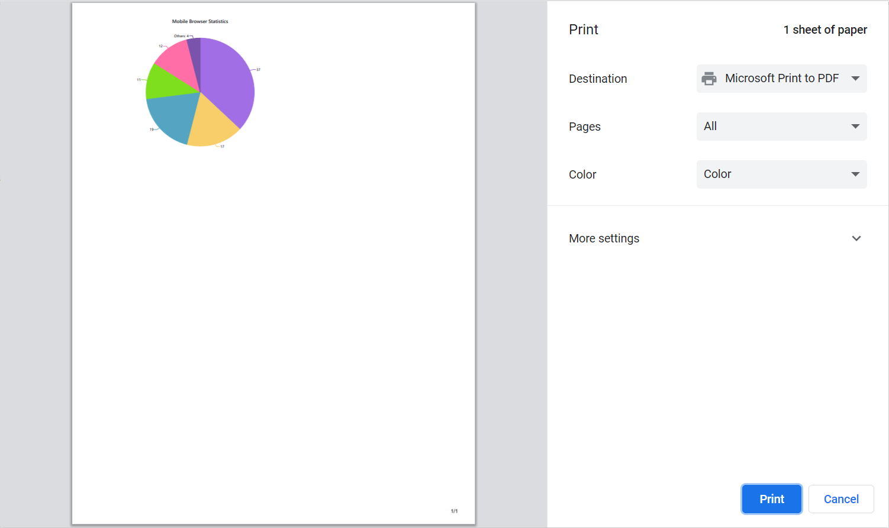

# Print and Export

## Print

The [`Print`] method can be used to print a rendered chart directly from the browser.





## Export

Using the [`Export`] method, the rendered chart can be exported to [`JPEG`](https://help.syncfusion.com/cr/blazor/Syncfusion.Blazor.Charts.ExportType.html#Syncfusion_Blazor_Charts_ExportType_JPEG), [`PNG`](https://help.syncfusion.com/cr/blazor/Syncfusion.Blazor.Charts.ExportType.html#Syncfusion_Blazor_Charts_ExportType_PNG), [`SVG`](https://help.syncfusion.com/cr/blazor/Syncfusion.Blazor.Charts.ExportType.html#Syncfusion_Blazor_Charts_ExportType_SVG), or [`PDF`](https://help.syncfusion.com/cr/blazor/Syncfusion.Blazor.Charts.ExportType.html#Syncfusion_Blazor_Charts_ExportType_PDF) format. The [`Export Type`](https://help.syncfusion.com/cr/blazor/Syncfusion.Blazor.Charts.ExportType.html) specifies the image format and [`FileName`] specifies the name of the exported file. Both of these parameters are required input parameters for this method.

The optional parameters for this method are,
* [`Orientation`] - Specifies the portrait or landscape orientation in the PDF document.
* [`AllowDownload`] - Specifies whether to download or not. If not, base64 string will be returned.





> Refer to our [`Blazor Charts`](https://www.syncfusion.com/blazor-components/blazor-charts) feature tour page for its groundbreaking feature representations and also explore our [`Blazor Chart Example`](https://blazor.syncfusion.com/demos/chart/pie?theme=bootstrap4) to know various chart types and how to represent time-dependent data, showing trends at equal intervals.

## See Also

* [Data Label](./data-labels)
* [Tooltip](./tool-tip)
* [Legend](./legend)