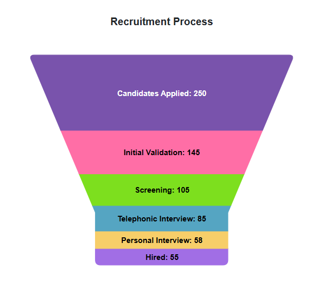

# Funnel in Blazor Accumulation Chart Component

[Funnel Chart](https://www.syncfusion.com/blazor-components/blazor-charts/chart-types/funnel-chart) is used to represent stages in a sales process and show the amount of potential revenue for each stage. To render the Funnel Chart, set the series [Type](https://help.syncfusion.com/cr/blazor/Syncfusion.Blazor.Charts.AccumulationChartSeries.html#Syncfusion_Blazor_Charts_AccumulationChartSeries_Type) as Funnel.

```cshtml

@using Syncfusion.Blazor.Charts

<SfAccumulationChart Title="Mobile Browser Statistics">
    <AccumulationChartSeriesCollection>
        <AccumulationChartSeries DataSource="@StatisticsDetails" XName="Browser" YName="Users"
                                 Name="Browser" Type="AccumulationType.Funnel">
        </AccumulationChartSeries>
    </AccumulationChartSeriesCollection>

    <AccumulationChartLegendSettings Visible="false"></AccumulationChartLegendSettings>
</SfAccumulationChart>

@code {
    public class Statistics
    {
        public string Browser { get; set; }
        public double Users { get; set; }
    }

    public List<Statistics> StatisticsDetails = new List<Statistics>
	{
       new Statistics { Browser = "Chrome", Users = 37 },
       new Statistics { Browser = "UC Browser", Users = 17 },
       new Statistics { Browser = "iPhone", Users = 19 },
       new Statistics { Browser = "Others", Users = 4  },
       new Statistics { Browser = "Opera", Users = 11 },
       new Statistics { Browser = "Android", Users = 12 }
    };
}

```




## Funnel Size

Customize the funnel chart size using the [Width](https://help.syncfusion.com/cr/blazor/Syncfusion.Blazor.Charts.AccumulationChartSeries.html#Syncfusion_Blazor_Charts_AccumulationChartSeries_Width) and [Height](https://help.syncfusion.com/cr/blazor/Syncfusion.Blazor.Charts.AccumulationChartSeries.html#Syncfusion_Blazor_Charts_AccumulationChartSeries_Height) properties.

```cshtml

@using Syncfusion.Blazor.Charts

<SfAccumulationChart Title="Mobile Browser Statistics">
    <AccumulationChartLegendSettings Visible="false"></AccumulationChartLegendSettings>

    <AccumulationChartSeriesCollection>
        <AccumulationChartSeries DataSource="@StatisticsDetails" XName="Browser" YName="Users"
                                 Name="Browser" Type="AccumulationType.Funnel" Width="60%" Height="80%">
        </AccumulationChartSeries>
    </AccumulationChartSeriesCollection>
</SfAccumulationChart>

@code {
    public class Statistics
    {
        public string Browser { get; set; }
        public double Users { get; set; }
    }

    public List<Statistics> StatisticsDetails = new List<Statistics>
	{
       new Statistics { Browser = "Chrome", Users = 37 },
       new Statistics { Browser = "UC Browser", Users = 17 },
       new Statistics { Browser = "iPhone", Users = 19 },
       new Statistics { Browser = "Others", Users = 4  },
       new Statistics { Browser = "Opera", Users = 11 },
       new Statistics { Browser = "Android", Users = 12 }
    };
}

```




N> The [Blazor Funnel Chart](https://blazor.syncfusion.com/demos/chart/funnel) example can be explored to learn to render and configure the funnel chart.

## Funnel neck size

Customize the neck size using the [NeckWidth](https://help.syncfusion.com/cr/blazor/Syncfusion.Blazor.Charts.AccumulationChartSeries.html#Syncfusion_Blazor_Charts_AccumulationChartSeries_NeckWidth) and [NeckHeight](https://help.syncfusion.com/cr/blazor/Syncfusion.Blazor.Charts.AccumulationChartSeries.html#Syncfusion_Blazor_Charts_AccumulationChartSeries_NeckHeight) properties.

```cshtml

@using Syncfusion.Blazor.Charts

<SfAccumulationChart Title="Mobile Browser Statistics">
    <AccumulationChartSeriesCollection>
        <AccumulationChartSeries DataSource="@StatisticsDetails" XName="Browser" YName="Users"
                                 Name="Browser" Type="AccumulationType.Funnel" NeckWidth="15%" NeckHeight="18%">
        </AccumulationChartSeries>
    </AccumulationChartSeriesCollection>

    <AccumulationChartLegendSettings Visible="false"></AccumulationChartLegendSettings>
</SfAccumulationChart>

@code {
    public class Statistics
    {
        public string Browser  { get; set; }
        public double Users { get; set; }
    }

    public List<Statistics> StatisticsDetails = new List<Statistics>
	{
       new Statistics { Browser = "Chrome", Users = 37 },
       new Statistics { Browser = "UC Browser", Users = 17 },
       new Statistics { Browser = "iPhone", Users = 19 },
       new Statistics { Browser = "Others", Users = 4  },
       new Statistics { Browser = "Opera", Users = 11 },
       new Statistics { Browser = "Android", Users = 12 }
    };
}

```




## Gap between funnel segments

Customize the space between segments using the [GapRatio](https://help.syncfusion.com/cr/blazor/Syncfusion.Blazor.Charts.AccumulationChartSeries.html#Syncfusion_Blazor_Charts_AccumulationChartSeries_GapRatio) property. It accepts the values ranging from 0 to 1.

```cshtml

@using Syncfusion.Blazor.Charts

<SfAccumulationChart Title="Mobile Browser Statistics">
    <AccumulationChartSeriesCollection>
        <AccumulationChartSeries DataSource="@StatisticsDetails" XName="Browser" YName="Users"
                                 Name="Browser" GapRatio="0.2" Type="AccumulationType.Funnel" NeckWidth="15%" NeckHeight="18%">
        </AccumulationChartSeries>
    </AccumulationChartSeriesCollection>

    <AccumulationChartLegendSettings Visible="false"></AccumulationChartLegendSettings>
</SfAccumulationChart>

@code {
    public class Statistics
    {
        public string Browser  { get; set; }
        public double Users { get; set; }
    }

    public List<Statistics> StatisticsDetails = new List<Statistics>
	{
       new Statistics { Browser = "Chrome", Users = 37 },
       new Statistics { Browser = "UC Browser", Users = 17 },
       new Statistics { Browser = "iPhone", Users = 19 },
       new Statistics { Browser = "Others", Users = 4  },
       new Statistics { Browser = "Opera", Users = 11 },
       new Statistics { Browser = "Android", Users = 12 }
    };
}

```




## Funnel explode

Explode points on mouse click by setting the [Explode](https://help.syncfusion.com/cr/blazor/Syncfusion.Blazor.Charts.AccumulationChartSeries.html#Syncfusion_Blazor_Charts_AccumulationChartSeries_Explode) property to **true**. Use [ExplodeIndex](https://help.syncfusion.com/cr/blazor/Syncfusion.Blazor.Charts.AccumulationChartSeries.html#Syncfusion_Blazor_Charts_AccumulationChartSeries_ExplodeIndex) and [ExplodeOffset](https://help.syncfusion.com/cr/blazor/Syncfusion.Blazor.Charts.AccumulationChartSeries.html#Syncfusion_Blazor_Charts_AccumulationChartSeries_ExplodeOffset) for further customization.

```cshtml

@using Syncfusion.Blazor.Charts

<SfAccumulationChart Title="Mobile Browser Statistics">
    <AccumulationChartSeriesCollection>
        <AccumulationChartSeries DataSource="@StatisticsDetails" XName="Browser" YName="Users"
                                 Name="Browser" Type=" AccumulationType.Funnel" ExplodeIndex="3" Explode="true" ExplodeOffset="10%">
        </AccumulationChartSeries>
    </AccumulationChartSeriesCollection>

    <AccumulationChartLegendSettings Visible="false"></AccumulationChartLegendSettings>
</SfAccumulationChart>

@code {
    public class Statistics
    {
        public string Browser { get; set; }
        public double Users { get; set; }
    }

    public List<Statistics> StatisticsDetails = new List<Statistics>
	{
       new Statistics { Browser = "Chrome", Users = 37 },
       new Statistics { Browser = "UC Browser", Users = 17 },
       new Statistics { Browser = "iPhone", Users = 19 },
       new Statistics { Browser = "Others", Users = 4  },
       new Statistics { Browser = "Opera", Users = 11 },
       new Statistics { Browser = "Android", Users = 12 }
    };
}

```




## Smart Data Label

Labels are automatically arranged on the left side of the funnel and pyramid chart when they overlap.

```cshtml

@using Syncfusion.Blazor.Charts

<SfAccumulationChart Title="World Population" EnableAnimation="false">
    <AccumulationChartLegendSettings Visible="false"></AccumulationChartLegendSettings>

    <AccumulationChartSeriesCollection>
        <AccumulationChartSeries DataSource="@StatisticsDetails" XName="Country" YName="Users"
                                 Type="AccumulationType.Funnel" Explode="false" Width="50%" Height="80%" NeckWidth="15%" NeckHeight="18%">
            <AccumulationDataLabelSettings Visible="true" Name="Country" Position="AccumulationLabelPosition.Outside">
                <AccumulationChartConnector Length="6%"></AccumulationChartConnector>
            </AccumulationDataLabelSettings>
        </AccumulationChartSeries>
    </AccumulationChartSeriesCollection>
</SfAccumulationChart>

@code {
    public class Statistics
    {
        public string Country { get; set; }
        public double Users { get; set; }
    }
	
    public List<Statistics> StatisticsDetails = new List<Statistics>
	{
        new Statistics { Country = "China", Users = 1409517397 },
        new Statistics { Country = "India", Users = 1339180127 },
        new Statistics { Country = "United States", Users = 324459463 },
        new Statistics { Country = "Indonesia", Users = 263991379  },
        new Statistics { Country = "Brazil", Users = 209288278 },
        new Statistics { Country = "Pakistan", Users = 197015955 },
        new Statistics { Country = "Nigeria", Users = 190886311 },
        new Statistics { Country = "Bangladesh", Users = 164669751 },
        new Statistics { Country = "Russia", Users = 143989754 },
        new Statistics { Country = "Mexico", Users = 129163276 },
        new Statistics { Country = "Japan", Users = 127484450 },
        new Statistics { Country = "Ethiopia", Users = 104957438 },
        new Statistics { Country = "Philippines", Users = 104918090 },
        new Statistics { Country = "Egypt", Users = 97553151 },
        new Statistics { Country = "Vietnam", Users = 95540800 },
        new Statistics { Country = "Germany", Users = 82114224 }
    };
}
```




## Border radius

Round the corners of the first and last data points using the [BorderRadius](https://help.syncfusion.com/cr/blazor/Syncfusion.Blazor.Charts.AccumulationChartSeries.html#Syncfusion_Blazor_Charts_AccumulationChartSeries_BorderRadius) property.

```cshtml

@using Syncfusion.Blazor.Charts

 <SfAccumulationChart Title="Recruitment Process" EnableAnimation="false" >
            <AccumulationChartLegendSettings Visible="false"></AccumulationChartLegendSettings>
            <AccumulationChartSeriesCollection>
                <AccumulationChartSeries DataSource="@FunnelChartPoints" XName="InterviewProcess" YName="Candidates" BorderRadius="8"
                                         Type="AccumulationType.Funnel" Height="80%" Width="40%">
                    <AccumulationDataLabelSettings Visible="true" Name="DataLabelMappingName" Position="AccumulationLabelPosition.Inside">
                        <AccumulationChartDataLabelFont FontWeight="600"></AccumulationChartDataLabelFont>
                    </AccumulationDataLabelSettings>
                </AccumulationChartSeries>
            </AccumulationChartSeriesCollection>
 </SfAccumulationChart>

@code {
    public class FunnelData
    {
        public string InterviewProcess { get; set; }
        public double Candidates { get; set; }
        public string DataLabelMappingName { get; set; }
    }

    public List<FunnelData> FunnelChartPoints { get; set; } = new List<FunnelData>
    {
        new FunnelData { InterviewProcess = "Hired", Candidates = 55, DataLabelMappingName = "Hired: 55" },
        new FunnelData { InterviewProcess = "Personal Interview", Candidates = 58, DataLabelMappingName = "Personal Interview: 58" },
        new FunnelData { InterviewProcess = "Telephonic Interview", Candidates = 85, DataLabelMappingName = "Telephonic Interview: 85" },
        new FunnelData { InterviewProcess = "Screening", Candidates = 105, DataLabelMappingName = "Screening: 105" },
        new FunnelData { InterviewProcess = "Initial Validation", Candidates = 145, DataLabelMappingName = "Initial Validation: 145" },
        new FunnelData { InterviewProcess = "Candidates Applied", Candidates = 250, DataLabelMappingName = "Candidates Applied: 250" }
    };
}

```




N> Refer to the [Blazor Charts](https://www.syncfusion.com/blazor-components/blazor-charts) feature tour page for its groundbreaking feature representations and also explore the [Blazor Accumulation Chart Example](https://blazor.syncfusion.com/demos/chart/funnel?theme=bootstrap5) to know various features of accumulation charts and how it is used to represent numeric proportional data.

## See also

* [Data label](../data-label)
* [Grouping](../grouping)
