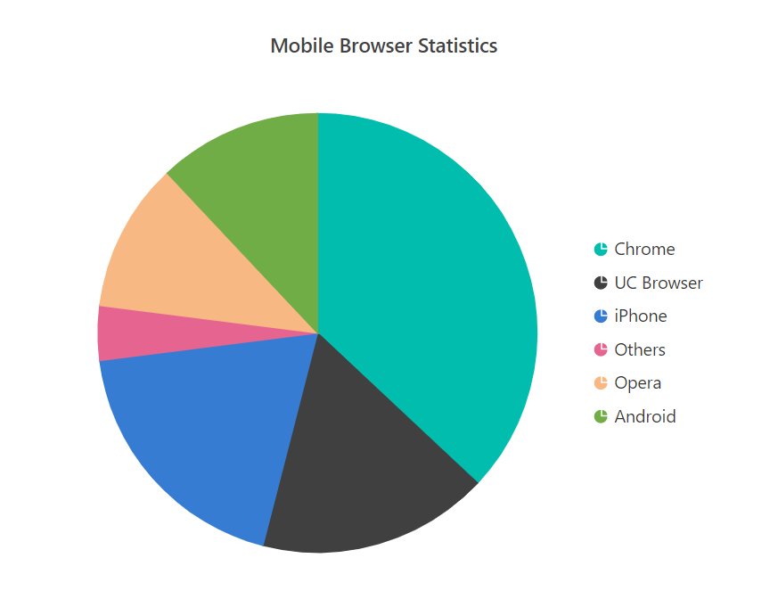
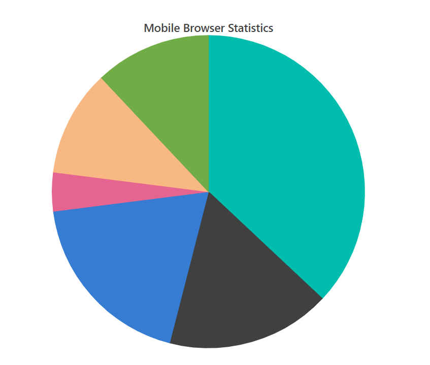
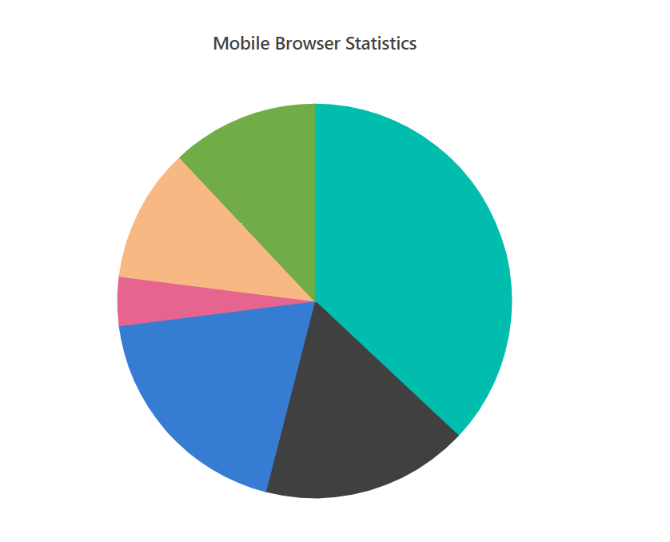
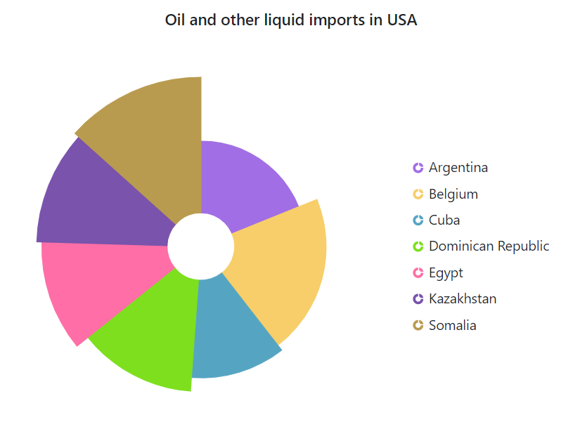
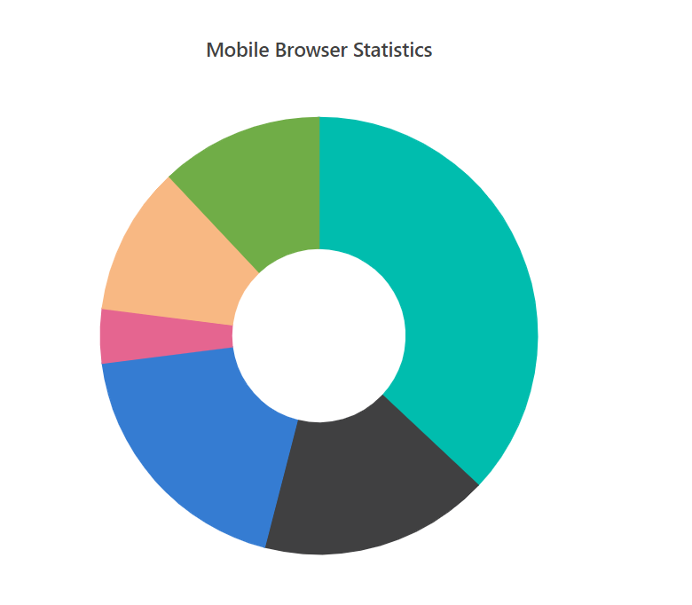
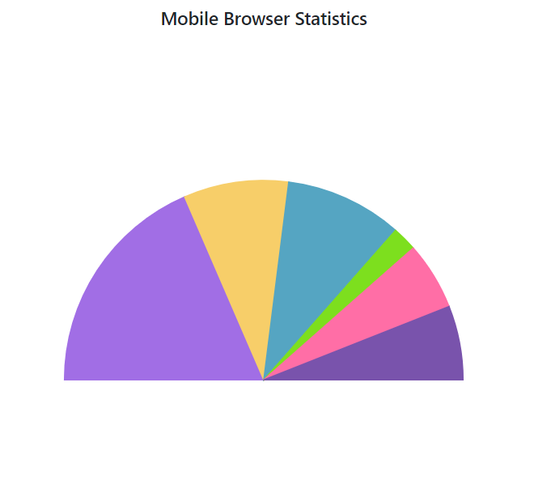
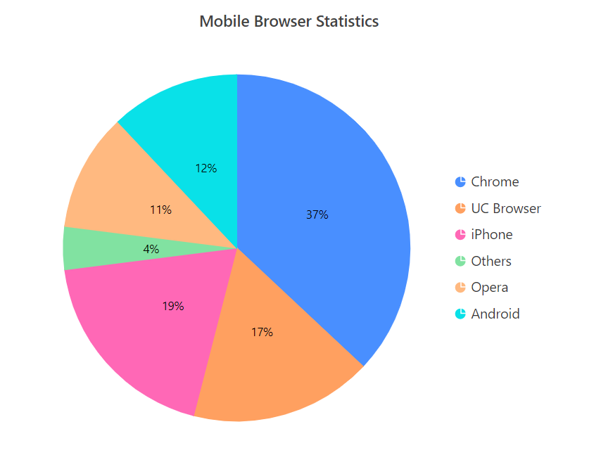

# Pie & Doughnut

## Pie Chart

To render a pie series, use the series [`Type`](https://help.syncfusion.com/cr/blazor/Syncfusion.Blazor.Charts.AccumulationChartSeries.html#Syncfusion_Blazor_Charts_AccumulationChartSeries_Type)
as `Pie`.

```csharp

@using Syncfusion.Blazor.Charts

<SfAccumulationChart Title="Mobile Browser Statistics">
    <AccumulationChartSeriesCollection>
        <AccumulationChartSeries DataSource="@StatisticsDetails" XName="Browser" YName="Users"
                                 Name="Browser">
        </AccumulationChartSeries>
    </AccumulationChartSeriesCollection>

    <AccumulationChartLegendSettings Visible="true"></AccumulationChartLegendSettings>
</SfAccumulationChart>

@code{
    public class Statistics
    {
        public string Browser { get; set; }
        public double Users { get; set; }
    }

    public List<Statistics> StatisticsDetails = new List<Statistics>
{
        new Statistics { Browser = "Chrome", Users = 37 },
        new Statistics { Browser = "UC Browser", Users = 17 },
        new Statistics { Browser = "iPhone", Users = 19 },
        new Statistics { Browser = "Others", Users = 4  },
        new Statistics { Browser = "Opera", Users = 11 },
        new Statistics { Browser = "Android", Users = 12 },
    };
}


```



> Note: You can refer to our [`Blazor Pie Chart`](https://www.syncfusion.com/blazor-components/blazor-charts/chart-types/pie-chart) feature tour page to know about its other groundbreaking feature representations. You can also explore our [`Blazor Pie Chart example`](https://blazor.syncfusion.com/demos/chart/pie) to knows how to render and configure the pie chart.

## Radius Customization

By default, radius of the pie series will be 80% of the size (minimum of chart width and height).
You can customize this using [`Radius`](https://help.syncfusion.com/cr/blazor/Syncfusion.Blazor.Charts.AccumulationChartSeries.html#Syncfusion_Blazor_Charts_AccumulationChartSeries_Radius)
property of the series.

```csharp

@using Syncfusion.Blazor.Charts

<SfAccumulationChart Title="Mobile Browser Statistics">
    <AccumulationChartSeriesCollection>
        <AccumulationChartSeries DataSource="@StatisticsDetails" XName="Browser" YName="Users"
                                 Name="Browser" Radius="100%">
        </AccumulationChartSeries>
    </AccumulationChartSeriesCollection>

    <AccumulationChartLegendSettings Visible="false"></AccumulationChartLegendSettings>
</SfAccumulationChart>

@code{
    public class Statistics
    {
        public string Browser { get; set; }
        public double Users { get; set; }
    }

    public List<Statistics> StatisticsDetails = new List<Statistics>
{
        new Statistics { Browser = "Chrome", Users = 37 },
        new Statistics { Browser = "UC Browser", Users = 17 },
        new Statistics { Browser = "iPhone", Users = 19 },
        new Statistics { Browser = "Others", Users = 4  },
        new Statistics { Browser = "Opera", Users = 11 },
        new Statistics { Browser = "Android", Users = 12 },
    };
}

```



## Pie Center

The center position of the pie can be changed by center x and center y. By default, center x and center y of the pie series are 50%. You can customize this using [`Center`](https://help.syncfusion.com/cr/blazor/Syncfusion.Blazor.Charts.AccumulationChartModel.html#Syncfusion_Blazor_Charts_AccumulationChartModel_Center) property of the series.

```csharp

@using Syncfusion.Blazor.Charts

<SfAccumulationChart EnableAnimation="false" Title="Mobile Browser Statistics">
    <AccumulationChartCenter X="60%" Y="60%"/>

    <AccumulationChartSeriesCollection>
        <AccumulationChartSeries DataSource="@StatisticsDetails" XName="Browser" YName="Users"/>
    </AccumulationChartSeriesCollection>

    <AccumulationChartLegendSettings Visible="false"/>
    <AccumulationChartTooltipSettings Enable="true"/>
</SfAccumulationChart>

@code{
    public class Statistics
    {
        public string Browser { get; set; }
        public double Users { get; set; }
    }

    public List<Statistics> StatisticsDetails = new List<Statistics>
{
        new Statistics { Browser = "Chrome", Users = 37 },
        new Statistics { Browser = "UC Browser", Users = 17 },
        new Statistics { Browser = "iPhone", Users = 19 },
        new Statistics { Browser = "Others", Users = 4  },
        new Statistics { Browser = "Opera", Users = 11 },
        new Statistics { Browser = "Android", Users = 12 },
    };
}


```



## Various Radius Pie Chart

You can use radius mapping to render the slice with different [`Radius`](https://help.syncfusion.com/cr/blazor/Syncfusion.Blazor.Charts.AccumulationChartSeries.html#Syncfusion_Blazor_Charts_AccumulationChartSeries_Radius) and also use border, fill properties to customize the point.

```csharp

@using Syncfusion.Blazor.Charts

<SfAccumulationChart Title="Oil and other liquid imports in USA" EnableAnimation="true" EnableSmartLabels="true">
    <AccumulationChartLegendSettings Visible="true"></AccumulationChartLegendSettings>

    <AccumulationChartSeriesCollection>
        <AccumulationChartSeries DataSource="@StatisticsDetails" XName="Browser" YName="Users"
                                 InnerRadius="20%" Radius="R">
        </AccumulationChartSeries>
    </AccumulationChartSeriesCollection>
</SfAccumulationChart>

@code{
    public class Statistics
    {
        public string Browser { get; set;}
        public double Users { get; set; }
        public string R { get; set; }
    }

    public List<Statistics> StatisticsDetails = new List<Statistics>
  {
         new Statistics { Browser = "Argentina", Users = 505370, R = "100"},
         new Statistics { Browser = "Belgium",    Users = 551500, R = "118.7"},
         new Statistics { Browser = "Cuba",  Users = 312685 , R = "124.6"},
         new Statistics { Browser = "Dominican Republic", Users = 350000 , R = "137.5"},
         new Statistics { Browser = "Egypt", Users = 301000 , R = "150.8"},
         new Statistics { Browser = "Kazakhstan", Users = 300000, R = "155.5"},
         new Statistics { Browser = "Somalia",  Users = 357022, R = "160.6"}
     };

}


```



## Doughnut Chart

To achieve a Doughnut Chart in pie series, customize the [`InnerRadius`](https://help.syncfusion.com/cr/blazor/Syncfusion.Blazor.Charts.AccumulationChartSeries.html#Syncfusion_Blazor_Charts_AccumulationChartSeries_InnerRadius) property of the series. By setting value greater than 0%, a doughnut will appear.
The InnerRadius property takes value from 0 to 100% of the pie radius.

```csharp

@using Syncfusion.Blazor.Charts

<SfAccumulationChart Title="Mobile Browser Statistics">
    <AccumulationChartSeriesCollection>
        <AccumulationChartSeries DataSource="@StatisticsDetails" XName="Browser" YName="Users"
                                 Name="Browser" InnerRadius="40%">
        </AccumulationChartSeries>
    </AccumulationChartSeriesCollection>

    <AccumulationChartLegendSettings Visible="false"></AccumulationChartLegendSettings>
</SfAccumulationChart>

@code{
    public class Statistics
    {
        public string Browser { get; set; }
        public double Users { get; set; }
    }

    public List<Statistics> StatisticsDetails = new List<Statistics>
{
        new Statistics { Browser = "Chrome", Users = 37 },
        new Statistics { Browser = "UC Browser", Users = 17 },
        new Statistics { Browser = "iPhone", Users = 19 },
        new Statistics { Browser = "Others", Users = 4  },
        new Statistics { Browser = "Opera", Users = 11 },
        new Statistics { Browser = "Android", Users = 12 },
    };
}

```



> Note: You can also explore our [`Blazor Doughnut Chart`](https://blazor.syncfusion.com/demos/chart/donut) example to knows how to render and configure the doughnut charts.

## Start and End angles

You can customize the start and end angle of the pie series using the
[`StartAngle`](https://help.syncfusion.com/cr/blazor/Syncfusion.Blazor.Charts.AccumulationChartSeries.html#Syncfusion_Blazor_Charts_AccumulationChartSeries_StartAngle) and
[`EndAngle`](https://help.syncfusion.com/cr/blazor/Syncfusion.Blazor.Charts.AccumulationChartSeries.html#Syncfusion_Blazor_Charts_AccumulationChartSeries_EndAngle)
properties. The default value of  StartAngle is 0 degree, and EndAngle is 360 degrees. By customizing this,
you can achieve a semi pie series.

```csharp

@using Syncfusion.Blazor.Charts

<SfAccumulationChart Title="Mobile Browser Statistics">
    <AccumulationChartSeriesCollection>
        <AccumulationChartSeries DataSource="@StatisticsDetails" XName="Browser" YName="Users"
                                 StartAngle="270" EndAngle="90">
        </AccumulationChartSeries>
    </AccumulationChartSeriesCollection>

    <AccumulationChartLegendSettings Visible="false">
    </AccumulationChartLegendSettings>
</SfAccumulationChart>

@code{
    public class Statistics
    {
        public string Browser { get; set; }
        public double Users { get; set; }
    }

    public List<Statistics> StatisticsDetails = new List<Statistics>
{
        new Statistics { Browser = "Chrome", Users = 37 },
        new Statistics { Browser = "UC Browser", Users = 17 },
        new Statistics { Browser = "iPhone", Users = 19 },
        new Statistics { Browser = "Others", Users = 4  },
        new Statistics { Browser = "Opera", Users = 11 },
        new Statistics { Browser = "Android", Users = 12 },
    };
}


```



## Color and Text Mapping

The fill color and the text in the data source can be mapped to the chart using [`PointColorMapping`](https://help.syncfusion.com/cr/blazor/Syncfusion.Blazor.Charts.AccumulationChartSeries.html#Syncfusion_Blazor_Charts_AccumulationChartSeries_PointColorMapping) in series and [`Name`](https://help.syncfusion.com/cr/blazor/Syncfusion.Blazor.Charts.AccumulationDataLabelSettings.html#Syncfusion_Blazor_Charts_AccumulationDataLabelSettings_Name) in datalabel respectively.

```csharp

@using Syncfusion.Blazor.Charts

<SfAccumulationChart Title="Mobile Browser Statistics">
    <AccumulationChartLegendSettings Visible="true"></AccumulationChartLegendSettings>

    <AccumulationChartSeriesCollection>
        <AccumulationChartSeries DataSource="@StatisticsDetails" XName="Browser" YName="Users" Name="Browser" PointColorMapping="Fill">
            <AccumulationDataLabelSettings Visible="true" Name="Text"></AccumulationDataLabelSettings>
        </AccumulationChartSeries>
    </AccumulationChartSeriesCollection>
</SfAccumulationChart>

@code{
    public class Statistics
    {
        public string Browser { get; set; }
        public double Users { get; set; }
        public string Fill { get; set; }
        public string Text { get; set; }
    }

    public List<Statistics> StatisticsDetails = new List<Statistics>
{
         new Statistics { Browser = "Chrome", Users = 37, Text= "37%", Fill="#498fff" },
         new Statistics { Browser = "UC Browser", Users = 17, Text= "17%", Fill="#ffa060" },
         new Statistics { Browser = "iPhone", Users = 19, Text= "19%", Fill="#ff68b6" },
         new Statistics { Browser = "Others", Users = 4, Text= "4%", Fill="#81e2a1"  },
         new Statistics { Browser = "Opera", Users = 11, Text= "11%", Fill="#ffb980" },
         new Statistics { Browser = "Android", Users = 12, Text= "12%", Fill="#09e1e8" },
    };
}

```



## Hide pie or doughnut border

By default, the border will appear in the pie/doughnut chart while mouse hover on the chart. You can disable the the border by setting [`EnableBorderOnMouseMove`](https://help.syncfusion.com/cr/blazor/Syncfusion.Blazor.Charts.SfAccumulationChart.html#Syncfusion_Blazor_Charts_SfAccumulationChart_EnableBorderOnMouseMove)
property is **false**.

```csharp

@using Syncfusion.Blazor.Charts

<SfAccumulationChart EnableBorderOnMouseMove="false">
    <AccumulationChartLegendSettings Visible="true"></AccumulationChartLegendSettings>

    <AccumulationChartSeriesCollection>
        <AccumulationChartSeries DataSource="@StatisticsDetails" XName="Browser" YName="Users" Name="Browser">
        </AccumulationChartSeries>
    </AccumulationChartSeriesCollection>
</SfAccumulationChart>

@code{
    public class Statistics
    {
        public string Browser { get; set; }
        public double Users { get; set; }
    }

    public List<Statistics> StatisticsDetails = new List<Statistics>
  {
         new Statistics { Browser = "Chrome", Users = 37 },
         new Statistics { Browser = "UC Browser", Users = 17 },
         new Statistics { Browser = "iPhone", Users = 19 },
         new Statistics { Browser = "Others", Users = 4  },
         new Statistics { Browser = "Opera", Users = 11 },
         new Statistics { Browser = "Android", Users = 12 },
      };
}


```


## See Also

* [Data label](../data-label/)
* [Grouping](../grouping/)