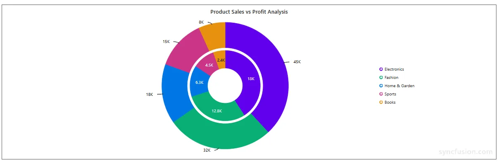

# Pie and Doughnut Chart in Blazor

## Pie Chart

The [Pie Chart](https://www.syncfusion.com/blazor-components/blazor-charts/chart-types/pie-chart) is used to represent numeric proportional data in divided slices. To render a [Pie Chart](https://help.syncfusion.com/cr/blazor/Syncfusion.Blazor.Charts.AccumulationType.html#Syncfusion_Blazor_Charts_AccumulationType_Pie), set the series [Type](https://help.syncfusion.com/cr/blazor/Syncfusion.Blazor.Charts.AccumulationChartSeries.html#Syncfusion_Blazor_Charts_AccumulationChartSeries_Type) as [Pie](https://help.syncfusion.com/cr/blazor/Syncfusion.Blazor.Charts.AccumulationType.html#Syncfusion_Blazor_Charts_AccumulationType_Pie).

```cshtml 

@using Syncfusion.Blazor.Charts

<SfAccumulationChart Title="Mobile Browser Statistics">
    <AccumulationChartSeriesCollection>
        <AccumulationChartSeries DataSource="@StatisticsDetails" XName="Browser" YName="Users"
                                 Name="Browser">
        </AccumulationChartSeries>
    </AccumulationChartSeriesCollection>

    <AccumulationChartLegendSettings Visible="true"></AccumulationChartLegendSettings>
</SfAccumulationChart>

@code{
    public class Statistics
    {
        public string Browser { get; set; }
        public double Users { get; set; }
    }

    public List<Statistics> StatisticsDetails = new List<Statistics>
    {
        new Statistics { Browser = "Chrome", Users = 37 },
        new Statistics { Browser = "UC Browser", Users = 17 },
        new Statistics { Browser = "iPhone", Users = 19 },
        new Statistics { Browser = "Others", Users = 4  },
        new Statistics { Browser = "Opera", Users = 11 },
        new Statistics { Browser = "Android", Users = 12 },
    };
}

```



## Radius customization

The radius of the pie series will be set to 80% of its size (minimum of chart width and height) by default. The [Radius](https://help.syncfusion.com/cr/blazor/Syncfusion.Blazor.Charts.AccumulationChartSeries.html#Syncfusion_Blazor_Charts_AccumulationChartSeries_Radius) property of the series can be used to customize the radius of the pie chart.

```cshtml 

@using Syncfusion.Blazor.Charts

<SfAccumulationChart Title="Mobile Browser Statistics">
    <AccumulationChartSeriesCollection>
        <AccumulationChartSeries DataSource="@StatisticsDetails" XName="Browser" YName="Users"
                                 Name="Browser" Radius="100%">
        </AccumulationChartSeries>
    </AccumulationChartSeriesCollection>

    <AccumulationChartLegendSettings Visible="false"></AccumulationChartLegendSettings>
</SfAccumulationChart>

@code{
    public class Statistics
    {
        public string Browser { get; set; }
        public double Users { get; set; }
    }

    public List<Statistics> StatisticsDetails = new List<Statistics>
    {
        new Statistics { Browser = "Chrome", Users = 37 },
        new Statistics { Browser = "UC Browser", Users = 17 },
        new Statistics { Browser = "iPhone", Users = 19 },
        new Statistics { Browser = "Others", Users = 4  },
        new Statistics { Browser = "Opera", Users = 11 },
        new Statistics { Browser = "Android", Users = 12 },
    };
}

```



## Pie center

The center x and center y can be used to change the pie's center position. The pie series' center x and center y are set to 50% by default. The [AccumulationChartCenter](https://help.syncfusion.com/cr/blazor/Syncfusion.Blazor.Charts.AccumulationChartCenter.html) property of the series can be used to customize this.

```cshtml 

@using Syncfusion.Blazor.Charts

<SfAccumulationChart EnableAnimation="false" Title="Mobile Browser Statistics">
    <AccumulationChartCenter X="70%" Y="60%" />

    <AccumulationChartSeriesCollection>
        <AccumulationChartSeries DataSource="@StatisticsDetails" XName="Browser" YName="Users" />
    </AccumulationChartSeriesCollection>

    <AccumulationChartLegendSettings Visible="false" />

</SfAccumulationChart>

@code{
    public class Statistics
    {
        public string Browser { get; set; }
        public double Users { get; set; }
    }

    public List<Statistics> StatisticsDetails = new List<Statistics>
    {
        new Statistics { Browser = "Chrome", Users = 37 },
        new Statistics { Browser = "UC Browser", Users = 17 },
        new Statistics { Browser = "iPhone", Users = 19 },
        new Statistics { Browser = "Others", Users = 4  },
        new Statistics { Browser = "Opera", Users = 11 },
        new Statistics { Browser = "Android", Users = 12 },
    };
}

```



## Various Radius Pie Chart

The [Radius](https://help.syncfusion.com/cr/blazor/Syncfusion.Blazor.Charts.AccumulationChartSeries.html#Syncfusion_Blazor_Charts_AccumulationChartSeries_Radius) mapping can be used to render the slice with different radius.

```cshtml 

@using Syncfusion.Blazor.Charts

<SfAccumulationChart Title="Oil and other liquid imports in USA" EnableAnimation="true" EnableSmartLabels="true">
    <AccumulationChartLegendSettings Visible="true"></AccumulationChartLegendSettings>

    <AccumulationChartSeriesCollection>
        <AccumulationChartSeries DataSource="@StatisticsDetails" XName="Browser" YName="Users"
                                 InnerRadius="20%" Radius="R">
        </AccumulationChartSeries>
    </AccumulationChartSeriesCollection>
</SfAccumulationChart>

@code{
    public class Statistics
    {
        public string Browser { get; set; }
        public double Users { get; set; }
        public string R { get; set; }
    }

    public List<Statistics> StatisticsDetails = new List<Statistics>
    {
        new Statistics { Browser = "Argentina", Users = 505370, R = "100"},
        new Statistics { Browser = "Belgium",    Users = 551500, R = "118.7"},
        new Statistics { Browser = "Cuba",  Users = 312685 , R = "124.6"},
        new Statistics { Browser = "Dominican Republic", Users = 350000 , R = "137.5"},
        new Statistics { Browser = "Egypt", Users = 301000 , R = "150.8"},
        new Statistics { Browser = "Kazakhstan", Users = 300000, R = "155.5"},
        new Statistics { Browser = "Somalia",  Users = 357022, R = "160.6"}
    };
}

```



## Doughnut chart

The doughnut chart can be created by setting the [InnerRadius](https://help.syncfusion.com/cr/blazor/Syncfusion.Blazor.Charts.AccumulationChartSeries.html#Syncfusion_Blazor_Charts_AccumulationChartSeries_InnerRadius) property of the [Pie Chart](https://help.syncfusion.com/cr/blazor/Syncfusion.Blazor.Charts.AccumulationType.html#Syncfusion_Blazor_Charts_AccumulationType_Pie) to a value ranging from 0% to 100%.

```cshtml 

@using Syncfusion.Blazor.Charts

<SfAccumulationChart Title="Mobile Browser Statistics">
    <AccumulationChartSeriesCollection>
        <AccumulationChartSeries DataSource="@StatisticsDetails" XName="Browser" YName="Users"
                                 Name="Browser" InnerRadius="40%">
        </AccumulationChartSeries>
    </AccumulationChartSeriesCollection>

    <AccumulationChartLegendSettings Visible="false"></AccumulationChartLegendSettings>
</SfAccumulationChart>

@code{
    public class Statistics
    {
        public string Browser { get; set; }
        public double Users { get; set; }
    }

    public List<Statistics> StatisticsDetails = new List<Statistics>
	{
        new Statistics { Browser = "Chrome", Users = 37 },
        new Statistics { Browser = "UC Browser", Users = 17 },
        new Statistics { Browser = "iPhone", Users = 19 },
        new Statistics { Browser = "Others", Users = 4  },
        new Statistics { Browser = "Opera", Users = 11 },
        new Statistics { Browser = "Android", Users = 12 },
    };
}

```



## Multiple donuts

You can create multiple donuts within a single chart by adding multiple series with different [InnerRadius](https://help.syncfusion.com/cr/blazor/Syncfusion.Blazor.Charts.AccumulationChartSeries.html#Syncfusion_Blazor_Charts_AccumulationChartSeries_InnerRadius) and [Radius](https://help.syncfusion.com/cr/blazor/Syncfusion.Blazor.Charts.AccumulationChartSeries.html#Syncfusion_Blazor_Charts_AccumulationChartSeries_Radius) values. This lets you compare multiple data sets within the same categories. Each series can carry its own data, colors, and customizations. The `MappingKey` property in [AccumulationChartLegendSettings](https://help.syncfusion.com/cr/blazor/Syncfusion.Blazor.Charts.AccumulationChartLegendSettings.html) groups legend items by a specified field from the data source, so points with matching `MappingKey` values appear as a single legend entry instead of one entry per series.

```cshtml

@using Syncfusion.Blazor.Charts

<SfAccumulationChart Title="Product Sales vs Profit Analysis" EnableBorderOnMouseMove="false" >

    <AccumulationChartSeriesCollection>
        <AccumulationChartSeries DataSource="@TotalSalesData" XName="@nameof(ProductData.X)" YName="@nameof(ProductData.Y)" Name="Total Sales" Type="@AccumulationType.Pie" Radius="90%" InnerRadius="60%" TooltipMappingName="@nameof(ProductData.X)">

            <AccumulationDataLabelSettings Visible="true" Name="@nameof(ProductData.Text)" Position="@AccumulationLabelPosition.Outside">
                <AccumulationChartConnector Type="@ConnectorType.Curve" Color="black" Width="2" DashArray="2,1" Length="5" />
            </AccumulationDataLabelSettings>

            <AccumulationChartAnimation Enable="false" />
        </AccumulationChartSeries>

        <AccumulationChartSeries DataSource="@TotalProfitData" XName="@nameof(ProductData.X)" YName="@nameof(ProductData.Y)" Name="Total Profit" Type="@AccumulationType.Pie" Radius="50%" InnerRadius="50%" TooltipMappingName="@nameof(ProductData.X)">

            <AccumulationDataLabelSettings Visible="true" Name="@nameof(ProductData.Text)" Position="@AccumulationLabelPosition.Inside">
                <AccumulationChartConnector Type="@ConnectorType.Curve" Color="black" Width="2" DashArray="2,1" Length="5" />
            </AccumulationDataLabelSettings>
            <AccumulationChartAnimation Enable="false" />
        </AccumulationChartSeries>
    </AccumulationChartSeriesCollection>

    <AccumulationChartTooltipSettings Enable="true" Format="<b>${point.x}</b><br/>Value: <b>$${point.y}</b><br/>Percentage: <b>${point.percentage}%</b>" />

    <AccumulationChartLegendSettings Visible="true" MappingKey="@nameof(ProductData.X)" />

    <AccumulationChartBorder Color="#333" Width="2" />
</SfAccumulationChart>

@code {
    private List<ProductData> TotalSalesData { get; set; } =
    {
        new() { X = "Electronics",  Y = 45000, Text = "45K" },
        new() { X = "Fashion",      Y = 32000, Text = "32K" },
        new() { X = "Home & Garden", Y = 18000, Text = "18K" },
        new() { X = "Sports",       Y = 15000, Text = "15K" },
        new() { X = "Books",        Y = 8000,  Text = "8K" }
    };

    private List<ProductData> TotalProfitData { get; set; } =
    {
        new() { X = "Electronics",  Y = 18000, Text = "18K",   Profit = "40%" },
        new() { X = "Fashion",      Y = 12800, Text = "12.8K", Profit = "40%" },
        new() { X = "Home & Garden", Y = 6300, Text = "6.3K",  Profit = "35%" },
        new() { X = "Sports",       Y = 4500,  Text = "4.5K",  Profit = "30%" },
        new() { X = "Books",        Y = 2400,  Text = "2.4K",  Profit = "30%" }
    };

    public class ProductData
    {
        public string X { get; set; } = string.Empty;
        public double Y { get; set; }
        public string Text { get; set; } = string.Empty;
        public string Profit { get; set; } = string.Empty;
    }
}

```

<!-- TODO:Add preview sample after the release -->


## Start and end angles

The [StartAngle](https://help.syncfusion.com/cr/blazor/Syncfusion.Blazor.Charts.AccumulationChartSeries.html#Syncfusion_Blazor_Charts_AccumulationChartSeries_StartAngle) and [EndAngle](https://help.syncfusion.com/cr/blazor/Syncfusion.Blazor.Charts.AccumulationChartSeries.html#Syncfusion_Blazor_Charts_AccumulationChartSeries_EndAngle) properties can be used to customize the start and end angles of the pie series. StartAngle is set to 0 degrees by default, and EndAngle is set to 360 degrees by default. Semi-pie series can be achieved by customizing these properties.

```cshtml 

@using Syncfusion.Blazor.Charts

<SfAccumulationChart Title="Mobile Browser Statistics">
    <AccumulationChartSeriesCollection>
        <AccumulationChartSeries DataSource="@StatisticsDetails" XName="Browser" YName="Users"
                                 StartAngle="270" EndAngle="90">
        </AccumulationChartSeries>
    </AccumulationChartSeriesCollection>

    <AccumulationChartLegendSettings Visible="false">
    </AccumulationChartLegendSettings>
</SfAccumulationChart>

@code{
    public class Statistics
    {
        public string Browser { get; set; }
        public double Users { get; set; }
    }

    public List<Statistics> StatisticsDetails = new List<Statistics>
	{
        new Statistics { Browser = "Chrome", Users = 37 },
        new Statistics { Browser = "UC Browser", Users = 17 },
        new Statistics { Browser = "iPhone", Users = 19 },
        new Statistics { Browser = "Others", Users = 4  },
        new Statistics { Browser = "Opera", Users = 11 },
        new Statistics { Browser = "Android", Users = 12 },
    };
}

```



## Color and text mapping

[PointColorMapping](https://help.syncfusion.com/cr/blazor/Syncfusion.Blazor.Charts.AccumulationChartSeries.html#Syncfusion_Blazor_Charts_AccumulationChartSeries_PointColorMapping) in series and [Name](https://help.syncfusion.com/cr/blazor/Syncfusion.Blazor.Charts.AccumulationDataLabelSettings.html#Syncfusion_Blazor_Charts_AccumulationDataLabelSettings_Name) in datalabel can be used to map the fill color and text from the data source to the chart.

```cshtml 

@using Syncfusion.Blazor.Charts

<SfAccumulationChart Title="Mobile Browser Statistics">
    <AccumulationChartLegendSettings Visible="true"></AccumulationChartLegendSettings>

    <AccumulationChartSeriesCollection>
        <AccumulationChartSeries DataSource="@StatisticsDetails" XName="Browser" YName="Users" Name="Browser" PointColorMapping="Fill">
            <AccumulationDataLabelSettings Visible="true" Name="Text"></AccumulationDataLabelSettings>
        </AccumulationChartSeries>
    </AccumulationChartSeriesCollection>
</SfAccumulationChart>

@code{
    public class Statistics
    {
        public string Browser { get; set; }
        public double Users { get; set; }
        public string Fill { get; set; }
        public string Text { get; set; }
    }

    public List<Statistics> StatisticsDetails = new List<Statistics>
{
         new Statistics { Browser = "Chrome", Users = 37, Text= "37%", Fill="#498fff" },
         new Statistics { Browser = "UC Browser", Users = 17, Text= "17%", Fill="#ffa060" },
         new Statistics { Browser = "iPhone", Users = 19, Text= "19%", Fill="#ff68b6" },
         new Statistics { Browser = "Others", Users = 4, Text= "4%", Fill="#81e2a1"  },
         new Statistics { Browser = "Opera", Users = 11, Text= "11%", Fill="#ffb980" },
         new Statistics { Browser = "Android", Users = 12, Text= "12%", Fill="#09e1e8" },
    };
}

```



## Border radius

The corners of all the slices in the pie/donut chart series can be rounded using the [BorderRadius](https://help.syncfusion.com/cr/blazor/Syncfusion.Blazor.Charts.AccumulationChartSeries.html#Syncfusion_Blazor_Charts_AccumulationChartSeries_BorderRadius) property within the [AccumulationChartSeries](https://help.syncfusion.com/cr/blazor/Syncfusion.Blazor.Charts.AccumulationChartSeries.html).

```cshtml
@using Syncfusion.Blazor.Charts

<SfAccumulationChart Title="Pie Chart with Border Radius">
    <AccumulationChartSeriesCollection>
        <AccumulationChartSeries DataSource="@DonutChartPoints" XName="Food" YName="Amount" InnerRadius="40%" BorderRadius="8">
        </AccumulationChartSeries>
    </AccumulationChartSeriesCollection>
    <AccumulationChartLegendSettings Visible="false"></AccumulationChartLegendSettings>
</SfAccumulationChart>

@code {
    public List<DonutData> DonutChartPoints { get; set; } = new List<DonutData>
    {
        new DonutData { Food = "Milk", Amount = 10, DataLabelMappingName = "Milk: 10%"},
        new DonutData { Food = "Rice", Amount = 30, DataLabelMappingName = "Rice: 30%"},
        new DonutData { Food = "Cereals", Amount = 20, DataLabelMappingName = "Cereals: 20%"},
        new DonutData { Food = "Water", Amount = 15, DataLabelMappingName = "Water: 15%"},
        new DonutData { Food = "Vegetables", Amount = 25, DataLabelMappingName = "Vegetables: 25%"},
    };
    public class DonutData
    {
        public string Food { get; set; }
        public double Amount { get; set; }
        public string DataLabelMappingName { get; set; }
    }
}
```


## Hide pie or doughnut border

When the mouse hovers over the pie/doughnut chart, the border appears by default. The border can be turned off by setting the [EnableBorderOnMouseMove](https://help.syncfusion.com/cr/blazor/Syncfusion.Blazor.Charts.SfAccumulationChart.html#Syncfusion_Blazor_Charts_SfAccumulationChart_EnableBorderOnMouseMove) property to **false**.

```cshtml 

@using Syncfusion.Blazor.Charts

<SfAccumulationChart Title="Mobile Browser Statistics" EnableBorderOnMouseMove="false">
    <AccumulationChartLegendSettings Visible="true"></AccumulationChartLegendSettings>

    <AccumulationChartSeriesCollection>
        <AccumulationChartSeries DataSource="@StatisticsDetails" XName="Browser" YName="Users" Name="Browser">
        </AccumulationChartSeries>
    </AccumulationChartSeriesCollection>
</SfAccumulationChart>

@code{
    public class Statistics
    {
        public string Browser { get; set; }
        public double Users { get; set; }
    }

    public List<Statistics> StatisticsDetails = new List<Statistics>
	{
        new Statistics { Browser = "Chrome", Users = 37 },
        new Statistics { Browser = "UC Browser", Users = 17 },
        new Statistics { Browser = "iPhone", Users = 19 },
        new Statistics { Browser = "Others", Users = 4  },
        new Statistics { Browser = "Opera", Users = 11 },
        new Statistics { Browser = "Android", Users = 12 },
    };
}

```



N> Refer to the [Blazor Charts](https://www.syncfusion.com/blazor-components/blazor-charts) feature tour page for its groundbreaking feature representations and also explore the [Blazor Accumulation Chart Example](https://blazor.syncfusion.com/demos/chart/pie?theme=fluent2) to know various features of accumulation charts and how it is used to represent numeric proportional data.

## See also

* [Data label](../data-label)
* [Grouping](../grouping)