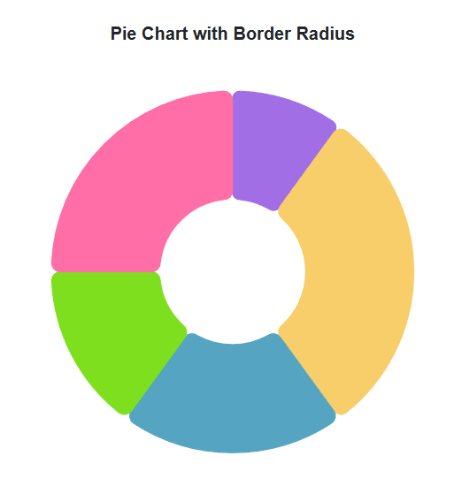

# Pie and Doughnut in Blazor Accumulation Chart Component

## Pie Chart

The [Pie Chart](https://www.syncfusion.com/blazor-components/blazor-charts/chart-types/pie-chart) visualizes numeric proportional data in divided slices. To render a [Pie Chart](https://help.syncfusion.com/cr/blazor/Syncfusion.Blazor.Charts.AccumulationType.html#Syncfusion_Blazor_Charts_AccumulationType_Pie), set the series [Type](https://help.syncfusion.com/cr/blazor/Syncfusion.Blazor.Charts.AccumulationChartSeries.html#Syncfusion_Blazor_Charts_AccumulationChartSeries_Type) as Pie.

```cshtml

@using Syncfusion.Blazor.Charts

<SfAccumulationChart Title="Mobile Browser Statistics">
    <AccumulationChartSeriesCollection>
        <AccumulationChartSeries DataSource="@StatisticsDetails" XName="Browser" YName="Users"
                                 Name="Browser">
        </AccumulationChartSeries>
    </AccumulationChartSeriesCollection>

    <AccumulationChartLegendSettings Visible="true"></AccumulationChartLegendSettings>
</SfAccumulationChart>

@code {
    public class Statistics
    {
        public string Browser { get; set; }
        public double Users { get; set; }
    }

    public List<Statistics> StatisticsDetails = new List<Statistics>
    {
        new Statistics { Browser = "Chrome", Users = 37 },
        new Statistics { Browser = "UC Browser", Users = 17 },
        new Statistics { Browser = "iPhone", Users = 19 },
        new Statistics { Browser = "Others", Users = 4  },
        new Statistics { Browser = "Opera", Users = 11 },
        new Statistics { Browser = "Android", Users = 12 }
    };
}

```




## Radius customization

Customize the pie series radius using the [Radius](https://help.syncfusion.com/cr/blazor/Syncfusion.Blazor.Charts.AccumulationChartSeries.html#Syncfusion_Blazor_Charts_AccumulationChartSeries_Radius) property.

```cshtml

@using Syncfusion.Blazor.Charts

<SfAccumulationChart Title="Mobile Browser Statistics">
    <AccumulationChartSeriesCollection>
        <AccumulationChartSeries DataSource="@StatisticsDetails" XName="Browser" YName="Users"
                                 Name="Browser" Radius="100%">
        </AccumulationChartSeries>
    </AccumulationChartSeriesCollection>

    <AccumulationChartLegendSettings Visible="false"></AccumulationChartLegendSettings>
</SfAccumulationChart>

@code {
    public class Statistics
    {
        public string Browser { get; set; }
        public double Users { get; set; }
    }

    public List<Statistics> StatisticsDetails = new List<Statistics>
    {
        new Statistics { Browser = "Chrome", Users = 37 },
        new Statistics { Browser = "UC Browser", Users = 17 },
        new Statistics { Browser = "iPhone", Users = 19 },
        new Statistics { Browser = "Others", Users = 4  },
        new Statistics { Browser = "Opera", Users = 11 },
        new Statistics { Browser = "Android", Users = 12 }
    };
}

```




## Pie center

Change the pie's center position using the [AccumulationChartCenter](https://help.syncfusion.com/cr/blazor/Syncfusion.Blazor.Charts.AccumulationChartCenter.html) property.

```cshtml

@using Syncfusion.Blazor.Charts

<SfAccumulationChart EnableAnimation="false" Title="Mobile Browser Statistics">
    <AccumulationChartCenter X="70%" Y="60%" />

    <AccumulationChartSeriesCollection>
        <AccumulationChartSeries DataSource="@StatisticsDetails" XName="Browser" YName="Users" />
    </AccumulationChartSeriesCollection>

    <AccumulationChartLegendSettings Visible="false" />
</SfAccumulationChart>

@code {
    public class Statistics
    {
        public string Browser { get; set; }
        public double Users { get; set; }
    }

    public List<Statistics> StatisticsDetails = new List<Statistics>
    {
        new Statistics { Browser = "Chrome", Users = 37 },
        new Statistics { Browser = "UC Browser", Users = 17 },
        new Statistics { Browser = "iPhone", Users = 19 },
        new Statistics { Browser = "Others", Users = 4  },
        new Statistics { Browser = "Opera", Users = 11 },
        new Statistics { Browser = "Android", Users = 12 }
    };
}

```




## Various Radius Pie Chart

Render slices with different radii using the [Radius](https://help.syncfusion.com/cr/blazor/Syncfusion.Blazor.Charts.AccumulationChartSeries.html#Syncfusion_Blazor_Charts_AccumulationChartSeries_Radius) mapping.

```cshtml

@using Syncfusion.Blazor.Charts

<SfAccumulationChart Title="Oil and other liquid imports in USA" EnableAnimation="true" EnableSmartLabels="true">
    <AccumulationChartLegendSettings Visible="true"></AccumulationChartLegendSettings>

    <AccumulationChartSeriesCollection>
        <AccumulationChartSeries DataSource="@StatisticsDetails" XName="Browser" YName="Users"
                                 InnerRadius="20%" Radius="R">
        </AccumulationChartSeries>
    </AccumulationChartSeriesCollection>
</SfAccumulationChart>

@code {
    public class Statistics
    {
        public string Browser { get; set; }
        public double Users { get; set; }
        public string R { get; set; }
    }

    public List<Statistics> StatisticsDetails = new List<Statistics>
    {
        new Statistics { Browser = "Argentina", Users = 505370, R = "100" },
        new Statistics { Browser = "Belgium", Users = 551500, R = "118.7" },
        new Statistics { Browser = "Cuba", Users = 312685 , R = "124.6" },
        new Statistics { Browser = "Dominican Republic", Users = 350000 , R = "137.5" },
        new Statistics { Browser = "Egypt", Users = 301000 , R = "150.8" },
        new Statistics { Browser = "Kazakhstan", Users = 300000, R = "155.5" },
        new Statistics { Browser = "Somalia", Users = 357022, R = "160.6" }
    };
}

```




## Doughnut chart

Create a doughnut chart by setting the [InnerRadius](https://help.syncfusion.com/cr/blazor/Syncfusion.Blazor.Charts.AccumulationChartSeries.html#Syncfusion_Blazor_Charts_AccumulationChartSeries_InnerRadius) property.

```cshtml

@using Syncfusion.Blazor.Charts

<SfAccumulationChart Title="Mobile Browser Statistics">
    <AccumulationChartSeriesCollection>
        <AccumulationChartSeries DataSource="@StatisticsDetails" XName="Browser" YName="Users"
                                 Name="Browser" InnerRadius="40%">
        </AccumulationChartSeries>
    </AccumulationChartSeriesCollection>

    <AccumulationChartLegendSettings Visible="false"></AccumulationChartLegendSettings>
</SfAccumulationChart>

@code {
    public class Statistics
    {
        public string Browser { get; set; }
        public double Users { get; set; }
    }

    public List<Statistics> StatisticsDetails = new List<Statistics>
	{
        new Statistics { Browser = "Chrome", Users = 37 },
        new Statistics { Browser = "UC Browser", Users = 17 },
        new Statistics { Browser = "iPhone", Users = 19 },
        new Statistics { Browser = "Others", Users = 4  },
        new Statistics { Browser = "Opera", Users = 11 },
        new Statistics { Browser = "Android", Users = 12 }
    };
}

```




## Start and end angles

Customize the start and end angles of the pie series using [StartAngle](https://help.syncfusion.com/cr/blazor/Syncfusion.Blazor.Charts.AccumulationChartSeries.html#Syncfusion_Blazor_Charts_AccumulationChartSeries_StartAngle) and [EndAngle](https://help.syncfusion.com/cr/blazor/Syncfusion.Blazor.Charts.AccumulationChartSeries.html#Syncfusion_Blazor_Charts_AccumulationChartSeries_EndAngle).

```cshtml

@using Syncfusion.Blazor.Charts

<SfAccumulationChart Title="Mobile Browser Statistics">
    <AccumulationChartSeriesCollection>
        <AccumulationChartSeries DataSource="@StatisticsDetails" XName="Browser" YName="Users"
                                 StartAngle="270" EndAngle="90">
        </AccumulationChartSeries>
    </AccumulationChartSeriesCollection>

    <AccumulationChartLegendSettings Visible="false">
    </AccumulationChartLegendSettings>
</SfAccumulationChart>

@code {
    public class Statistics
    {
        public string Browser { get; set; }
        public double Users { get; set; }
    }

    public List<Statistics> StatisticsDetails = new List<Statistics>
	{
        new Statistics { Browser = "Chrome", Users = 37 },
        new Statistics { Browser = "UC Browser", Users = 17 },
        new Statistics { Browser = "iPhone", Users = 19 },
        new Statistics { Browser = "Others", Users = 4  },
        new Statistics { Browser = "Opera", Users = 11 },
        new Statistics { Browser = "Android", Users = 12 }
    };
}

```




## Color and text mapping

Map fill color and text from the data source using [PointColorMapping](https://help.syncfusion.com/cr/blazor/Syncfusion.Blazor.Charts.AccumulationChartSeries.html#Syncfusion_Blazor_Charts_AccumulationChartSeries_PointColorMapping) and [Name](https://help.syncfusion.com/cr/blazor/Syncfusion.Blazor.Charts.AccumulationDataLabelSettings.html#Syncfusion_Blazor_Charts_AccumulationDataLabelSettings_Name).

```cshtml

@using Syncfusion.Blazor.Charts

<SfAccumulationChart Title="Mobile Browser Statistics">
    <AccumulationChartLegendSettings Visible="true"></AccumulationChartLegendSettings>

    <AccumulationChartSeriesCollection>
        <AccumulationChartSeries DataSource="@StatisticsDetails" XName="Browser" YName="Users" Name="Browser" PointColorMapping="Fill">
            <AccumulationDataLabelSettings Visible="true" Name="Text"></AccumulationDataLabelSettings>
        </AccumulationChartSeries>
    </AccumulationChartSeriesCollection>
</SfAccumulationChart>

@code {
    public class Statistics
    {
        public string Browser { get; set; }
        public double Users { get; set; }
        public string Fill { get; set; }
        public string Text { get; set; }
    }

    public List<Statistics> StatisticsDetails = new List<Statistics>
    {
        new Statistics { Browser = "Chrome", Users = 37, Text = "37%", Fill = "#498fff" },
        new Statistics { Browser = "UC Browser", Users = 17, Text = "17%", Fill = "#ffa060" },
        new Statistics { Browser = "iPhone", Users = 19, Text = "19%", Fill = "#ff68b6" },
        new Statistics { Browser = "Others", Users = 4, Text = "4%", Fill = "#81e2a1"  },
        new Statistics { Browser = "Opera", Users = 11, Text = "11%", Fill = "#ffb980" },
        new Statistics { Browser = "Android", Users = 12, Text = "12%", Fill = "#09e1e8" }
    };
}

```




## Border radius

Round the corners of pie/doughnut chart slices using the [BorderRadius](https://help.syncfusion.com/cr/blazor/Syncfusion.Blazor.Charts.AccumulationChartSeries.html#Syncfusion_Blazor_Charts_AccumulationChartSeries_BorderRadius) property.

```cshtml

@using Syncfusion.Blazor.Charts

<SfAccumulationChart Title="Pie Chart with Border Radius">
    <AccumulationChartSeriesCollection>
        <AccumulationChartSeries DataSource="@DonutChartPoints" XName="Food" YName="Amount" InnerRadius="40%" BorderRadius="8">
        </AccumulationChartSeries>
    </AccumulationChartSeriesCollection>
    <AccumulationChartLegendSettings Visible="false"></AccumulationChartLegendSettings>
</SfAccumulationChart>

@code {
    public class DonutData
    {
        public string Food { get; set; }
        public double Amount { get; set; }
        public string DataLabelMappingName { get; set; }
    }

    public List<DonutData> DonutChartPoints { get; set; } = new List<DonutData>
    {
        new DonutData { Food = "Milk", Amount = 10, DataLabelMappingName = "Milk: 10%" },
        new DonutData { Food = "Rice", Amount = 30, DataLabelMappingName = "Rice: 30%" },
        new DonutData { Food = "Cereals", Amount = 20, DataLabelMappingName = "Cereals: 20%" },
        new DonutData { Food = "Water", Amount = 15, DataLabelMappingName = "Water: 15%" },
        new DonutData { Food = "Vegetables", Amount = 25, DataLabelMappingName = "Vegetables: 25%" }
    };
}

```




## Hide pie or doughnut border

Disable the border on mouse hover by setting [EnableBorderOnMouseMove](https://help.syncfusion.com/cr/blazor/Syncfusion.Blazor.Charts.SfAccumulationChart.html#Syncfusion_Blazor_Charts_SfAccumulationChart_EnableBorderOnMouseMove) to **false**.

```cshtml

@using Syncfusion.Blazor.Charts

<SfAccumulationChart Title="Mobile Browser Statistics" EnableBorderOnMouseMove="false">
    <AccumulationChartLegendSettings Visible="true"></AccumulationChartLegendSettings>

    <AccumulationChartSeriesCollection>
        <AccumulationChartSeries DataSource="@StatisticsDetails" XName="Browser" YName="Users" Name="Browser">
        </AccumulationChartSeries>
    </AccumulationChartSeriesCollection>
</SfAccumulationChart>

@code {
    public class Statistics
    {
        public string Browser { get; set; }
        public double Users { get; set; }
    }

    public List<Statistics> StatisticsDetails = new List<Statistics>
	{
        new Statistics { Browser = "Chrome", Users = 37 },
        new Statistics { Browser = "UC Browser", Users = 17 },
        new Statistics { Browser = "iPhone", Users = 19 },
        new Statistics { Browser = "Others", Users = 4  },
        new Statistics { Browser = "Opera", Users = 11 },
        new Statistics { Browser = "Android", Users = 12 }
    };
}

```




N> Refer to the [Blazor Charts](https://www.syncfusion.com/blazor-components/blazor-charts) feature tour page for its groundbreaking feature representations and also explore the [Blazor Accumulation Chart Example](https://blazor.syncfusion.com/demos/chart/pie?theme=bootstrap5) to know various features of accumulation charts and how it is used to represent numeric proportional data.

## See also

* [Data label](../data-label)
* [Grouping](../grouping)
