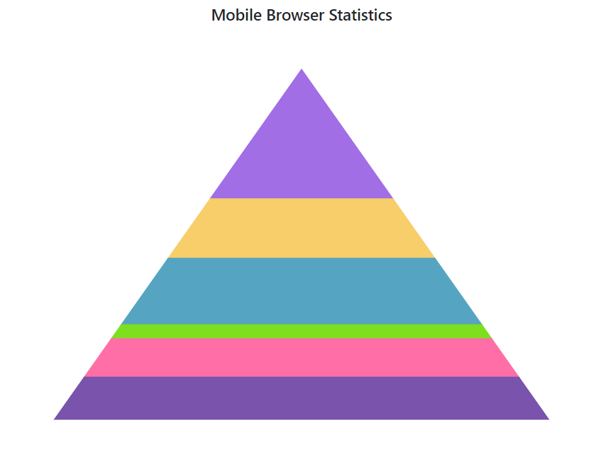
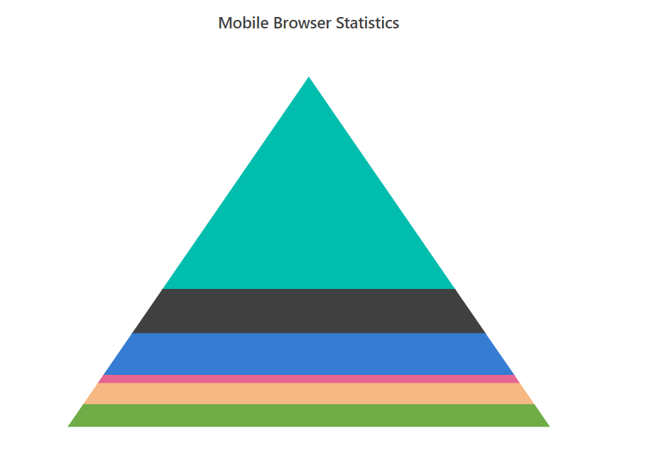
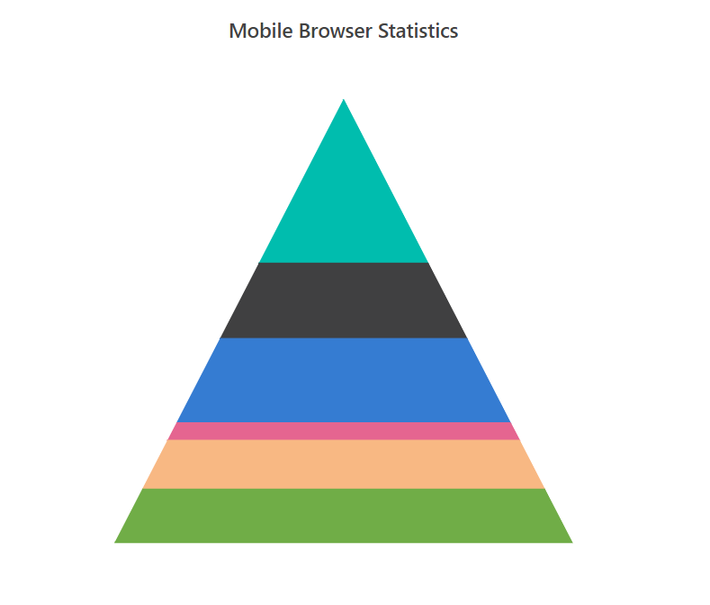
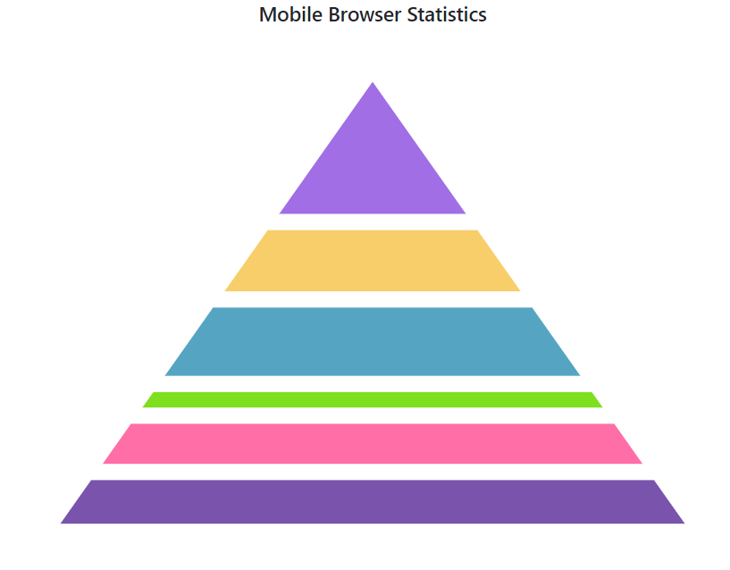
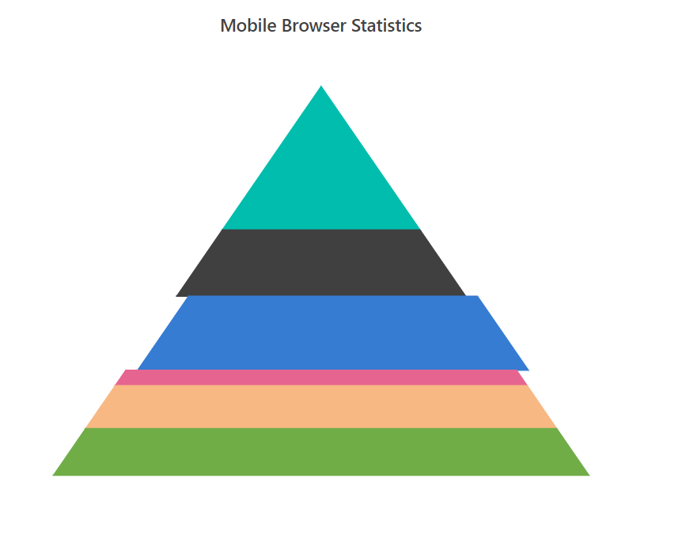

# Pyramid Chart

To render a pyramid series, use the series [`Type`](https://help.syncfusion.com/cr/blazor/Syncfusion.Blazor.Charts.AccumulationChartSeries.html#Syncfusion_Blazor_Charts_AccumulationChartSeries_Type)
as `Pyramid`.





> Note: You can refer to our [`Blazor Pyramid Chart`](https://www.syncfusion.com/blazor-components/blazor-charts/chart-types/pyramid-chart) feature tour page to know about its other groundbreaking feature representations. You can also explore our [`Blazor Pyramid Chart Example`](https://blazor.syncfusion.com/demos/chart/pyramid) to know how to render a pyramid series.

## Mode

The Pyramid chart supports linear and surface modes of rendering. The default type of the
[`PyramidMode`](https://help.syncfusion.com/cr/blazor/Syncfusion.Blazor.Charts.AccumulationChartSeries.html#Syncfusion_Blazor_Charts_AccumulationChartSeries_PyramidMode) is `Linear`.





## Size

The size of the pyramid chart can be customized by using the  [`Width`](https://help.syncfusion.com/cr/blazor/Syncfusion.Blazor.Charts.AccumulationChartSeries.html#Syncfusion_Blazor_Charts_AccumulationChartSeries_Width) and [`Height`](https://help.syncfusion.com/cr/blazor/Syncfusion.Blazor.Charts.AccumulationChartSeries.html#Syncfusion_Blazor_Charts_AccumulationChartSeries_Height) properties.





## Gap Between the Segments

Pyramid chart provides options to customize the space between the segments by using the [`GapRatio`](https://help.syncfusion.com/cr/blazor/Syncfusion.Blazor.Charts.AccumulationChartSeries.html#Syncfusion_Blazor_Charts_AccumulationChartSeries_GapRatio) property of the
series. It takes values from 0 to 1.





## Explode

Points can be exploded on mouse click by setting the [`Explode`](https://help.syncfusion.com/cr/blazor/Syncfusion.Blazor.Charts.AccumulationChartSeries.html#Syncfusion_Blazor_Charts_AccumulationChartSeries_Explode) property to **true**. You can also explode the point
on load using [`ExplodeIndex`](https://help.syncfusion.com/cr/blazor/Syncfusion.Blazor.Charts.AccumulationChartSeries.html#Syncfusion_Blazor_Charts_AccumulationChartSeries_ExplodeIndex). Explode distance can be set by using [`ExplodeOffset`](https://help.syncfusion.com/cr/blazor/Syncfusion.Blazor.Charts.AccumulationChartSeries.html#Syncfusion_Blazor_Charts_AccumulationChartSeries_ExplodeOffset) property.





## See Also

* [Data label](../data-label/)
* [Grouping](../grouping/)