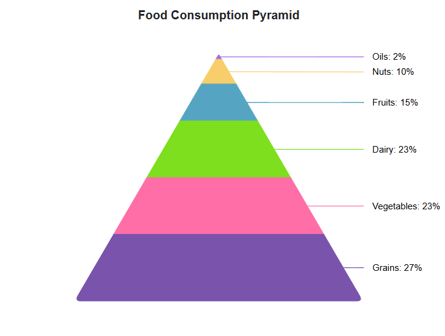

# Pyramid in Blazor Accumulation Chart Component

The [Pyramid Chart](https://www.syncfusion.com/blazor-components/blazor-charts/chart-types/pyramid-chart) is used to visualize the hierarchical data in upside triangle shape with horizontally divided section. To render the `Pyramid Chart`, set the series [Type](https://help.syncfusion.com/cr/blazor/Syncfusion.Blazor.Charts.AccumulationChartSeries.html#Syncfusion_Blazor_Charts_AccumulationChartSeries_Type) as `Pyramid`.

```cshtml 

@using Syncfusion.Blazor.Charts

<SfAccumulationChart Title="Mobile Browser Statistics">
    <AccumulationChartSeriesCollection>
        <AccumulationChartSeries DataSource="@StatisticsDetails" XName="Browser" YName="Users" Name="Browser"
								 Type="AccumulationType.Pyramid">
        </AccumulationChartSeries>
    </AccumulationChartSeriesCollection>

    <AccumulationChartLegendSettings Visible="false"></AccumulationChartLegendSettings>
</SfAccumulationChart>

@code{
    public class Statistics
    {
        public string Browser { get; set; }
        public double Users { get; set; }
    }

    public List<Statistics> StatisticsDetails = new List<Statistics>
    {
        new Statistics { Browser = "Chrome", Users = 37 },
        new Statistics { Browser = "UC Browser", Users = 17 },
        new Statistics { Browser = "iPhone", Users = 19 },
        new Statistics { Browser = "Others", Users = 4 },
        new Statistics { Browser = "Opera", Users = 11 },
        new Statistics { Browser = "Android", Users = 12 },
    };
}

```




## Pyramid mode

The Pyramid Chart can be rendered in both `Linear` or `Surface` modes by setting [PyramidMode](https://help.syncfusion.com/cr/blazor/Syncfusion.Blazor.Charts.AccumulationChartSeries.html#Syncfusion_Blazor_Charts_AccumulationChartSeries_PyramidMode) property. The default mode is `Linear`.

```cshtml 

@using Syncfusion.Blazor.Charts

<SfAccumulationChart Title="Mobile Browser Statistics">
    <AccumulationChartSeriesCollection>
        <AccumulationChartSeries DataSource="@StatisticsDetails" XName="Browser" YName="Users" Name="Browser"
								 Type="AccumulationType.Pyramid" PyramidMode="PyramidMode.Surface">
        </AccumulationChartSeries>
    </AccumulationChartSeriesCollection>

    <AccumulationChartLegendSettings Visible="false"></AccumulationChartLegendSettings>
</SfAccumulationChart>

@code{
    public class Statistics
    {
        public string Browser { get; set; }
        public double Users { get; set; }
    }

    public List<Statistics> StatisticsDetails = new List<Statistics>
    {
        new Statistics { Browser = "Chrome", Users = 37 },
        new Statistics { Browser = "UC Browser", Users = 17 },
        new Statistics { Browser = "iPhone", Users = 19 },
        new Statistics { Browser = "Others", Users = 4 },
        new Statistics { Browser = "Opera", Users = 11 },
        new Statistics { Browser = "Android", Users = 12 },
    };
}

```




## Pyramid size

The size of the pyramid chart can be customized by using the [Width](https://help.syncfusion.com/cr/blazor/Syncfusion.Blazor.Charts.AccumulationChartSeries.html#Syncfusion_Blazor_Charts_AccumulationChartSeries_Width) and [Height](https://help.syncfusion.com/cr/blazor/Syncfusion.Blazor.Charts.AccumulationChartSeries.html#Syncfusion_Blazor_Charts_AccumulationChartSeries_Height) properties.

```cshtml 

@using Syncfusion.Blazor.Charts

<SfAccumulationChart Title="Mobile Browser Statistics">
    <AccumulationChartSeriesCollection>
        <AccumulationChartSeries DataSource="@StatisticsDetails" XName="Browser" YName="Users"
                                 Name="Browser" Type="AccumulationType.Pyramid" Width="60%" Height="80%">
        </AccumulationChartSeries>
    </AccumulationChartSeriesCollection>

    <AccumulationChartLegendSettings Visible="false"></AccumulationChartLegendSettings>
</SfAccumulationChart>

@code{
    public class Statistics
    {
        public string Browser { get; set; }
        public double Users { get; set; }
    }

    public List<Statistics> StatisticsDetails = new List<Statistics>
	{
        new Statistics { Browser = "Chrome", Users = 37 },
        new Statistics { Browser = "UC Browser", Users = 17 },
        new Statistics { Browser = "iPhone", Users = 19 },
        new Statistics { Browser = "Others", Users = 4  },
        new Statistics { Browser = "Opera", Users = 11 },
        new Statistics { Browser = "Android", Users = 12 },
    };
}

```




## Gap between pyramid segments

The [Pyramid Chart](https://help.syncfusion.com/cr/blazor/Syncfusion.Blazor.Charts.AccumulationType.html#Syncfusion_Blazor_Charts_AccumulationType_Pyramid) provides options to customize the space between the segments by using the [GapRatio](https://help.syncfusion.com/cr/blazor/Syncfusion.Blazor.Charts.AccumulationChartSeries.html#Syncfusion_Blazor_Charts_AccumulationChartSeries_GapRatio) property of the series. It accepts values ranging from 0 to 1.

```cshtml 

@using Syncfusion.Blazor.Charts

<SfAccumulationChart Title="Mobile Browser Statistics">
    <AccumulationChartSeriesCollection>
        <AccumulationChartSeries DataSource="@StatisticsDetails" XName="Browser" YName="Users" Name="Browser"
								 Type="AccumulationType.Pyramid" GapRatio="0.2">
        </AccumulationChartSeries>
    </AccumulationChartSeriesCollection>

    <AccumulationChartLegendSettings Visible="false"></AccumulationChartLegendSettings>
</SfAccumulationChart>

@code{
    public class Statistics
    {
        public string Browser { get; set; }
        public double Users { get; set; }
    }

    public List<Statistics> StatisticsDetails = new List<Statistics>
    {
        new Statistics { Browser = "Chrome", Users = 37 },
        new Statistics { Browser = "UC Browser", Users = 17 },
        new Statistics { Browser = "iPhone", Users = 19 },
        new Statistics { Browser = "Others", Users = 4 },
        new Statistics { Browser = "Opera", Users = 11 },
        new Statistics { Browser = "Android", Users = 12 },
    };
}

```




## Pyramid explode

By setting the [Explode](https://help.syncfusion.com/cr/blazor/Syncfusion.Blazor.Charts.AccumulationChartSeries.html#Syncfusion_Blazor_Charts_AccumulationChartSeries_Explode) property to **true**, points can be exploded on mouse click. Using the [ExplodeIndex](https://help.syncfusion.com/cr/blazor/Syncfusion.Blazor.Charts.AccumulationChartSeries.html#Syncfusion_Blazor_Charts_AccumulationChartSeries_ExplodeIndex) property, expand the point on load. The [ExplodeOffset](https://help.syncfusion.com/cr/blazor/Syncfusion.Blazor.Charts.AccumulationChartSeries.html#Syncfusion_Blazor_Charts_AccumulationChartSeries_ExplodeOffset) property can be used to set the distance between explosions.

```cshtml 

@using Syncfusion.Blazor.Charts

<SfAccumulationChart Title="Mobile Browser Statistics">
    <AccumulationChartSeriesCollection>
        <AccumulationChartSeries DataSource="@StatisticsDetails" XName="Browser" YName="Users" Name="Browser"
                                 Type="AccumulationType.Pyramid" ExplodeIndex="2" Explode="true" ExplodeOffset="10">
        </AccumulationChartSeries>
    </AccumulationChartSeriesCollection>

    <AccumulationChartLegendSettings Visible="false"></AccumulationChartLegendSettings>
</SfAccumulationChart>

@code{
    public class Statistics
    {
        public string Browser { get; set; }
        public double Users { get; set; }
    }

    public List<Statistics> StatisticsDetails = new List<Statistics>
    {
        new Statistics { Browser = "Chrome", Users = 37 },
        new Statistics { Browser = "UC Browser", Users = 17 },
        new Statistics { Browser = "iPhone", Users = 19 },
        new Statistics { Browser = "Others", Users = 4 },
        new Statistics { Browser = "Opera", Users = 11 },
        new Statistics { Browser = "Android", Users = 12 },
    };
}

```




## Border radius

The corners of the first data point and last data point in the pyramid chart series can be rounded using the [BorderRadius](https://help.syncfusion.com/cr/blazor/Syncfusion.Blazor.Charts.AccumulationChartSeries.html#Syncfusion_Blazor_Charts_AccumulationChartSeries_BorderRadius) property within the [AccumulationChartSeries](https://help.syncfusion.com/cr/blazor/Syncfusion.Blazor.Charts.AccumulationChartSeries.html).

```cshtml
@using Syncfusion.Blazor.Charts

<SfAccumulationChart Title="Food Consumption Pyramid">
    <AccumulationChartLegendSettings Visible="false">
    </AccumulationChartLegendSettings>
    <AccumulationChartSeriesCollection>
        <AccumulationChartSeries DataSource="@PyramidChartPoints" XName="Foods" YName="Percentage" Type="AccumulationType.Pyramid" Width="45%" Height="80%" BorderRadius="8">
            <AccumulationDataLabelSettings Visible="true" Position="AccumulationLabelPosition.Outside" Name="DataLabelMappingName">
            </AccumulationDataLabelSettings>
        </AccumulationChartSeries>
    </AccumulationChartSeriesCollection>
</SfAccumulationChart>

@code {
    public List<PyramidData> PyramidChartPoints { get; set; } = new List<PyramidData>
    {
          new PyramidData { Foods = "Oils", Percentage = 2, DataLabelMappingName = "Oils: 2%" },
          new PyramidData { Foods = "Nuts", Percentage = 10, DataLabelMappingName = "Nuts: 10%" },
          new PyramidData { Foods = "Fruits", Percentage = 15, DataLabelMappingName = "Fruits: 15%" },
          new PyramidData { Foods = "Dairy", Percentage = 23, DataLabelMappingName = "Dairy: 23%" },
          new PyramidData { Foods = "Vegetables", Percentage = 23, DataLabelMappingName = "Vegetables: 23%" },
          new PyramidData { Foods = "Grains", Percentage = 27, DataLabelMappingName = "Grains: 27%"}
    };
    public class PyramidData
    {
        public string Foods { get; set; }
        public double Percentage { get; set; }
        public string DataLabelMappingName { get; set; }
    }
}
```



N> Refer to our [Blazor Charts](https://www.syncfusion.com/blazor-components/blazor-charts) feature tour page for its groundbreaking feature representations and also explore our [Blazor Accumulation Chart Example](https://blazor.syncfusion.com/demos/chart/pyramid?theme=bootstrap5) to know various features of accumulation charts and how it is used to represent numeric proportional data.

## See also

* [Data label](../data-label)
* [Grouping](../grouping)