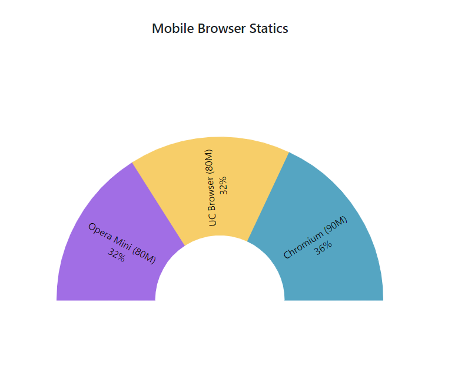
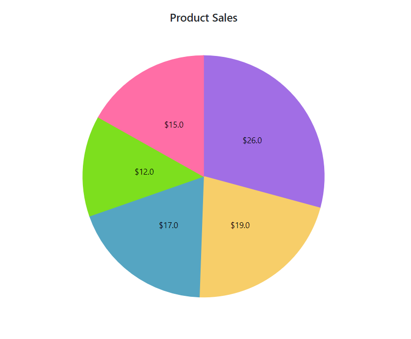

# Data Label in Blazor Accumulation Chart Component

The [Visible](https://help.syncfusion.com/cr/blazor/Syncfusion.Blazor.Charts.AccumulationDataLabelSettings.html#Syncfusion_Blazor_Charts_AccumulationDataLabelSettings_Visible) property in the [AccumulationDataLabelSettings](https://help.syncfusion.com/cr/blazor/Syncfusion.Blazor.Charts.AccumulationDataLabelSettings.html) can be used to add a data label to a series point.

```cshtml 

@using Syncfusion.Blazor.Charts

<SfAccumulationChart Title="Mobile Browser Statistics" EnableSmartLabels="true">
    <AccumulationChartLegendSettings Visible="false"></AccumulationChartLegendSettings>

    <AccumulationChartSeriesCollection>
        <AccumulationChartSeries DataSource="@StatisticsDetails" XName="Browser" YName="Users" Name="Browser">
            <AccumulationDataLabelSettings Visible="true" Name="Browser"></AccumulationDataLabelSettings>
        </AccumulationChartSeries>
    </AccumulationChartSeriesCollection>
</SfAccumulationChart>

@code{
    public class Statistics
    {
        public string Browser { get; set;}
        public double Users { get; set; }
        public string Text { get; set; }
        public string Fill { get; set; }

    }

    public List<Statistics> StatisticsDetails = new List<Statistics>
	{
        new Statistics { Browser = "Chrome", Users = 37, Text= "37%", Fill="#498fff"},
        new Statistics { Browser = "UC Browser", Users = 17, Text= "17%", Fill="#ffa060"},
        new Statistics { Browser = "iPhone", Users = 19, Text= "19%", Fill="#ff68b6"},
        new Statistics { Browser = "Others", Users = 4 , Text= "4%", Fill="#81e2a1"},
    };
}

```


<!--  -->

## Text Wrap

When the data label text exceeds the container, the text can be wrapped by using [TextWrap](https://help.syncfusion.com/cr/blazor/Syncfusion.Blazor.Charts.AccumulationDataLabelSettings.html#Syncfusion_Blazor_Charts_AccumulationDataLabelSettings_TextWrap) Property. End user can also wrap the data label text based on the [MaxWidth](https://help.syncfusion.com/cr/blazor/Syncfusion.Blazor.Charts.AccumulationDataLabelSettings.html#Syncfusion_Blazor_Charts_AccumulationDataLabelSettings_MaxWidth) property.

```cshtml 
@using Syncfusion.Blazor.Charts

 <SfAccumulationChart Title="Mobile Browser Statics">
         <AccumulationChartLegendSettings Visible="false"></AccumulationChartLegendSettings>

    <AccumulationChartSeriesCollection>
        <AccumulationChartSeries DataSource="@PieChartPoints" XName="Browser" YName="Users" Name="Browser">
            <AccumulationDataLabelSettings EnableRotation="true" Visible="true" MaxWidth="100" TextWrap="TextWrap.Wrap" Name="DataLabelMappingName" Position="AccumulationLabelPosition.Inside">
                </AccumulationDataLabelSettings>
            </AccumulationChartSeries>
        </AccumulationChartSeriesCollection>
    </SfAccumulationChart>

@code{
    public List<PieData> PieChartPoints { get; set; } = new List<PieData>
    {
        new PieData { Browser =  "Opera Mini", Users = 80, DataLabelMappingName = "Opera Mini (80M) 32%" },
        new PieData { Browser =  "UC Browser", Users = 80, DataLabelMappingName = "UC Browser (80M) 32%" },
        new PieData { Browser =  "Internet Explorer", Users = 90, DataLabelMappingName = "Chromium (90M) 36%" },
    };
    
    public class PieData
    {
        public string Browser { get; set; }
        public double Users { get; set; }
        public string DataLabelMappingName { get; set; }
    }
}
```

<!--  -->

## Position

The [Position](https://help.syncfusion.com/cr/blazor/Syncfusion.Blazor.Charts.AccumulationDataLabelSettings.html#Syncfusion_Blazor_Charts_AccumulationDataLabelSettings_Position) property in the [AccumulationDataLabelSettings](https://help.syncfusion.com/cr/blazor/Syncfusion.Blazor.Charts.AccumulationDataLabelSettings.html) allows the data label to be placed either [Inside](https://help.syncfusion.com/cr/blazor/Syncfusion.Blazor.Charts.AccumulationLabelPosition.html#Syncfusion_Blazor_Charts_AccumulationLabelPosition_Inside) or [Outside](https://help.syncfusion.com/cr/blazor/Syncfusion.Blazor.Charts.AccumulationLabelPosition.html#Syncfusion_Blazor_Charts_AccumulationLabelPosition_Outside) of the chart.

```cshtml 

@using Syncfusion.Blazor.Charts

<SfAccumulationChart Title="Mobile Browser Statistics">
    <AccumulationChartLegendSettings Visible="false"></AccumulationChartLegendSettings>

    <AccumulationChartSeriesCollection>
        <AccumulationChartSeries DataSource="@StatisticsDetails" XName="Browser" YName="Users" Name="Browser">
            <AccumulationDataLabelSettings Visible="true" Name="Browser" Position="AccumulationLabelPosition.Outside"></AccumulationDataLabelSettings>
        </AccumulationChartSeries>
    </AccumulationChartSeriesCollection>
</SfAccumulationChart>

@code{
    public class Statistics
    {
        public string Browser { get; set; }
        public double Users { get; set; }
        public string Text { get; set; }
        public string Fill { get; set; }

    }

    public List<Statistics> StatisticsDetails = new List<Statistics>
	{
        new Statistics { Browser = "Chrome", Users = 37, Text= "37%", Fill="#498fff"},
        new Statistics { Browser = "UC Browser", Users = 17, Text= "17%", Fill="#ffa060"},
        new Statistics { Browser = "iPhone", Users = 19, Text= "19%", Fill="#ff68b6"},
        new Statistics { Browser = "Others", Users = 4 , Text= "4%", Fill="#81e2a1"},
    };
}

```


<!--  -->

## Smart Labels

Data labels will be arranged smartly without overlapping with each other. The [EnableSmartLabels](https://help.syncfusion.com/cr/blazor/Syncfusion.Blazor.Charts.SfAccumulationChart.html#Syncfusion_Blazor_Charts_SfAccumulationChart_EnableSmartLabels) property can be used to enable or disable this feature.

```cshtml 

@using Syncfusion.Blazor.Charts

<SfAccumulationChart EnableSmartLabels="true">
    <AccumulationChartLegendSettings Visible="false"></AccumulationChartLegendSettings>

    <AccumulationChartSeriesCollection>
        <AccumulationChartSeries DataSource="@StatisticsDetails" XName="Country" YName="Users">
            <AccumulationDataLabelSettings Visible="true" Name="Country" Position="AccumulationLabelPosition.Outside">
                <AccumulationChartConnector Type="ConnectorType.Curve" Length="20px" />
            </AccumulationDataLabelSettings>
        </AccumulationChartSeries>
    </AccumulationChartSeriesCollection>
</SfAccumulationChart>

@code{
    public class Statistics
    {
        public string Country { get; set; }
        public double Users { get; set; }
    }
	
    public List<Statistics> StatisticsDetails = new List<Statistics>
    {
        new Statistics { Country = "China", Users = 1409517397 },
        new Statistics { Country = "India", Users = 1339180127 },
        new Statistics { Country = "United States", Users = 324459463 },
        new Statistics { Country = "Indonesia", Users = 263991379 },
        new Statistics { Country = "Brazil", Users = 209288278 },
        new Statistics { Country = "Pakistan", Users = 197015955 },
        new Statistics { Country = "Nigeria", Users = 190886311 },
        new Statistics { Country = "Bangladesh", Users = 164669751 },
        new Statistics { Country = "Russia", Users = 143989754 },
        new Statistics { Country = "Mexico", Users = 129163276 },
        new Statistics { Country = "Japan", Users = 127484450 },
        new Statistics { Country = "Ethiopia", Users = 104957438 },
        new Statistics { Country = "Philippines", Users = 104918090 },
        new Statistics { Country = "Egypt", Users = 97553151 },
        new Statistics { Country = "Vietnam", Users = 95540800 },
        new Statistics { Country = "Germany", Users = 82114224 },
    };
}

```


<!--  -->

## Connector line

When the data label is placed [Outside](https://help.syncfusion.com/cr/blazor/Syncfusion.Blazor.Charts.AccumulationLabelPosition.html#Syncfusion_Blazor_Charts_AccumulationLabelPosition_Outside) the chart, the connector line will be visible. The [Type](https://help.syncfusion.com/cr/blazor/Syncfusion.Blazor.Charts.AccumulationChartConnector.html#Syncfusion_Blazor_Charts_AccumulationChartConnector_Type), [Color](https://help.syncfusion.com/cr/blazor/Syncfusion.Blazor.Charts.AccumulationChartConnector.html#Syncfusion_Blazor_Charts_AccumulationChartConnector_Color), [Width](https://help.syncfusion.com/cr/blazor/Syncfusion.Blazor.Charts.AccumulationChartConnector.html#Syncfusion_Blazor_Charts_AccumulationChartConnector_Width), [Length](https://help.syncfusion.com/cr/blazor/Syncfusion.Blazor.Charts.AccumulationChartConnector.html#Syncfusion_Blazor_Charts_AccumulationChartConnector_Length) and [DashArray](https://help.syncfusion.com/cr/blazor/Syncfusion.Blazor.Charts.AccumulationChartConnector.html#Syncfusion_Blazor_Charts_AccumulationChartConnector_DashArray) properties can be used to customize the connector line.

```cshtml 

@using Syncfusion.Blazor.Charts

<SfAccumulationChart Title="Mobile Browser Statistics" EnableSmartLabels="true">
    <AccumulationChartLegendSettings Visible="false"></AccumulationChartLegendSettings>

    <AccumulationChartSeriesCollection>
        <AccumulationChartSeries DataSource="@StatisticsDetails" XName="Browser" YName="Users" Name="Browser">
            <AccumulationDataLabelSettings Visible="true" Name="Text" Position="AccumulationLabelPosition.Outside">
                <AccumulationChartConnector Color="#f4429e" Length="50px" Width="2" Type="ConnectorType.Curve" DashArray="5,3"></AccumulationChartConnector>
            </AccumulationDataLabelSettings>
        </AccumulationChartSeries>
    </AccumulationChartSeriesCollection>
</SfAccumulationChart>

@code{
    public class Statistics
    {
        public string Browser { get; set; }
        public double Users { get; set; }
        public string Text { get; set; }
        public string Fill { get; set; }

    }

    public List<Statistics> StatisticsDetails = new List<Statistics>
	{
        new Statistics { Browser = "Chrome", Users = 37, Text= "37%", Fill="#498fff"},
        new Statistics { Browser = "UC Browser", Users = 17, Text= "17%", Fill="#ffa060"},
        new Statistics { Browser = "iPhone", Users = 19, Text= "19%", Fill="#ff68b6"},
        new Statistics { Browser = "Others", Users = 4 , Text= "4%", Fill="#81e2a1"},
    };
}

```


<!--  -->

## Text mapping

The [Name](https://help.syncfusion.com/cr/blazor/Syncfusion.Blazor.Charts.AccumulationDataLabelSettings.html#Syncfusion_Blazor_Charts_AccumulationDataLabelSettings_Name) property can be used to map text from a data source to a data label.

```cshtml 

@using Syncfusion.Blazor.Charts

<SfAccumulationChart Title="Mobile Browser Statistics" EnableSmartLabels="true">
    <AccumulationChartLegendSettings Visible="false"></AccumulationChartLegendSettings>

    <AccumulationChartSeriesCollection>
        <AccumulationChartSeries DataSource="@StatisticsDetails" XName="Browser" YName="Users" Name="Browser">
            <AccumulationDataLabelSettings Visible="true" Name="Text">
            </AccumulationDataLabelSettings>
        </AccumulationChartSeries>
    </AccumulationChartSeriesCollection>
</SfAccumulationChart>

@code{
    public class Statistics
    {
        public string Browser { get; set; }
        public double Users { get; set; }
        public string Text { get; set; }
        public string Fill { get; set; }
    }

    public List<Statistics> StatisticsDetails = new List<Statistics>
    {
        new Statistics { Browser = "Chrome", Users = 37, Text= "37%", Fill="#498fff"},
        new Statistics { Browser = "UC Browser", Users = 17, Text= "17%", Fill="#ffa060"},
        new Statistics { Browser = "iPhone", Users = 19, Text= "19%", Fill="#ff68b6"},
        new Statistics { Browser = "Others", Users = 4 , Text= "4%", Fill="#81e2a1"},
    };
}

```


<!--  -->

N> Refer to the [Blazor Charts](https://www.syncfusion.com/blazor-components/blazor-charts) feature tour page for its groundbreaking feature representations and also explore the [Blazor Accumulation Chart Example](https://blazor.syncfusion.com/demos/chart/pie?theme=bootstrap5) to know various features of accumulation charts and how it is used to represent numeric proportional data.

## Format

Data label for the accumulation chart can be formatted using [Format](https://help.syncfusion.com/cr/blazor/Syncfusion.Blazor.Charts.ChartDataLabel.html#Syncfusion_Blazor_Charts_ChartDataLabel_Format) property. You can use the global formatting options, such as 'N1', 'P1', and 'C1'.

```cshtml

@using Syncfusion.Blazor.Charts

<SfAccumulationChart Title="Product Sales" EnableAnimation="false">
    <AccumulationChartTooltipSettings Enable="true"></AccumulationChartTooltipSettings>

    <AccumulationChartLegendSettings Visible="false"></AccumulationChartLegendSettings>

    <AccumulationChartSeriesCollection>
        <AccumulationChartSeries DataSource="@ChartValues" XName="XValue" YName="YValue" Name="Browser" Radius="80%" StartAngle="0" EndAngle="360"InnerRadius="0%">
            <AccumulationDataLabelSettings Visible="true"  Format="C1" Position="AccumulationLabelPosition.Inside"></AccumulationDataLabelSettings>
        </AccumulationChartSeries>
    </AccumulationChartSeriesCollection>
</SfAccumulationChart>

@code{
    public class ChartData
    {
        public string XValue { get; set; }
        public double YValue { get; set; }
    }

    public List<ChartData> ChartValues = new List<ChartData>
    {
        new ChartData { XValue = "Apple", YValue = 26 },
        new ChartData { XValue = "Redmi", YValue = 19 },
        new ChartData { XValue = "Realme", YValue = 17 },
        new ChartData { XValue = "Oneplus", YValue = 12 },
        new ChartData { XValue = "Samsung", YValue = 15 },
    };
}

```


<!--  -->

## See also

* [Tooltip](./tool-tip)
* [Legend](./legend)