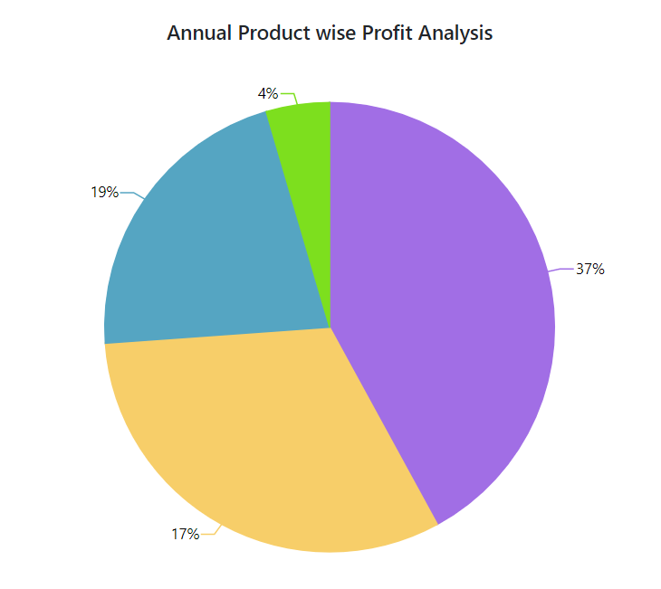

# Empty Points

Data points that contains `NaN` value are considered as empty points. The empty data points
can be ignored or not plotted in the chart. You can customize those points, using the [`EmptyPointSettings`](https://help.syncfusion.com/cr/blazor/Syncfusion.Blazor.Charts.AccumulationChartSeries.html#Syncfusion_Blazor_Charts_AccumulationChartSeries_EmptyPointSettings) property in
series. The default mode of the empty point is `Gap`. Other supported modes are `Average` and `Zero`.

```csharp

@page "/"

@using Syncfusion.Blazor.Charts
<SfAccumulationChart Title="Annual Product wise Profit Analysis">
    <AccumulationChartTooltipSettings Enable="true"></AccumulationChartTooltipSettings>

    <AccumulationChartLegendSettings Visible="false"></AccumulationChartLegendSettings>

    <AccumulationChartSeriesCollection>
        <AccumulationChartSeries DataSource="@StatisticsDetails" XName="Browser" YName="Users"
                                 Name="Profit">
            <AccumulationChartEmptyPointSettings Mode="@Mode" Fill="#c0faf4"></AccumulationChartEmptyPointSettings>
            <AccumulationDataLabelSettings Visible="true" Name="Text" Position="AccumulationLabelPosition.Outside"></AccumulationDataLabelSettings>
        </AccumulationChartSeries>
    </AccumulationChartSeriesCollection>
</SfAccumulationChart>

@code{
    public EmptyPointMode Mode = EmptyPointMode.Average;

    public class Statistics
    {
        public string Browser { get; set; }
        public double? Users { get; set; }
        public string Text { get; set; }
        public string Fill { get; set; }
    }
    public List<Statistics> StatisticsDetails = new List<Statistics>
{
       new Statistics { Browser = "Chrome", Users = 37, Text= "37%", Fill="#498fff"},
       new Statistics { Browser = "UC Browser", Users = null, Text= "17%", Fill="#ffa060"},
       new Statistics { Browser = "iPhone", Users = 19, Text= "19%", Fill="#ff68b6"},
       new Statistics { Browser = "Others", Users = 4 , Text= "4%", Fill="#81e2a1"},
    };
}

```



## Customization

Specific color for an empty point can be set by using the [`Fill`](https://help.syncfusion.com/cr/blazor/Syncfusion.Blazor.Charts.AccumulationChartEmptyPointSettings.html#Syncfusion_Blazor_Charts_AccumulationChartEmptyPointSettings_Fill) property in [`EmptyPointSettings`](https://help.syncfusion.com/cr/blazor/Syncfusion.Blazor.Charts.AccumulationChartSeries.html#Syncfusion_Blazor_Charts_AccumulationChartSeries_EmptyPointSettings) and the
border for an empty point can be set by using the [`Border`](https://help.syncfusion.com/cr/blazor/Syncfusion.Blazor.Charts.AccumulationChartEmptyPointSettings.html#Syncfusion_Blazor_Charts_AccumulationChartEmptyPointSettings_Border) property.

```csharp

@page "/"

@using Syncfusion.Blazor.Charts
<SfAccumulationChart Title="Annual Product wise Profit Analysis">
    <AccumulationChartTooltipSettings Enable="true"></AccumulationChartTooltipSettings>

    <AccumulationChartLegendSettings Visible="false"></AccumulationChartLegendSettings>

    <AccumulationChartSeriesCollection>
        <AccumulationChartSeries DataSource="@StatisticsDetails" XName="Browser" YName="Users"
                                 Name="Profit">
            <AccumulationChartEmptyPointSettings Mode="@Mode" Fill="#c0faf4"></AccumulationChartEmptyPointSettings>
            <AccumulationDataLabelSettings Visible="true" Name="Text" Position="AccumulationLabelPosition.Outside"></AccumulationDataLabelSettings>
        </AccumulationChartSeries>
    </AccumulationChartSeriesCollection>
</SfAccumulationChart>

@code{
    public EmptyPointMode Mode = EmptyPointMode.Average;

    public class Statistics
    {
        public string Browser { get; set; }
        public double? Users { get; set; }
        public string Text { get; set; }
        public string Fill { get; set; }
    }
    public List<Statistics> StatisticsDetails = new List<Statistics>
{
       new Statistics { Browser = "Chrome", Users = 37, Text= "37%", Fill="#498fff"},
       new Statistics { Browser = "UC Browser", Users = null, Text= "17%", Fill="#ffa060"},
       new Statistics { Browser = "iPhone", Users = 19, Text= "19%", Fill="#ff68b6"},
       new Statistics { Browser = "Others", Users = 4 , Text= "4%", Fill="#81e2a1"},
    };
}

```