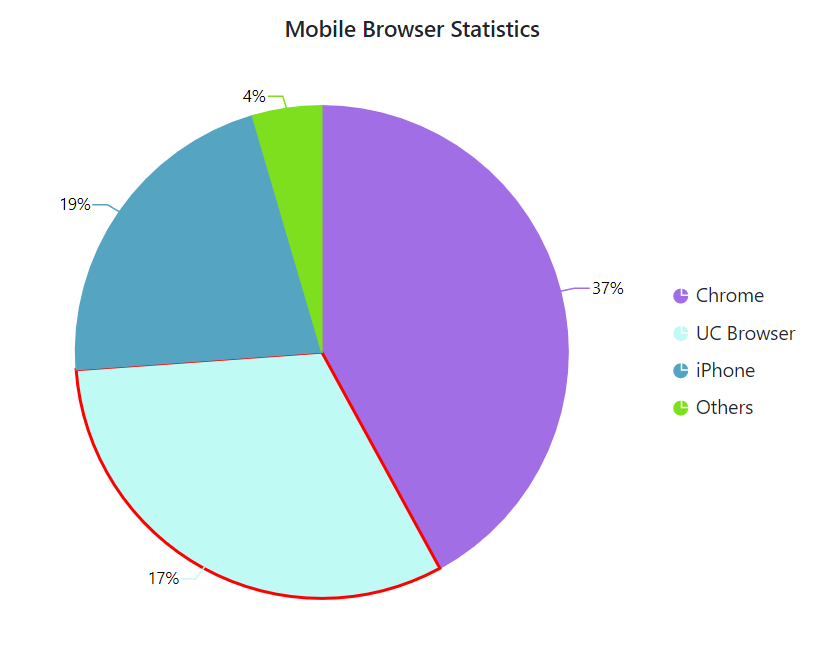

# Empty Points in Blazor Accumulation Chart Component

Data points that contain **NaN** or **null** value are considered as empty points. The empty data points can be ignored or not plotted in the chart. Those points can be customized using the [AccumulationChartEmptyPointSettings](https://help.syncfusion.com/cr/blazor/Syncfusion.Blazor.Charts.AccumulationChartEmptyPointSettings.html) in series. 

```cshtml 

@using Syncfusion.Blazor.Charts

<SfAccumulationChart Title="Mobile Browser Statistics">
    <AccumulationChartSeriesCollection>
        <AccumulationChartSeries DataSource="@StatisticsDetails" XName="Browser" YName="Users"
                                 Name="Profit">
            <AccumulationChartEmptyPointSettings Mode="@Mode"></AccumulationChartEmptyPointSettings>
            <AccumulationDataLabelSettings Visible="true" Name="Text" Position="AccumulationLabelPosition.Outside"></AccumulationDataLabelSettings>
        </AccumulationChartSeries>
    </AccumulationChartSeriesCollection>
</SfAccumulationChart>

@code{
    public EmptyPointMode Mode = EmptyPointMode.Gap;

    public class Statistics
    {
        public string Browser { get; set; }
        public double? Users { get; set; }
        public string Text { get; set; }
        public string Fill { get; set; }
    }
	
    public List<Statistics> StatisticsDetails = new List<Statistics>
	{
       new Statistics { Browser = "Chrome", Users = 37, Text= "37%", Fill="#498fff"},
       new Statistics { Browser = "UC Browser", Users = 17, Text= "17%", Fill="#ffa060"},
       new Statistics { Browser = "iPhone", Users = 19, Text= "19%", Fill="#ff68b6"},
       new Statistics { Browser = "Others", Users = 4 , Text= "4%", Fill="#81e2a1"},
    };
}

```


<!--  -->

## Customization

The [Mode](https://help.syncfusion.com/cr/blazor/Syncfusion.Blazor.Charts.AccumulationChartEmptyPointSettings.html#Syncfusion_Blazor_Charts_AccumulationChartEmptyPointSettings_Mode) property can be used to handle the visibility of the empty points. The default mode of the empty point is **Gap**. Other supported modes are **Average**, **Drop** and **Zero**. The [Fill](https://help.syncfusion.com/cr/blazor/Syncfusion.Blazor.Charts.AccumulationChartEmptyPointSettings.html#Syncfusion_Blazor_Charts_AccumulationChartEmptyPointSettings_Fill) property can be used to set a specific color for an empty point, and the [Border](https://help.syncfusion.com/cr/blazor/Syncfusion.Blazor.Charts.AccumulationChartEmptyPointSettings.html#Syncfusion_Blazor_Charts_AccumulationChartEmptyPointSettings_Border) property can be used to set the border for an empty point.

```cshtml 

@using Syncfusion.Blazor.Charts

<SfAccumulationChart Title="Mobile Browser Statistics">
    <AccumulationChartSeriesCollection>
        <AccumulationChartSeries DataSource="@StatisticsDetails" XName="Browser" YName="Users"
                                 Name="Profit">
            <AccumulationChartEmptyPointSettings Mode="@Mode" Fill="#c0faf4">
                <AccumulationChartEmptyPointBorder Color="red" Width="2"></AccumulationChartEmptyPointBorder>
            </AccumulationChartEmptyPointSettings>
            <AccumulationDataLabelSettings Visible="true" Name="Text" Position="AccumulationLabelPosition.Outside"></AccumulationDataLabelSettings>
        </AccumulationChartSeries>
    </AccumulationChartSeriesCollection>
</SfAccumulationChart>


@code{
    public EmptyPointMode Mode = EmptyPointMode.Average;

    public class Statistics
    {
        public string Browser { get; set; }
        public double? Users { get; set; }
        public string Text { get; set; }
        public string Fill { get; set; }
    }
	
    public List<Statistics> StatisticsDetails = new List<Statistics>
	{
       new Statistics { Browser = "Chrome", Users = 37, Text= "37%", Fill="#498fff"},
       new Statistics { Browser = "UC Browser", Users = null, Text= "17%", Fill="#ffa060"},
       new Statistics { Browser = "iPhone", Users = 19, Text= "19%", Fill="#ff68b6"},
       new Statistics { Browser = "Others", Users = 4 , Text= "4%", Fill="#81e2a1"},
    };
}

```


<!--  -->

N> Refer to the [Blazor Charts](https://www.syncfusion.com/blazor-components/blazor-charts) feature tour page for its groundbreaking feature representations and also explore the [Blazor Chart Example](https://blazor.syncfusion.com/demos/chart/pie?theme=bootstrap5) to know about the various chart types and how to represent time-dependent data, showing trends at equal intervals.

## See also

* [Data Label](./data-labels)
* [Tooltip](./tool-tip)
* [Legend](./legend)