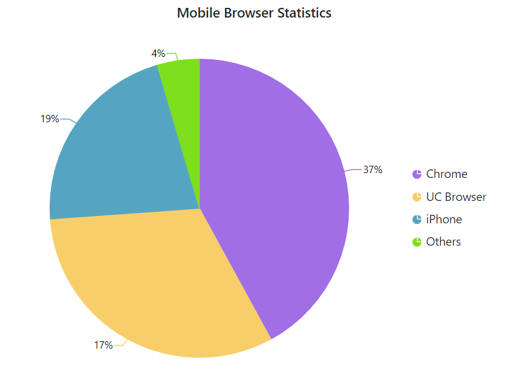

# Empty Points

Data points that contain **NaN** or **null** value are considered as empty points. The empty data points
can be ignored or not plotted in the chart. You can customize those points, using the [`EmptyPointSettings`](https://help.syncfusion.com/cr/blazor/Syncfusion.Blazor.Charts.AccumulationChartSeries.html#Syncfusion_Blazor_Charts_AccumulationChartSeries_EmptyPointSettings) property in series. 





## Customization

The [`Mode`](https://help.syncfusion.com/cr/blazor/Syncfusion.Blazor.Charts.AccumulationChartEmptyPointSettings.html#Syncfusion_Blazor_Charts_AccumulationChartEmptyPointSettings_Mode) property can be used to handle the visibility of the empty points. The default mode of the empty point is **Gap**. Other supported modes are **Average**, **Drop** and **Zero**. The [`Fill`](https://help.syncfusion.com/cr/blazor/Syncfusion.Blazor.Charts.AccumulationChartEmptyPointSettings.html#Syncfusion_Blazor_Charts_AccumulationChartEmptyPointSettings_Fill) property can be used to set a specific colour for an empty point, and the [`Border`](https://help.syncfusion.com/cr/blazor/Syncfusion.Blazor.Charts.AccumulationChartEmptyPointSettings.html#Syncfusion_Blazor_Charts_AccumulationChartEmptyPointSettings_Border) property can be used to set the border for an empty point.





> Refer to our [`Blazor Charts`](https://www.syncfusion.com/blazor-components/blazor-charts) feature tour page for its groundbreaking feature representations and also explore our [`Blazor Chart Example`](https://blazor.syncfusion.com/demos/chart/pie?theme=bootstrap4) to know various chart types and how to represent time-dependent data, showing trends at equal intervals.

## See Also

* [Data Label](./data-labels)
* [Tooltip](./tool-tip)
* [Legend](./legend)