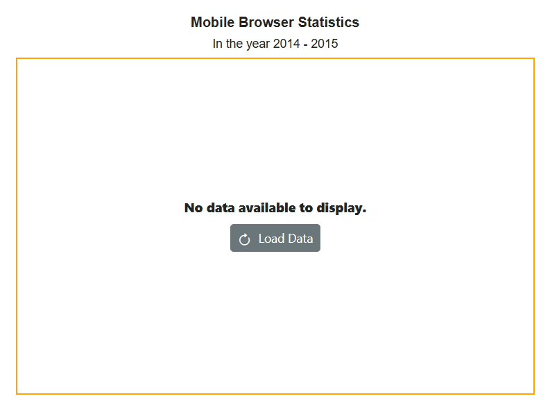

# Empty Points in Blazor Accumulation Chart Component

Data points with **NaN** or **null** values are considered empty points. These can be ignored or not plotted in the chart, and customized using [AccumulationChartEmptyPointSettings](https://help.syncfusion.com/cr/blazor/Syncfusion.Blazor.Charts.AccumulationChartEmptyPointSettings.html) in the series.

```cshtml

@using Syncfusion.Blazor.Charts

<SfAccumulationChart Title="Mobile Browser Statistics">
    <AccumulationChartSeriesCollection>
        <AccumulationChartSeries DataSource="@StatisticsDetails" XName="Browser" YName="Users"
                                 Name="Profit">
            <AccumulationChartEmptyPointSettings Mode="@Mode"></AccumulationChartEmptyPointSettings>
            <AccumulationDataLabelSettings Visible="true" Name="Text" Position="AccumulationLabelPosition.Outside"></AccumulationDataLabelSettings>
        </AccumulationChartSeries>
    </AccumulationChartSeriesCollection>
</SfAccumulationChart>

@code {
    public EmptyPointMode Mode = EmptyPointMode.Gap;

    public class Statistics
    {
        public string Browser { get; set; }
        public double? Users { get; set; }
        public string Text { get; set; }
        public string Fill { get; set; }
    }
	
    public List<Statistics> StatisticsDetails = new List<Statistics>
	{
       new Statistics { Browser = "Chrome", Users = 37, Text = "37%", Fill = "#498fff"},
       new Statistics { Browser = "UC Browser", Users = 17, Text = "17%", Fill = "#ffa060"},
       new Statistics { Browser = "iPhone", Users = 19, Text = "19%", Fill = "#ff68b6"},
       new Statistics { Browser = "Others", Users = 4 , Text = "4%", Fill = "#81e2a1"}
    };
}

```




## Customization

Handle empty points using the [Mode](https://help.syncfusion.com/cr/blazor/Syncfusion.Blazor.Charts.AccumulationChartEmptyPointSettings.html#Syncfusion_Blazor_Charts_AccumulationChartEmptyPointSettings_Mode) property. Supported modes: **Gap** (default), **Average**, **Drop**, and **Zero**. Use [Fill](https://help.syncfusion.com/cr/blazor/Syncfusion.Blazor.Charts.AccumulationChartEmptyPointSettings.html#Syncfusion_Blazor_Charts_AccumulationChartEmptyPointSettings_Fill) and [Border](https://help.syncfusion.com/cr/blazor/Syncfusion.Blazor.Charts.AccumulationChartEmptyPointSettings.html#Syncfusion_Blazor_Charts_AccumulationChartEmptyPointSettings_Border) to style empty points.

```cshtml

@using Syncfusion.Blazor.Charts

<SfAccumulationChart Title="Mobile Browser Statistics">
    <AccumulationChartSeriesCollection>
        <AccumulationChartSeries DataSource="@StatisticsDetails" XName="Browser" YName="Users"
                                 Name="Profit">
            <AccumulationChartEmptyPointSettings Mode="@Mode" Fill="#c0faf4">
                <AccumulationChartEmptyPointBorder Color="red" Width="2"></AccumulationChartEmptyPointBorder>
            </AccumulationChartEmptyPointSettings>
            <AccumulationDataLabelSettings Visible="true" Name="Text" Position="AccumulationLabelPosition.Outside"></AccumulationDataLabelSettings>
        </AccumulationChartSeries>
    </AccumulationChartSeriesCollection>
</SfAccumulationChart>

@code{
    public EmptyPointMode Mode = EmptyPointMode.Average;

    public class Statistics
    {
        public string Browser { get; set; }
        public double? Users { get; set; }
        public string Text { get; set; }
        public string Fill { get; set; }
    }
	
    public List<Statistics> StatisticsDetails = new List<Statistics>
	{
       new Statistics { Browser = "Chrome", Users = 37, Text = "37%", Fill = "#498fff"},
       new Statistics { Browser = "UC Browser", Users = 17, Text = "17%", Fill = "#ffa060"},
       new Statistics { Browser = "iPhone", Users = 19, Text = "19%", Fill = "#ff68b6"},
       new Statistics { Browser = "Others", Users = 4 , Text = "4%", Fill = "#81e2a1"}
    };
}

```




## Handling No Data

When no data is available, use the [NoDataTemplate](https://help.syncfusion.com/cr/blazor/Syncfusion.Blazor.Charts.SfAccumulationChart.html#Syncfusion_Blazor_Charts_SfAccumulationChart_NoDataTemplate) property to display a custom layout in the chart area. This can include a message, image, or button to load data. The chart updates automatically when data becomes available.

```cshtml

@using Syncfusion.Blazor.Charts
@using Syncfusion.Blazor.Buttons

<SfAccumulationChart @ref="accChart" Width="80%" Title="Mobile Browser Statistics" SubTitle="In the year 2014 - 2015">
    <NoDataTemplate>
        <div style="border: 2px solid orange; display: row-flex; align-items: center; justify-content: center; align-content: center; white-space: normal; text-align: center; width: inherit; height: inherit; font-weight: bolder; font-size: medium;">
            <div style="font-size:15px; margin-bottom:10px"><strong>No data available to display.</strong></div>
            <SfButton IconCss="e-icons e-refresh" OnClick="LoadData">Load Data</SfButton>
        </div>
    </NoDataTemplate>
    <ChildContent>
        <AccumulationChartSeriesCollection>
            <AccumulationChartSeries DataSource="@StatisticsDetails" XName="Browser" YName="Users" Name="Browser">
            </AccumulationChartSeries>
        </AccumulationChartSeriesCollection>
        <AccumulationChartLegendSettings Visible="true"></AccumulationChartLegendSettings>
    </ChildContent>
</SfAccumulationChart>

@code {
    private SfAccumulationChart accChart;

    public class Statistics
    {
        public string Browser { get; set; }
        public double Users { get; set; }
    }

    public List<Statistics> StatisticsDetails = new List<Statistics>();

    private void LoadData()
    {
        StatisticsDetails = new List<Statistics>
        {
            new Statistics { Browser = "Chrome", Users = 37 },
            new Statistics { Browser = "UC Browser", Users = 17 },
            new Statistics { Browser = "iPhone", Users = 19 },
            new Statistics { Browser = "Others", Users = 4  },
            new Statistics { Browser = "Opera", Users = 11 },
            new Statistics { Browser = "Android", Users = 12 }
        };
        if (accChart != null)
        accChart.Refresh();
    }
}

```




N> Refer to the [Blazor Charts](https://www.syncfusion.com/blazor-components/blazor-charts) feature tour page for its groundbreaking feature representations and also explore the [Blazor Chart Example](https://blazor.syncfusion.com/demos/chart/pie?theme=bootstrap5) to know about the various chart types and how to represent time-dependent data, showing trends at equal intervals.

## See also

* [Data label](./data-labels)
* [Tooltip](./tool-tip)
* [Legend](./legend)
