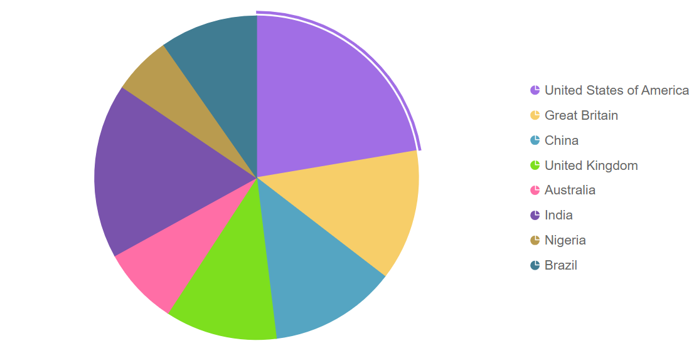
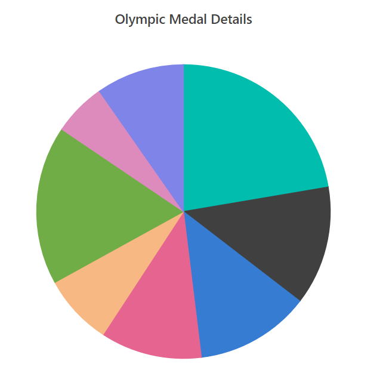
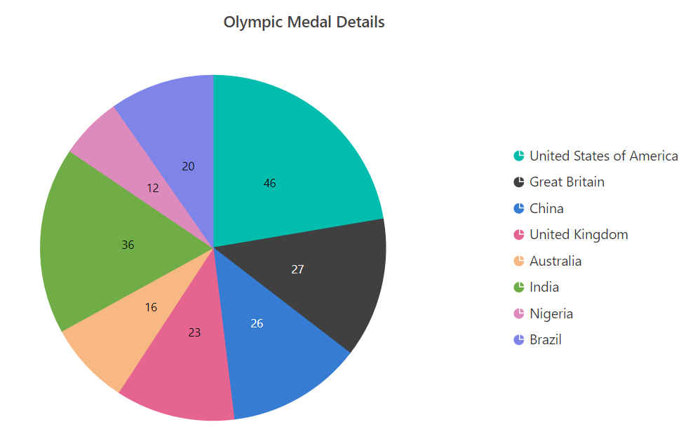

# Getting Started with Blazor Accumulation Chart in Blazor Web App

This section briefly explains about how to include `Blazor Accumulation Chart` component in your Blazor Web App using [Visual Studio](https://visualstudio.microsoft.com/vs/).

## Prerequisites

* [System requirements for Blazor components](https://blazor.syncfusion.com/documentation/system-requirements)

## Create a new Blazor Web App

You can create a **Blazor Web App** using Visual Studio 2022 via [Microsoft Templates](https://learn.microsoft.com/en-us/aspnet/core/blazor/tooling?view=aspnetcore-8.0) or the [Syncfusion Blazor Extension](https://blazor.syncfusion.com/documentation/visual-studio-integration/template-studio).

You need to configure the corresponding [Interactive render mode](https://learn.microsoft.com/en-us/aspnet/core/blazor/components/render-modes?view=aspnetcore-8.0#render-modes) and [Interactivity location](https://learn.microsoft.com/en-us/aspnet/core/blazor/tooling?view=aspnetcore-8.0&pivots=windows) while creating a Blazor Web Application.

## Install Syncfusion Blazor Charts and Themes NuGet in the App

To add **Blazor Accumulation Chart** component in the app, open the NuGet package manager in Visual Studio (*Tools → NuGet Package Manager → Manage NuGet Packages for Solution*), search and install [Syncfusion.Blazor.Charts](https://www.nuget.org/packages/Syncfusion.Blazor.Charts/) and [Syncfusion.Blazor.Themes](https://www.nuget.org/packages/Syncfusion.Blazor.Themes/).

If you utilize `WebAssembly or Auto` render modes in the Blazor Web App need to be install Syncfusion Blazor components NuGet packages within the client project.

Alternatively, you can utilize the following package manager command to achieve the same.




Install-Package Syncfusion.Blazor.Charts -Version {{ site.releaseversion }}
Install-Package Syncfusion.Blazor.Themes -Version {{ site.releaseversion }}




N> Syncfusion Blazor components are available in [nuget.org](https://www.nuget.org/packages?q=syncfusion.blazor). Refer to [NuGet packages](https://blazor.syncfusion.com/documentation/nuget-packages) topic for available NuGet packages list with component details.

## Register Syncfusion Blazor Service

Open **~/_Imports.razor** file and import the `Syncfusion.Blazor` and `Syncfusion.Blazor.Charts` namespace .

```cshtml

@using Syncfusion.Blazor
@using Syncfusion.Blazor.Charts

```

Now, register the Syncfusion Blazor Service in the **~/Program.cs** file of your Blazor Web App.

If you select an **Interactive render mode** as `WebAssembly` or `Auto`, you need to register the Syncfusion Blazor service in both **~/Program.cs** files of your Blazor Web App.

```cshtml

....
using Syncfusion.Blazor;
....
builder.Services.AddSyncfusionBlazor();
....

```

## Add stylesheet and script resources

The theme stylesheet and script can be accessed from NuGet through [Static Web Assets](https://blazor.syncfusion.com/documentation/appearance/themes#static-web-assets). Include the stylesheet reference in the `<head>` section and the script reference at the end of the `<body>` in the **~/Components/App.razor** file as shown below:

```html
<head>
    ....
    <link href="_content/Syncfusion.Blazor.Themes/material.css" rel="stylesheet" />
</head>
....
<body>
    ....
    <script src="_content/Syncfusion.Blazor.Core/scripts/syncfusion-blazor.min.js" type="text/javascript"></script>
</body>
```

N> Check out the [Blazor Themes](https://blazor.syncfusion.com/documentation/appearance/themes) topic to discover various methods ([Static Web Assets](https://blazor.syncfusion.com/documentation/appearance/themes#static-web-assets), [CDN](https://blazor.syncfusion.com/documentation/appearance/themes#cdn-reference), and [CRG](https://blazor.syncfusion.com/documentation/common/custom-resource-generator)) for referencing themes in your Blazor application. Also, check out the [Adding Script Reference](https://blazor.syncfusion.com/documentation/common/adding-script-references) topic to learn different approaches for adding script references in your Blazor application.

## Add Syncfusion Blazor Accumulation Chart component

Add the Syncfusion Blazor Accumulation Chart component in the **~Pages/.razor** file. If an interactivity location as `Per page/component` in the web app, define a render mode at the top of the `~Pages/.razor` component, as follows:




@* desired render mode define here *@
@rendermode InteractiveAuto







<SfAccumulationChart>
    <AccumulationChartSeriesCollection>
        <AccumulationChartSeries DataSource="@MedalDetails" XName="Country" YName="Medals">
        </AccumulationChartSeries>
    </AccumulationChartSeriesCollection>
</SfAccumulationChart>

@code{
    public class ChartData
    {
        public string Country { get; set;}
        public double Medals { get; set;}
    }

    public List<ChartData> MedalDetails = new List<ChartData>
    {
        new ChartData { Country= "United States of America", Medals= 46 },
        new ChartData { Country= "Great Britain", Medals= 27 },
        new ChartData { Country= "China", Medals= 26 },
        new ChartData { Country= "United Kingdom", Medals= 23 },
        new ChartData { Country= "Australia", Medals= 16 },
        new ChartData { Country= "India", Medals= 36 },
        new ChartData { Country= "Nigeria", Medals= 12 },
        new ChartData { Country= "Brazil", Medals= 20 },
     };
}




Press <kbd>Ctrl</kbd>+<kbd>F5</kbd> (Windows) or <kbd>⌘</kbd>+<kbd>F5</kbd> (macOS) to launch the application. This will render the Syncfusion Blazor Accumulation Chart component in your default web browser.



N> [View Sample in GitHub](https://github.com/SyncfusionExamples/Blazor-Getting-Started-Examples/tree/main/Accumulation%20Chart/BlazorWebApp)

## Add title

Using the [Title](https://help.syncfusion.com/cr/blazor/Syncfusion.Blazor.Charts.SfAccumulationChart.html#Syncfusion_Blazor_Charts_SfAccumulationChart_Title) property, a title to the accumulation chart is added to provide the user with quick information about the data plotted in the chart.




<SfAccumulationChart Title="Olympic Medal Details">
    <AccumulationChartSeriesCollection>
        <AccumulationChartSeries DataSource="@MedalDetails" XName="Country" YName="Medals">
        </AccumulationChartSeries>
    </AccumulationChartSeriesCollection>
</SfAccumulationChart>
@code{
    public class ChartData
    {
        public string Country { get; set; }
        public double Medals { get; set; }
    }

    public List<ChartData> MedalDetails = new List<ChartData>
    {
        new ChartData { Country= "United States of America", Medals= 46 },
        new ChartData { Country= "Great Britain", Medals= 27 },
        new ChartData { Country= "China", Medals= 26 },
        new ChartData { Country= "United Kingdom", Medals= 23 },
        new ChartData { Country= "Australia", Medals= 16 },
        new ChartData { Country= "India", Medals= 36 },
        new ChartData { Country= "Nigeria", Medals= 12 },
        new ChartData { Country= "Brazil", Medals= 20 },
     };
}






## Add data label

The data labels are added to improve the readability of the accumulation chart. This can be achieved by setting the [Visible](https://help.syncfusion.com/cr/blazor/Syncfusion.Blazor.Charts.AccumulationDataLabelSettings.html#Syncfusion_Blazor_Charts_AccumulationDataLabelSettings_Visible) property to `true` in the [AccumulationDataLabelSettings](https://help.syncfusion.com/cr/blazor/Syncfusion.Blazor.Charts.AccumulationDataLabelSettings.html).




<SfAccumulationChart Title="Olympic Medal Details">
    <AccumulationChartSeriesCollection>
        <AccumulationChartSeries DataSource="@MedalDetails" XName="Country" YName="Medals">
            <AccumulationDataLabelSettings Visible="true"/>
        </AccumulationChartSeries>
    </AccumulationChartSeriesCollection>
</SfAccumulationChart>





## Enable Tooltip

When space constraints prevent from displaying the information using data labels, the tooltip comes in handy. The tooltip can be enabled by setting the [Enable](https://help.syncfusion.com/cr/blazor/Syncfusion.Blazor.Charts.AccumulationChartTooltipSettings.html#Syncfusion_Blazor_Charts_AccumulationChartTooltipSettings_Enable) property in [AccumulationChartTooltipSettings](https://help.syncfusion.com/cr/blazor/Syncfusion.Blazor.Charts.AccumulationChartTooltipSettings.html) to `true`.




<SfAccumulationChart Title="Olympic Medal Details">
    <AccumulationChartSeriesCollection>
        <AccumulationChartSeries DataSource="@MedalDetails" XName="Country" YName="Medals">
        </AccumulationChartSeries>
    </AccumulationChartSeriesCollection>
    <AccumulationChartTooltipSettings Enable="true"></AccumulationChartTooltipSettings>
</SfAccumulationChart>





## Enable Legend

Legend is used for the accumulation chart by setting the [Visible](https://help.syncfusion.com/cr/blazor/Syncfusion.Blazor.Charts.AccumulationChartLegendSettings.html#Syncfusion_Blazor_Charts_AccumulationChartLegendSettings_Visible) property to `true` in the [AccumulationChartLegendSettings](https://help.syncfusion.com/cr/blazor/Syncfusion.Blazor.Charts.AccumulationChartLegendSettings.html).




<SfAccumulationChart Title="Olympic Medal Details">
    <AccumulationChartSeriesCollection>
        <AccumulationChartSeries DataSource="@MedalDetails" XName="Country" YName="Medals">
            <AccumulationDataLabelSettings Visible="true"></AccumulationDataLabelSettings>
        </AccumulationChartSeries>
    </AccumulationChartSeriesCollection>
    <AccumulationChartTooltipSettings Enable="true"></AccumulationChartTooltipSettings>
    <AccumulationChartLegendSettings Visible="true"></AccumulationChartLegendSettings>
</SfAccumulationChart>




* Press <kbd>Ctrl</kbd>+<kbd>F5</kbd> (Windows) or <kbd>⌘</kbd>+<kbd>F5</kbd> (macOS) to launch the application. This will render the Syncfusion Blazor Accumulation component in your default web browser.



## See also


1. [Getting Started with Syncfusion Blazor for client-side in .NET Core CLI](https://blazor.syncfusion.com/documentation/getting-started/blazor-webassembly-dotnet-cli)
2. [Getting Started with Syncfusion Blazor for client-side in Visual Studio](https://blazor.syncfusion.com/documentation/getting-started/blazor-webassembly-visual-studio)
3. [Getting Started with Syncfusion Blazor for server-side in .NET Core CLI](https://blazor.syncfusion.com/documentation/getting-started/blazor-server-side-dotnet-cli)
