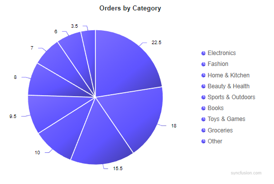
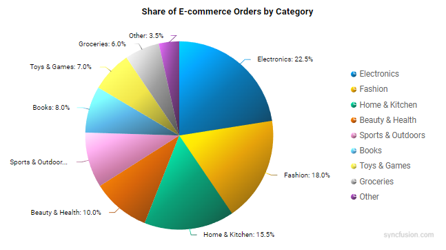
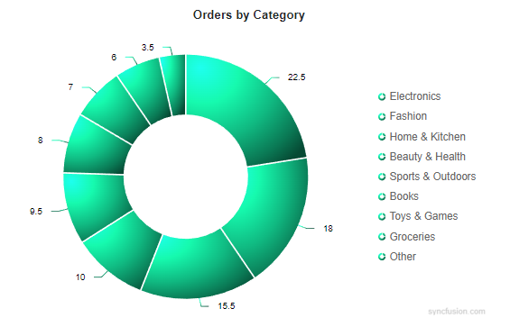
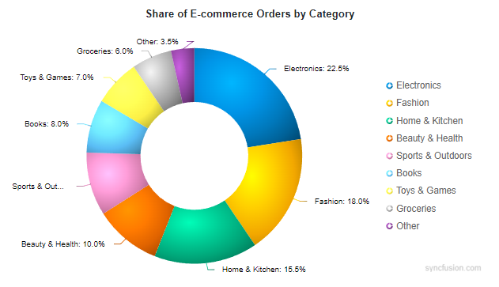

# Gradient in Blazor Accumulation Chart Component

Gradients add depth and modern styling to charts by smoothly blending multiple colors. The Charts component supports two gradient types:

- Linear gradient
- Radial gradient

## Linear gradient

A linear gradient blends colors along a straight path from a defined start point to an end point. In accumulation charts, a linear gradient can be applied either to the whole series or to each point via the `OnPointRender` event. An `AccumulationChartLinearGradient` is configured with one or more color stops.

Properties:
- X1 - Horizontal start position of the gradient (0 to 1).
- Y1 - Vertical start position of the gradient (0 to 1).
- X2 - Horizontal end position of the gradient (0 to 1).
- Y2 - Vertical end position of the gradient (0 to 1).

Each color stop (`AccumulationChartGradientColorStop`) supports:
- Offset   - Position along the gradient (0 to 100).
- Color    - Base color at the stop.
- Opacity  - Transparency (0 to 1).
- Lighten  - Adjusts lightness (positive lightens, negative darkens).
- Brighten - Adjusts brightness (positive increases, negative decreases).

### Apply gradient to the entire series

A linear gradient may be applied directly at the series level. The same gradient is applied uniformly to all data points, legend symbols and tooltip markers.

```cshtml

@using Syncfusion.Blazor.Charts

@* Initialize the AccumulationChart to display orders by category using a Pie series *@
<SfAccumulationChart Title="Orders by Category" Width="100%">
    <AccumulationChartLegendSettings Visible="true" />
    <AccumulationChartTooltipSettings Enable="true" />

    <AccumulationChartSeriesCollection>
        <AccumulationChartSeries DataSource="@CategoryData" XName="Category" YName="Share" Type="AccumulationType.Pie" Name="Share by Category">
            <AccumulationChartSeriesBorder Color="#FFFFFF" Width="2"></AccumulationChartSeriesBorder>

            <AccumulationDataLabelSettings Visible="true" Position="AccumulationLabelPosition.Outside" Name="DataLabelMappingName">
                <AccumulationChartConnector Length="10px" />
                <AccumulationChartDataLabelFont Size="12px" />
            </AccumulationDataLabelSettings>

            @* Series Linear Gradient: defines color stops for the entire series *@
            <AccumulationChartLinearGradient X1="0.1" Y1="0.0" X2="0.9" Y2="1.0">
                <AccumulationChartGradientColorStops>
                    <AccumulationChartGradientColorStop Offset="0"   Color="#4F46E5" Opacity="1"    Brighten="0.55" />
                    <AccumulationChartGradientColorStop Offset="60"  Color="#4F46E5" Opacity="0.98" Brighten="0.15" />
                    <AccumulationChartGradientColorStop Offset="100" Color="#4F46E5" Opacity="0.95" Brighten="-0.25" />
                </AccumulationChartGradientColorStops>
            </AccumulationChartLinearGradient>
        </AccumulationChartSeries>
    </AccumulationChartSeriesCollection>
</SfAccumulationChart>

@code {
    public class CategoryPoint { 
        public string Category { get; set; } 
        public double Share { get; set; } 
        public string DataLabel { get; set; } 
    }

    private readonly List<CategoryPoint> CategoryData = new ()
    {
        new CategoryPoint { Category = "Electronics", Share = 22.5, DataLabel = "Electronics: 22.5%" },
        new CategoryPoint { Category = "Fashion", Share = 18.0, DataLabel = "Fashion: 18.0%" },
        new CategoryPoint { Category = "Home & Kitchen", Share = 15.5, DataLabel = "Home & Kitchen: 15.5%" },
        new CategoryPoint { Category = "Beauty & Health", Share = 10.0, DataLabel = "Beauty & Health: 10.0%" },
        new CategoryPoint { Category = "Sports & Outdoors", Share = 9.5, DataLabel = "Sports & Outdoors: 9.5%" },
        new CategoryPoint { Category = "Books", Share = 8.0,  DataLabel = "Books: 8.0%" },
        new CategoryPoint { Category = "Toys & Games", Share = 7.0, DataLabel = "Toys & Games: 7.0%" },
        new CategoryPoint { Category = "Groceries", Share = 6.0,  DataLabel = "Groceries: 6.0%" },
        new CategoryPoint { Category = "Other", Share = 3.5,  DataLabel = "Other: 3.5%" }
    };
}

```


### Apply a gradient per point using the point render event

A diagonal linear gradient can be applied per data point using the `OnPointRender` event for a clear light-to-shadow transition.

```cshtml

@using Syncfusion.Blazor.Charts

@* Initialize the AccumulationChart to display share of e-commerce orders by category using a Pie series *@
<SfAccumulationChart Title="Share of E-commerce Orders by Category" Width="100%">
    @* Point Render: applies a diagonal linear gradient per point *@
    <AccumulationChartEvents OnPointRender="OnPointRender" />
    <AccumulationChartLegendSettings Visible="true" />
    <AccumulationChartTooltipSettings Enable="true" />

    <AccumulationChartSeriesCollection>
        <AccumulationChartSeries DataSource="@CategoryData" XName="Category" YName="Share" Type="AccumulationType.Pie" Name="Share by Category">
            <AccumulationChartSeriesBorder Color="transparent" Width="0"></AccumulationChartSeriesBorder>
            <AccumulationDataLabelSettings Visible="true" Position="AccumulationLabelPosition.Outside" Name="DataLabelMappingName">
                <AccumulationChartConnector Length="10px" />
                <AccumulationChartDataLabelFont Size="12px" />
            </AccumulationDataLabelSettings>
        </AccumulationChartSeries>
    </AccumulationChartSeriesCollection>
</SfAccumulationChart>

@code {
    public class CategoryShare
    {
        public string? Category { get; set; }
        public double Share { get; set; }
        public string? DataLabelMappingName { get; set; }
    }

    private readonly List<CategoryShare> CategoryData = new ()
    {
        new CategoryShare { Category = "Electronics", Share = 22.5, DataLabelMappingName = "Electronics: 22.5%" },
        new CategoryShare { Category = "Fashion", Share = 18.0, DataLabelMappingName = "Fashion: 18.0%" },
        new CategoryShare { Category = "Home & Kitchen", Share = 15.5, DataLabelMappingName = "Home & Kitchen: 15.5%" },
        new CategoryShare { Category = "Beauty & Health", Share = 10.0, DataLabelMappingName = "Beauty & Health: 10.0%" },
        new CategoryShare { Category = "Sports & Outdoors", Share = 9.5,  DataLabelMappingName = "Sports & Outdoors: 9.5%" },
        new CategoryShare { Category = "Books", Share = 8.0,  DataLabelMappingName = "Books: 8.0%" },
        new CategoryShare { Category = "Toys & Games", Share = 7.0,  DataLabelMappingName = "Toys & Games: 7.0%" },
        new CategoryShare { Category = "Groceries", Share = 6.0,  DataLabelMappingName = "Groceries: 6.0%" },
        new CategoryShare { Category = "Other", Share = 3.5,  DataLabelMappingName = "Other: 3.5%" }
    };

    private readonly string[] BaseColors = new[]
    {
        "#0072B2", "#E69F00", "#009E73", "#D55E00", "#CC79A7", "#56B4E9", "#F0E442", "#999999", "#7F3C8D"
    };

    private void OnPointRender(AccumulationPointRenderEventArgs args)
    {
        string baseColor = BaseColors[args.Point.Index % BaseColors.Length];
        args.LinearGradient = new AccumulationChartLinearGradient
        {
            X1 = 0.05, Y1 = 0.0, X2 = 0.95, Y2 = 1.0,
            GradientColorStops = new List<AccumulationChartGradientColorStop>
            {
                new AccumulationChartGradientColorStop { Offset = 0,   Color = baseColor, Brighten =  0.85, Opacity = 1 },
                new AccumulationChartGradientColorStop { Offset = 20,  Color = baseColor, Brighten =  0.45, Opacity = 0.98 },
                new AccumulationChartGradientColorStop { Offset = 50,  Color = baseColor, Brighten =  0.00, Opacity = 0.96 },
                new AccumulationChartGradientColorStop { Offset = 80,  Color = baseColor, Brighten = -0.30, Opacity = 0.94 },
                new AccumulationChartGradientColorStop { Offset = 100, Color = baseColor, Brighten = -0.55, Opacity = 0.92 }
            }
        };
    }
}

```


## Radial gradient

Configure a radial gradient by assigning an `AccumulationChartRadialGradient` with one or more color stops inside the `OnPointRender` event. The following properties control the gradient appearance:

- Cx - Normalized horizontal center of the gradient (0 to 1).
- Cy - Normalized vertical center of the gradient (0 to 1).
- Fx - Normalized horizontal focal point from which the gradient appears to originate (0 to 1).
- Fy - Normalized vertical focal point (0 to 1).
- R  - Normalized radius of the gradient circle (0 to 1).

Each color stop (`AccumulationChartGradientColorStop`) supports:
- Offset   - Position of the stop along the gradient (0 to 100).
- Color    - Base color at the stop.
- Opacity  - Transparency (0 to 1).
- Lighten  - Adjusts lightness (positive lightens, negative darkens).
- Brighten - Adjusts brightness (positive increases, negative decreases).

### Apply a radial gradient to the entire series

A radial gradient can be applied directly at the series level. The same gradient is applied uniformly to all data points, legend symbols and tooltip markers.

```cshtml

@using Syncfusion.Blazor.Charts

@* Initialize the AccumulationChart to display orders by category using a Pie series *@
<SfAccumulationChart Title="Orders by Category" Width="100%">
    <AccumulationChartLegendSettings Visible="true" />
    <AccumulationChartTooltipSettings Enable="true" />

    <AccumulationChartSeriesCollection>
        <AccumulationChartSeries DataSource="@CategoryData" XName="Category" YName="Share" Type="AccumulationType.Pie" Name="Share by Category">
            <AccumulationChartSeriesBorder Color="#FFFFFF" Width="2"></AccumulationChartSeriesBorder>

            <AccumulationDataLabelSettings Visible="true" Position="AccumulationLabelPosition.Outside" Name="DataLabelMappingName">
                <AccumulationChartConnector Length="10px" />
                <AccumulationChartDataLabelFont Size="12px" />
            </AccumulationDataLabelSettings>

            @* Series Radial Gradient: defines color stops for the entire series *@
            <AccumulationChartRadialGradient Cx="0.22" Cy="0.22" Fx="0.12" Fy="0.12" R="0.96">
                <AccumulationChartGradientColorStops>
                    <AccumulationChartGradientColorStop Offset="0" Color="#10B981" Opacity="1"  Brighten="0.85" />
                    <AccumulationChartGradientColorStop Offset="30" Color="#10B981" Opacity="1"  Brighten="0.35" />
                    <AccumulationChartGradientColorStop Offset="60" Color="#10B981" Opacity="1"  Brighten="0.00" />
                    <AccumulationChartGradientColorStop Offset="85" Color="#10B981" Opacity="1"  Brighten="-0.35" />
                    <AccumulationChartGradientColorStop Offset="100" Color="#10B981" Opacity="1"  Brighten="-0.60" />
                </AccumulationChartGradientColorStops>
            </AccumulationChartRadialGradient>
        </AccumulationChartSeries>
    </AccumulationChartSeriesCollection>
</SfAccumulationChart>

@code {
    public class CategoryPoint { 
        public string Category { get; set; }
        public double Share { get; set; }
        public string DataLabel { get; set; }
    }

    private readonly List<CategoryPoint> CategoryData = new ()
    {
        new CategoryPoint { Category = "Electronics", Share = 22.5, DataLabel = "Electronics: 22.5%" },
        new CategoryPoint { Category = "Fashion", Share = 18.0, DataLabel = "Fashion: 18.0%" },
        new CategoryPoint { Category = "Home & Kitchen", Share = 15.5, DataLabel = "Home & Kitchen: 15.5%" },
        new CategoryPoint { Category = "Beauty & Health", Share = 10.0, DataLabel = "Beauty & Health: 10.0%" },
        new CategoryPoint { Category = "Sports & Outdoors", Share = 9.5, DataLabel = "Sports & Outdoors: 9.5%" },
        new CategoryPoint { Category = "Books", Share = 8.0,  DataLabel = "Books: 8.0%" },
        new CategoryPoint { Category = "Toys & Games", Share = 7.0, DataLabel = "Toys & Games: 7.0%" },
        new CategoryPoint { Category = "Groceries", Share = 6.0,  DataLabel = "Groceries: 6.0%" },
        new CategoryPoint { Category = "Other", Share = 3.5,  DataLabel = "Other: 3.5%" }
    };
}

```


### Apply a radial gradient per point using the point render event

The following example uses a distinct color palette and an off-center radial gradient to create a clear light-to-shadow effect on each data point. The gradient is configured in `OnPointRender`, so each data point receives its own radial gradient derived from its base color.

```cshtml

@using Syncfusion.Blazor.Charts

@* Initialize the AccumulationChart to display share of e-commerce orders by category using a Pie series *@
<SfAccumulationChart Title="Share of E-commerce Orders by Category" Width="100%">
    @* Point Render: applies an off-center radial gradient per point *@
    <AccumulationChartEvents OnPointRender="OnPointRender" />
    <AccumulationChartLegendSettings Visible="true" />
    <AccumulationChartTooltipSettings Enable="true" />

    <AccumulationChartSeriesCollection>
        <AccumulationChartSeries DataSource="@CategoryData" XName="Category" YName="Share" Type="AccumulationType.Pie" Name="Share by Category">
            <AccumulationChartSeriesBorder Color="transparent" Width="0"></AccumulationChartSeriesBorder>
            <AccumulationDataLabelSettings Visible="true" Position="AccumulationLabelPosition.Outside" Name="DataLabelMappingName">
                <AccumulationChartConnector Length="10px" />
                <AccumulationChartDataLabelFont Size="12px" />
            </AccumulationDataLabelSettings>
        </AccumulationChartSeries>
    </AccumulationChartSeriesCollection>
</SfAccumulationChart>

@code {
    public class CategoryShare
    {
        public string? Category { get; set; }
        public double Share { get; set; }
        public string? DataLabelMappingName { get; set; }
    }

    private readonly List<CategoryShare> CategoryData = new ()
    {
        new CategoryShare { Category = "Electronics", Share = 22.5, DataLabelMappingName = "Electronics: 22.5%" },
        new CategoryShare { Category = "Fashion", Share = 18.0, DataLabelMappingName = "Fashion: 18.0%" },
        new CategoryShare { Category = "Home & Kitchen", Share = 15.5, DataLabelMappingName = "Home & Kitchen: 15.5%" },
        new CategoryShare { Category = "Beauty & Health", Share = 10.0, DataLabelMappingName = "Beauty & Health: 10.0%" },
        new CategoryShare { Category = "Sports & Outdoors", Share = 9.5,  DataLabelMappingName = "Sports & Outdoors: 9.5%" },
        new CategoryShare { Category = "Books", Share = 8.0,  DataLabelMappingName = "Books: 8.0%" },
        new CategoryShare { Category = "Toys & Games", Share = 7.0,  DataLabelMappingName = "Toys & Games: 7.0%" },
        new CategoryShare { Category = "Groceries", Share = 6.0,  DataLabelMappingName = "Groceries: 6.0%" },
        new CategoryShare { Category = "Other", Share = 3.5,  DataLabelMappingName = "Other: 3.5%" }
    };

    private readonly string[] BaseColors = new[]
    {
        "#0072B2", "#E69F00", "#009E73", "#D55E00", "#CC79A7", "#56B4E9", "#F0E442", "#999999", "#7F3C8D"
    };

    private void OnPointRender(AccumulationPointRenderEventArgs args)
    {
        string baseColor = BaseColors[args.Point.Index % BaseColors.Length];
        args.RadialGradient = new AccumulationChartRadialGradient
        {
            Cx = 0.35, Cy = 0.35, Fx = 0.35, Fy = 0.35, R = 0.85,
            GradientColorStops = new List<AccumulationChartGradientColorStop>
            {
                new AccumulationChartGradientColorStop { Offset = 0, Color = baseColor, Brighten =  0.60, Opacity = 1 },
                new AccumulationChartGradientColorStop { Offset = 35, Color = baseColor, Brighten =  0.30, Opacity = 1 },
                new AccumulationChartGradientColorStop { Offset = 65, Color = baseColor, Brighten =  0.05, Opacity = 1 },
                new AccumulationChartGradientColorStop { Offset = 85, Color = baseColor, Brighten = -0.15, Opacity = 1 },
                new AccumulationChartGradientColorStop { Offset = 100, Color = baseColor, Brighten = -0.35, Opacity = 1 }
            }
        };
    }
}

```


N> Refer to the [Blazor Charts](https://www.syncfusion.com/blazor-components/blazor-charts) feature tour page for its groundbreaking feature representations and also explore the [Blazor Accumulation Chart Example](https://blazor.syncfusion.com/demos/chart/pie?theme=bootstrap5) to know various features of accumulation charts and how it is used to represent numeric proportional data.

## See also

- [Data Label](./data-label)
- [Tooltip](./tool-tip)
- [Legend](./legend)
